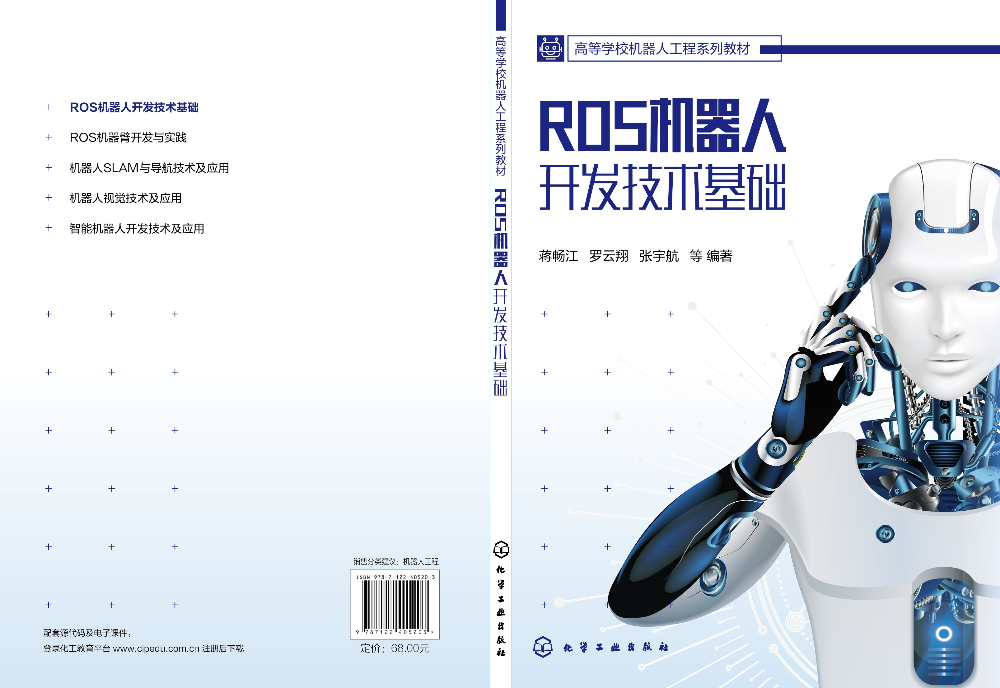
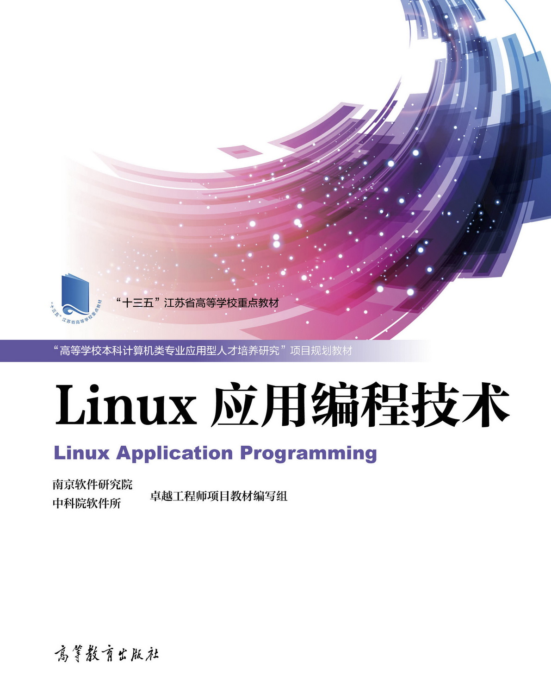

# 《ROS机器人开发技术基础》

[第 1 章 ROS 机器人基础](./charpter1)

[第 2 章 ROS 系统架构](./charpter2)

[第 3 章 ROS 常用组件和开发工具](./charpter3)

[第 4 章 ROS 编程](./charpter4)

[第 5 章 坐标变换TF及编程](./charpter5)

[第 6 章 机器人建模和仿真](./charpter6)

[第 7 章 机器人视觉开发技术](./charpter7)

[第 8 章 机器人语音开发技术](./charpter8)

[第 9 章 机器人SLAM与自主导航开发技术](./charpter9)

[第 10 章 ROS机器人开发实例](./charpter10)

## 内容简介

本书是内容全面、偏重基础的ROS 机器人开发入门书籍，是作者总结多年科研教学成果并在吸收国内外最新理论、方法和技术的基础上完成的。本书详细介绍了 ROS 机器人基础和 ROS 常用开发工具，详细讲解了 ROS 系统架构、ROS 客户端库和机器人建模与仿真；以工程开发为重心，详细讲解机器视觉、机器语音、SLAM 和导航等多方面 ROS 应用的实现原理和方法。本书结合大量实例，帮助读者在实现 ROS 基础功能的同时深入理解基于 ROS 的机器人开发技术，将书中的内容用于实践。本书注重运用 CDIO 工程教育理念，立足培养实际动手能力、综合应用能力、创新思维能力。

本书配有免费教学软件包，帮助读者更好理解和实践书中内容；配有免费电子课件，欢迎选用本书作教材的师生下载使用。

本书可作为普通高等院校机器人工程、自动化、人工智能、电子信息工程、软件工程等相关专业的教材，也可供广大科技工作者和工程技术人员参考使用。

购买：https://item.jd.com/13701530.html

先行课程：《Linux应用编程技术》罗云翔时任中科院软件所南京软件研究院教学部主任

购买：https://item.jd.com/10043442693904.html

## 前言

随着科学技术的发展以及人们对机器人的逐渐认知，机器人的应用规模和范围日益扩大，不仅制造环境下的工业机器人应用逐渐普及，非制造环境下的服务与仿人机器人应用也蓬勃发展。机器人应用环境的日益广泛和任务复杂度的日益增强、提高了机器人开发的时效性和困难度，对机器人硬件和软件技术都提出了更高的要求。而相比硬件的开发，软件开发明显力不从心。为迎接这个挑战，全球各地的开发者与研究机构纷纷投入机器人通用软件框架的研发工作中。在近些年里，产生了多种优秀的机器人软件框架，为软件开发工作提供了极大的便利，其中最为优秀的软件框架之一就是机器人操作系统（Robot Operating System，ROS）。ROS 是一个适用于机器人的开源通用软件框架。它提供了操作系统应有的服务，包括硬件抽象、底层设备控制、常用函数的实现、进程间消息传递以及包管理；它也提供用于获取、编译、编写和跨计算机运行代码所需的工具和库函数。编者来自重庆邮电大学自动化学院和中国科学院软件研究所，本书偏重于 ROS 机器人软件开发技术，是编者在学校多年从事教学、科研，在企业多年从事研发、培训的基础上，经多次试用，反复修改提高而成。本书将有关教学和研发成果加以总结提高，并吸收国内外最新理论、方法和技术，注重运用 CDIO工程教育理念，立足培养实际动手能力、综合应用能力和创新思维能力。本书注重知识内容的系统性、先进性与实践性，强调实践内容的应用性、工程性。为此，书中大量选用了编者所在团队的最新研发成果、学生参加科技竞赛作品、学生实验实践项目作为实例。

本书共分 10 章：第 1 章介绍 ROS 的诞生、发展、特点和安装方法，并提供教学实践所需的源代码包，介绍二进制包与源代码包的区别；第 2 章介绍 ROS 的文件系统，包括典型的 catkin 编译系统的工作原理及其工作空间结构、工作空间中包含的常见文件类型以及这些文件的编写规则等，并介绍 ROS 的通信架构，包括 ROS 的节点、节点管理器、launch 启动文件和四种通信方式（话题、服务、参数服务器、动作库）；第 3 章介绍 ROS 的常用组件和开发工具，包括 Gazebo 仿真工具、Rviz 可视化平台、rqt 可视化工具、rosbag 功能包、RoboWare Studio集成开发环境、Git 分布式版本控制系统；第 4 章介绍 ROS 客户端库的概念，目前最常用的 roscpp 和 rospy 客户端库中函数的定义、用法，以及几种通信方式的具体格式和实现方法；第 5 章介绍 TF 基本原理、TF 的通信方式（和 TF 编程基础），TF 在 C++和 Python 接口中的实现原理以及相关用法，TF 相关工具命令；第 6 章说明如何使用 urdf 文件创建一个机器人模型，然后使用 xacro 文件优化该模型，添加传感器模型，通过 ArbotiX 或者 ros_control 控制器让机器人动起来，并且放置到 Rviz 或 Gazebo 环境中实现可视化或仿真；第 7 章讨论 ROS 中的图像数据以及点云的查看方式，摄像头的标定方法，OpenCV 库和人脸识别的方法，使用摄像头进行二维码识别、物体姿态估计和 AR 标记检测、物体检测；第 8 章探讨机器语音是如何实现的，如何通过语音控制机器人、语音播放和与机器人实现对话交流，并且了解和认识 PocketSphinx 功能包、科大讯飞 SDK 和图灵语义；第 9 章介绍 SLAM 建图和自主导航的方法，分析常用的 Gmapping算法、Hector 算法、Cartographer 算法和 AMCL 定位算法；第 10 章介绍多种支持 ROS 的机器人系统实例，包括最流行的机器人平台 TurtleBot、科研教学机器人平台 XBot-U 和教育酷玩四足机器人 Unitree A1。

本书配有免费的教学软件包和电子课件供选用本书的师生使用，如有需要可扫描二维码下载使用。鉴于 ROS 机器人开发技术的飞速发展，尽管编写过程中尽心尽力，但由于编者水平有限，书中难免有疏漏或不妥之处，恳请读者批评指正。

编著者
2021 年 12 月
