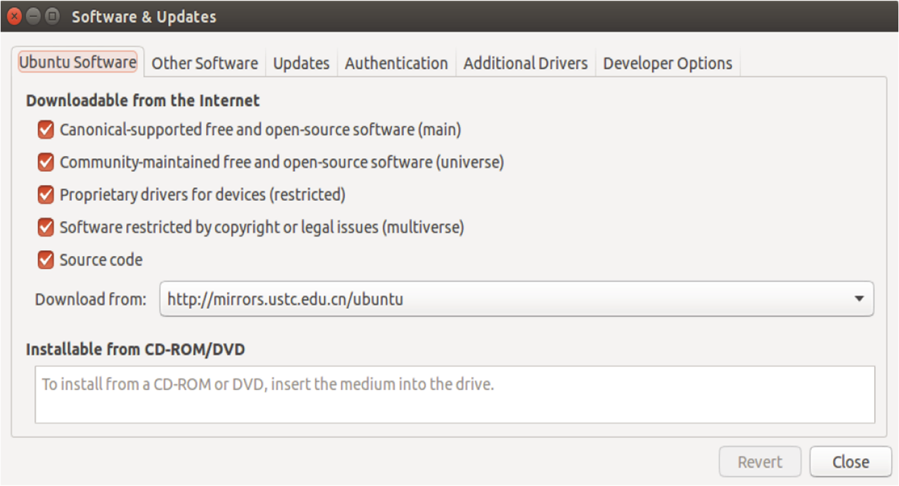
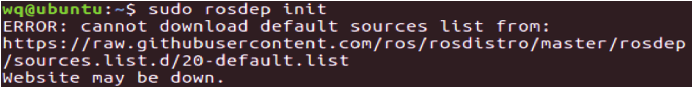
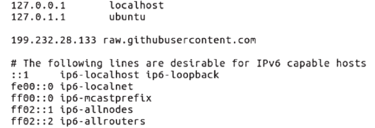
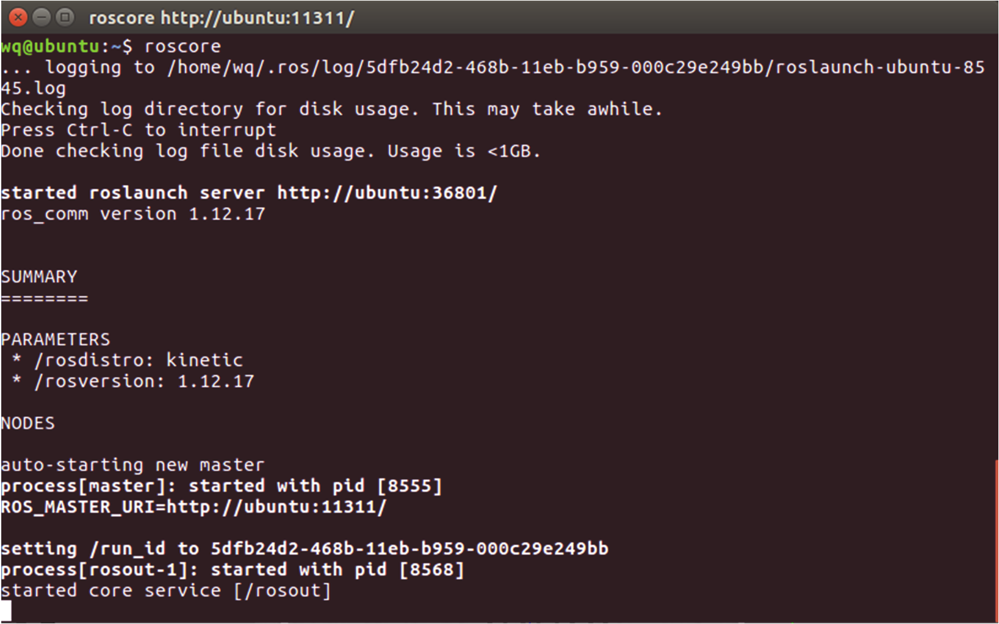
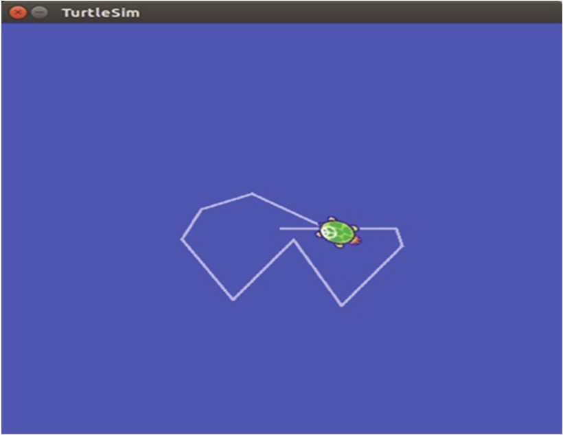
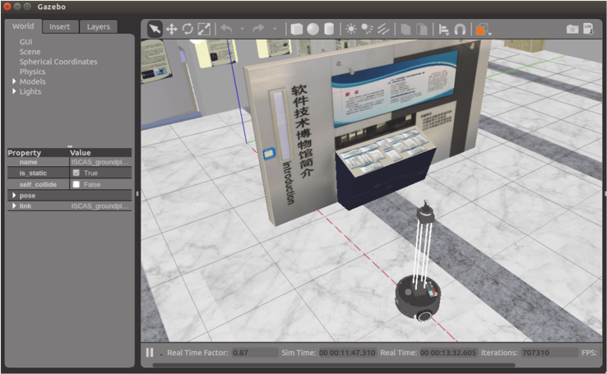
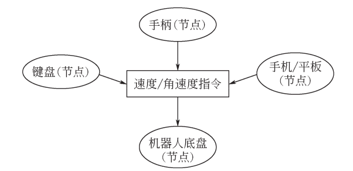

# 第 1 章 ROS 机器人基础

机器人操作系统（Robot Operating System，ROS）是一个应用于机器人上的通用软件框架，它操作方便、功能强大，特别适用于机器人这种多节点、多任务的复杂场景。因此，自 ROS 诞生以来，受到了学术界和工业界的欢迎，如今已经广泛应用于机械臂、移动底盘、无人机、无人车等种类的机器人上。

本章将介绍 ROS 的诞生、发展、特点和安装方法，带你逐步走上 ROS 机器人开发与应用之路。

## 1.1 机器人时代与 ROS 的诞生

对工业机器人的研究最早可追溯到第二次世界大战后不久。在 20 世纪 40 年代后期，橡树岭和阿尔贡国家实验室就已开始实施计划，研制遥控机械手，用于搬运放射性材料。这些系统是“主从”型的，用于准确地“模仿”操作员手和臂的动作。主机械手由使用者进行导引做一连串动作，而从机械手尽可能准确地模仿主机械手的动作，后来，在机械耦合主从机械手的动作中加入力的反馈，使操作员能够感受到从机械手及其环境之间产生的力。50 年代中期，机械手中的机械耦合被液压装置所取代，如通用电气公司的“巧手人”机器人和通用制造厂的“怪物” I 型机器人。 1954年 G.C.Devol 提出了“通用重复操作机器人”的方案，并在 1961 年获得了专利。

1958 年，被誉为“工业机器人之父”的 Joseph F.Engelberger 创建了世界上第一个机器人公司——Unimation（Universal Automation）公司，并参与设计了第一台 Unimate 机器人。这是一台用于压铸的五轴液压驱动机器人，手臂的控制由一台计算机完成。它采用了分离式固体数控元件，并装有存储信息的磁鼓，能够记忆并完成 180 个工作步骤。与此同时，另一家美国公司——AMF公司也开始研制工业机器人，即 Versatran（Versatile Transfer）机器人。它主要用于机器之间的物料运输，采用液压驱动。该机器人的手臂可以绕底座回转，沿垂直方向升降，也可以沿半径方向伸缩。一般认为 Unimate 和 Versatran 机器人是世界上最早的工业机器人。

在科技界，科学家会给每一个科技术语一个明确的定义，机器人问世已有几十年，但对机器人的定义仍然仁者见仁，智者见智，没有统一。直接原因之一是机器人还在发展，新的机型、新的功能不断涌现。根本原因是机器人涉及了“人”的概念，成为一个难以回答的哲学问题。就像机器人一词最早诞生于科幻小说之中一样，人们对机器人充满了幻想。也许正是由于机器人定义的模糊，才给了人们充分的想象和创造空间。机器人发展到目前为止共分为三个阶段。第一阶段，机器人只有“手”，以固定程序工作，不具有反馈外界信息的能力；第二阶段，机器人具有对外界信息的反馈能力，即有了感觉，如力觉、触觉、视觉等；第三阶段，即所谓的“智能机器人”阶段，这一阶段的机器人已经具有了自主性，有自主学习、推理、决策、规划等能力。

硬件技术的飞速发展在促进机器人领域快速发展和复杂化的同时，也对机器人系统的软件开发提出了更高要求。机器人平台与硬件设备越来越丰富，致使软件代码的复用性和模块化需求越来越强烈，而已有的机器人系统又不能很好地适应该需求。相比硬件的开发，软件开发明显力不从心。为迎接机器人软件开发面临的巨大挑战，全球各地的开发者与研究机构纷纷投入机器人通用软件框架的研发工作中。在近些年里，产生了多种优秀的机器人软件框架，为软件开发工作提供了极大的便利，其中，最为优秀的软件框架之一就是机器人操作系统。ROS 的原型源自于斯坦福大学人工智能实验室与机器人技术公司 Willow Garage 合作的个人机器人项目（Personal Robots Program）。该项目组研发的机器人 PR2 在 ROS 框架的基础上可以完成叠衣服、做早饭、打台球等一系列不可思议的动作，由此引发了越来越多的关注。在 2009 年初，Willow Garage 公司推出了 ROS 0.4，这是一个测试版的 ROS，现在所用的系统框架在这个版本中已经具有了初步的雏形。之后的版本才正式开启 ROS 的发展成熟之路。2010 年，Willow Garage公司正式发布了开源机器人操作系统 ROS 1.0，并很快在机器人研究领域掀起了 ROS 开发与应用的热潮。

## 1.2 初识 ROS

**（1）什么是 ROS**
机器人是一个系统工程，它涉及机械、电子、控制、通信、软件等诸多学科。以前，开发一个机器人需要设计机械结构、画电路板、写驱动程序、设计通信架构、组装集成、调试以及编写各种控制算法，每个任务都需要花费大量时间。然而，随着技术的进步，机器人产业分工开始走向细致化、多层次化。如今的电机、底盘、激光雷达、摄像头、机械臂等元器件都由不同厂家生产，社会分工加速了机器人行业的发展。而各个部件的集成就需要一个统一的软件平台，在机器人领域，这个平台就是机器人操作系统——ROS。ROS 图标如图 1.1 所示。


<center>图 1.1 ROS 图标</center>

ROS 是一个适用于机器人编程的框架，这个框架把原本松散的零部件耦合在了一起，为它们提供了通信架构。 ROS 虽然叫做操作系统，但并非是 Windows、 macOS 那样通常意义的操作系统，它只是连接了操作系统和开发的 ROS 应用程序，所以它也算是一个中间件，为 ROS 与基于 ROS的应用程序之间建立起了沟通的桥梁。它也是运行在 Linux 上的运行时环境，在这个环境上，机器人的感知、决策、控制算法可以更好地组织和运行。以上几个关键词（框架、中间件、操作系统、运行时环境）都可以用来描述 ROS 的特性，作为初学者不必深究这些概念，随着你越来越多地使用 ROS，就能够体会到它的作用。

**（2）ROS 的特点**

ROS 主要具有以下特点：

① 分布式、点对点：ROS 采用了分布式的网络框架，使用了基于 TCP/IP 的通信方式，实现了模块间点对点的松耦合连接，可以执行多种类型的通信。通过点对点的设计让机器人的进程可以分别运行，便于模块化地修改和定制，提高了系统的容错能力。

② 支持多种语言： ROS 支持多种编程语言。 C++和 Python 是目前应用最广的 ROS 开发语言。此外， ROS 还支持 LISP、 C#、 Java、 Octave 等多种不同的语言。为了支持更多应用的移植和开发，ROS 采用了一种中立的接口定义语言来实现各模块之间消息的传送。通俗的理解就是，ROS 的通信格式和用哪种编程语言无关，它使用的是自身定义的一套通信接口。

③ 丰富的组件化工具包：ROS 采用组件化的方式将已有的工具和软件进行集成，比如 ROS中的三维可视化平台 Rviz。Rviz 是 ROS 自带的一个图形化工具，可以方便地对 ROS 的程序进行图形化操作。再比如 ROS 中常用的物理仿真平台 Gazebo，在该仿真平台下可以创建一个虚拟的机器人仿真环境，还可以在仿真环境中设置一些必要的参数。

④ 免费且开源：ROS 具有一个庞大的开源社区 ROS WIKI（http://wiki.ros.org）。ROS WIKI中的应用代码以维护者来分类，主要包含由 Willow Garage 公司和一些开发者设计、维护的核心库部分，以及不同国家的 ROS 社区组织开发和维护的全球范围的开源代码。当前使用 ROS 开发的软件包已经达到数千万个，相关的机器人已经多达上千款。此外，ROS 遵从 BSD 协议，允许使用者修改和重新发布其中的应用代码，对个人和商业应用完全免费。

当然，ROS 也存在一些问题。如：通信实时性能有限、系统稳定性尚不满足工业级要求、安全性上没有防护措施、目前主要支持 Linux（Ubuntu）系统。但总体来说，ROS 为开发机器人带来了许多方便。它更适合科研者和开源用户使用，如果在工业场景应用（例如无人驾驶等）还需要做优化和定制。

**（3）历代 ROS 版本**

ROS1.0 版本发布于 2010 年，基于 PR2 机器人开发了一系列机器人相关的基础软件包。随后ROS 版本迭代频繁如表 1.1 所示，目前已经发布到了 Noetic 版本。

<center>表 1.1 历代 ROS 版本及相关信息</center>

| ROS 版本                | 发布时间      | 停止支持日期 |
| ----------------------- | ------------- | ------------ |
| Noetic Ninjemys （LTS） | 2020 年 5 月  | 2025 年 5 月 |
| Melodic Morenia（LTS）  | 2018 年 5 月  | 2023 年 5 月 |
| Lunar Loggerhead        | 2017 年 5 月  | 2019 年 5 月 |
| Kinetic Kame（LTS）     | 2016 年 5 月  | 2021 年 4 月 |
| Jade Turtle             | 2015 年 5 月  | 2017 年 5 月 |
| Indigo Igloo（LTS）     | 2014 年 7 月  | 2019 年 4 月 |
| Hydro Medusa            | 2013 年 9 月  | 2015 年 5 月 |
| Groovy Galapagos        | 2012 年 12 月 | 2014 年 7 月 |
| Fuerte Turtle           | 2012 年 4 月  | ———          |
| Electric Emys           | 2011 年 8 月  | ———          |
| Diamondback             | 2011 年 3 月  | ———          |
| C Turtle                | 2010 年 8 月  | ———          |
| Box Turtle              | 2010 年 3 月  | ———          |

## 1.3 ROS 的安装及测试

### 1.3.1 选择操作系统与 ROS 版本

ROS 目前主要支持在 Linux 操作系统上安装部署，它的首选开发平台是 Ubuntu。同时，也可以在Debian、OS X、Android、Arch、CentOS（基于源码编译安装）、Hawei openEuler（基于中科院软件所源进行安装）等系统上运行。时至今日，ROS 已经相继更新推出了多种版本，供不同版本的 Ubuntu 开发者使用。为了提供最稳定的开发环境，ROS 的每个版本都有一个推荐运行的 Ubuntu 版本，如表 1.2 所示。

<center>表 1.2 与 ROS 对应的 Ubuntu 版本</center>

| ROS 版本 | 首选 Ubuntu 版本 |
| -------- | ---------------- |
| Noetic   | Ubuntu 20.04     |
| Melodic  | Ubuntu 18.04     |
| Lunar    | Ubuntu 17.04     |
| Kinetic  | Ubuntu 16.04     |
| Jade     | Ubuntu 15.04     |
| Indigo   | Ubuntu 14.04     |
| ……       | ……               |

本教材的仿真环境适用于ROS Noetic，Melodic，Kinetic，可在https://gitee.com/yunxiangluo/ros_academy_code下载。

由于 ROS 官网不再对 Kinetic 版本提供支持服务，因此 ROS WIKI 推荐使用 Melodic 和 Noetic版本，但这并不影响 Kinetic 版本的正常使用，只需要注意选择正确的 Ubuntu 版本即可。并且我们 建 议 在 本 地 安 装 ， 不 推 荐 使 用 虚 拟 机 ， 这 样 兼 容 性 更 好 。 下 载 网 址 ： https://www.ubuntu.com/download/desktop。

如果你已经安装 Ubuntu，请确定系统版本。在终端中输入`cat /etc/lsb-release`确定 Ubuntu 的版本号，然后选择对应的 ROS 版本进行安装。如果没有安装正确的 ROS 版本，就会出现各种各样的依赖错误。

更多信息请参考 ROS 官方网站 http://www.ros.org。

### 1.3.2 ROS 的安装步骤

在正式安装前，先检查 Ubuntu 的初始环境是否配置正确。打开 Ubuntu 的“System Settings”，依次选择“Software&Updates”，“Ubuntu Software”，勾选关键“universe”，“restricted”，“multiverse”三项，如图 1.2 所示。



<center>图 1.2 设置 Ubuntu 系统软件源</center>

为了提高软件的下载、安装速度，可以使用国内镜像源，如中国科学技术大学（USTC）镜像源。

**（1）添加 ROS 软件源**

sources.list 是 Ubuntu 系统保存软件源地址的文件，这一步我们需要将 ROS 的软件源地址添加到该文件中，确保后续安装可以正确找到 ROS 相关软件的下载地址。打开终端，输入如下命令：

```bash
sudo sh -c '. /etc/lsb-release && echo "deb http://mirrors.ustc.edu.cn/ros/ubuntu/ $DISTRIB_CODENAME main" > /etc/apt/sources.list.d/ros-latest.list'
```

**（2）添加密钥**

```bash
sudo apt-key adv --keyserver 'hkp://keyserver.ubuntu.com:80' --recv-key C1CF6E31E6BADE8868B172B4F42ED6FBAB17C654
```

**（3）更新ROS源和升级Ubuntu系统**

更新ROS源和升级Ubuntu系统，确保Ubuntu软件包和索引是最新的。输入如下命令：

```bash
sudo apt update
sudo apt upgrade -y
```

**（4）安装 ROS**

ROS 中有很多函数库和工具，官网提供了四种默认的安装方式，当然也可以单独安装某个特定的软件包。这四种方式包括桌面完整版安装（Desktop-Full）、桌面版安装（Desktop）、基础版安装（ROS-Base）、单独软件包安装（Individual Package）。只需选择其中一种即可。

① 桌面完整版安装（Desktop-Full）是最为推荐的一种安装版本，除了包含 ROS 的基础功能（核心功能包、构建工具和通信机制）外，还包含丰富的机器人通用函数库、功能包（自主导航、2D（二维）/3D（三维）感知功能、机器人地图建模等）以及工具（Gazebo 仿真工具、Rviz 可视化工具、rqt 工具箱等）。

Ubuntu16.04 安装 Kinetic 版本：

```bash
sudo apt-get install ros-kinetic-desktop-full -y 
```

Ubuntu18.04 安装 Melodic 版本：

```bash
sudo apt-get install ros-melodic-desktop-full -y 
```

Ubuntu20.04 安装 Noetic 版本：

```bash
sudo apt-get install ros-noetic-desktop-full -y
```

②单独软件包安装（Individual Package）在运行 ROS 时若缺少某些 package 依赖会经常用到。可以安装某个指定的 ROS 软件包，使用软件包名称替换掉下面的“PACKAGE”。（可选）

```bash
sudo apt-get install ros-noetic-PACKAGE
```

例如安装机器人 SLAM 地图建模 Gmapping 功能包时，使用如下命令安装：

```bash
sudo apt-get install ros-noetic-slam-gmapping
```

若要查找可用的软件包，请运行以下命令：

```bash
apt-cache search ros-noetic
```

**（5）配置 ROS**

配置 ROS 是安装 ROS 之后必须要完成的步骤。

① 初始化 rosdep：rosdep 是 ROS 中自带的工具，主要功能是为某些功能包安装系统依赖，同时也是某些 ROS 核心功能包必须用到的工具。需要输入以下命令进行初始化和更新：

```bash
sudo rosdep init
rosdep update
```

提示：执行 `sudo rosdep init`命令时可能会因网络错误而报错，如图 1.3 所示。



<center>图 1.3 初始化时报错</center>

解决办法：

- 浏览器打开https://ipaddress.com/website/raw.githubusercontent.com
查找raw.githubusercontent.com对应的IP

- 在终端执行命令`sudo gedit /etc/hosts`打开 hosts 文件，将第一步查到的IP如`199.232.28.133
raw.githubusercontent.com`添加到文件中，保存退出，添加后的文件如图1.4所示。



<center>图 1.4 修改后的 hosts 文件</center>

保存并退出后，在终端执行`sudo rosdep init`命令即可。

② 设置环境变量：此时，ROS 已成功安装在计算机中，默认在/opt 路径下。在后续使用中，由于会频繁使用终端输入 ROS 命令，所以在使用前需要对环境变量进行设置。 Ubuntu 默认使用的终端是 bash，在 bash 中设置 ROS 环境变量的命令如下：

```bash
echo "source /opt/ros/noetic/setup.bash" >> ~/.bashrc
source ~/.bashrc
```

注意：本文使用的ROS为Noetic版本，若为其他版本，修改代码中的“noetic”即可。上述方法可以使你每次打开一个新的终端都能自动配置 ROS 的环境。而命令`source /opt/ros/noetic/setup.bash`只能修改当前终端，如果再打开一个新的终端，还是会默认使用 bash 配置文件中设置的环境。

③ 安装 rosinstall： rosinstall 是 ROS 中一个独立的常用命令行工具，可以用来下载和安装 ROS中的功能包程序。为了便于后续开发，建议按如下命令安装（可选）：

```bash
sudo apt-get install python-rosinstall -y
```

（6）安装 RoboWare Studio

通常 ROS 的程序都是用 C++和 Python 开发的，为了提高开发的效率，本教材建议用 IDE 来写代码。目前在 Ubuntu 上已经有许多 IDE 支持 ROS 开发，比如 Eclipse、Qt Creator。不过这些 IDE配置起来会比较麻烦，我们推荐使用一款适配 ROS 的 IDE——RoboWare Studio 来开发。读者可下载[roboware-studio_1.2.0-1524709819_amd64.deb](./roboware-studio_1.2.0-1524709819_amd64.deb) 并完成依赖和软件的安装，RoboWare Studio仅适用于Ubuntu 18.04 和 16.04。RoboWare Studio 的使用很简单，几乎与所有 ROS 相关的操作都可以在 IDE 中完成，建议参考官方网站上的使用手册快速上手。本书将在后续章节详细介绍 RoboWare Studio 的安装步骤与基本操作。

### 1.3.3 测试 ROS
首先输入以下命令启动 ROS

```bash
roscore
```

如果出现图 1.5 所示的日志信息，那么说明 ROS 正常启动了。



<center>图 1.5 ROS 启动成功后的日志信息</center>

接着我们测试 ROS 的吉祥物——小海龟，来简单地测试 ROS 运行是否正常，同时，也来体验一下 ROS 的神奇与精彩之处。

启动 roscore 后，重新打开一个终端窗口，启动仿真器节点。输入命令：

```bash
rosrun turtlesim turtlesim_node
```

此时屏幕上会出现一只小海龟，重新打开一个终端，启动键盘控制节点。输入命令：

```bash
rosrun turtlesim turtle_teleop_key 
```

将鼠标聚焦在最后一个终端的窗口中，然后通过键盘上的方向键操作小海龟，如果小海龟正常移动，并且在屏幕上留下移动轨迹（如图 1.6 所示），那么恭喜你，ROS 已经成功地安装、配置并且运行。至此，ROS 的安装、配置与测试就全部结束了，下面正式开启 ROS 机器人开发及应用的精彩旅程。



<center>图 1.6 小海龟移动轨迹</center>

## 1.4 安装教学包
在 1.3 节我们已经用 apt 工具安装好了 ROS，apt 安装的软件包都是二进制形式，可以在系统中直接运行，它们是 ROS 官方提供给用户的应用程序。然而，很多时候我们需要运行第三方开发的软件包，这个时候就需要下载源代码进行编译。

本节我们下载本书配套的 ROS-Academy-for-Beginners 教学包，给读者演示源码包下载—编译—运行的完整流程。后续章节的部分代码将用到这个教学包，请读者按照流程下载和编译。

**（1）下载源码包**
首先在 Ubuntu 系统中安装 Git，命令如下：

```bash
sudo apt-get install git -y
```


然后再创建一个名为 catkin_ws 的工作空间，在它的 src 路径下复制 ROS-Academy-for-Beginners 教学包。命令如下：

```bash
mkdir p ~/catkin_ws/src
cd catkin_ws/src
git clone https://gitee.com/yunxiangluo/ros_academy_code.git
```

**（2）安装依赖**

安装 ROS-Academy-for-Beginners 所需要的依赖，输入命令：

```bash
cd ~/catkin_ws
rosdep install --from-paths src --ignore-src --rosdistro=noetic -y
```

注意：以上命令非常重要，缺少依赖将导致教学包无法正常编译和运行。

**（3）编译**

接着回到工作空间下进行编译。输入命令：

```bash
cd ~/catkin_ws
catkin_make
echo "source ~/catkin_ws/devel/setup.bash" >> ~/.bashrc
#刷新环境
source ~/.bashrc
```

注意：编译完成后必须刷新一下工作空间的环境，否则可能找不到工作空间。许多时候我们为了打开终端就能够运行工作空间中编译好的ROS程 序 ，我们习惯把 `source ~/catkin_ws/devel/setup.bash`命令追加到~/.bashrc 文件中（catkin_ws 替换为你的工作空间名称），也可以通过`echo "source ~/catkin_ws/devel/setup.bash" >> ~/.bashrc`命令来追加。

**（4）运行仿真程序**

编译完成后就可以运行本书配套的仿真了，在工作空间输入以下命令：

```bash
roslaunch robot_sim_demo robot_spawn.launch
```

此时可以看到仿真画面启动，仿真界面中包括了软件博物馆和 XBot 机器人模型，如图 1.7 所示。



<center>图 1.7 课程仿真界面</center>

注意：若使用虚拟机中的 Linux 运行，可能会出现 Gazebo 窗口闪退导致无法运行的情况。此时需要先将虚拟机中的 Ubuntu 系统关机，然后通过右击 VMWare 虚拟机选择“设置”→“显示器”选项，关闭“3D 图形加速”功能即可。再打开一个新的终端，输入以下命令，用键盘控制机器人移动：

```bash
rosrun robot_sim_demo robot_keyboard_teleop.py
```

将鼠标聚焦控制程序窗口，按下 i、j、l 等按键，就可以通过键盘来控制机器人的移动了。当你完成了这一步，首先恭喜你，你已经完成了 ROS 最常见的“源码下载—安装依赖—编译—运行”的流程。在 ROS 社区有许多这样的软件包，基本都按照这样的流程来运行。键盘控制仿真机器人移动这个 demo 展现了 ROS 分布式消息收发的特性。我们打开的虽然是键盘控制程序，但它可以替换为手柄控制、手机/平板控制，甚至是路径规划自动控制。键盘控制机器人移动原理如图 1.8 所示。



<center>图 1.8 键盘控制仿真机器人移动原理</center>

模拟器里的机器人并不关心是谁发给它的消息，它只关心这个消息是什么（速度、角速度等指令）。所以，每一个进程（节点）都各司其职，负责不同的任务，同时定义好消息收发的接口。如果我们现在要做路径规划任务，那么我们只需要再单独开发一个节点，同样向底盘发送我们求解出的速度/角速度指令就可以了。现在你可能对 ROS 工作方式还一无所知，不过没关系，后续的章节我们将会对 ROS 涉及的这些概念进行详细介绍，等你看完了这本书，就能明白整个 ROS 框架运行的原理，甚至自己能编程实现一些功能模块了。

## 1.5 二进制包与源代码包

在 1.3 节我们使用 apt 工具安装了 ROS 系统以及相关的软件包，而在 1.4 节我们通过下载源码编译的方式安装了一个 ROS 教学软件包。这是两种常见的软件包安装方式，通常软件包（package）可以分为二进制包和源代码包。

二进制包里面包括了已经编译完成且可以直接运行的程序。通过`sudo apt-get install package_name`来进行下载和解包（安装），执行完该命令后便可以立即使用。因此，这种方式简单、快捷，适合比较固定、无需改动的程序。而源代码包里是程序的原始代码，在计算机上需经过编译，生成了可执行的二进制文件后方可运行。一些个人开发的程序、第三方修改或者需要修改的程序都应当通过源代码包来编译运行。二进制包和源代码包的区别如表 1.3 所示。

<center>表 1.3 二进制包和源代码包的区别</center>

| 项目           | 二进制包                     | 源代码包                         |
| -------------- | ---------------------------- | -------------------------------- |
| 下载方式       | apt-get install/直接下载 deb | git clone/直接下载源代码         |
| ROS 包存放位置 | /opt/ros/noetic/             | 工作空间下，如~/catkin_ws/src    |
| 编译方式       | 无需编译                     | 通过caktin_make                  |
| 来源           | 官方 apt 软件源              | 开源项目、第三方开发者           |
| 扩展性         | 无法修改                     | 通过源代码修改                   |
| 可读性         | 无法查看源代码               | 方便阅读源代码                   |
| 优点           | 安装方便，安装速度快         | 源码可修改，便于定制功能         |
| 缺点           | 无法修改                     | 编译工具、软件包依赖、版本和参数 |
| 应用场景       | 基础软件                     | 需要查看、开发和修改的程序       |

另外，在 ROS 中，我们可能经常会遇到缺少相关 ROS 依赖的问题。有些时候编译或者运行一些 ROS 程序，系统会提示找不到×××功能包。遇到这样的问题，请先阅读错误原因，看看是否有解决方法。如果是缺少 ROS 的依赖，通常可以用以下命令来安装：

```bash
sudo apt-get install ros-kinetic-PACKAGE
```

将“PACKAGE”替换为系统提示缺少的软件包，例如：

```bash
sudo apt-get install ros-kinetic-slam-gmapping         #Gmapping-SLAM 算法包
sudo apt-get install ros-kinetic-turtlebot-description #TurtleBot 机器人模型包
```

## 1.6 本章小结
本章带你打开了 ROS 机器人开发技术的大门，一起了解了 ROS 的诞生、发展、特点和历代版本，重点学习了 ROS 在 Ubuntu 系统下的安装步骤与配置方法，并通过有趣的小海龟例程测试了 ROS 是否能在 Ubuntu 系统下正常运行。此外，本书还提供了教学实践所需的源代码包，介绍了二进制包与源代码包的区别。接下来，让我们一起更加深入地学习 ROS 的系统架构，了解 ROS 到底是如何组织文件结构，如何实现通信的吧！

## 1.7 习题

1. [单选]机器人操作系统的全称是？
    A. React Operating System
    B. Router Operating System
    C. Request of Service
    D. Robot Operating System

2. [单选] ROS Kinetic 最佳适配的 Linux 版本是？
    A. CentOS 7
    B. Ubuntu 14.04
    C. Ubuntu 16.04 
    D. Ubuntu 18.04

3. [单选]下列哪个不是 ROS 的特点？
    A.开源
    B.分布式架构
    C.强实时性 
    D.模块化

4. [单选] ROS 官方二进制包可以通过以下哪个命令安装（假定 Kinetic 版本）？
    A. sudo apt-get install ROS_kinetic_packagename
    B. sudo apt-get install ROS-Kinetic- packagename
    C. sudo apt-get install ros_kinetic_packagename
    D. sudo apt-get install ros- kinetic-packagename

5. [单选] ROS 最早诞生于哪所学校的实验室？
    A.麻省理工学院（MIT）
    B.斯坦福大学（Stanford）
    C.加州大学伯克利分校（UC. Berkeley） 
    D.卡内基梅隆大学（CMU）

6. [多选]下列哪些是 ROS 的发行版本？

    A. Indigo
    B. Jade
    C. Xenial
    D. Kinetic

7. [多选]查看 https://robots.ros.org/页面的机器人，下列哪些机器人支持 ROS？

   A. Pioneer 3-AT 
   B. XBot
   C. TurtleBot3
   D. PR2
