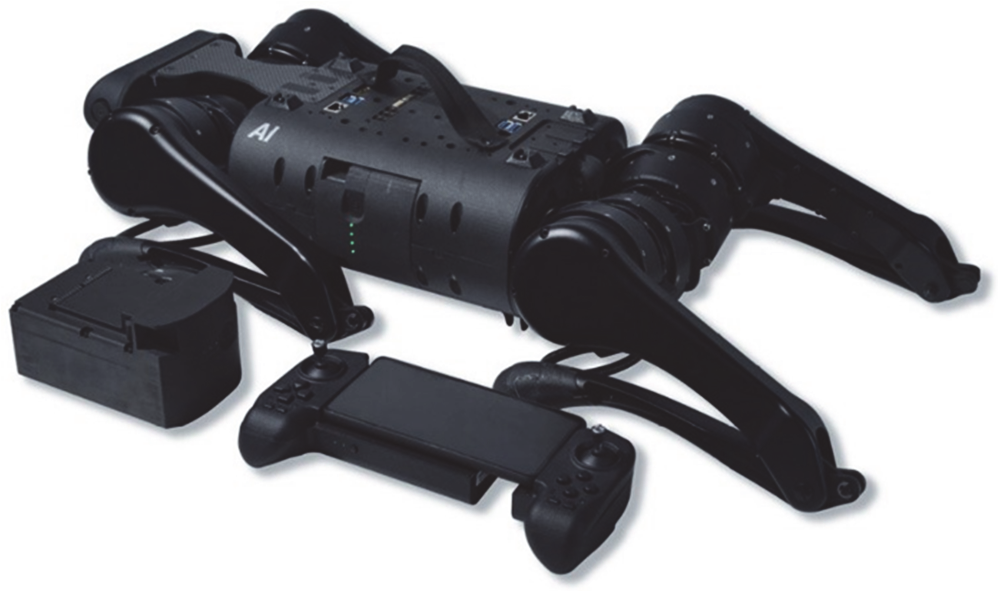

# 第 10 章 ROS机器人开发实例

在实际的机器人应用中，往往涉及多种领域，不仅需要灵活应用书中的内容，还需要综合更多机器人、嵌入式系统、计算机等领域的知识。ROS 社区中丰富的功能包和机器人案例为我们的学习和研究提供了绝好的平台，本章将介绍以下三种支持 ROS 的真实机器人系统。其中， XBot-U 和 Unitree A1都是中国机器人公司研发的代表产品，展现了中国 ROS 机器人研发的最新进展和世界领先水平。

TurtleBot：ROS 社区中最流行的高性价比机器人平台，前后共发布三代，本章将在 Gazebo仿真环境中使用 TurtleBot3 实现 SLAM 建图和导航功能。

XBot-U：XBot 系列机器人是重德智能科技出品的一款包含机器人硬件平台、软件平台和操作系统支持三方面在内的机器人平台解决方案。

Unitree A1：一款全新超高性价比教育酷玩四足机器人，具有精简的机械结构和较高的运动性能。

## 10.1 TurtleBot

TurtleBot 机器人是 Willow Garage 公司开发的一款小型、低成本、完全可编程、基于 ROS 的移动机器人，目前共发布了三代产品，如图 10.1 所示。TurtleBot 的目的是给入门级的机器人爱好者或从事移动机器人编程的开发者提供一个基础平台，让他们直接使用 TurtleBot 自带的软硬件，专注于应用程序的开发，避免了设计草图、购买器材、加工材料、设计电路、编写驱动、组装等一系列工作。借助该机器人平台，可以省掉很多前期工作，只要根据平台提供的软硬件接口，就能实现所需的功能。除了 TurtleBot kit，用户还可以从 ROS WIKI 上下载 TurtleBot SDK。作为入门级移动机器人平台，TurtleBot 拥有许多与该公司大型机器人平台（如 PR2）相同的功能。


<center>图 10.1 TurtleBot 机器人</center>

可以说 TurtleBot 是 ROS 中最为重要的机器人之一，它伴随 ROS 一同成长。作为 ROS 开发前沿的机器人，几乎每个版本的 ROS 测试都会以 TurtleBot 为主，ROS2 也率先在 TurtleBot 上进行了大量测试。因此，TurtleBot 是 ROS 支持度最好的机器人之一，可以在 ROS 社区中获得大量关于 TurtleBot 的相关资源，很多功能包也能直接复用到我们自己的移动机器人平台上，是使用 ROS开发移动机器人的重要资源。

TurtleBot 第一代发布于 2010 年，两年后发布了第二代产品。前两代 TurtleBot 使用 iRobot 的机器人作为底盘，在底盘上可以装载激光雷达、Kinect 等传感器，使用 PC 搭载基于 ROS 的控制系统。在 2016 年的 ROSCon 上，韩国机器人公司 Robotis 和开源机器人基金会（OSRF）发布了TurtleBot3，彻底颠覆了原有 TurtleBot 的外形设计，成本进一步降低，模块化更强，而且可以根据开发者的需求自由改装。TurtleBot3 并不是为取代 TurtleBot2 而生，而是提出了一种更加灵活的移动机器人平台。下面主要介绍 TurtleBot3。

### 10.1.1 TurtleBot 的配置与使用

使用 TurtleBot3 之前需要完成一些设置工作，下面以 TurtleBot3—burger 为例进行说明。

**（1）PC 软件设置**

PC 软件设置包括系统安装设置和 TurtleBot3 功能包的安装设置，TurtleBot3 测试的系统版本是 Ubuntu 16.04.1，ROS 版本是 Kinetic Kame。TurtleBot3 功能包的安装设置有以下两种方式。

① 源码下载安装 首先安装 TurtleBot3 依赖包：

```bash
$ sudo apt-get install ros-noetic-joy ros-noetic-teleop-twist-joy
ros-noetic-teleop-twist-keyboard ros-noetic-laser-proc
ros-noetic-rgbd-launch ros-noetic-depthimage-to-laserscan
ros-noetic-rosserial-arduino ros-noetic-rosserial-python
ros-noetic-rosserial-server ros-noetic-rosserial-client
ros-noetic-rosserial- msgs ros-noetic-amcl ros-kinetic-map-server
ros-noetic-move-base ros-noetic-urdf ros-kinetic-xacro
ros-noetic-compressed-image-transport ros-noetic-rqt- image-view
ros-noetic-gmapping ros-noetic-navigation
ros-noetic-interactive-markers -y
```

安装 TurtleBot3 源码并编译：

```bash
cd ~/catkin_ws/src/
git clone https://github.com/ROBOTIS-GIT/turtlebot3_msgs.git
git clone https://github.com/ROBOTIS-GIT/turtlebot3.git
cd ~/catkin_ws && catkin_make
```

并进行环境设置：

```bash
echo "source ~/catkin_ws/devel/setup.bash" >> ~/.bashrc
```

② 二进制包安装 直接安装 TurtleBot3 二进制功能包：

```bash
sudo apt-get install ros-noetic-turtlebot3-* -y
```

**（2）SBC 软件设置**

TurtleBot3 burger 的 SBC（单板计算机）是 Raspberry Pi 3，出厂时默认安装 Ubuntu MATE 和TurtleBot3，不需要进行额外设置。

**（3）网络配置**

ROS 需要 IP 地址在 TurtleBot3 和远程 PC 之间进行通信，分别在 TurtleBot3 和 PC 上，如图10.2 所示，修改.bashrc 文件完成网络配置。


<center>图 10.2 TurtleBot3 网络配置</center>

（4）开始使用

远程 PC 运行 roscore，TurtleBot3 SBC 启动 launch 文件：

```bash
roslaunch turtlebot3_bringup turtlebot3_robot.launch
```

远程 PC 运行 Rviz，效果如图 10.3 所示：

```bash
export TURTLEBOT3_MODEL=burger
roslaunch turtlebot3_bringup turtlebot3_model.launch
```


<center>图 10.3 TurtleBot3 在 Rviz 中显示</center>

### 10.1.2 Gazebo 中的 TurtleBot3

安装完成后，使用如下命令启动 TurtleBot3 的仿真环境：

```bash
export TURTLEBOT3_MODEL=burger
roslaunch turtlebot3_gazebo turtlebot3_world.launch
```

TurtleBot3 目前有两种模型：burger 和 Waffle。启动之前必须通过环境变量的方式设置所需要的模型，这里选择 burger。启动成功后，可以看到如图 10.4 所示的 Gazebo 仿真环境和 TurtleBot3 机器人。


<center>图 10.4 Gazebo 仿真环境中的 TurtleBot 3</center>

查看当前系统中的话题列表，因为 TurtleBot3 burger 模型较为简单，搭载的传感器也并不多，所以这里发布和订阅的话题也比较少（见图 10.5）。


<center>图 10.5 查看 ROS 中的话题列表</center>

### 10.1.3 使用 TurtleBot 实现导航功能

基于上一节的仿真环境和现有的传感器数据，可以使用如下命令实现 TurtleBot3 的 SLAM 功能，指定建图算法为 Gmapping：

```bash
roslaunch turtlebot3_slam turtlebot3_slam.launch slam_methods:=gmapping
rosrun turtlebot3_teleop turtlebot3_teleop_key
```

打开 Rviz，并且订阅传感器和地图数据，通过键盘控制 TurtleBot3 运动，就可以看到如图 10.6所示的 SLAM 效果了。


<center>图 10.6 TurtleBot3 实现 SLAM 仿真的运行效果</center>

建完地图之后，我们运行下面的命令来保存地图到当前路径下：

```bash
rosrun map_server map_saver -f ~/map
```

接下来在构建完成的地图上实现 TurtleBot3 自主导航功能：

```bash
roslaunch turtlebot3_navigation turtlebot3_navigation.launch map_file:=$HOME/map.yaml
```

后面的“map_file： =”是你的地图路径。在 Rviz 中选择导航的目标点后， Gazebo 中的 TurtleBot3机器人开始向目标移动，在 Rviz 中可以看到如图 10.7 所示的传感器信息和机器人状态显示信息。


<center>图 10.7 TurtleBot3 实现自主导航仿真的运行效果</center>

## 10.2 XBot-U

### 10.2.1 XBot-U 特点

XBot 机器人经历了 XBot1 与 XBot-U 两代机器人的开发与改进，如图 10.8 所示。目前已完全支持室内环境中的所有机器人 ROS 相关传感器接入和机器人应用。该平台自带运动控制系统、二维激光雷达点云测距、超声测距、红外测距、升降平台控制器、高清人脸识别摄像头、RGB-D 深度高清摄像头以及机器人视觉伺服云台。


<center>图 10.8 XBot1 与 XBot-U</center>

另外在功能上，XBot 机器人搭载了由腾讯优图和中科院软件所联合推出的人脸识别盒子，用户按照 SDK 规定的接口调用方式访问人脸识别盒子，轻松获取当前的人脸识别结果；在语音识别和语音交互上，XBot 也毫不逊色。依靠科大讯飞的强大语音处理能力，机器人上搭载我们为 XBot机器人特别定制的语音交互功能，它能够与人脸识别、机器人 SLAM 联动起来实现多种复杂的功能。

XBot-U 机器人有以下特点：

① 稳定、可靠的运动控制 XBot-U 机器人运动电机采用先进的 PID 鲁棒性控制算法，提供十分稳定、可靠的机器人运动控制，配以高减速比的高精度电机，机器人运动速度可控制到 0.01m/s的精度，最小速度达 0.01m/s，最大速度超 2m/s。具有加速时间短、制动效果明显等多方面的优秀特性。

② 完备的驱动软件支持 我们为 XBot-U 机器人提供了完备的驱动软件，采用国际通用的驱动软件框架和通信协议，能够提供 50Hz 以上频率的数据心跳包传输和快速精准地实现数据编码、解码功能，使机器人的运动状态控制精度到达 20ms 以上，从而使机器人能够更加迅速地完成相应用户算法的控制。

③ 自主建图定位与导航（可选） XBot-U 机器人具备室内环境下的自主建图定位与导航功能，该功能让机器人在室内实现完全自主的同步建图和定位，从而使机器人能够根据用户需求，在任意位置之间自由穿梭行走，同时在导航过程中精准避障，全自主规划行走路径。

④ 超长续航与自主充电 XBot-U 机器人配备高达 60Ah 的超大容量电池，续航时间最高可达15 小时。同时支持用户预约返回充电和自主返回充电模式，机器人智能管理自身的电量，在电量不足时自动返回充电桩充电。

⑤ 高性能计算能力 XBot-U 机器人配备高性能的 CPU 计算能力和超强的 GPU 计算能力（根据需要定制），支持 CUDA 加速，运行超大场景的 OpenPose 算法速度达 3fps 以上，为应用计算提供强大的支持。

⑥ ROS 系统全支持 XBot-U 机器人软件框架专为 ROS 系统定制，可运行 ROS 系统下的所有软件和算法，运动控制和规划算法完全支持 ROS 系统协议，为更多的学习和开发者提供通用的算法验证和应用落地的平台。

⑦ 搭载高精度人脸识别盒子 腾讯优图技术支撑的人脸识别盒子集成在机器人底盘内部，使机器人拥有国际前沿最为先进的人脸识别功能，识别率高达 99.7%以上。经过重德对 XBot-U 机器人的移植和定制，用户只需要注册人脸、获取人脸识别结果两个简单的步骤，即可轻松实现人脸识别。

⑧ 搭载语音交互模块 XBot-U 上集成了科大讯飞的语音识别、语音合成、语音交互等多种强大的语音类智能模块，经过对机器人系统的移植，出厂的机器人已经具备简单的对话功能，而且还能根据用户的配置，实现指定场景下的语音交互。

### 10.2.2 初步上手 XBot-U 机器人

XBot-U 机器人分解图如图 10.9 所示，主机本身没有配备显示器，虽然我们也可以通过 UXbotAPP 对机器人进行简单控制和状态查看，或者使用自带的 HDMI 接口外接显示器，但是当我们想进一步对 XBot 进行了解、研究，或者进行建图、运动规划等高级功能时，这两种方法都有各自的不便之处，因此，我们推荐读者通过配置个人计算机（PC 端）来实现与机器人的无线通信。配置后的个人计算机与 XBot-U 机器人构成主从机关系（XBot-U 为主机，PC 端为从机），同时从机可以 SSH 远程登录到 XBot 上，这样，就可以使用你的个人计算机实现对机器人的控制。对个人计算机环境的配置主要包括：安装 Ubuntu 操作系统、安装 ROS 环境、配置 ROS 环境、从机连接到XBot 主机、部署 XBot 功能包。


<center>图 10.9 XBot-U 机器人分解图</center>

**（1）从机连接到 XBot 主机**

个人计算机通常可以通过“SSH 连接”和“ROS 主从机配置”两种方式控制 XBot 机器人，这两种方法各有用途。“SSH 连接”是 Linux 系统的功能，其安装和使用就不一一详述。“ROS主从机配置”即为 ROS 计算机分布式主从通信，是需要安装 ROS 环境之后才能配置。两者在命令的层级上就不一样，SSH 是 Linux 的底层通信，ROS 主从机通信是 ROS 主机和从机通过订阅话题和服务实现的，其使用的前提是主机的 ROS 必须启动。关于两者使用的区别，用户可以自己去尝试和查询资料。关于其他的 ROS 网络的配置教程，请参考 ROS 官方 WIKI 社区：http://wiki.ros.org/ROS/NetworkSetup。

**（2）在从机上部署 XBot 功能包**

为了能够在从机上控制机器人，我们需要在个人计算机上部署与 XBot 机器人相同的工作空间。在 PC 上打开终端，新建工作空间 caktin_ws 并对它初始化。

```bash
mkdir -p catkin_ws/src
cd catkin_ws
catkin_make
```

初始化完成后，下载解压或者复制 XBot 功能包到 catkin_ws/src 下。

```bash
cd ~/catkin_ws/src
git clone https://github.com/DroidAITech/xbot.git
```

接着，我们要安装所有与功能包相关的依赖。

```bash
cd ~/catkin_ws
rosdep install --from-paths src --ignore-src --rosdistro=noetic –y
```
最后编译工作空间。

```bash
cd ~/catkin_ws
catkin_make
```

（3）让机器人动起来

XBot-U 机器人自带有开机启动程序，与 xbot_bringup/launch/xbot-u.launch 文件中所启动的内容一致，即开机时机器人会自动启动底盘节点、激光雷达节点、人脸识别摄像头节点和 RealSense深度摄像头节点。如果后续还需要启动其他节点，也可以使用不同命令启动相应的节点。

① 启动常用功能 在 XBot 机器人的工作空间（~/catkin_ws/src/）中，我们已经部署了机器人的相关驱动包合集 XBot（包括 bringup、description、driver、msgs、节点、safety-controller、tools和相关文档说明）、人脸识别包（xbot_face）、运动规划包（xbot_navi）以及语音交互包xbot_talker）。

在终端输入下方的命令，可以通过我们编写好的一键启动脚本来启动 XBot 机器人。

```bash
roslaunch xbot_bringup xbot-u.launch
```

该脚本里包含了 XBot 的常用功能。输入该命令后，机器人会启动各个模块和 ROS 节点，包括机器人、激光雷达、RGB-D 传感器、人脸识别摄像头视频流等。注意：该脚本是默认启动后自动执行的，即开机时所有功能都已经为你启动好。你也可以使用下面的命令将其全部关闭，该命令需要你输入密码以确认权限。

```bash
sudo service xbot stop
```

另外，如果你只想启动 XBot 机器人的部分功能，也可以手动输入下面命令来启动 XBot。

```bash
roslaunch xbot_bringup xbot.launch
```
该脚本所驱动起来的传感器包括机器人电机控制器、电机码盘、超声波传感器、红外传感器、电压与电流检测器等。xbot.launch 脚本所启动的功能相比 xbot-u.launch 脚本要少些，主要集中在机器人的运动控制方面。

② 驱动摄像头

XBot-U 机器人配带有 Intel RealSense 摄像头，使用下面命令可单独启动RealSense 摄像头。

```bash
roslaunch xbot_bringup realsense.launch
```

③ 驱动激光雷达 使用下面命令可以单独启动 rplidar 激光雷达。

```bash
roslaunch xbot_bringup rplidar.launch
```

### 10.2.3 智能交互

机器人上配备有人脸识别和语音交互两项智能交互功能，并提供了 Android 应用“UXbot 助手”APP 来与 XBot 进行交互。

（1）人脸识别

人脸识别功能主要分为注册人脸、管理人脸和识别人脸三个部分。注册人脸分为人脸图片注册和实时拍照注册两种方式。完成注册人脸之后，在人脸识别盒子中就有了注册人脸的用户列表，查 看 该 列 表 的 方 法 为 在 连 入 机 器 人 网 络 的 任 意 一 台 机 器 上 通 过 浏 览 器 访 问 网 址 http://192.168.8.141:8000/management/userids，就能够显示当前已经注册成功的所有用户名。注册完人脸之后，如果摄像头画面中出现注册过的人脸，机器人就能够识别出相应的信息。

（2）语音交互

机器人中已经配置好了语音交互模块，使用该模块只需在机器人或者从机上调用相应的service，并修改相应的请求参数，即可打开内置的语音交互模块。可以让机器人播放语音文件，让机器人播放你输入的文字，与机器人进行对话以及通过语音控制机器人。

（3）使用 UXbot 助手控制你的机器人

UXbot 助手是面向用户的操作终端，方便用户实时掌控 XBot 状态以及对 XBot 进行交互操作。用户可以从 UXbot 助手上了解当前 XBot 机器人的电量、摄像头俯仰角度、摄像头平台的旋转角度。用户也可以通过 UXbot 助手来调节 XBot 的摄像头俯仰角度、摄像头平台旋转角度。用户可以通过界面上的摇杆控件，来控制 XBot 机器人进行移动，还可以实时查看 XBot 上的摄像头拍摄到的图像。

### 10.2.4 自主导航

我们在最初的 XBot 的软硬件设计上，都早已充分考虑到了 XBot 对于目前绝大部分建图算法和开源程序的支持特性。

在硬件上，XBot 具备标准的双轮差分系统，前后各配置一个可减振的万向轮，适应大多数室内的运行环境；激光雷达方面，XBot 可以与市面上大部分的激光雷达兼容运行，支持所有使用二维激光雷达建图的程序。

在软件上，XBot 以成为一款最适合中国 ROS 学者和研究人员使用的机器人软硬件平台为目标，从最原始的驱动软件编写逻辑和优化方法，到其 node Package 的设置，都按照 ROS 控制标准和系统标准而完成，以方便我们在该平台上测试或调试任何 ROS 算法程序。

### 10.2.5 XBot 仿真与教学

我们为 ROS 初学者和 XBot 机器人的使用者提供了一套仿真环境，可以实现在模拟器上对机器人的操作。注意：仿真环境与之前配置的从机环境不相同。

首先下载、安装依赖和编译 ROS-Academy-for-Beginners，以下是 Ubuntu16.04 下的安装方法：

```bash
cd ~/catkin_ws/src
git clone https://github.com/DroidAITech/ROS-Academy-for-Beginners.git
cd ~/catkin_ws
rosdep install --from-paths src --ignore-src --rosdistro=kinetic -y  #安装依赖
catkin_make															 #编译
```

另外建议在本地 Ubuntu 下运行仿真程序。虚拟机对 Gazebo 的兼容性存在问题，可能会有错误或卡顿。

**（1）启动 XBot 模拟器**

输入以下命令启动 XBot 模拟器：

```bash
roslaunch robot_sim_demo robot_spawn.launch
```

随后 Gazebo 会启动，如果是第一次启动，可能需要等待几分钟，等待 Gazebo 从服务器上下载模型。Gazebo 正常启动后，你就能看到 XBot 机器人模型和软件博物馆的场景了，如图 10.10所示。


<center>图 10.10 Gazebo 上软件博物馆模型</center>

启动键盘控制程序，你就可以控制机器人前后左右移动了。

```bash
rosrun robot_sim_demo robot_keyboard_teleop.py
```

**（2）SLAM 仿真**

在 XBot 的 SLAM 仿真中提供了 Gmapping、Karto、Hector 等常见 SLAM 算法的 demo，本节以启动和可视化 Gmapping 为例，介绍运行方法。

首先确保已经启动 XBot 模拟器，然后输入：

```bash
roslaunch slam_sim_demo gmapping_demo.launch
```

启动 Gmapping 后，启动 Rviz 查看建图效果：

```bash
roslaunch slam_sim_demo view_slam.launch
```

你可以再启动键盘控制程序，移动机器人，就能够看到地图逐渐建立的过程。

```bash
rosrun robot_sim_demo robot_keyboard_teleop.py
```

运行效果如图 10.11 所示。


<center>图 10.11 Rviz 建图界面</center>

在 slam_sim_demo 中还有其他 SLAM 算法，启动方法和 Gmapping 相同。

（3）已知地图与导航仿真

许多情况下，我们已经建立好了场景地图，只需要机器人执行定位和导航的任务，我们提供了 AMCL（定位）、map_server（已知地图）和导航相结合的仿真环境。

首先启动 XBot 模拟器，然后输入启动 AMCL 与导航仿真：

```bash
roslaunch navigation_sim_demo amcl_demo.launch
```

启动 Rviz，查看定位效果：

```bash
roslaunch navigation_sim_demo view_navigation.launch
```

如图 10.12 所示，绿色箭头表示粒子，点击 Rviz 上方工具栏中的 2D Nav Goal，然后在地图上确认目标点位置和方向，机器人就会执行导航任务。


<center>图 10.12 输入目标点控制机器人移动</center>

## 10.3 Unitree A1

Unitree A1（以下简称 A1）是宇树科技于 2020 年在美国拉斯维加斯 CES2020 发布的一款全新超高性价比教育酷玩四足机器人。如图 10.13 所示，2013 年至 2016 年期间，宇树科技的创始人开创性地使用低成本外转子无刷电机来构造高性能四足机器人，大大推进了高性能四足机器人的产业化。2017 年 10 月，宇树科技发布了 Laikago 四足机器人，是全球首个正式对外公开并零售的高运动性能四足机器人。2019 年发布的 Aliengo 四足机器人，定位于行业功能性四足机器人，采用了全新设计的动力系统，一体化机身设计，更轻量。2020 年，宇树科技发布的第四代四足机器人 A1 一经推出即受到业内人士的一致好评，进一步推进了四足机器人走进大众生活的进程。A1的特点是小巧灵活、爆发力强，最大持续室外奔跑速度可达 3.3m/s，是国内近似规格奔跑速度最快、最稳定的中小型四足机器人


<center>图 10.13 Unitree A1 的发展历程</center>

### 10.3.1 Unitree A1 的功能与结构

（1）A1 机器人功能

A1 四足机器人作为宇树公司的第四代产品，拥有更可靠的硬件技术、优异的算法和无与伦比的运动性能。A1 四足机器人平台由四足机器人、遥控器以及配套使用的控制软件组成。整机有 12个自由度（由 12 台高性能关节电机组成），使用力控技术对每个关节进行力和位置的复合控制，以实现对整机的力控而获得卓越的运动性能。

A1 不论是体重还是尺寸均显著低于同类型的机器人，单人即可对整机进行搬运和调试，携带方便。A1 开发的软件控制接口分为高层接口和底层接口，高层接口直接给机器人发送行走速度、转弯、蹲下等指令，不需要编写底层的动力学控制程序。机器人的主控制器接收到高层指令后，会控制机器人做整体的运动，此模式适合做一些简单的开发。底层接口直接控制电机，包括每个电机的位置、速度和力矩，此时主控制器将不再负责控制机器人的整体运动，而是把控制权交给用户，此模式适合做一些更深层次的开发。目前控制接口支持 C/C++、ROS。A1 具有优良的运动性能，能轻松实现步行、小跑等常规运动形态，也能实现爬坡和上楼梯等特殊运动形态以及越障、避障、倒地后原地爬起等。其机身具有良好的抵抗冲击的能力，在跑步、跳跃、与外物碰撞或者摔倒时，机身能够很好地抵抗冲击力负荷。

（2）A1 机器人结构

A1 四足机器人平台主要由控制系统、通信系统、动力系统和电池包组成。A1 四足机器人及相关配件如图 10.14 所示。



<center>图 10.14  A1 四足机器人及相关配件</center>

控制系统分为底层控制系统和上层控制系统。底层控制系统直接和机器人各关节单元的电机通信，可以接收上层控制系统传递的运动控制指令，转化成各关节电机的力矩和位置指令，实现对各关节电机的控制。上层控制系统通过智能感知模块和运动控制算法生成对机器人位姿和运动控制的指令，通过通信系统将控制指令下发到底层控制系统，再由底层控制系统转化成各关节电机执行指令，使机器人完成相应动作。

通信系统可以将上层控制系统对机器人的运动指令下发到底层控制系统，同时将底层控制系统采集到的机器人各传感器的信息反馈到上层控制系统。通信系统还负责完成将遥控器控制指令下发到底层控制系统以及 APP 和上层控制系统之间的信息传输。

动力系统由电机、减速器、驱动器、编码器构成，完成四足机器人的运动。电池包负责对机器人提供电能。

### 10.3.2 Unitree A1 关节电机的配置

A1 机器人上安装有 12 台关节电机，这些关节电机就是机器人实现复杂运动的基础。用户只需要给关节电机发送相关的命令，电机就能完成从接收命令到关节力矩输出的全部工作。A1 四足机器人为用户提供了 3 个接口，如图 10.15 所示，其中中间的接口为 24V 直流电源接口，两侧的为 RS-485 接口，且这两个 RS-485 接口完全等价。关节电机就是通过 RS-485 接口与上位机（通常为用户的计算机）进行通信的。


<center>图 10.15  A1 四足机器人的接口</center>

由于所有的电机底层控制算法都已经整合在电机内部，因此上位机只需要完成上层控制和RS-485 串口的数据收发。为了方便用户对关节电机的操作，宇树科技提供了 USB 转 RS-485 的转接口和 RS-485 串口收发的 SDK 软件包（即 unitree_actuator_sdk），该 SDK 包提供了 C、C++、Python 以及 ROS 的代码实例，用户只需要仿照实例就能完成对电机的控制。下面我们演示如何控制电机。

**（1）查看串口名**

将 USB 转 RS-485 转接口连接在上位机上时，上位机会为这个串口分配一个串口名。在 Linux系统中，这个串口名一般是以“ttyUSB”开头。打开终端，运行如下命令即可得到上位机当前连接的串口名：

```bash
cd /dev
ls |grep ttyUSB
```

如图 10.16 所示，当前上位机连接的串口名为“ttyUSB0”。考虑到串口所在的文件夹路径，其完整的串口名为“/dev/ttyUSB0”。


<center>图 10.16  在 Linux 系统中查看串口名</center>

**（2）修改电机 ID**

每一个电机都需要分配一个 ID，同时上位机发送的每一条控制命令也包含一个 ID。电机只会执行 ID 与自己一致的控制命令。因此，当多个关节电机串联在同一条 RS-485 线路中时，为了分别控制其中的每一个电机，必须给每一个电机分配一个唯一的 ID。

unitree_actuator_sdk 中的 ChangeID_Tools 文件夹下提供了修改电机 ID 的程序，在管理员权限下运行 Linux 文件夹下的可执行文件 ChangeID：

```bash
sudo ./ChangeID
```

如图 10.17 所示，开始执行 ChangeID 程序后，就可以输入当前的串口名，输入后按下回车，所有电机都会进入修改 ID 模式。转动电机的输出轴一次，则电机的 ID 被设置为 0，以此类推，且 ID 只能为 0、1 和 2。在转动完所有电机的输出轴后，在终端窗口输入“a”并且按下回车，即完成电机 ID 的修改。完成后，即可运行 unitree_actuator_sdk 中的 script 文件夹下的 check.py 文件，检验一下电机 ID 修改的结果，让电机转起来。


<center>图 10.17  在 Linux 系统中执行修改 ID 程序</center>

### 10.3.3 让 Unitree A1 机器人站起来

下面我们来完成一个简单又实用的实例：编写一个控制器，利用 Gazebo 仿真平台让我们的A1 四足机器人站起来。控制器就是一个有限状态机，这个有限状态机由四种状态组成，分别是阻尼模式（Passive）、固定站立（FixedStand）、自由站立（FreeStand）和对角步态（Troting）。实现此功能之前，请读者下载 unitree_ros 软件包并编译（下载地址： https://github.com/unitreerobotics/unitree_ros），该软件包是由许多软件包集合而成的，这其中就有下文需要使用到的 unitree_guide软件包。

（1）机器人的关节控制

在 unitree_guide/include/FSM 文件夹下，打开头文件 FSMState.h，可以看到 FSMState 类下有四个关键的函数：enter（切换进入当前状态时被调用执行）、run（保持在当前状态时，会被循环调用执行）、 exit （退出当前状态时被调用执行）和 checkChange （检查是否需要切换至其他状）。而实现代码在文件夹 unitree_guide/src/FSM 中。由于有限状态机的四种状态都继承自基类 FSMState，因此通过对上述四个函数的不同程序控制，可以实现各个状态的不同功能。每个状态都继承了基类的如下变量：

```cpp
CtrlComponents *_ctrlComp; 	// 包含大多数控制所需的类与状态变量
LowlevelCmd *_lowCmd; 		// 发送给各个电机的命令
LowlevelState *_lowState; 	// 从各个电机接收的状态
```

其中，CtrlComponents 是一个结构体，包含了大量与控制相关的类和状态变量，例如数据收发接口、输入与输出命令、估计器、平衡控制器、控制频率、控制器运行的平台等。读者可以在头文件 CtrlComponents.h 中查看具体内容。CtrlComponents 中的类和变量都是在 main.cpp 文件的主函数 main 中初始化的，因此对控制器进行整体修改时，只需要在主函数 main 下进行一次操作就可以完成。LowlevelCmd 是控制器发送给机身 12 个电机的命令，LowlevelState 则包含机身 12个电机返回的状态以及 IMU 的状态。在 LowlevelCmd 和 LowlevelState 中，电机的命令和状态都是保存在数组中的，因此我们需要了解数组的序号 ID 与机器人每个关节之间的对应关系。

**（2）机器人的阻尼模式**

阻尼模式是一种特殊的速度模式。当我们令角速度 ω =0 时，电机会保持转轴速度为 0。并且在被外力旋转时，产生一个阻抗力矩。这个力矩的方向与旋转方向相反，大小与旋转速度成正比。当停止外力旋转后，电机会静止在当前位置。尽管我们的目标是实现机器人的固定站立，但出于安全考虑，我们会令机器人在开机时默认进入阻尼模式，即机器人缓慢趴下。

在文件 src/FSM/State_Passive.cpp 中，我们看到在函数 enter 中，12 个电机都被设置为阻尼模式：

```cpp
if (_ctrlComp -> ctrlPlatform == CtrlPlatform::GAZEBO) {
  for (int i = 0; i < 12; i++) {
    _lowCmd -> motorCmd[i].mode = 10; //
    指定电机运行模式， 10 为闭环伺服控制
    _lowCmd -> motorCmd[i].q = 0; // 指定角度位置
    _lowCmd -> motorCmd[i].dq = 0; // 指定角速度
    _lowCmd -> motorCmd[i].Kp = 0; // 位置刚度
    _lowCmd -> motorCmd[i].Kd = 8; // 速度刚度（阻尼）
    _lowCmd -> motorCmd[i].tau = 0; // 前馈力矩
  }
} else if (_ctrlComp -> ctrlPlatform == CtrlPlatform::A1) {
  ...
}
```

**（3）机器人的固定站立模式**

在固定站立模式下，每一个电机都处于位置模式，即电机的输出轴将会稳定在一个固定的位置。因此，机器人的各个关节会逐渐转动到一个给定值并锁死，这时机器人能保持固定站立。让我们打开文件/src/FSM/State_FixedStand.cpp，看一下函数 enter、run 和 exit 是如何共同实现固定站立的。首先来看 enter 函数的关键代码：

```cpp
void State_FixedStand::enter() {
  if (_ctrlComp -> ctrlPlatform ==
    CtrlPlatform::GAZEBO) {
    for (int i = 0; i < 4; i++) {
      // 控制机身关节
      _lowCmd -> motorCmd[i * 3 + 0].mode = 10;
      _lowCmd -> motorCmd[i * 3 + 0].Kp = 70;
      _lowCmd -> motorCmd[i * 3 + 0].dq = 0;
      _lowCmd -> motorCmd[i * 3 + 0].Kd = 3;
      _lowCmd -> motorCmd[i * 3 + 0].tau = 0;
      // 控制大腿关节
      _lowCmd -> motorCmd[i * 3 + 1].mode = 10;
      _lowCmd -> motorCmd[i * 3 + 1].Kp = 180;
      _lowCmd -> motorCmd[i * 3 + 1].dq = 0;
      _lowCmd -> motorCmd[i * 3 + 1].Kd = 8;
      _lowCmd -> motorCmd[i * 3 + 1].tau = 0;
      //
      控制小腿关节
      _lowCmd -> motorCmd[i * 3 + 2].mode = 10;
      _lowCmd -> motorCmd[i * 3 + 2].Kp = 300;
      _lowCmd -> motorCmd[i * 3 + 2].dq = 0;
      _lowCmd -> motorCmd[i * 3 + 2].Kd = 15;
      _lowCmd -> motorCmd[i * 3 + 2].tau = 0;
    }
  }
  ...
  for (int i = 0; i < 12; i++) {
    _lowCmd -> motorCmd[i].q = _lowState -> motorState[i].q;
    _startPos[i] = _lowState -> motorState[i].q;
  }
  ...
}
```

在 enter 函数中，要给机身关节、大腿关节和小腿关节发送不同的位置刚度 K p 和速度刚度 K d 。由于在站立时小腿关节的力臂最大，所以负载也最大，就需要提高小腿关节的位置刚度 K p ，同时为了稳定性，也要相应地提高它的速度刚度 K d 。为了让机器人的每一个关节都能连续稳定地旋转到固定站立模式，需要在函数 run 中进行线性插值：

```cpp
void State_FixedStand::run() {
  _percent += (float) 1 / _duration;
  _percent = _percent > 1 ? 1 : _percent;
  for (int j = 0; j < 12; j++) {
    _lowCmd -> motorCmd[j].q = (1 - _percent) * _startPos[j] + _percent * _ targetPos[j];
  }
}
```

由于有限状态机是以固定时间间隔循环运行的，所以我们的线性插值也是离散的。因此我们的设计目标也就是：在给定的循环次数内，通过线性插值，将所有关节从初始角度连续旋转到目标角度，并且在到达给定的循环次数之后，将关节锁定在目标角度。具体的实现方式就是让变量_percent 从 0 开始一步步增长到 1，然后根据_percent 的值插值得到当前时刻关节的目标角度。最后，在 exit 函数中将退出固定站立状态时的变量_percent 还原为 0。这样，当我们再次切换到固定站立模式的时候，函数 run 中的线性插值才能够正常地运行。

```cpp
void State_FixedStand::exit() {
  _percent = 0;
}
```

**（4）在 Gazebo 中让机器人站起来**

由于我们是使用 C++语言进行的编程，所以读者需要做的就只是进入 catkin_ws 文件夹，然后在终端输入 catkin_make 并运行。编译成功后，新打开一个终端，运行以下命令来开始 Gazebo仿真：

```bash
roslaunch unitree_guide gazeboSim.launch
```

之后即可看到在仿真环境下的四足机器人 A1，如图 10.18 所示。


<center>图 10.18 Gazebo 仿真环境中的 Unitree A1</center>

开始运行 Gazebo 仿真后，再新打开一个终端，执行以下命令打开控制器：

```bash
rosrun unitree_guide junior_ctrl
```

控制器的初始状态是阻尼模式，此时机器人只是趴在地面上。在当前键盘控制的模式下，按下数字键“2”即可切入到固定站立模式，如图 10.19 所示。这时，再按下数字键“1”就可以返回阻尼模式，机器人又会缓缓趴下。


<center>图 10.19  A1 在 Gazebo 仿真环境下固定站立</center>

## 10.4 本章小结

本章介绍了多种支持 ROS 的机器人系统实例，包括最流行的机器人平台 TurtleBot、科研教学机器人平台 XBot-U 和教育酷玩四足机器人 Unitree A1。

通过对这些机器人开发实例的学习，相信你已经感受到了 ROS 的强大之处，了解了如何简单地使用这些支持 ROS 的机器人平台，学会了如何构建一个自己的机器人系统，实现丰富的机器人应用功能。也相信你已经掌握了 ROS 机器人开发技术及应用的精髓了，ROS 正在不断发展，机器人平台也在不断更新，希望你的 ROS 机器人开发与应用之路也越来越精彩！


参考文献

[1] 胡春旭. ROS 机器人开发实践[M]. 北京：机械工业出版社，2018.

[2] 约瑟夫，卡卡切. 精通 ROS 机器人编程[M]. 北京：机械工业出版社，2019.

[3] 高翔，张涛，刘毅，等. 视觉 SLAM 十四讲：从理论到实践[M].北京：电子工业出版社.2019.

[4] Chitta S，Marder-Eppstein E，Meeussen W， et al. ros_control： A generic and simple control framework for ROS[J].The Journal of Open Source Software，2017，2（20），456.

[5] 费尔南德斯著. ROS 机器人程序设计：第 2 版[M]. 刘锦涛，译. 北京：机械工业出版社，2016.

[6] 无为斋主. 机器人 ROS 开发实践[M]. 北京：机械工业出版社，2019.

[7] 纽曼. ROS 机器人编程：原理与应用[M]. 李笔锋、祝朝政、刘锦涛，译. 北京：机械工业出版社，2019.


