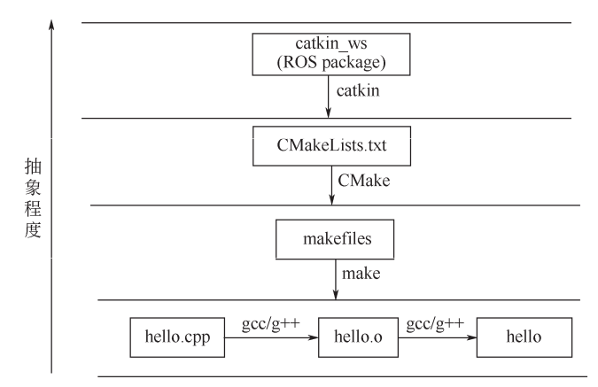
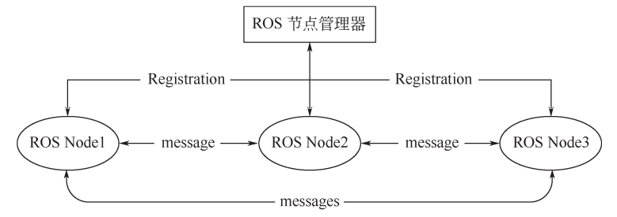
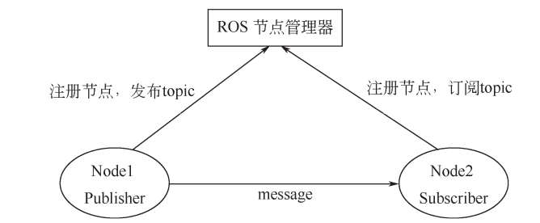
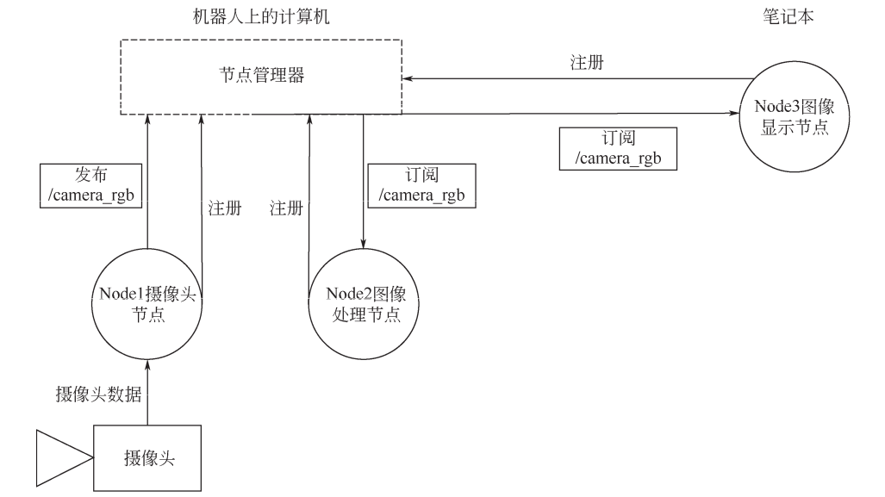
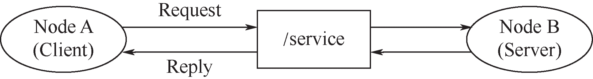
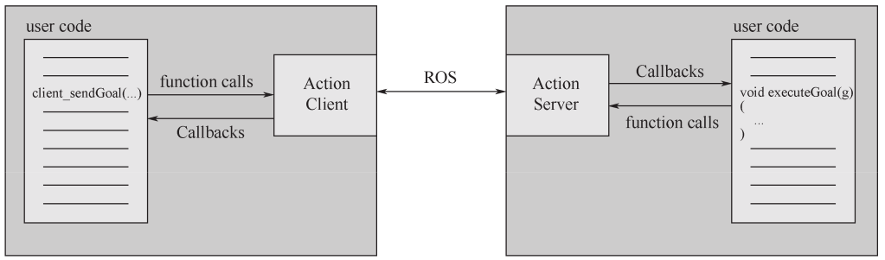
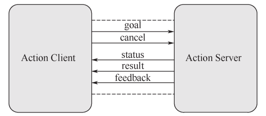

# 第 2 章 ROS 系统架构

本章主要介绍了 ROS 的工程结构和通信架构。工程结构是指文件系统的结构，而通信架构是ROS 的灵魂，也是整个 ROS 正常运行的关键所在，包括各种数据的处理、进程的运行、消息的传递等。要建立一个 ROS 项目，首先要认识一个 ROS 项目，从根本上熟悉 ROS 文件系统的组织形式和 ROS 各个进程的通信方式，从而正确地进行开发和编程。

本章我们将一起学习以下内容：

关于 ROS 的文件系统，我们将学习：catkin 工作空间、catkin 编译系统、功能包（package）及其包含的常见文件类型（包括 CMakeLists.txt 文件、 package.xml 文件等）、 元功能包（Metapackage）。

关于 ROS 的通信架构，我们将学习：ROS 节点（Node）与节点管理器（Node Master）的概念及工作原理、launch 启动文件、四种通信方式（包括话题 topic、服务 service、参数服务器parameter server、动作库 Actionlib）的通信原理以及它们对应的数据类型等。

## 2.1 ROS 文件系统

使用 ROS 实现机器人开发的主要手段当然是写代码，那么这些代码文件就需要存放到一个固定的空间内，也就是工作空间。而对于源代码，只有在编译之后才能在系统上运行。因此，我们必须掌握 ROS 的工作空间及其存放的各类型文件，了解 ROS 编译系统的原理及过程。

### 2.2.1 catkin 工作空间

工作空间（workspace）是一个存放工程开发相关文件的文件夹。catkin 工作空间是创建、修改、编译 catkin 软件包的目录。catkin 的工作空间，直观地形容就是一个仓库，里面装载着 ROS的各种项目工程，便于系统组织管理和调用。工作空间在可视化图形界面里是一个文件夹，我们自己写的 ROS 代码通常就放在工作空间中。

**（1）创建 catkin 工作空间**

首先使用系统命令创建一个初始的 catkin_ws 路径，这是 catkin 工作空间结构的最高层级。输入以下命令，完成 catkin 工作空间的创建与初始化。

```bash
mkdir –p ~/catkin_ws/src
cd ~/catkin_ws/src
catkin_make
```

第一行代码直接创建了第二层级的文件夹 src，这也是我们存放 ROS 软件包的地方。第二行代码使得进程进入工作空间，然后再初始化。注意：catkin_make 命令必须在工作空间的根目录下执行。

**（2）结构介绍**

一个典型的 catkin 编译系统下的工作空间结构如下所示：

`─ build`
`│ ├── catkin`
`│ │ └── catkin_generated`
`│ │ └── version`
`│ │ └── package.cmake`
`│ ├──`
`......`
`│ ├── catkin_make.cache`
`│ ├── CMakeCache.txt`
`│ ├── CMakeFiles`
`│ │ ├──`
`......`
`├── devel`
`│ ├── env.sh`
`│ ├── lib`
`│ ├── setup.bash`
`│ ├── setup.sh`
`│ ├── _setup_util.py`
`│ └── setup.zsh`
`└──src`
`└──CMakeLists.txt -> /opt/ros/kinetic/share/catkin/cmake/toplevel.cmake`

在工作空间下使用 tree 命令，即可显示文件结构。

```bash
cd  ~/catkin_ws
sudo apt install tree -y
tree
```

典型的 catkin 工作空间中一般包含以下三个目录空间：

① src：代码空间（Source Space），开发过程中最常用的文件夹，用来存储所有 ROS 的 package
源代码包。

② build：编译空间（Build Space），用来存储工作空间编译过程中产生的缓存信息和中间文件。

③ devel：开发空间（Development Sapce），用来存放编译生成的目标文件（包括头文件、动态链接库、静态链接库、可执行文件等）和环境变量。

在有些编译选项下也可能包含 install，即安装空间（Install Space）。编译成功后，可使用 make install 命令将可执行文件安装到该空间，运行该空间中的环境变量脚本，即可在终端运行这些可执行文件。但安装空间并不是必需的，很多工作空间中并没有该文件夹。

### 2.1.2 catkin 编译系统
对于源代码包，只有在编译之后才能在系统上运行。Linux 下的编译器有 gcc、g++，随着源文件数量的增加，直接用 gcc 或 g++命令的方式显得效率低下，人们逐渐开始用 Makefile 来进行编译。然而，随着工程体量的增大， Makefile 也不能满足需求，于是便出现了 CMake 工具。 CMake是对 make 工具的生成器，是更高层的工具，它简化了编译构建过程，能够管理大型项目，具有良好的扩展性。对于 ROS 这样大体量的平台来说，采用的就是 CMake，并且，ROS 对 CMake 进行了扩展，于是便有了 Catkin 编译系统。

早期的 ROS 编译系统是 rosbuild，但随着 ROS 的不断发展，rosbuild 逐渐暴露出许多缺点，不能很好地满足系统需求。在 Groovy 版本面世后，catkin 作为 rosbuild 的替代品被正式投入使用。catkin 操作更加简单且工作效率更高，可移植性更好，而且支持交叉编译和更加合理地功能包分配。目前的 ROS 同时支持着 rosbuild 和 catkin 两种编译系统，但 ROS 的核心软件包已经全部转换为 catkin。rosbuild 已经被逐步淘汰，所以建议初学者直接使用 catkin。

**（1）catkin 特点**

catkin 是基于 CMake 的编译构建系统，具有以下特点：
① catkin 沿用了包管理的传统，如 find_package（）基础结构。
② 扩展了 CMake。例如：软件包编译后无需安装就可使用；自动生成 find_package （）代码，pkg-config 文件；解决了多个软件包构建顺序问题。
③ 一个 catkin 的软件包（package）必须要包括两个文件：package.xml 文件和 CMakeLists.txt文件。关于这两个文件我们将在后面的小节详细介绍。

**（2）catkin 工作原理**
catkin 编译系统的工作流程如下：首先，在工作空间 catkin_ws/src/下递归地查找和编译其中每一个 ROS 的 package。package 中会有 package.xml 和 CMakeLists.txt 文件，catkin（CMake）编译系统依据 CMakeLists.txt 文件，生成 makefiles（放在 catkin_ws/build/）。然后，make 将生成的makefiles 文件编译、链接，生成可执行文件（放在 catkin_ws/devel）。也就是说，catkin 就是将CMake 与 make 指令做一个封装从而完成整个编译过程的工具。catkin 编译过程如图 2.1 所示。




<center>图 2.1 catkin 编译过程</center>

**（3）使用 catkin_make 进行编译**
要用 catkin 编译一个工程或软件包，只需要用 catkin_make 指令。一般当我们写完代码，执行一次 catkin_make 进行编译，调用系统自动完成编译和链接过程，构建生成目标文件。编译的一般流程如下：

```bash
cd ~/catkin_ws/   					#回到工作空间
catkin_make       					#开始编译
source ~/catkin_ws/devel/setup.bash #刷新环境
```

catkin 编译之前需要回到工作空间目录，catkin_make 在其他路径下编译不会成功。编译完成后，如果有新的目标文件产生（原来没有），那么一般紧跟着要刷新环境，使得系统能够找到刚才编译生成的 ROS 可执行文件。这个细节比较容易遗漏，致使后续出现可执行文件无法打开等错误。

catkin_make 命令也有一些可选参数，输入 catkin_make –h 即可查看以下参数信息：

| catkin_make [args]                                           |                                                              |
| ------------------------------------------------------------ | ------------------------------------------------------------ |
| -h, --help                                                   | #帮助信息                                                    |
| -C DIRECTORY, --directory DIRECTORY                          | #工作空间的路径 (默认为 '.')                                 |
| --source SOURCE                                              | #src 的路径 (默认为'workspace_base/src')                     |
| --build BUILD                                                | #build 的路径 (默认为'workspace_base/build')                 |
| --use-ninja                                                  | #用 ninja 取代 make                                          |
| --use-nmake                                                  | #用 nmake 取代 make                                          |
| --force-cmake                                                | #强制 CMake，即使已经 CMake 过                               |
| --no-color                                                   | #禁止彩色输出(只对 catkin_make 和 CMake 生效)                |
| --pkg PKG [PKG ...]                                          | #只对某个 PKG 进行 make                                      |
| --only-pkg-with-deps ONLY_PKG_WITH_DEPS [ONLY_PKG_WITH_DEPS ...] | #通过设置 CATKIN_WHITELIST_PACKAGES 变量将指定的 package 列入白<br/>#名单，此变量存在于 CMakeCache.txt 中 |
| --cmake-args [CMAKE_ARGS [CMAKE_ARGS ...]]                   | #传给 CMake 的参数                                           |
| --make-args [MAKE_ARGS [MAKE_ARGS ...]]                      | #传给 make 的参数                                            |
| --override-build-tool-check                                  | #用来覆盖由不同编译工具产生的错误                            |

### 2.1.3 package 功能包

功能包（package）是 catkin 编译的基本单元，包含 ROS 节点、库、配置文件等。我们调用catkin_make 编译的对象就是一个个 ROS 的 package，也就是说任何 ROS 程序只有组织成 package才能编译。所以，package 也是 ROS 源代码存放的地方，任何 ROS 的代码，无论是 C++代码还是Python 代码都要放到 package 中。一个 package 可以编译出多个目标文件（ROS 可执行程序、动态和静态库、头文件等）。

**（1）package 结构**
一个 package 功能包下常见的文件、路径有：
① CMakeLists.txt：定义 package 的包名、依赖、源文件、目标文件等编译规则，是 package不可缺少的成分。
② package.xml：描述 package 的包名、版本号、作者、依赖等信息，是 package 不可缺少的成分。
③ src/：用来存放需要编译的源代码文件。
④ include/：用来存放 ROS 源代码对应的头文件，包括 C++的源码（.cpp）和 Python 的 module
（py）。
⑤ scripts/：用来存放可执行脚本。如 shell 脚本（.sh）、python 脚本。
⑥ srv/：用来存放自定义格式的服务类型（.srv）。
⑦ msg/：用来存放自定义格式的消息类型（.msg）。
⑧ models/：用来存放机器人或仿真场景的 3D 模型（.sda、.stl、.dae 等）。
⑨ urdf/：用来存放机器人的模型描述（.urdf 或.xacro）。
⑩ launch/：用来存放功能包中所有的启动文件（.launch 或.xml）。
通常 ROS 文件都是按照以上形式组织的，这是约定俗成的命名习惯，建议遵守。以上路径中，
只有 CMakeLists.txt 和 package.xml 这两个文件是必需的，其余路径根据软件包是否需要来决定。

**（2）package 的创建**

创建一个 package 需要在 catkin_ws/src 下，用到 catkin_create_pkg 命令，用法是：catkin_create_pkg [package] [depends] 。其中 package 是包名， depends 是依赖的包名，可以依赖多个软件包。例如，新建一个 package 叫做 test_pkg，依赖为 roscpp、rospy、std_msgs（常用依赖），命令如下：

```bash
catkin_create_pkg test_pkg roscpp rospy std_msgs
```

**（3）package 相关命令**

① rospack rospack 是对 package 进行管理的工具，命令的用法如表 2.1 所示。

<center>表 2.1 rospack 常用命令</center>

| rospack 命令              | 作用                        |
| ------------------------- | --------------------------- |
| rospack help              | 显示 rospack 的用法         |
| rospack list              | 列出本机所有 package        |
| rospack depends [package] | 显示 package 的依赖包       |
| rospack find [package]    | 定位某个 package            |
| rospack profile           | 刷新所有 package 的位置记录 |

② roscd roscd 命令类似于 Linux 系统的 cd，改进之处在于 roscd 可以直接跳转到 ROS 的软件包。

```bash
roscd [package] #跳转到 package 所在的路径
```

③ rosls rosls 也可以视为 Linux 指令 ls 的改进版，可以直接列出 ROS 软件包的内容。

```bash
rosls [package] #列出 package 下的文件
```

④ rosdep rosdep 是用于管理 ROS 中 package 依赖项的命令行工具，用法如表 2.2 所示。

<center>表 2.2 rosdep 常用命令</center>

| rosdep 命令              | 作用                         |
| ------------------------ | ---------------------------- |
| rosdep check [package]   | 检查 package 的依赖是否满足  |
| rosdep install [package] | 安装 package 的依赖          |
| rosdep db                | 生成和显示依赖数据库         |
| rosdep init              | 初始化/etc/ros/rosdep 中的源 |
| rosdep keys              | 检查 package 的依赖是否满足  |
| rosdep update            | 更新本地的 rosdep 数据库     |

一个较为常用的命令是 rosdep install --from-paths src --ignore-src –rosdistro=noetic –y ，用于安装工作空间中 src/路径下所有 package 的依赖项（由 package.xml 文件指定）。

### 2.1.4 CMakeLists.txt 文件

CMakeLists.txt 原本是 CMake 编译系统的规则文件，而 catkin 编译系统基本沿用了 CMake 的编译风格，只是针对 ROS 工程添加了一些宏定义。所以在写法上， catkin 的 CMakeLists.txt 与 CMake的基本一致。CMakeLists.txt 文件直接规定了某个 package 需要依赖哪些 package、要编译生成哪些目标、如何编译等流程。它指定了由源码到目标文件的编译规则，catkin 编译系统在工作时首先会找到每个 package 下的 CMakeLists.txt，然后按照规则来编译构建。

CMakeLists.txt 的基本语法还是按照 CMake 的语法标准，而 catkin 在其中加入了少量的宏，总体的结构如下：

| CMakeLists.txt 的基本语法 | 描述                                                         |
| ------------------------- | ------------------------------------------------------------ |
| cmake_minimum_required()  | #CMake 的版本号                                              |
| project()                 | #项目名称                                                    |
| find_package()            | #找到编译需要的其他 CMake/catkin package                     |
| catkin_python_setup()     | #catkin 新加宏，打开 catkin 的 Python module 的支持          |
| add_message_files()       | #catkin 新加宏，添加自定义 message文件                       |
| add_service_files()       | #catkin 新加宏，添加自定义service文件                        |
| add_action_files()        | #catkin 新加宏，添加自定义action文件                         |
| generate_message()        | #catkin 新加宏，生成不同语言版本的 msg/srv/Action 接口       |
| catkin_package()          | #catkin 新加宏，生成当前 package 的 Cmake 配置，供依赖本包的其他软件包调用 |
| add_library()             | #生成库                                                      |
| add_executable()          | #生成可执行二进制文件                                        |
| add_dependencies()        | #定义目标文件依赖于其他目标文件，确保其他目标文件已被构建    |
| target_link_libraries()   | #链接                                                        |
| catkin_add_gtest()        | #catkin 新加宏，生成测试                                     |
| install()                 | #安装至本机                                                  |

为了详细地解释 CMakeLists.txt 的写法，我们以 turtlesim 小海龟这个 package 为例，读者可 roscd 到 turtlesim 包下查看。CMakeLists.txt 的写法如下：


```cmake
cmake_minimum_required(VERSION 2.8.3) #CMake 至少为 2.8.3 版
project(turtlesim) #项目(package)名称为 turtlesim，在后续文件中可使用变量${PROJECT_NAME}来引用项目名称turltesim
find_package(catkin REQUIRED COMPONENTS geometry_msgs message_generation rosconsole roscpp roscpp_serialization roslib rostime std_msgs std_srvs) #cmake 宏，指定依赖的其他 package，实际是生成了一些环境变量，如<NAME>_FOUND、<NAME>_INCLUDE_DIRS、 <NAME>_LIBRARYIS
#此处 catkin 是必备依赖，其余的 geometry_msgs……为组件
find_package(Qt5Widgets REQUIRED)
find_package(Boost REQUIRED COMPONENTS thread)
include_directories(include ${catkin_INCLUDE_DIRS} ${Boost_INCLUDE_DIRS}) #指定 C++的头文件路径
link_directories(${catkin_LIBRARY_DIRS}) #指定链接库的路径
add_message_files(DIRECTORY msg FILES
	Color.msg Pose.msg) #自定义 msg 文件
add_service_files(DIRECTORY srv FILES
	Kill.srv
	SetPen.srv
	Spawn.srv
	TeleportAbsolute.srv
	TeleportRelative.srv) #自定义 srv 文件
generate_messages(DEPENDENCIES geometry_msgs std_msgs std_srvs) #在 add_message_files、 add_service_files 宏之后必须加上这句话，用于生成 srv、msg 头文件/module，生成的文件位于 devel/include 中
catkin_package(CATKIN_DEPENDS geometry_msgs message_runtime std_msgs std_srvs)
#catkin 宏命令，用于配置 ROS 的 package 配置文件和 CMake 文件
#这个命令必须在 add_library()或者 add_executable()之前调用，该函数有 5 个可选参数：
#(1) INCLUDE_DIRS——导出包的 include 路径
#(2) LIBRARIES——导出项目中的库
#(3) CATKIN_DEPENDS——该项目依赖的其他 catkin 项目
#(4) DEPENDS——该项目所依赖的非 catkin、CMake 项目
#(5) CFG_EXTRAS——其他配置选项
set(turtlesim_node_SRCS
	src/turtlesim.cpp
	src/turtle.cpp
	src/turtle_frame.cpp)
	set(turtlesim_node_HDRS
	include/turtlesim/turtle_frame.h) #指定 turtlesim_node_SRCS、turtlesim_node_HDRS 变量
qt5_wrap_cpp(turtlesim_node_MOCS ${turtlesim_node_HDRS})
add_executable(turtlesim_node ${turtlesim_node_SRCS} ${turtlesim_node_MOCS})
#指定可执行文件目标 turtlesim_node
target_link_libraries(turtlesim_node Qt5::Widgets ${catkin_LIBRARIES}
${Boost_LIBRARIES})
#指定链接可执行文件
add_dependencies(turtlesim_node turtlesim_gencpp)
add_executable(turtle_teleop_key tutorials/teleop_turtle_key.cpp)
target_link_libraries(turtle_teleop_key ${catkin_LIBRARIES})
add_dependencies(turtle_teleop_key turtlesim_gencpp)
add_executable(draw_square tutorials/draw_square.cpp)
target_link_libraries(draw_square ${catkin_LIBRARIES} ${Boost_LIBRARIES})
add_dependencies(draw_square turtlesim_gencpp)
add_executable(mimic tutorials/mimic.cpp)
target_link_libraries(mimic ${catkin_LIBRARIES})
add_dependencies(mimic turtlesim_gencpp)
#同样指定可执行目标、 链接、 依赖
install(TARGETS turtlesim_node turtle_teleop_key draw_square mimic RUNTIME DESTINATION ${CATKIN_PACKAGE_BIN_DESTIATION})
#安装目标文件到本地系统
install(DIRECTORY images DESTINATION ${CATKIN_PACKAGE_SHARE_DESTINATION} FILES_MATCHING PATTERN "*.png" PATTERN "*.svg")
```

### 2.1.5 package.xml 文件

package.xml 也是 catkin 的 package 必备文件，它是这个软件包的描述文件，在较早的ROS版本（rosbuild 编译系统）中，这个文件叫做 manifest.xml，用于描述 package 的基本信息。如果你在网上看到一些 ROS 项目里包含着 manifest.xml，那么它多半是 Hydro 版本之前的项目了。

每个功能包都包含一个名为 package.xml 的功能包清单，用于记录功能包的基本信息，包含了package 的名称、版本号、内容描述、维护人员、软件许可、编译构建工具、编译依赖、运行依赖等信息。实际上， rospack find 和 rosdep 等命令之所以能快速定位和分析出 package 的依赖项信息，就是因为直接读取了每一个 package 中的 package.xml 文件，它为用户提供了快速了解一个 package的渠道。

package.xml 遵循 xml 标签文本的写法，由于版本更迭的原因，现在有两种格式（format1与format2），不过区别不大。老版本（format1）的 package.xml 通常包含以下标签： 

| package.xml语法    | 描述                         |
| ------------------ | ---------------------------- |
| <package>          | #根标记文件                  |
| <name>             | #包名                        |
| <version>          | #版本号                      |
| <description>      | #内容描述                    |
| <maintainer>       | #维护者                      |
| <license>          | #软件许可证                  |
| <buildtool_depend> | #编译构建工具，通常为 catkin |
| <build_depend>     | #编译依赖项                  |
| <run_depend>       | #运行依赖项                  |

说明：其中，第 1～6 个为必备标签，第 1 行是根标签，嵌套了其余的所有标签；第 2～6 个为包的各种属性；第 7～9 个为编译的相关信息。
在新版本（format2）中，package.xml 通常包含以下标签：

| package.xml语法       | 描述                                             |
| --------------------- | ------------------------------------------------ |
| <package>             | #根标记文件                                      |
| <name>                | #包名                                            |
| <version>             | #版本号                                          |
| <description>         | #内容描述                                        |
| <maintainer>          | #维护者                                          |
| <license>             | #软件许可证                                      |
| <buildtool_depend>    | #编译构建工具，通常为 catkin                     |
| <depend>              | #指定依赖项为编译、导出、运行需要的依赖， 最常用 |
| <build_depend>        | #编译依赖项                                      |
| <build_export_depend> | #导出依赖项                                      |
| <exec_depend>         | #运行依赖项                                      |
| <test_depend>         | #测试用例依赖项                                  |
| <doc_depend>          | #文档依赖项                                      |

由此看出，新版本的 package.xml 在格式上增加了一些内容，相当于将之前的 build 和 run 依赖项的描述进行了细分。目前，Indigo、Kinetic、Lunar 等版本的 ROS 都同时支持两种版本的package.xml，所以无论选哪种格式都可以。

为了说明 package.xml 的写法，还是以 turtlesim 软件包为例，其 package.xml 文件内容如下，并添加了相关的注释。

 ```xml
 <?xml version="1.0"?>
 <!--本示例为老版本的 package.xml-->
 <package>
     <!--package 为根标签，写在最外面-->
     <name>turtlesim</name>
     <version>0.8.1</version>
     <description>
 turtlesim is a tool made for teaching ROS and ROS packages.
 </description>
     <maintainer email="dthomas@osrfoundation.org">Dirk Thomas</maintainer>
     <license>BSD</license>
     <url type="website">http://www.ros.org/wiki/turtlesim</url>
     <url type="bugtracker">https://github.com/ros/ros_tutorials/issues</url>
     <url type="repository">https://github.com/ros/ros_tutorials</url>
     <author>Josh Faust</author>
     <!--编译工具为 catkin-->
     <buildtool_depend>catkin</buildtool_depend>
     <!--编译时需要依赖以下包-->
     <build_depend>geometry_msgs</build_depend>
     <build_depend>qtbase5-dev</build_depend>
     <build_depend>message_generation</build_depend>
     <build_depend>qt5-qmake</build_depend>
     <build_depend>rosconsole</build_depend>
     <build_depend>roscpp</build_depend>
     <build_depend>roscpp_serialization</build_depend>
     <build_depend>roslib</build_depend>
     <build_depend>rostime</build_depend>
     <build_depend>std_msgs</build_depend>
     <build_depend>std_srvs</build_depend>
     <!--运行时需要依赖以下包-->
     <run_depend>geometry_msgs</run_depend>
     <run_depend>libqt5-core</run_depend>
     <run_depend>libqt5-gui</run_depend>
     <run_depend>message_runtime</run_depend>
     <run_depend>rosconsole</run_depend>
     <run_depend>roscpp</run_depend>
     <run_depend>roscpp_serialization</run_depend>
     <run_depend>roslib</run_depend>
     <run_depend>rostime</run_depend>
     <run_depend>std_msgs</run_depend>
     <run_depend>std_srvs</run_depend>
 </package>
 ```

上面内容是老版本（format1）的写法，如果要写成新版本（format2）则可以改为下面的写法。

```xml
<?xml version="1.0"?>
<package format="2">
    <!--在声明 package 时指定 format2，为新版格式-->
    <name>turtlesim</name>
    <version>0.8.1</version>
    <description>
turtlesim is a tool made for teaching ROS and ROS packages.
</description>
    <maintainer email="dthomas@osrfoundation.org">Dirk Thomas</maintainer>
    <license>BSD</license>
    <url type="website">http://www.ros.org/wiki/turtlesim</url>
    <url type="bugtracker">https://github.com/ros/ros_tutorials/issues</url>
    <url type="repository">https://github.com/ros/ros_tutorials</url>
    <author>Josh Faust</author>
    <!--编译工具为 catkin-->
    <buildtool_depend>catkin</buildtool_depend>
    <!--用 depend 来整合 build_depend 和 run_depend-->
    <depend>geometry_msgs</depend>
    <depend>rosconsole</depend>
    <depend>roscpp</depend>
    <depend>roscpp_serialization</depend>
    <depend>roslib</depend>
    <depend>rostime</depend>
    <depend>std_msgs</depend>
    <depend>std_srvs</depend>
    <!--build_depend 标签未变-->
    <build_depend>qtbase5-dev</build_depend>
    <build_depend>message_generation</build_depend>
    <build_depend>qt5-qmake</build_depend>
    <!--run_depend 要改为 exec_depend-->
    <run_depend>libqt5-core
    </exec_depend>
    <run_depend>libqt5-gui
    </exec_depend>
    <run_depend>message_runtime
    </exec_depend>
</package>
```

### 2.1.6 其他常见文件类型

在 ROS 的 package 中，除了 CMakeLists.txt 和 package.xml 这两个必备的文件之外，还有许多其他常见的文件类型，这里做一个简单的介绍。

① launch 文件：通常放在软件包的 launch/路径中，一般以.launch 或.xml 结尾，它对 ROS 需要运行的程序进行了打包，通过一句命令来启动。一般 launch 文件中会指定要启动哪些 package下的哪些可执行程序，以什么参数启动，以及一些管理控制的命令。详细内容将在后文介绍。

② msg/srv/action 文件：ROS 程序中有可能有一些自定义的消息/服务/动作文件，是为程序的开发者所设计的数据结构，这类文件以“.msg” “.srv” “.action”结尾，通常放在 package 的“msg/” “srv/” “action/”路径下。

③ urdf/xacro 文件：是机器人模型的描述文件，以.urdf 或.xacro 结尾。它定义了机器人的连接件和关节的信息，以及它们之间的位置、角度等信息，通过 urdf 文件可以将机器人的物理连接信息表示出来，并在可视化调试和仿真中显示。

④ yaml 文件：一般存储了 ROS 需要加载的参数信息和一些属性配置。通常在 launch 文件或程序中读取 yaml 文件，把参数加载到参数服务器上。一般会把 yaml 文件存放在 param/路径下。

⑤ dae/stl 文件：dae 或 stl 文件是 3D 模型文件，机器人的 URDF 或仿真环境通常会引用这类文件，它们描述了机器人的三维模型。相比 urdf 文件，dae/stl 文件可以定义更复杂的模型，可以直接从 SolidWorks 或其他建模软件中导出机器人装配模型，从而显示出更加精确的外形。

⑥ rviz 文件：本质上是固定格式的文本文件，其中存储了 Rviz 窗口的配置（显示哪些控件、视角、参数等）。通常 rviz 文件不需要手动修改，而是直接在 Rviz 工具里保存，以便下次运行时直接读取。

### 2.1.7 Metapackage 元功能包

 **（1）Metapackage 介绍**
在 Hydro 版本之后的 ROS 版本中，原有功能包集（Stack）的概念升级为“元功能包”（Metapackage），主要作用都是将多个功能接近，甚至相互依赖的软件包整合成为一个功能包集合。例如一个 ROS 导航的元功能包中包含建模、定位、导航等多个功能包。

ROS 里常见的元功能包如表 2.3 所示。

<center>表 2.3 常见的 Metapackage</center>

| Metapackage名称 | 描述                                   | 链接                                            |
| --------------- | -------------------------------------- | ----------------------------------------------- |
| navigation      | 导航相关的功能包集                     | https://github.com/ros-planning/navigation      |
| moveit          | 运动规划相关的（主要是机械臂）功能包集 | https://github.com/ros-planning/moveit          |
| image_pipeline  | 图像获取、处理相关的功能包集           | https://github.com/ros-perception/image_common  |
| vision_opencv   | OS 与 OpenCV 交互的功能包集            | https://github.com/ros-perception/vision_opencv |
| turtlebot       | TurtleBot 机器人相关的功能包集         | https://github.com/turtlebot/turtlebot          |
| pr2_robot       | PR2 机器人驱动功能包集                 | https://github.com/PR2/pr2_robot                |

（2）Metapackage 写法
我们以 ROS-Academy-for-Beginners 为例介绍 Metapackage 的写法。在教学包内，有一个ros-academy-for-beginners 软 件 包 ， 该 包 即 为 一 个 Metapackage ， 其 中 有 且 仅 有 两 个 文 件 ：CMakeLists.txt 和 package.xml。

CMakeLists.txt 的写法如下：

```cma
cmake_minimum_required(VERSION 2.8.3)
project(ros_academy_for_beginners)
find_package(catkin REQUIRED)
catkin_metapackage()
#声明本软件包是一个 Metapackage
```

package.xml 的写法如下：

```xml
<package>
    <name>ros_academy_for_beginners</name>
    <version>17.12.4</version>
    <description>
--------------------------------------------------------------------------
A ROS tutorial for beginner level learners. This metapackage includes some
demos of topic, service, parameter server, tf, urdf, navigation, SLAM...
It tries to explain the basic concepts and usages of ROS.
--------------------------------------------------------------------------
</description>
    <maintainer email="yunxiang@iscas.ac.cn">Chai Changkun</maintainer>
    <author>Luo Yunxiang</author>
    <license>BSD</license>
    <url>http://http://www.droid.ac.cn</url>
    <buildtool_depend>catkin</buildtool_depend>
    <run_depend>navigation_sim_demo</run_depend>
    <!--注意这里的 run_depend 标签，将其
他软件包都设为依赖项-->
    <run_depend>param_demo</run_depend>
    <run_depend>robot_sim_demo</run_depend>
    <run_depend>service_demo</run_depend>
    <run_depend>slam_sim_demo</run_depend>
    <run_depend>tf_demo</run_depend>
    <run_depend>topic_demo</run_depend>
    <export>
        <!--这里需要有 export 和 Metapackage 标签，注意这种固定写法-->
        <metapackage/>
    </export>
</package>
```

Metapackage 中的以上两个文件和普通 package 的不同点是：CMakeLists.txt 文件中加入了catkin_metapackage（）宏，指定本软件包为一个 Metapackage；package.xml 文件的标签将所有软件包列为依赖项，标签中添加标签声明。

## 2.2 ROS 通信架构

ROS 是一个分布式框架，为用户提供多节点（进程）之间的通信服务，所有软件功能和工具都建立在这种分布式通信机制上，所以，ROS 的通信机制是最底层也是最核心的技术。在2.1节我们重点介绍了 package 功能包及其包含的各文件类型，而一个 package 里可以有多个可执行文件，一个可执行文件在运行之后就成为一个进程，这个进程在 ROS 中就叫做节点。要掌握 ROS 的通信架构，就需要了解各个节点的运行原理和它们的通信方式。因此，本节首先介绍最小的进程单元——节点和节点管理器，然后介绍 ROS 的“发动机”——launch 文件，最后介绍 ROS 中的四种通信方式，即话题、服务、参数服务器、动作库。

### 2.2.1 Node 与 Node Master

**（1）概念**

节点（Node）是执行运算任务的进程，一个系统一般由多个节点组成，也可以称作“软件模块”。在 ROS 中，最小的进程单元就是节点。从程序角度来说，一个节点就是一个可执行文件（通常为 C++编译生成的可执行文件、Python 脚本）被执行，加载到了内存之中；从功能角度来说，通常一个节点负责机器人的某一个单独的功能。由于机器人的功能模块非常复杂，我们往往不会把所有功能都集中到一个节点上，而会采用分布式的方式。

由于机器人元器件很多、功能庞大，因此实际运行时往往会运行众多的节点，分别负责感知世界、控制运动、决策和计算等不同的功能。那么如何合理地进行调配、管理这些节点呢？这就要利用 ROS 提供的节点管理器（Node Master），节点管理器在整个网络通信架构里相当于管理中心，管理着各个节点。首先节点在节点管理器处进行注册，之后节点管理器会将该节点纳入整个ROS 程序中。Node 之间的通信也是先由节点管理器进行“牵线”，才能两两进行点对点的通信。当 ROS 程序启动时，首先启动节点管理器，再由节点管理器依次启动各个节点。

**（2）启动节点管理器和节点**

首先启动 ROS，输入命令：

```bash
roscore
```

此时 ROS 节点管理器启动，同时启动的还有 rosout 和 parameter server。其中 rosout 是负责日志输出的一个节点，其作用是告知用户当前系统的状态，包括输出系统的 error、warning 等，并且将 log 记录于日志文件中；parameter server 即参数服务器，它并不是一个节点，而是存储配置参数的一个服务器，后文我们会单独介绍。每一次运行 ROS 的节点前，都需要先启动节点管理器，才能够让节点注册和启动。

启动节点管理器之后，节点管理器开始按照系统的安排协调启动具体的节点。我们知道一个package 中存放着可执行文件，可执行文件是静态的，当系统执行这些可执行文件并将这些文件加载到内存中时，就成为了动态的节点。按照以下格式输入命令启动节点，其中pkg_name为包名，node_name为程序名，它需要有可执行权限。

```bash
rosrun pkg_name node_name
```

通常就是按照这样的顺序启动，当节点太多时，则选用 launch 文件来启动（将在下一小节介绍）。节点管理器与节点之间以及节点与节点之间的关系如图 2.2 所示。



<center>图 2.2 节点管理器与各 Node 之间的关系图</center>

**（3）rosrun 和 rosnode 命令**

rosrun 命令的详细用法如下：

```bash
rosrun [--prefix cmd] [--debug] pkg_name node_name [ARGS]
```

rosrun 将会寻找 pkg_name下的名为 node_name 的可执行程序，将可选参数 ARGS 传入。例如在gdb 下运行 ROS 程序：

```bash
rosrun --prefix 'gdb -ex run --args' pkg_name node_name
```

rosnode 命令的详细用法与作用如表 2.4 所示。

以上命令中常用的为前三个，在开发调试时经常需要查看当前节点以及节点的信息，所以请记住这些常用命令。如果你忘记这些命令，也可以通过 rosnode help 来查看 rosnode 命令的用法。

<center>表 2.4 rosnode 命令的详细用法与作用</center>

| rosnode命令            | 作用                                 |
| ---------------------- | ------------------------------------ |
| rosnode list           | 列出当前运行的节点信息               |
| rosnode info node_name | 显示出节点的详细信息                 |
| rosnode kill node_name | 结束某个节点                         |
| rosnode ping           | 测试连接节点                         |
| rosnode machine        | 列出在特定机器或列表机器上运行的节点 |
| rosnode cleanup        | 清除不可到达节点的注册信息           |

### 2.2.2 launch 启动文件   

机器人是一个系统工程，通常一个机器人运行操作时要开启很多个节点，对于一个复杂的机器人的启动操作应该怎么做呢？当然，我们并不需要对每个节点依次进行 rosrun，ROS 提供了一种能同时启动节点管理器和多个节点的方法，那便是 launch 启动文件。任何包含两个或两个以上节点的系统都可以利用启动文件来指定和配置需要使用的节点。通常的命名方案是以.launch 作为启动文件的后缀，启动文件是 XML 文件。一般把启动文件存储在取名为 launch 的目录中。该方法需要输入以下格式的命令来实现： 

```bash
roslaunch pkg_name file_name.launch
```

roslaunch 命令首先会自动检测系统的 roscore 有没有运行，也就是确认节点管理器是否在运行状态中。如果节点管理器没有启动，那么 roslaunch 就会首先启动节点管理器，然后再按照 launch的规则执行，launch 文件里已经配置好了启动的规则。所以 roslaunch 就像是一个启动工具，能够按照预先配置的规则把多个节点一次性启动起来，避免用户在终端中逐条输入指令。

 **（1）写法与格式**

launch 文件同样也遵循着 XML 格式规范，是一种标签文本，它的格式包括以下标签（参考链接：http://wiki.ros.org/roslaunch/XML）：

| launch语法   | 描述                                |
| ------------ | ----------------------------------- |
| <launch>     | <!--根标签-->                       |
| <node>       | <!--需要启动的节点及其参数-->       |
| <include>    | <!--包含其他 launch-->              |
| <machine>    | <!--指定运行的机器-->               |
| <env-loader> | <!--设置环境变量-->                 |
| <param>      | <!--定义参数到参数服务器-->         |
| <rosparam>   | <!--加载yaml文件参数到参数服务器--> |
| <arg>        | <!--定义变量-->                     |
| <remap>      | <!--设定参数映射-->                 |
| <group>      | <!--设定命名空间-->                 |
| </launch>    | <!--根标签-->                       |

需要注意的是：每个 XML 文件都必须要包含一个根元素，根元素由一对<launch>标签定义，即“<launch> …</launch>”，文件中的其他内容都必须包含在这对标签之内；启动文件的核心是启动 ROS 节点，采用<node>标签定义。除了这两个标签，我们还需要关注<param>、<arg>、<remap>这几个常用的标签。

**（2）参数设置**

关于参数设置的标签元素有<param>和<arg>，分别代表 parameter 和 argument，尽管翻译为中文都是“参数”的意思，但 parameter 和 argument 在 ROS 中的含义是截然不同的，就像编程语言中的全局变量和局部变量的区别一样。 parameter 是运行中的 ROS 系统使用的数值，存储在参数服务器中，每个活跃的节点都可以通过 ros::param::get 函数来获取 parameter 的值，用户也可以通过rosparam 命令来获得 parameter 的值；而 argument 只在启动文件内才有意义，不能提供给节点使用，只能在 launch 文件中使用。

例如，在参数服务器中添加一个名为 demo_param、值为 888 的参数，其命令如下：

 ```xml
 <param name="demo_param" type="int" value="888"/>
 ```

当 launch 文件中需要用到 argument 时，可以使用如下命令调用：

```xml
<param name="demo" value="$（arg demo_arg）" />
<node name="node" pkg="package" type="type" args="$（arg demo_arg）" />
```

**（3）重映射**

<remap>标签顾名思义就是重映射，重映射是基于替换的思想，每个重映射包含一个原名称和一个新名称。ROS 支持话题的重映射，每当节点使用重映射中的原始名称时，ROS 客户端库就会默默地将它替换成其对应的新名称。<remap>标签里包含一个 original-name 和一个 new-name，即原名称和新名称。

例如，TurtleBot 的键盘控制节点发布的速度控制指令话题可能是/turtlebot/cmd_vel，但是我们自己的机器人订阅的速度控制话题是/cmd_vel，这时使用<remap>标签就可以将/turtlebot/cmd_vel重映射为/cmd_vel，这样我们的机器人就可以接收到速度控制指令了。该命令如下：

 ```xml
 <remap from="/turtlebot/cmd_vel" to="/cmd_vel " />
 ```

**（4）示例** 

我们先来介绍 ROS 官网给出的一个最简单的例子，文本中的信息是，它启动了一个单独的节点 talker，该节点是 rospy_tutorials 软件包中的节点。

```xml
<launch>
    <node name="talker" pkg="rospy_tutorials" type="talker" />
</launch>
```

从上面的示例中可以看出，在启动文件中启动一个节点需要三个属性：name、pkg 和 type。其中，name 属性用来定义节点运行的名称，将覆盖节点中 init(）赋予节点的名称；pkg 定义节点所在的功能包名称；type 定义节点的可执行文件名称。这三个属性等同于在终端使用 rosrun 命令启动节点时的输入参数。这是三个最常用的属性，在有些情况下，我们还有可能用到以下属性：

① output = “screen”：将节点的标准输出打印到终端屏幕，默认输出为日志文档。

② respawn = “true”：复位属性，该节点停止时会自动重启，默认为 false。

③ required = “true”：必要节点，当该节点终止时，launch 文件中的其他节点也被终止。

④ ns = “namespace”：命名空间，为节点内的相对名称添加命名空间前缀。

⑤ args = “arguments”：节点需要的输入参数。

实 际 应 用 中 的 launch 文 件 往 往 要 复 杂 很 多 ， 我 们 以 Ros-Academy-for-Beginners 中 的robot_sim_demo 的 robot_spawn.launch 为例：

```xml
<launch>
    <!--arg 是 launch 标签中的变量声明，arg 的 name 为变量名，default 或者 value 为值-->
    <arg name="robot"default="xbot2"/>
    <arg name="debug"default="false"/>
    <arg name="gui" default="true"/>
    <arg name="headless" default="false"/>
    <!-- Start Gazebo with a blank world -->
    <include file="$(find gazebo_ros)/launch/empty_world.launch">
        <!--include 用来嵌套仿真场景的 launch 文件-->
        <arg name="world_name" value="$(find robot_sim_demo)/worlds/ROS-Academy.world"/>
        <arg name="debug" value="$(arg debug)" />
        <arg name="gui" value="$(arggui)" />
        <arg name="paused" value="false"/>
        <arg name="use_sim_time" value="true"/>
        <arg name="headless" value="$(arg headless)"/>
    </include>
    <!-- Oh, you wanted a robot? -->
    <!--嵌套了机器人的 launch 文件-->
    <include file="$(find robot_sim_demo)/launch/include/$(arg robot).launch.xml" />
    <!--如果想连同 Rviz 一起启动，可以按照以下方式加入 Rviz 这个节点-->
    <node name="rviz" pkg="rviz" type="rviz" args="-d $(find robot_sim_demo)/urdf_gazebo.rviz" />
</launch>
```

这个 launch 文件相比上一个简单的例子来说，内容稍微有些复杂。它的作用是启动 Gazebo模拟器，导入参数内容，加入机器人模型。对于初学者，不要求掌握每一个标签的作用，但至少应该有一个印象。如果读者自己需要写 launch 文件，可以先从改 launch 文件的模板入手，基本可以满足普通项目的要求。

### 2.2.3 话题
**（1）通信原理**

ROS 的通信方式中，话题（topic）是常用的一种。对于实时性、周期性的消息，使用 topic来传输是最佳的选择。topic 是一种点对点的单向通信方式，这里的“点”指的是节点，也就是说节点之间可以通过 topic 方式来传递信息。topic 要经历下面几步的初始化过程：首先，Publisher（发布）节点和 Subscriber （订阅）节点都要到节点管理器进行注册，然后， Publisher 会发布 topic，Subscriber 在节点管理器的指挥下会订阅该 topic，从而建立起 Sub-Pub 之间的通信。注意：整个过程是单向的。其流程示意图如图 2.3 所示。



<center>图 2.3 topic 通信流程示意图</center>

Subscriber 会对接收到的消息进行处理，一般这个过程叫做回调（Callback）。所谓回调就是提前定义好了一个处理函数（写在代码中），当有消息来时就会触发这个处理函数，函数会对消息的内容进行处理。topic 通信属于一种异步的通信方式。下面我们通过一个示例来了解一下如何使用 topic 通信。

**（2）示例**

参考图 2.4，我们以摄像头画面的发布、处理、显示为例来介绍 topic 通信的流程。在机器人上的摄像头拍摄程序是一个节点（用圆圈表示，我们记作 Node1），当 Node1 运行启动之后，它作为一个 Publisher 就开始发布 topic。比如它发布了一个叫做/camera_rgb 的 topic（方框表示），是 RGB 颜色信息，即采集到的彩色图像。同时，假设 Node2 是图像处理程序，它订阅了/camera_rgb这个 topic，经过节点管理器的配对，它就能建立和摄像头节点（Node1）的连接。Node1 每发布一个消息之后，就会继续执行下一个动作，至于消息是什么状态、被怎样处理，Node1 并不关心；而对于 Node2，它只负责接收和处/camera_rgb 上的消息，至于是谁发来的，它也不关心。因此，Node1 与 Node2 两者都各司其职，不存在协同工作，我们称这种通信方式是异步的。



<center>图 2.4 通信示例示意图</center>

ROS 是一种分布式的架构，一个 topic 可以被多个节点同时发布，也可以同时被多个节点订阅。比如在这个场景中用户可以再加入一个图像显示的节点 Node3，如果想看看摄像头节点的画面，则可以用自己的笔记本连接到机器人上的节点管理器，然后在笔记本上启动图像显示节点。这就体现了分布式系统通信的好处：扩展性好、软件复用率高。

总结三点：

① topic 通信方式是异步的，发送时调用 publish（）函数，发送完成立即返回，不用等待反馈。

② Subscriber 通过回调函数的方式来处理消息。

③ topic 可以同时有多个 Subscriber，也可以同时有多个 Publisher。ROS 中这样的例子有/rosout、/tf 等。

**（3）rostopic 操作指令**

在实际应用中，应该熟悉 topic 的几种常见的操作命令，表 2.5 详细地列出了各命令及其作用，可以通过命令 rostopic help 或 rostopic command -h 查看具体用法。

<center>表 2.5 rostopic 命令及作用</center>

| rostopic 命令            | 作用                         |
| ------------------------ | ---------------------------- |
| rostopic list            | 列出当前所有的 topic         |
| rostopic info topic_name | 显示某个 topic 的属性信息    |
| rostopic echo topic_name | 显示某个 topic 的内容        |
| rostopic pub topic_name  | 向某个 topic 发布内容        |
| rostopic bw topic_name   | 查看某个 topic 的带宽        |
| rostopic hz topic_name   | 查看某个 topic 的频率        |
| rostopic find topic_type | 查找某个类型的 topic         |
| rostopic type topic_name | 查看某个 topic 的类型（msg） |

**（4）操作实例**

① 首先打开 ROS-Academy-for-Beginners 的模拟场景，输入 roslaunch robot_sim_demo robot_spawn.launch ，可以看到仿真的模拟环境，该 launch 文件启动了模拟场景、机器人。

② 再打开一个终端查看当前模拟器中存在的 topic，输入命令 rostopic list ，可以看到许多 topic，可以将它们视为模拟器与外界交互的接口。

③ 查询 topic “ /camera/rgb/image_raw”的相关信息 rostopic info /camera/rgb/image_raw ，则会显示信息类型 type、发布者和订阅者的信息。

④ 上步演示中可以得知，并没有订阅者订阅该 topic。指定 image_view 来接收这个消息，命令格式为 rosrun image_view image_view image:=<image topic> [transport] 。例如运行命令 rosrun image_view image_view image：= /camera/rgb/image_raw ，会出现一张 RGB图 片 ， 其 message 类 型 即 上 一 步 中 的 信 息 类 型 type 。 此 时 ， 再 次 运 行 rostopic info /camera/rgb/image_raw ，会发现该 topic 已被订阅。

⑤ 同理，可以查询摄像头的深度信息 depth 图像： rosrun image_view image_view image:=/camera/depth/image_raw 。

⑥ 运行命令 rosrun robot_sim_demo robot_keyboard_teleop.py ，可用键盘控制仿真机器人运动。与此同时，可查看 topic 的内容 rostopic echo /cmd_vel ，可以看到窗口显示的各种坐标参数在不断变化。

**（5）message**

topic 有很严格的格式要求，比如前面提到的摄像头进程中的 RGB 图像 topic，它必然要遵循ROS 中定义好的 RGB 图像格式。这种数据格式就是 message，文件类型为.msg。message 按照定义解释就是 topic 内容的数据类型，也称之为 topic 的格式标准。这里和平常用到的 message 直观概念有所不同，这里的 message 不单单指一条发布或者订阅的消息，也指 topic 的格式标准。

① 结构与类型 基本的 msg 包括 bool、int8、int16、int32、int64（以及 uint）、float、float64、string、time、duration、header、可变长度数组 array[]、固定长度数组 array[C]。那么，一个具体的 msg文件是怎么组成的呢？例如下面这个存放在 sensor_msgs/msg/image.msg 里的 msg 文件，其结构如下： 

 ```python
 std_msg/Header header
     uint32 seq
     time   stamp
 	string frame_id
 uint32  height
 uint32  width
 string  encoding
 uint8   is_bigendian
 uint32  step
 uint8[] data
 ```

观察上面 msg 的定义，可以发现 msg 类似于 C 语言中的结构体。通过定义图像的宽度、高度等来规范图像的格式，这就解释了 message 不仅仅是我们平时理解的一条一条的消息，而且更是ROS 中 topic 的格式规范。或者可以将 msg 理解为一个“类”，那么每次发布的内容可以理解为“对象”。通常所说的 message 既指的是类，又指它的对象。而 msg 文件则相当于类的定义。

② 操作指令 rosmsg 的操作命令有 6 个：

| 命令                 | 描述                             |
| -------------------- | -------------------------------- |
| rosmsg list          | #列出系统上所有的 msg            |
| rosmsg show msg_name | #显示某个 msg 的内容/定义        |
| rosmsg md5           | #显示 md5 加密后的消息           |
| rosmsg info          | #显示消息信息 rosmsg show 的别名 |
| rosmsg package       | #显示某个功能包下的所有消息      |
| rosmsg packages      | #列出包含消息的功能包            |

③ 常见 message 常见的 message 类型包括 std_msgs、 sensor_msgs、nav_msgs、geometry_msgs、自定义类型等。例如：

Header.msg

```python
#定义数据的参考时间和参考坐标
#文件位置:std_msgs/Header.msg
uint32 seq #数据 ID
time stamp #数据时间戳
```

Odometry.msg

```python
#消息描述了自由空间中位置和速度的估计值
#文件位置:nav_msgs/Odometry.msg
Header header
string child_frame_id
PoseWithCovariance pose
TwistWithCovariance twist
```

Imu.msg

```python
#消息包含了从惯性元件中得到的数据，加速度为 m/s 2 ，角速度为 rad/s
#如果所有的测量协方差已知，则需要全部填充进来；如果只知道方差，则只填充协方差矩阵的对角数据即
可
#文件位置： sensor_msgs/Imu.msg
Header header
Quaternion orientation
float64[9] orientation_covariance
Vector3 angular_velocity
float64[9] angular_velocity_covariance
Vector3 linear_acceleration
float64[] linear_acceleration_covariance
```

Accel.msg

```python
#定义加速度项，包括线加速度和角加速度
#文件位置:geometry_msgs/Accel.msg
Vector3 linear
Vector3 angular
```

### 2.2.4 服务

上一小节我们介绍了 ROS 通信方式中的 topic（话题）通信，我们知道 topic 是 ROS 中比较常见的单向异步通信方式。然而，当一些节点只是临时而非周期性地需要某些数据时， 如果用 topic通信方式就会消耗大量不必要的系统资源，造成系统的低效率、高功耗。这种情况下，就需要一种请求-查询式的通信模型。本小节我们将介绍 ROS 通信中的另一种通信方式——服务（service）。

**（1）通信原理**

为了解决以上问题，service 通信方式在通信模型上与 topic 做了区分。service 通信是双向的，它不仅可以发送消息，同时还会有反馈。所以 service 包括两部分，一部分是请求方（Client），另一部分是应答方/服务提供方（Server）。请求方（Client）会发送一个 Request，等待 Server 处理后，反馈回一个 Reply，这样通过类似“请求-应答”的机制完成整个服务通信。

这种通信方式的流程示意图如图 2.5 所示。



<center>图 2.5 service 通信流程示意图</center>

Node A 是客户端 Client（请求方），Node B 是服务端 Server（应答方），且其提供了一个服务的接口，叫做/service。一般用 string 类型来指定 service 的名称。

service 是同步通信方式，所谓同步就是说 Node A 发布请求后会在原地等待响应，直到 Node B处理完了请求并且反馈一个 Reply 给 Node A，Node A 才会继续执行。Node A 在等待过程中是处于阻塞状态。这样的通信模型没有频繁的消息传递，没有太多地占用系统资源，当接收请求后才执行服务，简单而且高效。

为了加深读者对 topic 和 service 这两种最常用的通信方式的理解和认识，下面给出两者的对比。具体如表 2.6 所示。

| 名称     | topic                            | service                            |
| -------- | -------------------------------- | ---------------------------------- |
| 通信方式 | 异步通信                         | 同步通信                           |
| 实现原理 | TCP/IP                           | TCP/IP                             |
| 通信模型 | Publish-Subscribe                | Request-Reply                      |
| 映射关系 | Publisher-Subscriber（多对多）   | Client-Server（多对一）            |
| 特点     | 接收者收到数据会回调（Callback） | 远程过程调用 （RPC）服务器端的服务 |
| 应用场景 | 连续、高频的数据发布             | 偶尔使用的功能/具体的任务          |
| 举例     | 激光雷达、里程计发布数据         | 开关传感器、拍照、逆解计算         |

 ① 远程过程调用（Remote Procedure Call，RPC）可以简单、通俗地理解为在一个进程里调用另一个进程的函数。

  **（2）rosservice 操作命令**

service 通信方式的常见操作命令及作用如表 2.7 所示。  

| rosservice 命令 | 作用                        |
| --------------- | --------------------------- |
| rosservice list | 显示服务列表                |
| rosservice info | 打印服务信息                |
| rosservice type | 打印服务类型                |
| rosservice uri  | 打印服务 ROSRPC URI         |
| rosservice find | 按服务类型查找服务          |
| rosservice call | 使用所提供的 args，调用服务 |
| rosservice args | 打印服务参数                |

**（3）操作实例**

① 首先打开 ROS-Academy-for-Beginners 的模拟场景，输入 `roslaunch robot_sim_demo robot_spawn.launch` 。
② 输入`rosservice list`，查看当前运行的服务。
③ 随机选择/gazebo/delete_light 服务，观察名称，此操作是删除光源。
④ 输入`rosservice info /gazebo/delete_light`查看属性信息，可以看到信息“Node：/gazebo，Type：gazebo_msgs/DeleteLight，Args：Light_name”。这里的类型 type 也就是下文介绍的 srv，传递参数 Light_name。
⑤ 输入`rosservice call /gazebo/delete_light sun`，这里的 sun 是参数名，是模拟场景中的唯一光源。操作完成后可以看到场景中的光线消失。
⑥ 可以看到终端的回传信息“success： True”和“sun successfully deleted”。这就是双向通信的信息反馈，通知已经成功完成操作。

 **（4）srv**

① 结构与类型 类似于 msg 文件，srv 文件是用来描述服务（service）数据类型的，一般放置在功能包根目录下的 srv 文件夹中。该文件包括请求（Request）和响应（Reply）两个数据域，数据域中的内容与 msg 的数据类型相同，只是在请求与响应的描述之间需要使用“---”将其分隔开。其格式声明举例如下：

msgs_demo/srv/DetectHuman.srv

```
bool start_detect
---
my_pkg/HumanPose[] pose_data
```

msgs_demo/msg/HumanPose.msg

```
std_msgs/Header header
string uuid
int32 number_of_joints
my_pkg/JointPose[]joint_data
```

msgs_demo/msg/JointPose.msg

```
string joint_name
geometry_msgs/Pose pose
float32 confidence
```

以 DetectHuman.srv 文件为例，该服务示例取自 OpenNI 的人体检测 ROS 软件包。它是用来查询当前深度摄像头中的人体姿态和关节数信息的。srv 文件格式很固定，第一行是请求的格式，中间用“---”隔开，第三行是应答的格式。在本例中，请求为是否开始检测，应答为一个数组，数组的每个元素为某个人的姿态（HumanPose）。而对于人的姿态，其实是一个 msg，所以，srv 可以嵌套 msg 在其中，但它不能嵌套 srv。

② 操作命令 rossrv 具体的操作命令如表 2.8 所示。

<center>表 2.8 rossrv 命令及作用</center>

| rossrv 命令     | 作用             |
| --------------- | ---------------- |
| rossrv show     | 显示服务描述     |
| rossrv list     | 列出所有服务     |
| rossrv md5      | 显示服务 md5sum  |
| rossrv package  | 列出包中的服务   |
| rossrv packages | 列出包含服务的包 |

 ③ 修改部分文件
通常，在定义完 msg、srv 文件之后，还需要修改 package.xml 和CMakeLists.txt 文件，以添加一些必要的依赖。例如：

```xml
<build_depend>** message_generation **</build_depend>
<run_depend>** message_runtime **</run_depend>
```

其中“**”所引的就是新添加的依赖。又例如：

```xml
find_package(...roscpp rospy std_msgs ** message_generation **)
catkin_package(
...
CATKIN_DEPENDS ** message_runtime ** ...
...)
add_message_file(
FILES
** DetectHuman.srv **
** HumanPose.msg **
** JointPos.msg **)
** generate_messages(DEPENDENCIES std_msgs)**
```

添加的内容指定 srv 或 msg 在编译或者运行中需要的依赖。对于初学者，其具体作用可不深究，但需要了解的是，无论我们自定义了 srv 还是 msg，添加依赖都是必不可少的一步。

④ 常见 srv 类型 srv 类型与 msg 的数据类型相同。相当于两个 message 通道，一个通道用于发送请求，另一个用于接收响应。例如：

AddTwoInts.srv

```
#对两个整数求和，虚线前是输入量，虚线后是返回量
#文件位置：自定义 srv 文件
int32 a
int32 b
---
int32 sum
```

SetMap.srv

```
#文件位置： nav_msgs/SetMap.srv
#以初始位置为基准，设定新的地图
nav_msgs/OccupancyGrid map
geometry_msgs/PoseWithCovarianceStamped initial_pose
---
bool success
```

Empty.srv

```
#文件位置： std_srvs/Empty.srv
#代表一个空的 srv 类型
---
```

### 2.2.5 参数服务器

**（1）通信原理**

与 topic 和 service 两种通信方式不同，参数服务器（parameter server）可以说是特殊的“通信方式”。特殊点在于参数服务器是节点存储参数的地方，用于配置参数、全局共享参数。参数服务器使用互联网传输，在节点管理器中运行，实现整个通信过程。ROS 参数服务器为参数值，使用 XMLRPC 数据类型，其中包括：strings、integers、floats、booleans、lists、dictionaries、iso8601 dates 和 base64-encoded data。

参数服务器作为 ROS 中一种特殊的数据传输的方式，有别于 topic 和 service，它更加的静态。维护着一个数据字典，字典里存储着各种参数和配置。字典其实就是一个个的键值对（key-value），每一个 key 不重复，且每一个 key 对应着一个 value。也可以说字典就是一种映射关系，在实际的项目应用中，因为字典的这种静态的映射特点，我们往往将一些不常用到的参数和配置放入参数服务器里的字典里，这样对这些数据进行读写都方便、高效。

**（2）维护方式**
参数服务器的维护方式非常简单、灵活，总的来说有三种方式：命令行维护、launch 文件内读写和节点源码。

① 命令行维护 使用命令行来维护参数服务器即使用 rosparam 命令来进行各种操作，如表2.9 所示。


<center>表 2.9 rosparam 命令及作用</center>

| rosparam 命令                      | 作用           |
| ---------------------------------- | -------------- |
| rosparam set param_key param_value | 设置参数       |
| rosparam get param_key             | 显示参数       |
| rosparam load file_name            | 从文件加载参数 |
| rosparam dump file_name            | 保存参数到文件 |
| rosparam delete                    | 删除参数       |
| rosparam list                      | 列出参数名称   |

注意：加载和保存文件时，需要遵守 YAML 格式。YAML 格式具体示例如下：

```
name:'Zhangsan'
age:20 gender:'M'
score{Chinese:80,Math:90}
score_history:[85,82,88,90]
```

简单来说，就是遵循“key： value”的格式定义参数。其实可以把 yaml 文件的内容理解为字典，因为它也是键值对的形式。

② launch 文件内读写 launch 文件中有很多标签，而与参数服务器相关的标签只有两个，一个是<param>，另一个是<rosparam>。这两个标签功能比较相近，但<param>一般只设置一个参数。

③ 节点源码 我们可以编写程序，在节点中对参数服务器进行维护，也就是利用 API 来对参数服务器进行操作。roscpp 提供了两种方法：ros::param namespace 和 ros::NodeHandle。rospy 也提供了维护参数服务器的多个 API 函数。

**（3）操作实例**
① 首先打开 ROS-Academy-for-Beginners 的模拟场景，输入`roslaunch robot_sim_demo robot_spawn.launch`。
② 输入命令 `rosparam list` ，查看参数服务器上的 param。
③ 查询参数信息，例如查询竖直方向的重力参数。输入命令`rosparam get /gazebo/gravity_z`，得到参数值 value=-9.8。
④ 尝试保存一个参数到文件中，输入命令`rosparam dump param.yaml`，可以在当前路径看到该文件，也就能查看到相关的参数信息。 

### 2.2.6 动作库
**（1）通信原理**

动作库（Actionlib）是 ROS 中一个很重要的库，用于实现 Action 的通信机制。类似 service的通信机制，Action 也是一种请求-响应机制的通信方式，Action 主要弥补了 service 通信的一个不足，就是当机器人执行一个长时间的任务时，假如利用 service 通信方式，请求方会很长时间接收不到反馈，致使通信受阻。Action 则带有连续反馈，可以随时查看任务进度，也可以终止请求，这样的特性使得它在一些特别的机制中拥有很高的效率，比较适合实现长时间的通信过程。

Action 的工作原理也是采用客户端/服务器（Client-Server）模式，是一个双向的通信模式。通信双方在 ROS 的 Action Protocol 下通过消息进行数据的交流通信。Client 和 Server 为用户提供一个简单的 API 来请求目标（在客户端）或通过函数调用和回调来执行目标（在服务器端）。其工作模式的示意图如图 2.6 所示。



<center>图 2.6 Action 工作模式示意图</center>

通信双方在 ROS 的 Action Protocol 下进行交流通信是通过接口来实现的，如图 2.7 所示。可以看到，客户端会向服务器发送目标指令和取消动作指令，而服务器端则可以给客户端发送实时的状态信息、结果信息、反馈信息等，从而完成了 service 通信方式无法完成的部分。



<center>图 2.7 接口示意图</center>

**（2）Action 规范**

利用动作库进行请求响应，动作的内容格式应包含三个部分：目标、反馈、结果。

目标：机器人执行一个动作，应该有明确的移动目标信息，包括一些参数的设定如方向、角度、速度等，从而使机器人完成动作任务。

反馈：在动作进行的过程中，应该有实时的状态信息反馈给服务器的客户端，告诉客户端动作完成的状态，可以使客户端做出准确的判断，从而及时地去修正命令。

结果：当动作完成时，动作服务器把本次动作的结果信息发送给客户端，使客户端得到本次动作的全部信息，例如可能包含机器人的运动时长、最终姿势等。Action 规范文件的后缀名是.action，它的内容格式如下：

```
#Define the goal
uint32 dishwasher_id # 确定使用哪一个 dishwasher
---
#Define the result
uint32 total_dishes_cleaned
---
#Define a feedback message
float32 percent_complete
```

**（3）操作实例**

Actionlib 是用来实现 Action 的一个功能包集。我们在实例中设置一个场景，执行一个搬运的动作。在搬运过程中服务器端会不断地发送反馈信息，最终完成整个搬运过程。演示源码在ROS-Academy-for-Beginners 教学包中。

首先写 handling.action 文件，类比上面的格式，包括目标、结果、反馈三个部分：

```
uint32 handling_id
---
uint32 Handling_completed
---
float32 percent_complete
```

然后修改文件夹里 CMakeLists.txt 文件的内容如下：

① find_package(catkin REQUIRED genmsg actionlib_msgs actionlib)

② add_action_files (DIRECTORY action FILESDoDishes.action)

generate_messages(DEPENDENCIES actionlib_msgs)

③ add_action_files(DIRECTORY action FILES Handling.action)

④ generate_messages(DEPENDENCIES actionlib_msgs)

修改 package.xml 文件，添加所需要的依赖如下：

① <build_depend>actionlib</build_depend>

② <build_depend>actionlib_msgs</build_depend>

③ <run_depend>actionlib</run_depend>

④ <run_depend>actionlib_msgs</run_depend>

最后回到工作空间 catkin_ws 中进行编译。

**（4）常见 Action 类型**

常见的 Action 类型与 srv、msg 的数据类型类似，只是文件内容分成了三个部分。举例如下：

AddTwoInts.action

```
#文件位置:自定义 Action 文件
#表示将两个整数求和
int64 a
int64 b
---
int64 sum
---
```

AutoDocking.action

```
#文件位置:自定义 Action 文件
#goal
---
#result
string text
---
#feedback
string state
string text
```

MoveBase.action

```
#文件位置:geometry_msgs/MoveBase.action
geometry_msgs/PoseStamped target_pose
---
---
geometry_msgs/PoseStamped base_position
```

至此，ROS 通信架构的四种通信方式就介绍结束了，我们可以对比学习这四种通信方式，思考每一种通信方式的优缺点和适用场景，在正确的场景使用正确的通信方式，这样整个 ROS 的通信会更加高效，机器人也将更加地灵活和智能。

## 2.3 本章小结

本章首先介绍了 ROS 的文件系统，包括典型的 catkin 编译系统的工作原理及其工作空间结构、工作空间中包含的常见文件类型以及这些文件的编写规则等；然后介绍了 ROS 的通信架构，包括ROS 的节点、节点管理器、 launch 启动文件和四种通信方式（话题、服务、参数服务器、动作）。

学习完本章，你应该已经掌握了 ROS 文件系统的组织形式和 ROS 各个进程之间的通信方式，熟悉了 ROS 文件系统中重要文件的编写格式和各种通信方式的区别、特点和使用场景。这些将会对你正确地进行开发和编程有很大帮助。

接下来，我们将要学习 ROS 常用的组件和开发工具，这些工具在开发中将会非常地实用。

## 2.4 习题

1. [单选]目前 ROS 主流的编译系统是？
A. Ament
B. CMake
C. catkin
D. rosbuild

2. [单选]如果要 clone 一个 ROS 的软件包，下列哪个路径是合理的存放位置？
A. ～/catkin_ws/devel 
B. ～/catkin_ws/
C. ～/my_ws/src 
D. ～/catkin_ws/build

3. [单选]默认情况下，catkin_make 生成的 ROS 可执行文件放在哪个路径？
A. catkin_ws/src 
B. catkin_ws/
C. catkin_ws/devel
D. catkin_ws/build

4. [多选]一个 ROS 的 package 要正常地编译，必须要有哪些文件？
A. *.cpp
B. CMakeLists.txt
C. *.h
D. package.xml

5. [单选]关于 ROS Node 的描述，哪一项是错误的？
A. Node 启动前会向节点管理器注册
B. Node 可以先于 ROS 节点管理器启动
C. Node 是 ROS 可执行文件运行的实例 
D. Node 是 ROS 的进程

6. [单选]启动 ROS 节点管理器的命令是：
A. rosmaster
B. roscore
C. roslaunch
D. rosMaster

7. [单选]关于.launch 文件的描述，以下哪一项是错的？
A.可以加载配置好的参数，方便快捷 
B.通过 roslaunch 命令来启动 launch 文件
C.在 roslaunch 前必须先 roscore 
D.可以一次性启动多个节点，减少操作

8. [单选]想要查看“/odom”话题发布的内容，应该用哪个命令？
A. rostopic echo /odom
B. rostopic content /odom
C. rostopic info /odom
D.rostopic print/odom

9. [多选]关于 topic 通信的描述，下列选项正确的有？
A. topic 是一种异步通信机制
B.一个 topic 至少要有一个发布者和一个接收者
C.查看当前的 topic 可以通过 rostopic list 命令
D.一个 Node 最多只能发布一个 topic

10. [判断]同一个 topic 上可以有多个发布者。
A.正确
B.错误

11. [单选]下列有关 service 与 topic 通信区别的描述，说法错误的是？
A. topic 是异步通信，service 是同步通信
B.多个 Server 可以同时提供同一个 Service
C. topic 通信是单向的，service 是双向的
D. topic 适用于传感器的消息发布，service 适用于偶尔调用的任务

12. [单选]已知一个 service 叫做“/GetMap”，查看该 service 的类型可以用哪条指令？
A.rosservice echo /GetMap
B.rosservice type /GetMap
C.rossrv type /GetMap
D.rosservice list /GetMap

13. [单选]在 parameter server 上添加 param 的方式不包括？
A.通过 rosnode 命令添加 param 
B.通过 rosparam 命令添加 param
C.在 launch 中添加 param 
D.通过 ROS 的 API 来添加 param

14. [单选]下列选项中关于 Action 的描述错误的是？
A. Action 通信的双方也是 Client 和 Server
B. Action 的 Client 可以发送目标 goal，也可以请求取消 cancel
C. Action 文件与.srv 文件写法一致
D. Action 通常用在长时间的任务中

15. [多选]下列选项中关于 ROS 通信方式的描述正确的是？
A.现在要设计一个节点，开发路径规划功能，输入是目标点和起始点，输出是路径，适合用 topic 通信方式
B.传感器消息发布一般都采用 topic 形式发布
C. Action 更适合用在执行时间长，并且需要知道状态和结果的场景
D.机械臂关节的逆解计算适合用 service 通信
