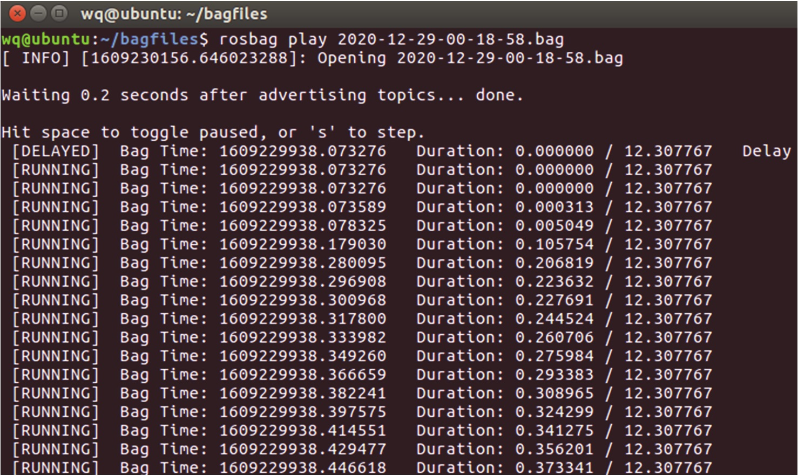

# 第 3 章 ROS 常用组件和开发工具

本章将介绍 ROS 开发时常常使用的组件和开发工具。
ROS 常用组件包括：Gazebo、Rviz、rqt、rosbag。Gazebo 是一种最常用的 ROS 仿真工具，也是目前 ROS 仿真效果最好的工具；Rviz 是可视化工具，可以将接收到的信息呈现出来；rqt 则是非常好用的数据流可视化工具，通过 rqt 可以直观地看到消息的通信架构和流通路径；rosbag 则是为 ROS 提供数据记录与回放的功能包，此外，它还提供代码 API，可对包进行编写操作。

ROS 常用的开发工具有 RoboWare Studio 和 Git。RoboWare Studio 是专为 ROS 开发而设计的集成开发环境（IDE），它使开发变得直观、简单且易于管理；Git 是一款免费开源的分布式版本控制系统，旨在快速、高效地管理从小到大的所有项目，且易于学习，占用空间小。熟练使用这几款组件和开发工具对于我们的 ROS 学习和开发都有极大的帮助。

## 3.1 Gazebo 仿真工具

ROS 中的工具可以帮助我们完成一系列的操作，使得我们的工作更加轻松、高效。ROS 工具的功能大概有以下几个方向：仿真、调试、可视化。本节我们要学习的 Gazebo 就是实现了仿真的功能，而调试与可视化由 Rviz、rqt 来实现，将在后面依次为大家介绍。

### 3.1.1 认识 Gazebo

仿真/模拟（Simulation）泛指基于原本的系统、事务或流程，建立一个模型以表征其关键特性或者行为/功能，予以系统化与公式化，以便对关键特性进行模拟。在 ROS 中，仿真的意义不仅仅在于做出一个很酷的 3D 场景，更重要的是给机器人一个逼近现实的虚拟物理环境，比如光照条件、物理距离等。设定好具体的参数，让机器人完成人为设定的目标任务。比如一些有危险因素的测试，就可以让机器人在仿真的环境中去完成。例如无人车在环境复杂的交通要道的场景，我们就
可以在仿真的环境下测试各种情况下无人车的反应与效果，如车辆的性能、驾驶的策略、车流和人流的行为模式等；又或者各种不可控因素如雨雪天气、突发事故、车辆故障等，可以在仿真的环境下收集结果参数、指标信息等。

Gazebo 是一个机器人的仿真工具，即模拟器。目前市面上也有一些其他的机器人模拟器，例如 Vrep、Webots，而 Gazebo 是对 ROS 兼容性最好的开源工具。Gazebo 和 ROS 都由 OSRF（Open Source Robotics Foundation）来维护，所以它对 ROS 的兼容性比较好。此外，它还具备强大的物理引擎、高质量的图形渲染、方便的编程接口与图形接口。通常一些不依赖于具体硬件的算法和场景都可以在 Gazebo 上进行仿真，例如图像识别、传感器数据融合处理、路径规划、SLAM 等任务完全可以在 Gazebo 上仿真实现，大大减轻了对硬件的依赖。

### 3.1.2 操作演示

**（1）安装并运行 Gazebo**

如果已经安装了桌面完整版的 ROS，那么可以直接跳过这一步，否则，请使用以下命令进行安装：

```bash
sudo apt-get install ros-noetic-gazebo-ros-pkgs ros-noetic-gazebo-ros-control -y
```

安装完成后，在终端使用如下命令启动 ROS 和 Gazebo：

```bash
roscore
rosrun gazebo_ros gazebo
```

Gazebo 的主界面包含以下几个部分：3D 视图区、工具栏、模型列表、模型属性项和时间显示区。如图 3.1 所示。在 3D 视图区，可以通过鼠标左键进行平移操作、通过鼠标滚轮中键进行旋转操作、通过鼠标滚轮进行缩放操作等。


<center>图 3.1 Gazbo 的主界面</center>

验证 Gazebo 是否与 ROS 系统成功连接，可以在终端输入 rostopic list 查看 Gazebo 发布/订阅话题列表，或输入 rosservice list 查看 Gazebo 提供的服务列表。若成功显示，则说明连接成功。

**（2）构建仿真环境**

我们在仿真之前需要构建一个仿真环境。有两种构建仿真环境的方法：

① 直接插入模型 在 Gazebo 左侧的模型列表中，有一个“Insert”选项罗列了所有可使用的模型。选择需要使用的模型，放置在主显示区中，就可以在仿真环境中导入机器人和外部物体等仿真实例。如图 3.2 所示。

注意：模型的加载需要连接国外网站，为了保证模型顺利加载，我们可以提前将模型文件下载并放置到本地路径~/gazebo/models 下，模型文件的下载地址为 https://bitbucket.org/osrf/gazebo_models/downloads/或 https://github.com/osrf/gazebo-models。


<center>图 3.2 在 Gazebo 中直接插入仿真模型</center>

② 按需自制模型

我们还可以按需自制模型并将其拖入到仿真环境中。Gazebo 提供的Building Editor 工具支持手动绘制地图。在 Gazebo 菜单栏中选择 Edit→Building Editor，可以打开图 3.3 所示的界面。选择左侧的绘制选项，然后就可以在上侧窗口中使用鼠标绘制地图，下侧窗口中则会实时显示出绘制的仿真环境。


<center>图 3.3 使用 Building Editor 工具构建仿真环境</center>

## 3.2 Rviz 可视化平台

### 3.2.1 认识 Rviz

ROS 中存在大量不同形态的数据，某些类型的数据（如图像数据）往往不利于开发者感受数据所描述的内容，所以需要将数据可视化显示。Rviz（Robot Visualization Tool）则是 ROS 针对机器人系统的可视化需求所提供的一款可以显示多种数据的三维可视化工具，一方面能够实现对外部信息的图形化显示，另一方面还可以通过 Rviz 给对象发布控制信息，从而实现对机器人的监测与控制。

在 Rviz 中，用户可以通过 XML 文件对机器人以及周围物体的属性进行描述和修改，例如物体的尺寸、质量、位置、关节等属性，并且可以在界面中将这些属性以图形化的形式呈现出来。同时，Rviz 还可以实时显示机器人传感器的信息、机器人的运动状态、周围环境的变化等。Rviz可以帮助开发者实现所有可检测信息的图形化显示，开发者也可以在 Rviz 的控制界面下，通过按钮、滑动条、数值等方式控制机器人的行为。因此，Rviz 强大的可视化功能为开发者及其他用户提供了极大的便利。

### 3.2.2 操作演示

**（1）安装并运行 Rviz**

如果已经安装了桌面完整版的 ROS，那么可以直接跳过这一步，否则，可以使用以下命令进行安装：

```bash
sudo apt-get install ros-noetic-rviz -y
```

安装完成后，在终端使用如下命令启动 ROS 和 Rviz：

```bash
roscore
rosrun rviz rviz
```

当成功启动 Rviz 后，会看到如图 3.4 所示的界面。


<center>图 3.4 Rviz 的主界面</center>

Rviz 主界面主要包括以下几个部分：

① 3D 视图区：（图 3.4 中中间黑色部分）用于可视化显示数据；

② 工具栏：（图 3.4 中上部）用于提供视角控制、目标设置、发布地点等工具；

③ 显示列表：（图 3.4 中左部）用于显示当前加载的显示插件，可以配置每个插件的属性；

④ 视角设置区：（图 3.4 中右部）用于选择多种观测视角；

⑤ 时间显示区：（图 3.4 中下部）用于显示当前的系统时间和 ROS 时间。

**（2）数据可视化**

点击 Rviz 界面左侧下方的“Add”，会将默认支持的所有数据类型的显示插件罗列出来，如图 3.5 所示。点击后会弹出新的显示对话框，包含显示插件的数据类型以及所选择的显示插件的描述。


<center>图 3.5 Rviz 默认支持的显示插件</center>

在图 3.5 所示的列表中选择需要的数据类型插件，然后在“Display Name”文本框中为选择的显示插件指定唯一的名称，用来识别显示的数据。例如，如果你的机器人上有两个激光扫描仪，可以创建两个名为“Laser Base”和“Laser Head”的“Laser Scan”显示。

添加完成后，Rviz 左侧的“Displays”中会列出已经加载的显示插件，点击插件列表前的三角符号可以打开一个属性列表，根据需求设置属性。一般情况下，“Topic”属性较为重要，用来声明该显示插件所订阅的数据来源，如果订阅成功，在中间的显示区应该会出现可视化后的数据。如果显示有问题，请检查属性区域的“Status”状态。Status 有四种状态：OK、Warning、Error 和Disabled。不同状态会通过不同的背景颜色在显示标题中指示。如果显示的状态是“OK”，那么该显示插件的状态就是正常的，否则需要查看错误信息并处理该错误。

## 3.3 rqt 可视化工具

### 3.3.1 认识 rqt

rqt 是基于 Qt 开发的可视化工具，拥有扩展性好、灵活易用、跨平台等特点。其中，“r”代表 ROS，“qt”是指它是 Qt 图形界面（GUI）工具包。rqt 由三个部分组成，除了 rqt 核心模块，还有 rqt_common_plugin （后端图形工具套件）以及 rqt_robot_plugins （机器人运行时的交互工具）。

在使用之前，需要使用以下命令安装 rgt 可视化工具：

```bash
sudo apt-get install ros-noetic-rqt -y
sudo apt-get install ros-noetic-rqt-common-plugins -y
```

### 3.3.2 操作演示

**（1）计算图可视化工具（rqt_graph）**

rqt_graph 是一个图像化显示通信架构的工具，可以直观地展示当前正在运行的 Node、topic和消息的流向。其中，椭圆表示节点 Node，矩形表示 topic，箭头表示消息流向。需要注意的是rqt_graph 不会自动更新信息，需要手动点击刷新按钮进行刷新。由于 rqt_graph 工具能直观地显示系统的全貌，所以非常地常用。

在终端使用如下命令即可启动该工具：

```bash
rqt_graph
```

启动成功后的计算图如图 3.6 所示（以小海龟例程为例）。


<center>图 3.6 Rviz 默认支持的显示插件</center>

**（2）数据绘图工具（rqt_plot）**

rqt_plot 是一个二维数值曲线绘制工具，主要用于查看参数，将一些参数，尤其是动态参数以曲线图的形式绘制出来。 rqt_plot 的 GUI 提供了大量特征功能，包括开始和停止绘图、平移和缩放、导出图像等。输入如下命令即可启动该工具：

```bash
rqt_plot
```

然后在界面上方的“Topic”输入框中输入需要显示的话题消息，如果不确定话题名称，可以在终端中使用 rostopic list 命令查看。

例如在小海龟例程中，当用键盘控制小海龟移动时，通过 rqt_plot 工具描绘海龟 x、y 坐标变化的效果图如图 3.7 所示。


<center>图 3.7 rqt_plot 工具界面</center>

注意：在运行 rqt_plot 命令时，如使用ROS Kinetic，由于 Kinetic 中默认安装的 Python2.7 与 Matplotlib 不兼容且不再支持 Python2，可能会出现报错。因此，读者可以安装 Python3.6 并将其设置为默认 Python 版本（具体安装步骤请读者自行查阅），或者通过命令 pip install pyqtgraph 安装另一个可视化工具 PyQtGraph，安装完成后再在终端运行 rqt_plot 命令即可。

**（3）日志输出工具（rqt_console）**

rqt_console 工具用来图像化显示和过滤 ROS 系统运行状态中的所有日志消息。输入以下命令即可启动该工具：

```bash
rqt_console
```

启动成功后可以看到如图 3.8 所示的可视化界面。


<center>图 3.8 rqt_console 工具界面</center>

在运行包含多个节点的 ROS 系统的时候，最好设置一下 rqt_console，这样能快速查找错误。需要注意的是，rqt_console 只能显示它开始运行之后接收到的消息，在出现错误之后再开启rqt_console 通常不会告诉你引发错误的原因。

（4）参数动态配置工具（rqt_reconfigure）

rqt_reconfigure 工具可以在不重启系统的情况下，动态配置 ROS 系统中的参数，但是该功能的使用需要在代码中设置参数的相关属性，从而支持动态配置。与前面介绍的三个工具不同，该工具的启动命令并不是直接输入该工具的名称，请勿混淆。首先打开 ROS-Academy-for-Beginners 的模拟场景。输入：

```bash
rosrun rqt_reconfigure rqt_reconfigure
```
启动后的界面将显示当前系统中所有可动态配置的参数，如图 3.9 所示。在界面中使用输入框、滑动条或下拉框进行设置即可实现参数的动态配置。


<center>图 3.9 rqt_reconfigure 工具界面</center>

## 3.4 rosbag 功能包

### 3.4.1 认识 rosbag

**（1）简介**

rosbag 的作用主要是帮助开发者记录 ROS 系统运行时的消息数据，然后在离线状态下回放这些消息。它旨在提高性能，并避免消息的反序列化和重新排序。rosbag 功能包提供了命令行工具和代码 API，可以用 C++或者 Python 来编写包，而且 rosbag 命令行工具和代码 API 是稳定的，始终保持向后的兼容性。

**（2）相关指令**

rosbag 命令可以记录、回放和操作包。指令列表如表 3.1 所示。

<center>表 3.1 rosbag 指令列表</center>

| 命令       | 作用                                                 |
| ---------- | ---------------------------------------------------- |
| check      | 确定一个包是否可以在当前系统中运行，或者是否可以迁移 |
| decompress | 压缩一个或多个包文件                                 |
| filter     | 解压一个或多个包文件                                 |
| fix        | 在包文件中修复消息，以便在当前系统中播放             |
| help       | 获取相关命令指示帮助信息                             |
| info       | 总结一个或多个包文件的内容                           |
| play       | 以一种时间同步的方式回放一个或多个包文件的内容       |
| record     | 用指定主题的内容记录一个包文件                       |
| reindex    | 重新索引一个或多个包文件                             |

rosbag 通过命令行能够对软件包进行很多的操作，更重要的是拥有代码 API，可以重新对包进行编写。增加一个 ROS API，用于通过服务调用与播放和录制节点进行交互。

### 3.4.2 操作演示

**（1）记录数据**

首先启动键盘，控制小海龟例程所需的所有节点，以下命令每条新建一个终端后输入：

```bash
roscore
rosrun turtlesim turtlesim_node
rosrun turtlesim turtle_teleop_key
```

启动成功后，可以看到可视化界面中的小海龟，还可以在终端中通过键盘控制小海龟移动。然后我们来查看在当前 ROS 系统中存在哪些话题。输入如下命令得到图 3.10 的话题列表。

 ```bah
 rostopic list –v
 ```


<center>图 3.10 查看 ROS 系统中的话题列表</center>

接下来使用 rosbag 记录这些话题的消息，并且打包成一个文件放置在指定文件夹中：

```bash
mkdir ~/bagfiles
cd ~/bagfiles
rosbag record –a
```

rosbag record 就是数据记录的命令，这里的-a 意为记录所有发布的消息。如果需要记录特定的 topic，则输入`rosbag record <topic_names>`。

现在，消息记录已经开始，我们可以在终端中控制小海龟移动一段时间，运动轨迹如图3.11所示。然后在 rosbag 数据记录运行的终端中按下“Ctrl+C”，即可终止数据记录。进入刚才创建的文件夹~/bagfiles中，会有一个以时间命名并且以“.bag”为后缀的文件，这就是成功生成的数据记录文件。


<center>图 3.11 记录数据时的运动轨迹</center>

注意：当使用`rosbag record -a`命令来记录消息时，如果未能在记录数据的终端以“Ctrl+C”结束录制，会生成以“.bag.active”为后缀的文件，而只有以“.bag”为后缀的包，才能正常进行数据回放等操作。

**（2）回放数据**

数据记录完成后就可以使用该数据记录文件进行数据回放。rosbag 功能包提供了 info 命令，在~/bagfiles 路径下可以查看数据文件的详细信息：

```bash
rosbag info ~/bagfiles/<FileName>
```

使用 info 命令来查看之前生成的数据记录文件，可以看到如图 3.12 所示的信息。


<center>图 3.12 查看数据记录文件的相关信息</center>

从以上信息中我们可以看到，数据记录包中包含所有话题、消息类型、消息数量等信息。终止之前打开的 turtle_teleop_key 控制节点并重启 turtlesim_node，在~/bagfiles 路径下使用如下命令回放所记录的话题数据：

```bash
rosbag play ~/bagfiles/<FileName>
```

这条指令会按照信息发布时的时间顺序来播放包中的内容。在 play 后面加上 -l ，会无限循环播放。另外可以设定播放时间，比如在 play 后面加 -u 240 ，包中的内容播放到 240 秒就会停止。数据开始回放后，小海龟的运动轨迹与之前数据记录过程中的状态完全相同。在终端中可以看到如图 3.13 所示的信息，可以看到不同时间小海龟移动的位置。



<center>图 3.13 回放数据记录文件</center>

## 3.5 RoboWare Studio 集成开发环境

RoboWare Studio 是一个专为 ROS 开发而设计的 IDE（集成开发环境），支持Ubuntu 16.04和18.04版本，不支持Ubuntu 20.04，它使 ROS 开发变得直观、简单且易于管理。RoboWare Studio 不仅提供了用于编程的工具，还提供了很多用于管理 ROS 工作区， ROS 节点的创建、处理和编译，以及支持运行 ROS 的工具。

### 3.5.1 安装 RoboWare Studio

RoboWare Studio 的安装非常简单，不需要额外的配置即可自动检测并加载 ROS 环境。它有许多无需配置即可使用的功能，可帮助 ROS 开发人员创建应用程序，如创建 ROS 软件包的图形界面、源文件（包含服务和消息文件），以及列出节点和软件包。

为了安装 RoboWare Studio，我们需要下载安装文件，可以从 https://github.com/ME-Msc/Robo%20Ware-Studio-1.2.0或者本书配套的资源包下载该软件，然后双击下载完成的.deb 文件，用软件包管理器 GUI 打开并安装，或者在终端使用下面的命令来安装：

```bash
cd /path/to/deb/file
sudo dpkg –I roboware-studio_<version>_<architecture>.deb
```

若想卸载该软件，可使用以下命令：

```bash
sudo apt-get remove roboware-studio
```

### 3.5.2 操作演示

**（1）RoboWare Studio 入门**

安装好后，可使用下面的命令启动 RoboWare Studio：

```bash
roboware-studio
```

打开 RoboWare Studio 的主窗口，可以看到如图 3.14 所示的用户界面。


<center>图 3.14 RoboWare Studio 的用户界面</center>

在 RoboWare Studio 的用户界面中有以下主要组件：

① 资源管理器：该面板显示 ROS 工作区 src 文件夹的内容，在该面板中，可以查看所有的ROS 软件包。

② 节点：在该面板中，可以访问工作区内所有编译好的节点。节点都被包含在软件包下，可以用该面板直接运行节点。

③ 编辑器：在该面板中，可以编辑软件包的源码。

④ 终端和输出：该面板允许开发者使用集成在IDE 中的 Linux 终端，并在编译过程中检查可能出现
的错误。

在开始编译源码之前，我们应该在 RoboWare Studio 中导入 ROS 工作区，如图 3.15 所示。在主工
具栏中，选择“文件”→“打开工作区”，然后选择 ROS 工作区的文件夹。这样，位于 src 文件夹中的所有软件包都将显示在资源管理器中。


<center>图 3.15 在 RoboWare Studio 中导入 ROS 工作区</center>

**（2）在 RoboWare Studio 中创建 ROS 软件包**

RoboWare Studio 允许开发者直接从用户界面管理 ROS 项目，而无需使用 Linux 终端或编辑CMakeLists.txt 文件。创建基于 C++可执行程序的 ROS 软件包，需要如下步骤：

① 创建软件包：在资源管理器窗口的 ROS 工作区中的 src 文件夹上右击，然后选择“新建ROS 包”，并输入软件包的名称。这样就能创建一个新的 ROS 软件包了，如图 3.16 所示。


<center>图 3.16 在 RoboWare Studio 中导入 ROS 工作区</center>

② 创建源代码文件夹：在资源管理器窗口中右击软件包的名称，然后选择“新建 Src 文件夹”，如图 3.17 所示。


<center>图 3.17 在软件包中添加存放源代码的文件夹</center>

③ 创建源码文件：在创建的 src 文件夹上右击，然后选择“新建 C++ ROS 节点”。输入源码文件名称后，RoboWare Studio 将询问该文件是一个系统库文件还是一个可执行文件，在这里选择可执行文件。

④ 添加软件包的依赖项：为软件包添加依赖项的操作是在资源管理器窗口右击软件包的名字，然后选择“编辑依赖的 ROS 包列表”。在该输入栏输入我们需要的依赖项列表。

在这四步操作的过程中，RoboWare Studio 将修改 CMakeLists.txt 文件，这样就能编译所需的可执行文件了。roboware_package 更新后的 CMakeLists.txt 文件如下：

```cmake
cmake_minimum_required(VERSION 2.8.3)
project(roboware_package)
find_package(catkin REQUIRED COMPONENTS roscpp std_msgs)
find_package(catkin REQUIRED COMPONENTS roscpp)
catkin_package()
    include_directoried( include ${catkin_INCLUDE_DIRS} )
    add_executable(roboware
    src/roboware.cpp
)
add_dependencies(roboware ${${PROJECT_NAME}_EXPORTED_TARGETS} ${catkin_EXPORTED_TARGETS})
Target_link_libraries(roboware ${catkin_LIBRARIES}
)
```

从生成的 CMakeLists.txt 文件中可以看到，已成功添加可执行文件和附加的库。同样，我们还可以添加 ROS 消息、服务、动作等。

（3）在 RoboWare Studio 中编译 ROS 工作区针对本地与远程编译和部署的 ROS 软件包， RoboWare Studio 同时支持发行版本和调试版本。在本书中，我们将配置 RoboWare Studio，从而可以编译本地开发模式的发行版本。要选择编译模式，可以直接利用资源管理器面板的下拉菜单，如图 3.18 所示。


<center>图 3.18 选择 RoboWare Studio的编译配置</center>

要编译工作区，可以在主工具栏的 ROS 下点击“构建”进行编译，或者使用快捷键“Ctrl+Shift+B”。编译过程的输出将显示在 Output 面板中。默认情况下，RoboWare Studio 会编译工作区中的所有软件包（使用 catkin_make 命令）。为了手动指定一个或多个软件包来编译，我们可以在指定的软件包上右击，然后选定“设置为活动状态”来激活它。

这样，当我们单击“构建”按钮时，只会编译已被激活的软件包，而那些未被激活的软件包会用删除线标记出来，如图 3.19 所示。


<center>图 3.19 显示已激活和未激活的软件包</center>

我们可以通过在资源管理器窗口选择“激活所有 ROS 包”来激活所有的软件包配置。

**（4）在 RoboWare Studio 中运行 ROS 节点**

读者可以通过使用 roslaunch 和 rosrun 命令来运行 ROS 节点。

首先，我们应该为软件包创建一个启动文件。在软件包上右击，选择“新建 launch 文件夹”来创建一个名为 launch 的文件夹。然后，在启动文件夹上右击，并选择“新建 launch 文件”来添加新文件。当编辑好启动文件后，我们只需要在启动文件上右击，然后选择“运行 launch 文件”即可，如图 3.20 所示。


<center>图 3.20 在 RoboWare Studio 中运行 roslaunch 命令</center>

要使用 rosrun 命令来执行 ROS 节点，我们必须从节点列表中选择要运行的可执行文件。这样打开节点窗口，进而允许我们在该节点上执行不同的操作。用户可以在调试控制台查看节点的输出信息。

**（5）在 RoboWare Studio 界面启动 ROS 工具**

RoboWare Studio 允许开发者运行一些前文提到的 ROS 常用组件。要使用这些工具，可以在 RoboWareStudio 的顶部工具栏中，点击 ROS 菜单展开如图 3.21所示的下拉菜单。


<center>图 3.21 ROS 工具列表</center>

可以在该菜单上直接运行 roscore 或访问这些常用的工具。除此之外，可以直接在文件编辑器中打
开.bashrc 文件并手动修改系统配置。另外，也可以通过选择“运行远程端 roscore”选项来运行远程端 roscore。

**（6）处理活动的 ROS 话题、节点和服务**

要在特定的时间查看系统中活动的 ROS 话题、节点和服务，可以单击左侧栏的 ROS 图标。随着 roscore形成的信息遍历列表显示在每个框中，我们可以通过单击话题名称而显示每条 ROS 消息的内容，如图 3.22 所示。


<center>图 3.22 RoboWare Studio 中的 ROS 面板</center>

我们还可以在 RoboWare Studio 中录制和回放 ROS 日志文件，单击“活动话题”旁边的图标，如图 3.23 所示，此时系统中所有活动的话题都将被记录下来。生成的日志文件将保存在工作区的根文件夹下。要停止录制，必须在终端窗口使用“Ctrl+C”。如果想要记录多个话题，按“Ctrl”键然后逐一选择它们，最后单击 rosbag 记录按钮。


<center>图 3.23 记录日志文件</center>

要回放日志文件，可以在资源管理器窗口右击日志文件名称，然后单击“播放 BAG 文件”，如图 3.24 所示。


<center>图 3.24 回放日志文件</center>

**（7）使用 RoboWare Studio 工具创建 ROS 节点和类**

RoboWare Studio 提供了一个向导来创建 C++、Python 类以及 ROS 节点。要创建 ROS 节点，可按照下面操作来执行：

① 在软件包上右击，然后选择“新建 C++ ROS 节点”或“新建 Python ROS 节点”。

② 输入软件包的名称。

③ 默认情况下，将创建两个源文件：一个发布者节点和一个订阅者节点。

④ 编译软件包。CMakeLists.txt 文件已根据新创建的节点进行了更新，可以根据需要删除发布者或者订阅者，这时，CMakeLists.txt 文件也会自动更新。

除了 ROS 节点，我们还可以用以下方式来创建 C++类：

① 在软件包名称上右击，选择“新建 C++类”。

② 输入类的名称，例如 roboware_class。

③ 在 include 文件夹下创建 roboware_class.h 的头文件，同时，在 src 文件夹下创建 roboware_class.cpp 的源码文件。

④ 选择一个可执行文件来链接刚刚创建的类，以便将类导入软件包的另一个 ROS 节点中。

⑤ CMakeLists.txt 文件将自动更新。

**（8）RoboWare Studio 中的 ROS 软件包管理工具**

在 RoboWare Studio 界面中，我们可以通过 ROS 软件包管理器面板安装或浏览可用的 ROS 软件包。要访问此面板，可单击左侧栏的 ROS Package Manager 图标。RoboWare Studio 将自动检测正在使用的 ROS 版本以及安装在 ROS 软件包路径中的软件包列表。

在此面板中，我们可以浏览 ROS 仓库中的可用软件包，并且可以在软件包和超软件包之间选择。还可以单击软件包名直接查看它的 WIKI 界面，而且还可以很方便地安装或卸载选定的软件包，如图 3.25 所示。


<center>图 3.25 RoboWare Studio 的软件包管理器</center>

## 3.6 代码管理 Git

### 3.6.1 认识 Git

**（1）简介**

Git 是一个免费开源的分布式版本控制系统，旨在快速、高效地管理所有项目。由于 Git 是为在 Linux 内核上工作而构建的，这意味着它从一开始就必须有效地处理大型存储库；而且，由于是用 C 语言编写的，减少了与高级语言相关的运行开销。因此，速度和性能就是 Git 的主要设计目标。

此外，与常用的版本控制工具 CVS、Subversion 等不同，它采用了分布式版本库的方式，不需要服务器端软件支持，使得源代码的发布和交流极其方便。大家所熟知的 GitHub，是一个面向开源项目代码管理平台，实际上，因为它只支持 Git 作为唯一的版本库格式进行托管，故名为 GitHub。由此可见 Git 的强大优势。

**（2）相关指令**

常见的 Git 指令如表 3.2 所示。

<center>表 3.2 常见 Git 指令</center>

| 指令                          | 作用                                     |
| ----------------------------- | ---------------------------------------- |
| git init [repo]               | 初始化指定 Git 仓库，生成一个.git 目录   |
| git fetch                     | 从远程获取最新版本到本地，不会自动合并   |
| git pull                      | 将远程存储库中的更改合并到当前分支中     |
| git push                      | 将本地分支的更新推送到远程主机           |
| git clone [repo] [directory]  | 从现有 Git 仓库中复制项目到指定的目录    |
| git add [file] [cache]        | 将文件添加到缓存中                       |
| git status                    | 查看项目的当前状态                       |
| git diff                      | 查看执行 git status 的结果的详细信息     |
| git commit                    | 将缓存区的内容添加到仓库中               |
| git reset HEAD [file] [cache] | 取消已缓存的内容，待修改提交缓存区后执行 |
| git rm [-f] [file]            | 从 Git 中移除某个文件（-f 为强制删除）   |
| git mv                        | 移动或重命名一个文件、目录、符号链接     |
| git branch [-a]               | 查看当前工作目录的分支（-a 为远程）      |
| git branch -d                 | 删除分支                                 |
| git branch -b                 | 切换分支                                 |
| git merge                     | 合并分支                                 |

### 3.6.2 操作演示

使用 ROS 系统时需要用到许多数据包，有些时候会出现需要使用的 ROS 数据包并没有 Debian包的情况，这时就要从数据源安装该数据包。接下来，我们将介绍如何使用 Git 来下载需要的代码资源和上传本地代码资源到 GitHub 仓库。

**（1）安装 Git 和绑定 SSH**

安装 Git 的命令如下： 

```bah
sudo apt-get install git -y
```

配置本机 Git 的两个重要信息——user.name 和 user.email，终端输入如下命令即可设置：

```bash
git config --global user.name "Your Name"
git config --global user.email "email@example.com"
```

通过命令 git config --list 查看是否设置成功。

查看 home 目录下是否有.ssh 目录，一般情况是没有的，需要我们手动生成这个目录，在终端输入：

```bash
ssh-keygen
```

进入 home 目录下的.ssh 目录会看到两个文件 id_rsa 和 id_rsa.pub，id_rsa 是私钥，id_rsa.pub是公钥。将 id_rsa.pub 文件中的内容复制一下。创建并登录自己的 GitHub（https://github.com）账号，进入 Settings→SSH and GPG keys→New SSH key。如图 3.26 所示。在“Key”那一栏下面将复制的内容粘贴进去就可以了，最后点击“Add SSH key”按钮添加。


<center>图 3.26 绑定 SSH 操作界面</center>

**（2）从 GitHub 下载源码包**

在 1.4 节我们安装本课程需要的教学包时，已经介绍了如何通过 Git 指令下载源码包。为了让读者更清楚地了解 Git 的使用方法，这里再详细介绍一下。首先，需要在 GitHub 的搜索框中通过关 键 字 搜 索 到 你 需 要 的 项 目 ； 然 后 ， 点 击 地 址 栏 对 地 址 进 行 复 制 ， 例 如 https://github.com/ros-simulation/gazebo_ros_pkgs；最后，在终端中创建一个自己的工作空间，并在终端中复制该项目。输入命令如下：

```bash
cd ~/catkin_ws/src
git clone https://github.com/ros-simulation/gazebo_ros_pkgs.git
```

要说明的是在 GitHub 上只能复制一个完整的项目，为了保证一个项目的完整性，GitHub不允许仅复制单个文件或文件夹。

**（3）上传源码包到 GitHub 仓库**

首先进入到要上传源码包的文件夹，右键“在终端中打开”：

① 在终端中输入`git init`，初始化本地仓库（文件夹）；

② 然后输入`git add .`，添加本地仓库的所有文件夹；

③ 输入`git commit -m "first commit"`，参数-m 可以说明本次提交的描述信息；

④ 输入`git remote rm origin`，清空当前远程 origin；

⑤ 输入`git remote add origin https://github.com/你的账号名/你新建的仓库名.git`；

⑥ 输入`git push -u origin master`，将本地的 master 分支推送到 origin 主机的 master分支，-u 选项会将 origin 指定为默认主机。 

## 3.7本章小结

本章介绍了 ROS 的常用组件和开发工具，通过学习，你应该了解了这些工具的作用与使用方法。例如 Gazebo 是仿真工具，给机器人一个逼近现实的虚拟物理环境；Rviz 是可视化工具，可以将接收到的信息呈现出来； rqt 是数据流可视化工具，可以看到消息的通信架构和流通路径； rosbag是提供数据记录与回放的功能包；RoboWare Studio 是集成开发环境（IDE）；Git 是分布式版本控制系统，可以用来管理项目的代码。

那么，你是否已经掌握了这些工具的用法呢？赶紧动手操作一下吧。


## 3.8 习题

1. [单选] Gazebo 是一款什么工具？
A.调试
B.可视化
C.仿真
D.命令行

2. [单选] rqt_graph 可以用来查看计算图，以下说法错误的是？
A.计算图反映了节点之间消息的流向
B. rqt_graph 中的椭圆代表节点
C. rqt_graph 可以看到所有的 topic、service 和 Action
D.计算图反映了所有运行的节点

3. [单选]下列选项中关于 rosbag 的描述错误的是？
A. rosbag 可以记录和回放 service 
B. rosbag 可以记录和回放 topic
C. rosbag 记录的结果为.bag 文件 
D. rosbag 可以指定记录某一个或多个 topic

4. [多选] Rviz 可以图形化显示哪些类型的数据？
A.激光 LaserScan 
B.点云 PointCloud
C.机器人模型 RobotModel 
D.轨迹 Path

5. [单选]下列选项中关于 RoboWare Studio 的描述错误的是？
A. RoboWare Studio 允许开发者直接从用户界面管理 ROS 项目
B. RoboWare Studio 可以上传本地 ROS 项目的代码资源到 GitHub 仓库
C. RoboWare Studio 可以编译 ROS 工作区中的所有软件包
D. RoboWare Studio 是一个专为 ROS 开发而设计的 IDE

6. [单选]下列选项中关于 Git 指令的描述错误的是？
A. git fetch 可将远程存储库中的更改合并到当前分支中
B. git push 可以将本地分支的更新推送到远程主机
C. git branch 可以查看当前工作目录的分支
D. git diff 可以查看执行 git status 的结果的详细信息