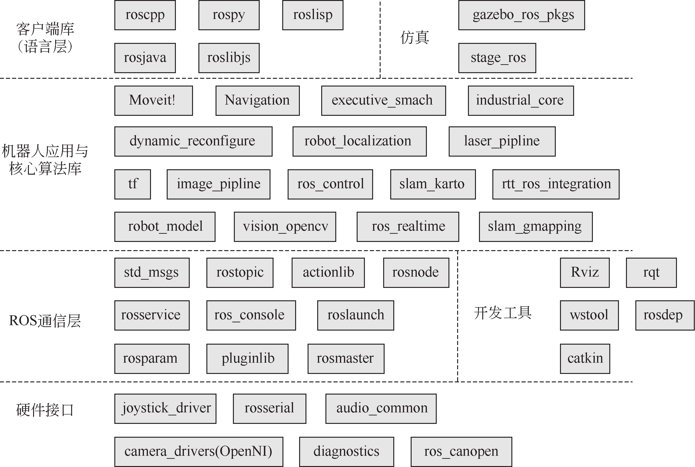
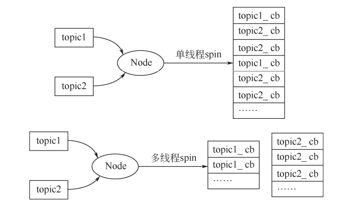

# 第 4 章 ROS 编程

从本章开始，我们就要正式地接触 ROS 编程了。在之前的章节，你了解到用命令行启动 ROS程序、发送指令消息，或使用可视化界面来调试机器人。你可能很想知道，这些工具到底是如何实现这些功能的。其实这些工具本质上都是基于 ROS 的客户端库（Client Library）实现的，所谓客户端库，简单理解就是一套接口，ROS 为机器人开发者提供了不同语言的接口，比如 roscpp 是C++语言的 ROS 接口，rospy 是 Python 语言的 ROS 接口，我们直接调用它所提供的函数就可以实
现 topic、service 等通信功能。

本章分为两大节，分别介绍 roscpp 和 rospy。第一节介绍 roscpp 的基本函数和用 C++开发 ROS的基本方法。本节的内容需要有 C++的基础，如果你对 C++比较陌生，建议先学习 C++编程。第二节学习 ROS 的另一个接口 rospy，也即 Python 语言的接口。客户端库（Client Library）不仅仅指的是 C++、Python 语言的接口，其实是各种语言的接口统称。rospy 中函数的定义、函数的用法都和 roscpp 不相同。结合这些内容，本章还给出了 topic demo 和 service demo 的具体格式和写法，方便读者更直观地学习 roscpp 和 rospy 编程。

## 4.1 Client Library 简介

ROS 为机器人开发者们提供了不同语言的编程接口，比如 C++接口叫做 roscpp，Python 接口叫做 rospy， Java 接口叫做 rosjava。尽管语言不同，但这些接口都可以用来创建 topic、 service、param，实现 ROS 的通信功能。Client Library 有点类似开发中的 Helper Class，把一些常用的基本功能做了封装。目前 ROS 支持的 Client Library 如表 4.1 所示。目前最常用的只有 roscpp 和 rospy，而其余的语言版本基本都还是测试版。

<center>表 4.1 Client Library</center>

| Client Library | 介绍                                                         |
| -------------- | ------------------------------------------------------------ |
| roscpp         | ROS 的 C++库，是目前应用最广泛的 ROS 客户端库，执行效率高    |
| rospy          | ROS 的 Python 库，开发效率高，通常用在对运行时间没有太大要求的场合，例如配置、初始化等操作 |
| roslisp        | ROS 的 LISP 库                                               |
| roscs          | Mono/.NET.库，可用任何 Mono/.NET 语言，包括 C#、Iron Python、Iron Ruby 等 |
| rosgo          | ROS Go 语言库                                                |
| rosjava        | ROS Java 语言库                                              |
| rosnodejs      | Javascript 客户端库                                          |

从开发客户端库的角度看，一个客户端库，至少需要包括节点管理器注册、名称管理、消息收发等功能。这样才能给开发者提供对 ROS 通信架构进行配置的方法。

ROS 的整体框架如图 4.1 所示。你可以看到整个 ROS 包括的 package，还可以看到 roscpp、 rospy处于什么位置。




<center>图 4.1 ROS 整体框架</center>

## 4.2 roscpp

roscpp 位于/opt/ros/noetic 之下，用 C++实现了 ROS 通信。在 ROS 中， C++的代码是通过 catkin这个编译系统（扩展的 CMake）来进行编译构建的。所以简单地理解，也可以把 roscpp 就当作一个 C++的库，我们创建一个 CMake 工程，在其中调用了 roscpp 等 ROS 的库，这样就可以在工程中使用 ROS 提供的函数了。

通常我们要调用 ROS 的 C++接口，首先就需要包含 #include<ros/ros.h> ，具体可见 http://docs.ros.org/api/roscpp/html/index.html。

roscpp 的主要部分包括：

① ros::init（） 解析传入的 ROS 参数，创建节点第一步需要用到的函数。

② ros::NodeHandle 和 topic、service、param 等交互的公共接口

③ ros::master 包含从节点管理器查询信息的函数

④ ros::this_node 包含查询这个进程的函数

⑤ ros::service 包含查询服务的函数

⑥ ros::param 包含查询参数服务器的函数，而不需要用到 NodeHandle

⑦ ros::names 包含处理 ROS 图资源名称的函数

以上功能可以分为以下的类别：

① Initialization and Shutdown 初始与关闭节点

② Publisher and Subscriber 发布和订阅

③ service 服务

④ parameter server 参数服务器

⑤ Timer 定时器

⑥ NodeHandle 节点句柄

⑦ Callback and Spinning 回调与轮询

⑧ Logging 日志

⑨ Names and Node Information 名称管理

⑩ Time 时钟

11. Exception 异常

看到这么多接口，千万别觉得复杂，我们日常开发并不会用到所有的功能，你只需要有一些印象，掌握几个比较常见和重要的用法就足够了。下面我们来介绍关键的用法。

### 4.2.1 节点

当执行一个 ROS 程序时，该程序就被加载到了内存中，成为一个进程，在 ROS 里叫做节点。每一个 ROS 的节点尽管功能不同，但都有一些必不可少的步骤，比如初始化节点、关闭节点、创建句柄等。这一小节我们来学习节点的一些最基本的操作。

**（1）初始化节点**

对于一个 C++写的 ROS 程序，它之所以区别于普通 C++程序，是因为在代码中做了两层工作：

① 调用了 ros::init（）函数，从而初始化节点名称和其他信息，一般 ROS 程序都会以这种方式开始。

② 创建了 ros::NodeHandle 对象，也就是节点的句柄，它可以用来创建 Publisher、 Subscriber 等。句柄（Handle）这个概念可以理解为一个“把手”，你握住了门把手，就可以很容易地把整扇门拉开或者关上，而不必关心门是什么样子。NodeHandle 就是对节点资源的描述，有了它就可以操作这个节点了，比如为程序提供服务、监听某个 topic 上的消息、访问和修改 param 等。

**（2）关闭节点**

通常我们要关闭一个节点可以直接在终端上按“Ctrl+C”，系统会自动触发 SIGINT 句柄来关闭这个进程，也可以通过调用 ros::shutdown（）来手动关闭节点，但我们很少这样做。以下是一个节点初始化、关闭的例子。

```cpp
#include<ros/ros.h>
int main(int argc, char** argv)
{
    ros::init(argc, argv, "your_node_name");
    ros::NodeHandle nh;
    //
    节点功能
    ros::spin();//用于触发 topic、service 的响应队列 return 0;
}
```

这段代码是最常见的一个 ROS 程序的执行步骤，通常要启动节点，获取句柄，而关闭的工作由系统自动帮我们完成，如果有特殊需要也可以自定义。你可能很关心句柄可以用来做些什么，接下来我们来看看 NodeHandle 常用的成员函数。

**（3）NodeHandle 常用成员函数**

NodeHandle 是 Node 的句柄，用来对当前节点进行各种操作。在 ROS 中，NodeHandle 是一个定义好的类，通过 #include<ros/ros.h> ，可以创建这个类，以及使用它的成员函数。

NodeHandle 常用成员函数有以下六种：

① 创建话题的 Publisher。

```cpp
ros::Publisher advertise(const string &topic, uint32_t queue_size, bool latch=false)；
```

第一个参数为发布话题的名称；第二个参数为消息队列的最大长度，如果发布的消息超过这个长度而没有被接收，那么旧的消息就会出队，通常设为一个较小的数即可；第三个参数为是否锁存，某些话题并不会以某个频率发布，比如/map 这个 topic，只有在初次订阅或者地图更新这两种情况下，/map才会发布消息。

② 创建话题的 Subscriber。

```cpp
ros::Subscriber subscribe(const string &topic, uint32_t queue_size, void(*)(M));
```

第一个参数是订阅话题的名称；第二个参数是订阅队列的长度，如果收到的消息都没来得及处理，那么新消息入队，旧消息就会出队；第三个参数是回调函数指针，指向回调函数来处理接收到的消息。

③ 创建服务的 Server。

```cpp
ros::ServiceServer advertiseService(const string &service, bool (*srv_func)(Mreq &, Mres &)；
```

第一个参数是 service 的名称；第二个参数是服务函数的指针，指向服务函数，指向的函数应该有两个参数，分别用来接收请求和响应。

④ 创建服务的 Client。

```cpp
ros::ServiceClient serviceClient (const string &service_name , bool persistent=false)；
```

第一个参数是 service 的名称；第二个参数是用于设置服务的连接是否持续，如果为 true， Client将会保持与远程主机的连接，这样后续的请求会快一些，通常我们设为 false。

⑤ 查询某个参数的值。

```cpp
bool getParam(const string &key, std::string &s);
bool getParam(const std::string &key, double &d) const；
bool getParam(const std::string &key, int &i) const；
```

从参数服务器上获取 key 对应的值，这里已重载了多个类型。

⑥ 给参数赋值。

```cpp
void setParam(const std::string &key, const std::string &s) const；
void setParam(const std::string &key, const char *s) const；
void setParam(const std::string &key, int i) const；
```

给 key 对应的 val 赋值，这里重载了多个类型的 val。

可 以 看出 ，NodeHandle 对 象 在 ROS C++ 程 序里非 常 重要 ，各 种 类型 的通 信 都需 要用NodeHandle 来创建完成。下面我们具体来看 topic、service 和 param 这三种基本通信方式的写法。

### 4.2.2 topic

**（1）topic 通信**

topic 是 ROS 里的一种异步通信模型，该模型节点间分工明确，例如有的只负责发送，有的只负责接收处理。对于绝大多数的机器人应用场景，比如传感器数据的收发、速度控制指令的收发，topic 模型是最适合的通信方式。

为了讲明白 topic 通信的编程思路，我们首先来看 topic_demo 中的代码。这个程序是一个消息收发的例子：自定义一个类型为 gps 的消息（包括位置 x、y 和工作状态 state 信息），一个节点以一定的频率发布模拟的 gps 消息，另一个节点接收并处理，算出到原点的距离。源代码见ROS-Academy-for-Beginners/topic_demo。

**（2）创建 gps 消息**

在 代 码 中 ， 我 们 会 用 到 自 定 义 类 型 的 gps 消 息 ， 在 msg 路 径 下 创 建 gps.msg 。 详 见topic_demo/msg/gps.msg。

```
string state #工作状态
float32 x #x 坐标
float32 y #y 坐标
```

以上就定义了一个 gps 类型的消息，可以把它理解成一个 C 语言中的结构体，类似于：

```cpp
struct gps
{
    string state;
    float32 x;
    float32 y;
}
```

在程序中对一个 gps 消息进行创建、修改的方法和对结构体的操作一样。当创建完了 msg 文件，记得修改 CMakeLists.txt 和 package.xml，从而让系统能够编译自定义消息。在 CMakeLists.txt中需要改动：

```cmak
find_package(catkin REQUIRED COMPONENTS roscpp std_msgs message_generation）
#需要添加的地方
add_message_files(FILES gps.msg)
#catkin 在 CMake 之上新增的命令，指定从哪个消息文件生成
generate_messages(DEPENDENCIES std_msgs)
#catkin 新增的命令，用于生成消息
#DEPENDENCIES 后面指定生成 msg 需要依赖其他什么消息，由于 gps.msg 用到了 float32 这种 ROS 标准消息，因此需要再把 std_msgs 作为依赖
```

在 package.xml 中需要改动：

```xml
<build_depend>message_generation</build_depend>
<run_depend>message_runtime</run_depend>
```

当你完成了以上所有工作，就可以回到工作空间进行编译了。编译完成之后会在 devel 路径下生成 gps.msg 对应的头文件，头文件按照 C++的语法规则定义了 topic_demo::gps 类型的数据。要在代码中使用自定义消息类型，只要包含 #include <topic_demo/gps.h> 头文件，然后声明，按照对结构体操作的方式修改内容即可。

```cpp
topic_demo::gps mygpsmsg;
mygpsmsg.x = 1.6;
mygpsmsg.y = 5.5;
mygpsmsg.state = "working";
```

**（3）消息发布节点**

定义完了消息，就可以开始写 ROS 代码了。通常我们会把消息收发的两端分成两个节点来写，一个节点就是一个完整的 C++程序。详见 topic_demo/src/talker.cpp。

```roscpp
#include <ros/ros.h>
#include <topic_demo/gps.h>
//自定义 msg 产生的头文件
int main(int argc, char **argv)
{
    ros::init(argc, argv, "talker");//用于解析 ROS 参数，第三个参数为本节点名称
    ros::NodeHandle nh;//实例化句柄，初始化节点
    topic_demo::gps msg;
    //自定义 gps 消息并初始化
    ...
    ros::Publisher pub = nh.advertise<topic_demo::gps>("gps_info", 1); //创建
    Publisher，向"gps_info"话题上发布消息
    ros::Rate loop_rate(1.0);
    //定义发布的频率，1HZ
    while (ros::ok()) //循环发布 msg
    {
        ... //处理 msg
        pub.publish(msg);// 以 1Hz 的频率发布 msg
        loop_rate.sleep();//根据前面定义的 loop_rate，设置 1s 的暂停
    }
	return 0;
}
```

机器人上几乎所有的传感器，都是按照这种通信方式来传输数据，只是发布频率和数据类型有区别。

**（4）消息接收节点**

消息接收节点见文件中的 topic_demo/src/listener.cpp，代码如下：

```CPP
#include <ros/ros.h>
#include <topic_demo/gps.h>
#include <std_msgs/Float32.h>
void gpsCallback(const topic_demo::gps::ConstPtr &msg)
{
    std_msgs::Float32 distance; //计算到原点(0,0)的距离
    distance.data = sqrt(pow(msg->x,2)+pow(msg->y,2));
    ROS_INFO("Listener: Distance to origin = %f, state: %s",distance.data,msg->state.c_str()); //输出
}

int main(int argc, char **argv)
{
    ros::init(argc, argv, "listener");
    ros::NodeHandle n;
    ros::Subscriber sub = n.subscribe("gps_info", 1, gpsCallback); //设置回调函数 gpsCallback
    ros::spin(); //ros::spin()用于调用所有可触发的回调函数，将进入循环，不会返回，类似于在循环里反复调用 spinOnce()
                 //而 ros::spinOnce()只会去触发一次
    return 0;
}
```

在 topic 接收方，有一个比较重要的概念，就是回调（Callback），在本例中，回调就是预先给 gps_info 话题传来的消息准备一个回调函数，事先定义好回调函数的操作，本例中是计算到原点的距离。只有当有消息来时，回调函数才会被触发执行。具体去触发的命令就是 ros::spin()，它会反复地查看有没有消息来，如果有就会让回调函数去处理。

因此千万不要认为，只要指定了回调函数，系统就会去自动触发，必须ros::spin()或ros::spinOnce()才能真正使回调函数生效。

**（5）CMakeLists.txt 文件修改**

在 CMakeLists.txt 中添加以下内容，生成可执行文件。

```cmake
add_executable(talker src/talker.cpp) #生成可执行文件 talker
add_dependencies(talker topic_demo_generate_messages_cpp)
#表明在编译talker前，必须先编译完成自定义消息
#必须添加add_dependencies，否则找不到自定义的 msg 产生的头文件
target_link_libraries(talker ${catkin_LIBRARIES}) #链接
add_executable(listener src/listener.cpp)#生成可执行文件
listener add_dependencies(listener topic_demo_generate_messages_cpp)
target_link_libraries(listener ${catkin_LIBRARIES})#链接
```

以上 CMake 语句告诉 catkin 编译系统如何去编译生成我们的程序。这些命令都是标准的CMake 命令，如果不理解，请查阅 CMake 教程。之后经过 catkin_make，一个自定义消息的发布与接收的基本模型就完成了。

**（6）回调函数与spin()方法**

回调函数作为参数被传入到了另一个函数中（在本例中传递的是函数指针），在未来某个时刻（当有新的 message 到达时）执行。Subscriber 接收到消息，实际上是先把消息放到一个队列中去，队列的长度在 Subscriber 构建的时候已经设置好了。当有 spin()函数执行，就会去处理消息队列中队首的消息。spin()具体处理的方法又可分为阻塞/非阻塞、单线程/多线程。在 ROS 函数接口层里面有 4 种spin()的方式，如表 4.2 所示。

<center>表 4.2 spin()的 4 种方法</center>

| spin 方法                     | 阻塞   | 线程   |
| ----------------------------- | ------ | ------ |
| ros::spin()                   | 阻塞   | 单线程 |
| ros::spinOnce()               | 非阻塞 | 单线程 |
| ros::MultiThreadedSpin()      | 阻塞   | 多线程 |
| ros::AsyncMultiThreadedSpin() | 非阻塞 | 多线程 |

阻塞与非阻塞的区别我们已经介绍过，下面来看看单线程与多线程的区别，如图 4.2 所示。




<center>图 4.2 单线程与多线程的区别</center>

常用的 spin(()、spinOnce()是单个线程逐个处理回调队列里的数据。有些场合需要用到多线程分别处理，则可以用到 MultiThreadedSpin()、AsyncMultiThreadedSpin()。

### 4.2.3 service
**（1）service 通信**

service 是一种请求-反馈的通信机制。请求的一方通常被称为客户端，提供服务的一方叫做服务器端。service 机制相比于 topic 的不同之处在于：

① 消息的传输是双向的、有反馈的，而不是单一的流向。

② 消息往往不会以固定频率传输（即不连续），而是在需要时才会向服务器发出请求。在 ROS 中如何请求或者提供一个服务，我们来看 service_demo 的代码：一个节点发出服务请求（姓名、年龄），另一个节点进行服务响应，答复请求。

**（2）创建 Greeting 服务**

创建 service_demo/Greeting.srv 文件，内容包括：

```
string name
int32 age #短横线上边是服务请求的数据
---
string feedback #短横线下边是服务回传的内容
```

srv 格式的文件创建后，也需要修改 CMakeLists.txt，在其中加入 add_service_files （FILES Greeting.srv） 。其余与添加 msg 的改动一样。然后进行 catkin_make，系统就会生成在代码中 可用的 Greeting 类型。在代码中使用，只需要包含 #include <service_demo/Greeting.h> ，即可创建该类型的 srv。

```cpp
service_demo::Greeting grt; //grt 分为 grt.request 和 grt.response 两部分
grt.request.name = "HAN"; //不能用 grt.name 或者 grt.age 来访问
grt.request.age = "20";
...
```

新生成的 Greeting 类型的服务，其结构体的风格更为明显，可以这么理解，一个 Greeting 服务结构体中嵌套了两个结构体，分别是请求和响应：

```cpp
struct Greeting
{
    struct Request
    {
        string name;
        int age;
    }request；

    struct Response
    {
    	string feedback;
    }response;
}
```

**（3）创建提供服务节点（Server）**

在 service_demo/srv/server.cpp 文件的代码中，服务的处理操作都写在 handle_function()中，它的输入参数就是 Greeting 的 Request 和 Response 两部分，而非整个 Greeting 对象。通常在处理函数中，我们对 Request 数据进行需要的操作，将结果写入到 Response 中。在 roscpp 中，处理函数返回值是 bool 型，也就是服务是否成功执行。而 Python 的 handle_function ()传入的只有 Request，但返回值是 Response。提供服务节点见 service_demo/srv/server.cpp，详细代码如下：

```cpp
#include <ros/ros.h>
#include <service_demo/Greeting.h>
bool handle_function(service_demo::Greeting::Request &req, service_demo::Greeting::Res ponse &res)
{
    //显示请求信息
    ROS_INFO("Request from %s with age %d", req.name.c_str(), req.age);
    //处理请求，结果写入 Response
    res.feedback = "Hi" + req.name + "". I’m server!";
    //返回 true，正确处理了请求
    return true;
}

int main(int argc, char** argv){
    ros::init(argc, argv, "greetings_server"); //解析参数，命名节点
    ros::NodeHandle nh; //创建句柄，实例化节点
    ros::ServiceServer service = nh.advertiseService("greetings", handle_function); //写明服务的处理函数
    ros::spin();
    return 0;
}
    
```

**4）创建服务请求节点（Client）**

在 service_demo/srv/client.cpp 文件的代码中，有两处比较关键的地方，一个是建立一个ServiceClient，另一个则是开始调用服务。建立 Client 需要指明服务的类型和服务的名称，即`nh.serviceClient<service_demo::Greeting>("greetings") `。而在调用时则可以直接使用client.call(srv) ， 返 回 的 结 果 不 是 Response ， 而 是 是 否 成 功 调 用 远 程 服 务 。

service_demo/srv/client.cpp 的内容如下：

```cpp
# include "ros/ros.h"
# include "service_demo/Greeting.h"
int main(int argc, char **argv)
{
    ros::init(argc, argv, "greetings_client");// 初始化，节点命名为"greetings_client" ros::NodeHandle nh
    ros::ServiceClient client = nh.serviceClient<service_demo::Greeting>("greetings");
    //定义 service 客户端，service 名字为“greetings”，service 类型为 service_demo
    //实例化 srv，设置其 Request 消息的内容， Request 包含两个变量， name 和 age，见 Greeting.
    srv service_demo::Greeting srv
    srv.request.name = "HAN"; 
    srv.request.age = 20;
    if (client.call(srv))
    {
        // 注意：我们的 Response 部分中的内容只包含一个变量 Response，另外注意将其转变成字符串
        ROS_INFO("Response from server: %s", srv.response.feedback.c_str());
    }
    else
    {
    	ROS_ERROR("Failed to call service Service_demo"); return 1;
    }
    return 0;
}
```

CMakeLists.txt 和 package.xml 修改方法与 topic_demo 的修改方法类似，不再赘述。

### 4.2.4 param

**（1）parameter server**

严格来说，param 并不能称作一种通信方式，因为它往往只是用来存储一些静态的设置，而不是动态变化的。所以关于 param 的操作非常轻巧，非常简单。关于 param 的 API，roscpp 为我们提供了两套，一套是放在 ros::param namespace 下，另一套是放在 ros::NodeHandle 下，这两套API 的操作完全一样，使用哪一个取决于你的习惯。

**（2）param_demo**

我们来看看在 C++中如何进行 param_demo 的操作，param_demo/param.cpp 文件，内容包括：

```cpp
#include<ros/ros.h>
int main(int argc, char **argv){
    ros::init(argc, argv, "param_demo");
    ros::NodeHandle nh;
    int parameter1, parameter2, parameter3, parameter4, parameter5;
    //get param 的三种方法
    //1.ros::param::get()获取参数"param1"的 value，写入到 parameter1 上
    bool ifget1 = ros::param::get("param1", parameter1);
    //2. ros::NodeHandle::getParam()获取参数，与 1 作用相同
    bool ifget2 = nh.getParam("param2",parameter2);
    //3. ros::NodeHandle::param()类似于 1 和 2
    //但如果 get 不到指定的 param，它可以给 param 指定一个默认值(如 33333)
    nh.param("param3", parameter3, 33333);
    if(ifget1) //param 是否取得
    ...
    //set param
    //1. ros::param::set()设置参数 parameter4 = 4
    ros::param::set("param4", parameter4);
    //2. ros::NodeHandle::setParam()设置参数 parameter5 = 5
    nh.setParam("param5",parameter5);
    //check param
    //1. ros::NodeHandle::hasParam()
    bool ifparam5 = nh.hasParam("param5");
    //2. ros::param::has()
    bool ifparam6 = ros::param::has("param6");
    //delete param
    //1. ros::NodeHandle::deleteParam()
    bool ifdeleted5 = nh.deleteParam("param5");
    //2. ros::param::del()
    bool ifdeleted6 = ros::param::del("param6");
    ...
}
```

以上是 roscpp 中对 param 进行增删改查操作的方法，非常直观。

**（3）param_demo 中的 launch 文件**

param_demo/launch/param_demo_cpp.launch 内容为：

```xml
<launch>
	<!--param 参数配置-->
	<param name="param1" value="1" />
	<param name="param2" value="2" />
	<!--rosparam 参数配置-->
	<rosparam>
        param3: 3
        param4: 4
        param5: 5
    </rosparam>
	<!--以上写法将参数转成 yaml 文件加载，注意：param 前面必须为空格，不能用 Tab，否则 yaml文件在解析时会出现错误-->
	<!--rosparam file="$(find robot_sim_demo)/config/xbot2_control.yaml" command="load " /-->
	<node pkg="param_demo" type="param_demo" name="param_demo" output="screen" />
</launch>
```

实际项目中我们对参数进行设置，尤其是添加参数时，一般都不是在程序中，而是在 launch文件中。因为 launch 文件可以方便地修改参数，而写成代码之后，修改参数必须重新编译。因此我们会在 launch 文件中将 param 都定义好，比如这个 demo 正确的打开方式应该是 `roslaunch param_demo param_demo_cpp.launch `。

**（4）命名空间对 param 的影响**

在实际的项目中，实例化句柄时，经常会看到两种不同的写法"ros::NodeHandle n；"和"ros::NodeHandle nh（"~"）；"。这两种写法有什么不同呢？以本书的 name_demo 为例。在本节 launch 文件夹的 demo.launch 中定义了两个参数，一个是全局 serial，其数值是 5；另一个是局部的 serial，其数值是 10。

```xml
<launch>
	<!--全局参数 serial-->
	<param name="serial" value="5" />
	<node name="name_demo" pkg="name_demo" type="name_demo" output="screen">
		<!--局部参数 serial-->
		<param name="serial" value="10" />
	</node>
</launch>
```

在 name_demo.cpp 中，我们分别尝试了利用全局命名空间句柄提取全局的 param 和局部的param，以及利用局部命名空间下的句柄提取全局的 param 和局部的 param，详细的代码如下：

```cpp
#include <ros/ros.h>
int main(int argc, char* argv[])
{
    int serial_number = -1;//serial_number 初始化
    ros::init(argc, argv, "name_demo");//节点初始化
    /*创建命名空间*/
    //n 是全局命名空间
    ros::NodeHandle n;
    //nh 是局部命名空间
    ros::NodeHandle nh("~");
    /* 全局命名空间下的 param*/
    ROS_INFO("global namespace");
    // 提取全局命名空间下的参数 serial n.getParam("serial", serial_number)
    ROS_INFO("global_Serial was %d", serial_number);
    //提取局部命名空间下的参数 serial
    n.getParam("name_demo/serial", serial_number);
    //在全局命名空间下，要提取局部命名空间下的参数，需要添加节点名称
    ROS_INFO("global_to_local_Serial was %d", serial_number);
    /* 局部命名空间下的 param*/
    ROS_INFO("local namespace");
    // 提取局部命名空间下的参数
    serial nh.getParam("serial", serial_number);
    ROS_INFO("local_Serial was %d", serial_number);
    //提取全局命名空间下的参数 serial
    nh.getParam("/serial", serial_number);//在局部命名空间下，要提取全局命名空间下的参
    数，需要添加“/”
    ROS_INFO("local_to_global_Serial was %d", serial_number);
    ros::spin();
    return 0;
}
```

最后的结果为：

```
[ INFO] [1525095241.802257811]: global namespace
[ INFO] [1525095241.803512501]: global_Serial was 5
[ INFO] [1525095241.804515959]: global_to_local_Serial was 10 
[ INFO] [1525095241.804550167]: local namespace
[ INFO] [1525095241.805126562]: local_Serial was 10
[ INFO] [1525095241.806137701]: local_to_global_Serial was 5
```

### 4.2.5 时钟
**（1）Time 与 Duration**

ROS 里经常用到的一个功能就是时钟，比如计算机器人移动距离、设定一些程序的等待时间、设定计时器等。roscpp 同样给我们提供了时钟方面的操作。
具 体 来 说 ，roscpp 里 有两 种 时 间 的表 示 方 法 ，一 种 是 时 刻（ ros::Time ） ， 一 种 是时长（ros::Duration）。无论是 Time 还是 Duration 都具有相同的表示方法。Time/Duration 都由秒和纳秒组成。要使用 Time 和 Duration，需要包含 #include<ros/time.h>和#include <ros/duration.h> 这两个头文件。

```cpp
ros::Time begin = ros::Time::now(); //获取当前时间
ros::Time at_some_time1(5,20000000);//5.2s
ros::Time at_some_time2(5.2) //5.2s，重载了 float 类型和两个 uint 类型的构造函数
ros::Duration one_hour(60*60,0);//1h
double secs1 = at_some_time1.toSec();//将 Time 转为 double 型时间
double secs2 = one_hour.toSec();//将 Duration 转为 double 型时间
```

Time 和 Duration 表示的概念并不相同，Time 指的是某个时刻，而 Duration 指的是某个时间段，尽管它们的数据结构都相同，但却用在不同的场景下。ROS 为我们重载了 Time、Duration 类型之间的加减运算，比如：

```cpp
ros::Time t1 = ros::Time::now() - ros::Duration(5.5); //t1 是 5.5s 前的时刻，Time加减 Duration，返回都是 Time
ros::Time t2 = ros::Time::now() + ros::Duration(3.3);//t2 是当前时刻往后推 3.3s 的时刻
ros::Duration d1 = t2 - t1;//从 t1 到 t2 的时长，两个 Time 相减返回 Duration 类型
ros::Duration d2 = d1 -ros::Duration(0,300);//两个 Duration 相减，还是 Duration
```

以上是 Time、Duration 之间的加减运算，要注意没有 Time+Time 的运算。

**（2）sleep**

通常在机器人任务执行中可能有需要等待的场景，这时就要用到 sleep 功能，roscpp 中提供了两种 sleep 的方法：

方法一：

```cpp
ros::Duration(0.5).sleep(); //用 Duration 对象的 sleep 方法休眠
```

方法二：

```cpp
ros::Rate r(10); //10HZ
while(ros::ok())
{
    r.sleep();//定义好sleep的频率，Rate 对象会自动让整个循环以 10Hz 的频率休眠，即使有任务执行占用了时间
}
```

**（3）Timer**

Rate 的功能是指定一个频率，让某些动作按照这个频率来循环执行。与之类似的是 ROS 中的定时器 Timer，它是通过设定回调函数和触发时间来实现某些动作的反复执行，创建方法和话题通信方式中的 Subscriber 很像，代码如下：

```cpp
void callback1(const ros::TimerEvent&)
{
	ROS_INFO("Callback 1 triggered");
}

void callback2(const ros::TimerEvent&)
{
	ROS_INFO("Callback 2 triggered");
}

int main(int argc, char **argv)
{
	ros::init(argc, argv, "talker");
	ros::NodeHandle n;
    ros::Timer timer1 = n.createTimer(ros::Duration(0.1), callback1);
    //Timer1 每 0.1s 触发一次 Callback1 函数
    ros::Timer timer2 = n.createTimer(ros::Duration(1.0), callback2);
    //Timer2 每 1.0s 触发一次 Callback2 函数
    ros::spin();//千万别忘了 spin，只有 spin 才能真正去触发回调函数
    return 0;
}
```

### 4.2.6 日志和异常

**（1）日志**

ROS 为开发者和用户提供了一套用于记录和输出的日志系统，这套系统的实现方式是基于topic，也就是每个节点都会把一些日志信息发到一个统一的 topic 上去，这个 topic 就是/rosout。rosout 本身也是一个节点，它专门负责日志的记录。我们在启动节点管理器的时候，系统就会附带启动 rosout。

在 roscpp 中进行日志的输出，需要包含#include <ros/console.h>头文件，这个头文件包括了五个级别的日志输出接口，分别是：DEBUG、INFO、WARN、ERROR、FATAL。当然也可以在一些特定场景、特定条件下输出，不过对于普通开发者来说可能用不到这么复杂的功能。

具体可参考：http://wiki.ros.org/roscpp/Overview/Logging。

**（2）异常**

roscpp 中有两种异常类型，当有以下两种错误时，就会抛出异常：

```cpp
ros::InvalidNodeNameException //当无效的基础名称传给 ros::init()，通常是名称中有/，就会触发
ros::InvalidNameException     //当无效名称传给了 roscpp
  
```

## 4.3 rospy

### 4.3.1 rospy 与 roscpp 的比较

rospy 是 Python 版本的 ROS 客户端库，提供了 Python 编程需要的接口，可认为 rospy 就是一个 Python 的模块（module）。这个模块位于/opt/ros/kinetic/lib/python2.7/dist-packages/rospy（ROS Kinetic/Melodic）或/opt/ros/noetic/lib/python3/dist-packages/rospy（ROS Noetic）之中()。

rospy 包含的功能与 roscpp 相似，都有关于节点、topic、service、param、Time 相关的操作。但同时 rospy 和 roscpp 也有一些区别：

① rospy 没有 NodeHandle，例如创建 Publisher、Subscriber 等操作都被直接封装成了 rospy 中的函数或类，调用起来简单、直观。

② rospy 一些接口的命名和 roscpp 不一致，需要开发者注意，避免调用错误。

相比于 C++的开发，用 Python 来写 ROS 程序开发效率大大提高，诸如显示、类型转换等细节不再需要我们注意，可以节省时间成本。但 Python 的执行效率较低，同样一个功能用 Python运行的耗时会高于 C++。因此，我们开发 SLAM、路径规划、机器视觉等方面的算法时，往往优先选择 C++。ROS 中绝大多数基本指令，例如 rostopic、roslaunch，都是用 Python 开发的，简单、轻巧。

### 4.3.2 rospy 结构

要介绍 rospy，就不得不提 Python 代码在 ROS 中的组织方式。通常来说，Python 代码有两种组织方式，一种是单独的一个 Python 脚本，适用于简单的程序；另一种是 Python 模块，适合体量较大的程序。

单独的 Python 脚本对于一些小体量的 ROS 程序，一般就是一个 Python 文件，放在 script/或src/路径下，非常简单：

```
your_package
|- script/
|- your_script.py
|-...
```

当程序的功能比较复杂，放在一个脚本里难以实现时，就需要把一些功能放到 Python module里，以便其他的脚本来调用，ROS 建议我们按照以下规范来建立一个 Python 的模块。

```
your_package
|- src/
|-your_package/
|- _init_.py
|- modulefiles.py
|- scripts/
|- your_script.py
|- setup.py
```

在 src 下建立一个与你的 package 同名的路径，其中存放`_init_.py`以及模块文件。这样就建立好了 ROS 规范的 Python 模块，就可以在你的脚本中进行调用。如果不了解`_init_`.py 的作用，可以自行参考资料。 ROS 中的这种 Python 模块组织规范与标准的 Python 模块组织规范并不完全一致，可以按照 Python 的规范去建立一个模块，然后在你的脚本中调用，但是建议按照 ROS 推荐的规范来写，这样方便其他人阅读。通常我们常用的 ROS 命令，大多数其实都是一个个的 Python 模块，源代码存放在 ros_comm 仓库的 tools 路径下。可以看到每一个命令行工具（如 rosbag、 rosmsg）都是用模块的形式组织核心代码，然后在 script/下建立一个脚本来调用模块。

### 4.3.3 rospy API

① Node 相关的常见用法如表 4.3 所示

<center>表 4.3 Node 相关的常见用法</center>

| 返回值      | 方法                                              | 作用                     |
| ----------- | ------------------------------------------------- | ------------------------ |
|             | rospy.init_node(name, argv=None, anonymous=False) | 注册和初始化节点         |
| MasterProxy | rospy.get_master()                                | 获取节点管理器的句柄     |
| bool        | rospy.is_shutdown()                               | 节点是否关闭             |
|             | rospy.on_shutdown(fn)                             | 在节点关闭时调用 fn 函数 |
| str         | get_node_uri()                                    | 返回节点的 URI           |
| str         | get_name()                                        | 返回本节点的全名         |
| str         | get_namespace()                                   | 返回本节点的名称空间     |

② topic 相关的常见用法如表 4.4 所示。

<center>表 4.4 topic 相关的常见用法</center>

| 返回值       | 方法                                               | 作用                                                      |
| ------------ | -------------------------------------------------- | --------------------------------------------------------- |
| [[str, str]] | get_published_topics()                             | 返回正在被发布的所有 topic 名称和类型                     |
| message      | wait_for_message(topic, topic_type, time_out=None) | 等待某个 topic 的 message                                 |
|              | spin()                                             | 触发 topic 或 service 的回调/处理函数，会阻塞直到关闭节点 |

③ Publisher 类的常见用法如表 4.5 所示。

<center>表 4.5 Publisher 类的常见用法</center>

| 返回值 | 方法                                          | 作用     |
| ------ | --------------------------------------------- | -------- |
|        | init(self, name, data_class, queue_size=None) | 构造函数 |
|        | publish(self, msg)                            | 发布消息 |
| str    | unregister(self)                              | 停止发布 |

④ Subscriber 类的常见用法如表 4.6 所示。

<center>表 4.6 Subscriber 类的常见用法</center>

| 返回值 | 方法                                                         | 作用     |
| ------ | ------------------------------------------------------------ | -------- |
|        | `_init_(self, name, data_class, call_back=None, queue_size=None)` | 构造函数 |
|        | unregister(self, msg)                                        | 停止订阅 |

⑤ service 相关的常见用法如表 4.7 所示。

<center>表 4.7 service 相关的常见用法</center>

| 返回值 | 方法                                    | 作用             |
| ------ | --------------------------------------- | ---------------- |
|        | wait_for_service(service, timeout=None) | 阻塞直到服务可用 |

⑥ service 类（Server）的常见用法如表 4.8 所示。

| 返回值 | 方法                                         | 作用                                                   |
| ------ | -------------------------------------------- | ------------------------------------------------------ |
|        | `_init_`(self, name, service_class, handler) | 构造函数，Handler 为处理函数，service_class 为 srv类型 |
|        | shutdown(self)                               | 关闭服务的 Server                                      |

⑦ ServiceProxy 类（Client）的常见用法如表 4.9 所示。

| 返回值 | 方法                                | 作用                  |
| ------ | ----------------------------------- | --------------------- |
|        | `_init_`(self, name, service_class) | 构造函数，创建 Client |
|        | call(self, args, *kwds)             | 发起请求              |
|        | `_call_`(self, args, *kwds)         | 发起请求              |
|        | close(self)                         | 关闭服务的 Client     |

⑧ param 相关的常见用法如表 4.10 所示。

<center>表 4.10 param 相关的常见用法</center>

| 返回值           | 方法                                        | 作用                       |
| ---------------- | ------------------------------------------- | -------------------------- |
| XmlRpcLegalValue | get_param(param_name, default=_unspecified) | 获取参数的值               |
| [str]            | get_param_names()                           | 获取参数的名称             |
|                  | set_param(param_name, param_value)          | 设置参数的值               |
|                  | delete_param(param_name)                    | 删除参数                   |
| bool             | has_param(param_name)                       | 参数是否存在于参数服务器上 |
| str              | search_param()                              | 搜索参数                   |

 ⑨ 时钟相关的常见用法如表 4.11 所示。
<center>表 4.11 时钟相关的常见用法</center>

| 返回值 | 方法            | 作用                     |
| ------ | --------------- | ------------------------ |
| Time   | get_rostime()   | 获取当前时刻的 Time 对象 |
| float  | get_time()      | 返回当前时间，单位秒     |
|        | sleep(duration) | 执行挂起                 |

⑩ Time 类的常见用法如表 4.12 所示。

<center>表 4.12 Time 类的常见用法</center>

| 返回值 | 方法                            | 作用                               |
| ------ | ------------------------------- | ---------------------------------- |
|        | `_init_`(self, secs=0, nsecs=0) | 构造函数                           |
| Time   | now()                           | 静态方法，返回当前时刻的 Time 对象 |

 Duration 类的常见用法如表 4.13 所示。

<center>表 4.13 Duration 类的常见用法</center>

| 返回值 | 方法                        | 作用     |
| ------ | --------------------------- | -------- |
|        | init(self, secs=0, nsecs=0) | 构造函数 |

### 4.3.4 topic

与 4.2.2 节类似，我们用 Python 来写一个节点间消息收发的 demo，同样还是创建一个自定义的 gps 类型的消息，一个节点发布模拟的 gps 信息，另一个节点接收并计算到原点的距离。

**（1）自定义消息的生成**

gps.msg 定义如下：

```
string state #工作状态
float32 x    #x 坐标
float32 y    #y 坐标
```

我 们 需 要 修 改 CMakeLists.txt 文 件 。 这 里 需 要 强 调 的 一 点 就 是 ， 对 创 建 的 msg 进 行catkin_make ，会在~/catkin_ws/devel/lib/python2.7/dist-packages/topic_demo 下生成 msg 模块（module）。有了这个模块，我们就可以在 Python 程序中调用 from topic_demo.msg import gps ，从而进行 gps 类型消息的读写。

**（2）消息发布节点**

与 C++的写法类似，我们来看如何用 Python 编写 topic 的程序，详见 topic_demo/scripts/pytalker.py。

```python
#!/usr/bin/env python
#coding=utf-8
import rospy
from topic_demo.msg import gps #导入自定义的数据类型
def talker():
    #Publisher 函数的第一个参数是话题名称，第二个参数是数据类型，第三个参数是我们定义的 msg，是缓冲区的大小
    #queue_size: None（不建议）
    这将设置为阻塞式同步收发模式
    #queue_size: 0（不建议）这将设置为无限缓冲区模式，很危险
    #queue_size: 10 or more 一般情况下，设为 10，queue_size 太大会导致数据延迟，不同步
    pub = rospy.Publisher('gps_info', gps, queue_size=10)
    rospy.init_node('pytalker', anonymous=True)
    rate = rospy.Rate(1) #更新频率是 1Hz
    x=1.0
    y=2.0
    state='working'
    while not rospy.is_shutdown(): #计算距离
        rospy.loginfo('Talker: GPS: x=%f, y= %f',x,y)
        pub.publish(gps(state,x,y))
        x=1.03*x y=1.01*y
        rate.sleep()

if __name__ == '__main__':
	talker()
```

以上代码与 C++的区别体现在以下几个方面：

① rospy 创建和初始化一个节点，不再需要用 NodeHandle。由于 rospy 中没有设计 NodeHandle这个句柄，我们创建 topic、service 等操作时都直接用 rospy 里对应的方法。

② rospy 中节点的初始化不一定要放在程序的开头，在 Publisher 建立后再初始化也可以。

③ 消息的创建更加简单，比如 gps 类型的消息可以直接用类似于构造函数的方式 gps(state, x,  y)来创建。

④ 日志的输出方式不同，C++中是 ROS_INFO()，而 Python 中是 rospy.loginfo()。

⑤ 判断节点是否关闭的函数不同，C++用的是 ros::ok()，而 Python 用的是 rospy.is_shutdown()。

通过以上的区别可以看出，roscpp 和 rospy 的接口并不一致，在名称上要尽量避免混用。在实现原理上，两套客户端库也有各自的实现方式，并没有基于一个统一的核心库来开发。这也是 ROS在设计上不足的地方。

ROS2 就解决了这个问题， ROS2 中的客户端库包括了 rclcpp （ROS Client Library C++）、 rclpy（ROS Client Library Python）以及其他语言的版本，它们都是基于一个共同的核心 ROS 客户端库rcl 来开发的，这个核心库由 C 语言实现。

**（3）消息订阅节点**

见 topic_demo/scripts/pylistener.py：

```python
#!/usr/bin/env python #coding=utf-8
import rospy
import math
from topic_demo.msg import gps #导入 mgs
#回调函数输入的应该是 msg
def callback(gps):
	distance = math.sqrt(math.pow(gps.x, 2)+math.pow(gps.y, 2))
	rospy.loginfo('Listener: GPS: distance=%f, state=%s', distance, gps.state)

def listener():
	rospy.init_node('pylistener', anonymous=True)
	#Subscriber 函数的第一个参数是 topic 的名称，第二个参数是接收的数据类型，第三个参数是回
	调函数的名称
	rospy.Subscriber('gps_info', gps, callback)
	rospy.spin()
    
if __name__ == '__main__':
    listener()
```

在订阅节点的代码里，rospy 与 roscpp 有一个不同的地方：rospy 里没有 spinOnce()，只有spin()。建立完 talker 和 listener 之后，经过 catkin_make 编译，就完成了 Python 版的 topic 通信模型的创建。

### 4.3.5 service

本节用 Python 来写一个 service 通信的 demo，创建两个节点，一个节点发出服务请求（姓名、年龄），另一个节点进行服务响应，答复请求。

**（1）srv 文件**

建立一个名为 Greeting.srv 的服务文件，内容如下：

```
string name #短横线上边是服务请求的数据
int32 age
--- #短横线下边是服务回传的内容
string feedback
```

然后修改 CMakeLists.txt 文件。ROS 的 catkin 编译系统会将你自定义的 msg、srv（甚至还有Action）文件自动编译构建，生成对应的 C++、Python、LISP 等语言下可用的库或模块。许多初学者错误地以为，只要建立了一个 msg 或 srv 文件，就可以直接在程序中使用，这是不对的，必须在 CMakeLists.txt 中添加关于消息创建、指定消息/服务文件的几个宏命令。

**（2）创建提供服务节点（Server）**

见 service_demo/scripts/server_demo.py：

```python
#!/usr/bin/env python #coding=utf-8
import rospy
from service_demo.srv import *
def server_srv():
    #初始化节点，命名为 "greetings_server"
    rospy.init_node("greetings_server")
    #定义 service 的 Server 端，service 名称为"greetings"， service 类型为 Greeting
    #收到的 Request 请求信息将作为参数传递给 handle_function 进行处理
    s = rospy.Service("greetings", Greeting, handle_function)
    rospy.loginfo("Ready to handle the request:")
    #阻塞程序结束
    rospy.spin()

def handle_function(req):
    # 注意我们是如何调用 Request 请求内容的，是将其认为是一个对象的属性，在我们定义的service_demo 类型的 service 中， Request 部分的内容包含两个变量，一个是字符串类型的 name，另外一个是整数类型的 age
    rospy.loginfo( 'Request from %s with age %d', req.name, req.age)
    #返回一个 service_demo.Response 实例化对象，其实就是返回一个 Response 的对象，其包含的内容为我们在 service_demo.srv 中定义的 Response 部分的内容，我们定义了一个 string 类型的变量feedback，因此，此处实例化时传入字符串即可
    return GreetingResponse("Hi %s. I' server!"%req.name)
    #如果单独运行此文件，则将上面定义的 server_srv 作为主函数运行

if __name__ == '__main__':
    server_srv()
```

以上代码可以看出 Python 和 C++在 ROS 中进行服务通信时，Server 端的处理函数有区别：C++的 handle_function()传入的参数是整个 srv 对象的 Request 和 Response 两部分，返回值是 bool型。显示这次服务是否成功的处理：

```cpp
bool handle_function(service_demo::Greeting::Request &req,service_demo::Greeting::Res ponse &res){
    ...
    return true;
}
```

而 Python 的 handle_function()传入的只有 Request，返回值是 Response，即：

```python
def handle_function(req):
    ...
    return GreetingResponse("Hi %s. I' server!"%req.name)
```

这也是 ROS 在两种语言编程时的差异之一。相比 C++来说，Python 的这种思维方式更加简单，更符合我们的思维习惯。

**（3）创建服务请求节点（Client）**

服务请求节点 service_demo/scripts/client_demo.py 的代码如下：

```python
#!/usr/bin/env python
# coding:utf-8
# 指定编码类型为 utf-8，是为了使 Python 能够识别中文
# 加载所需模块
import rospy
from service_demo.srv import *
def client_srv():
    rospy.init_node('greetings_client') # 等待有可用的服务"greetings"
    rospy.wait_for_service("greetings")
    try:
        # 定义 service 客户端，service 名称为“greetings”，service 类型为 Greeting
        greetings_client = rospy.ServiceProxy("greetings",Greeting)
        #向 Server 端发送请求，发送的 Request 内容为 name 和 age,其值分别为"HAN"、20
        #此处发送的 Request 内容与 srv 文件中定义的 Request 的属性是一致的
        # resp = greetings_client("HAN",20)
        resp = greetings_client.call("HAN",20)
        greetings_client.call("HAN",20)
        rospy.loginfo("Message From server:%s"%resp.feedback)
    except rospy.ServiceException, e:
        rospy.logwarn("Service call failed: %s"%e)
        # 如果单独运行此文件，则将上面函数 client_srv()作为主函数运行
if __name__ == '__main__':
	client_srv()
```

### 4.3.6 param 与 Time
**（1）param_demo**

相比 roscpp 中有两套对 param 操作的 API，rospy 中关于 param 的函数就显得简单多了，包括了增、删、查、改等用法：rospy.get_param()、rospy.set_param()、rospy.has_param()、rospy.delete_param()、rospy.check_param()、rospy.get_param_names()。下面我们来看看
param_demo 里的代码：

```python
#!/usr/bin/env python # coding:utf-8
import rospy
def param_demo():
    rospy.init_node("param_demo")
    rate = rospy.Rate(1)
    while(not rospy.is_shutdown()):
    #get param
        parameter1 = rospy.get_param("/param1")
        parameter2 = rospy.get_param("/param2", default=222)
        rospy.loginfo('Get param1 = %d', parameter1)
        rospy.loginfo('Get param2 = %d', parameter2)
        #delete param
        rospy.delete_param('/param2')
        #set param
        rospy.set_param('/param2',2)
    #check param
	    ifparam3 = rospy.has_param('/param3')
    	if(ifparam3):
    		rospy.loginfo('/param3 exists')
    	else:
    		rospy.loginfo('/param3 does not exist')
        
        #get param names
        params = rospy.get_param_names()
        rospy.loginfo('param list: %s', params)
        rate.sleep()
        
if __name__ == '__main__':
	param_demo()
```

**（2）time_demo**

① 时钟 rospy 中关于时钟的操作和 roscpp 是一致的，都有 Time、Duration 和 Rate 三个类。Time 标识的是某个时刻（例如今天 22：00），而 Duration 表示的是时长（例如一周），但它们具有相同的结构：秒和纳秒。

② 创建 Time 和 Duration
rospy 中的 Time 和 Duration 的构造函数类似，都是 `_init_(self, secs=0, nsecs=0)` ，指定秒和纳秒（1ns =10 -9 s）。

```python
time_now1 = rospy.get_rostime() #当前时刻的 Time 对象， 返回 Time 对象
time_now2 = rospy.Time.now() 	#当前时刻的 Time 对象， 返回 Time 对象
time_now3 = rospy.get_time() 	#得到当前时间，返回 float 类型数据，单位秒
time_4 = rospy.Time(5) 			#创建 5s 的时刻
duration = rospy.Duration(3*60) #创建 3min 时长
```

关于 Time、Duration 之间的加减法和类型转换，和 roscpp 中的完全一致，请参考 4.2 节，此处不再重复。

**③ sleep**

关于 sleep 的用法，Rate 类中的 sleep 主要用来按照固定的频率保持一个循环，循环中一般都是发布消息、执行周期性任务的操作。这里的 sleep 会考虑上次 sleep 的时间，从而使整个循环严格按照指定的频率进行。

```python
duration.sleep()   		#挂起
rospy.sleep(duration) 	#挂起，这两种方式效果完全一致
loop_rate = Rate(5) 	#利用 Rate 来控制循环频率
while(rospy.is_shutdown()):
	loop_rate.sleep() 	#挂起，会考虑上次 loop_rate.sleep 的时间
```

④ Timer

rospy 里的定时器和 roscpp 中类似，只不过不是用句柄来创建，而是直接用rospy.Timer(Duration, callback) ，函数中第一个参数是时长，第二个参数是回调函数。

```python
def my_callback(event):
    print 'Timer called at ' + str(event.current_real)
    rospy.Timer(rospy.Duration(2), my_callback) #每 2s 触发一次 Callback 函数
    rospy.spin()								#考虑上次 loop_rate.sleep 的时间
```

同样不要忘了 rospy.spin () ，只有 spin 才能触发回调函数。回调函数传入的值是 TimerEvent类型，该类型包括以下几个属性：

```python
rospy.TimerEvent
    last_expected
    #理想情况下为上一次回调应该发生的时间
    last_real
    #上次回调实际发生的时间
    current_expected
    #本次回调应该发生的时间
    current_real
    #本次回调实际发生的时间
    last_duration
    #上次回调所用的时间（结束～开始）
```

## 4.4 本章小结

通过对本章的学习，你应该知道了 ROS 客户端库的概念，熟悉了目前最常用的 roscpp 和 rospy的客户端库以及它们的组成部分 topic、service、param 等，为以后机器人的编程打下了基础。此外，我们在本章分别介绍了 roscpp 和 rospy 中函数的定义、函数的用法，以及几种通信方式的具体格式和实现方法。你会发现 roscpp 和 rospy 既有相似之处，又有不同之处，并且它们都有各自的优缺点。掌握这两种客户端库，对于我们的 ROS 编程会有极大的帮助。

## 4.5 习题

1. [多选] ROS 的 Client Library 支持哪些编程语言？
A. LISP
B. Java
C. C++
D. Python

2. [单选]当 Subscriber 接收到消息时，会以什么机制来处理？
A.通知服务
B.事件服务
C.回调
D.信号槽

3. [单选]创建一个 Publisher，发布的 topic 为“mytopic”，msg 类型为 std_msg/Int32，以下创建方法正确的是：
A. ros::NodeHandle nh；ros::Publisher pub = nh.advertise<std_msgs::Int32>()"mytopic"， 10)；
B. ros::Publisher pub("mytopic"， std_msgs::Int32， 10)；
C. ros::Publisher<std_msgs::Int32> pub()"mytopic"， 10)；
D. ros::NodeHandle nh；ros::Publisher pub = nh.advertise()"mytopic"， std_msgs::Int32， 10)；

4. [单选]以下选项中关于 rospy 的描述，错误的是：
A.许多 ROS 的命令行工具都是基于 rospy 开发的，例如 rostopic 和 rosservice
B.导航规划、视觉 SLAM 等任务适合用 rospy 开发
C. rospy 是基于 Python 语言的 ROS 接口
D. rospy 提供了操作 ROS topics、services、params 的接口

5. [多选]下列哪些函数是会阻塞的？
A. rospy.wait_for_service()
B. rospy.loginfo()
C. rospy.spin() 
D. rospy.wait_for_message()

6. [单选] parameter2 = rospy.get_param("/param2",  default=123) 函数语句的功能是：
A.在 parameter server 上搜索/param2 参数，将其值存入 parameter2 变量，等待时间为123ｓ
B.在 parameter server 上搜索/param2 参数，如果有则将其值存入 parameter2 变量，如果没有则将 123 存入 parameter2 变量
C.在 parameter server 上检查/param2 参数，检查其值是否为 123
D.在 parameter server 上设置/param2 参数，默认设置为 123

7. [判断] rospy 中没有 NodeHandle（句柄）的概念。
A.正确
B.错误