# 第 5 章 坐标变换TF及编程

机器人的坐标变换一直以来是机器人学的一个难点，我们人类在进行一个简单的动作时，从思考到实施行动再到完成动作可能仅仅需要几秒，但是对机器人来讲就需要进行大量的计算和坐标变换。

首先我们从认识 TF 开始，然后学习 TF 消息和 TF 树，在后面我们还将介绍 TF 的数据类型和在 C++以及 Python 中的一些函数和类。

## 5.1 认识 TF

### 5.1.1 简介

TF（TransForm）就是坐标变换，TF 是 ROS 世界里一个基本的也是很重要的概念。在现实生活中，我们的各种行为都可以在很短的时间里完成，比如拿起身边的物品，但是在机器人的世界里，则远远没有那么简单。

观察如图 5.1 所示的机器人，我们直观上不认为拿起物品会有什么难度，站在人类的立场上，我们也许会想到手向前伸、抓住、收回，就完成了这整个一系列的动作。但是如今的机器人远远没有这么智能，它能得到的只是各种传感器发送回来的数据，然后它再对各种数据进行处理，比如手臂弯曲 45°，再向前移动 20cm 等这种十分精确的数据，尽管如此，机器人依然没法做到像人类一样自如地进行各种行为操作。那么在这个过程中， TF 又扮演着什么样的角色呢？还拿图 5.1来说，当机器人的“眼睛”获取一组关于物体的坐标方位的数据时，对于机器人手臂来说，这个坐标只是相对于机器人头部的传感器的数据，并不直接适用于机器人手臂执行，那么物体相对于头部和手臂之间的坐标变换，就是 TF。

坐标变换包括了位置和姿态两个方面的变换，ROS 中的 TF 是一个可以让用户随时记录多个坐标系的功能包。TF 维护缓存的树形结构中的坐标系之间的关系，并且允许用户在任何期望的时间点和任何两个坐标系之间转换点、矢量等。

### 5.1.2 ROS 中的 TF

观察图 5.2，我们可以看到 ROS 数据结构的一个抽象图， ROS 中机器人模型包含大量的部件，每一个部件都称为 link（比如手部、头部、某个关节、某个连杆），每一个 link 上面对应着一个frame（坐标系），用 frame 表示该部件的坐标系，frame 和 link 是绑定在一起的，TF 就可以实现frame 之间的坐标变换。TF 是一个通俗的名称，实际上它有很多含义。

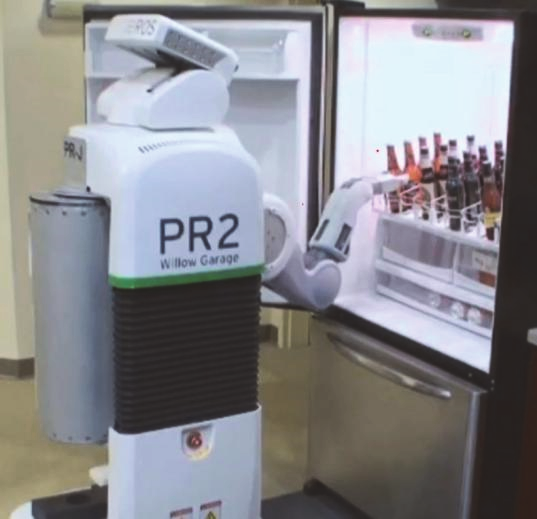

<center>图 5.1 PR2 机器人</center>

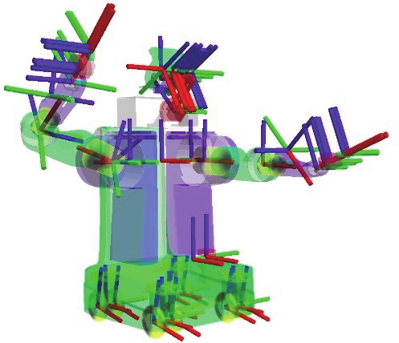

<center>图 5.2 PR2 机器人模型</center>

① 可以被当做是一种标准规范，这种标准定义了坐标变换的数据格式和数据结构，TF 本质是树状的数据结构，即“TF Tree”。

② TF 也可以看成是一个话题/tf，话题中的消息保存的就是 TF Tree 的数据结构格式，维护了整个机器人，甚至是地图的坐标变换关系。维持并更新机器人整个坐标系的话题是/tf，/tf 话题表示的内容是整个机器人的 TF Tree，而非仅仅是某两个坐标系之间的变换关系，这样的话，/tf 话题是需要很多的节点来维护的，每一个节点维护两个 frame 之间的关系。

③ TF 还可以看成是一个 package，它包含了很多的工具。比如可视化、查看关节间的 tf、debug tf 等。

④ TF 含有一部分的 API 接口，就是 roscpp 和 rospy 里关于 TF 的 API，用作节点程序中的编程。TF 对发布器与订阅器进行了封装，使开发者通过 TF 的接口更加简单地建立对 TF 树中某些坐标系变换关系的维护与订阅。

如图 5.2 所示的 PR2 机器人模型，我们可以看到有很多的 frame，错综复杂地分布在机器人的各个 link 上。维护各个坐标系之间的关系，就要靠 TF Tree 来处理。如图 5.3 所示的 TF 树，是我们常用的 robot_sim_demo 运行起来的 TF Tree 结构，每一个圆圈代表一个 frame，对应着机器人上的一个 link，任意的两个 frame 之间都必须是连通的，如果出现某一环节的断裂，就会引发系统报错。所以，完整的 TF Tree 不能有任何断层的地方，这样我们才能查清楚任意两个 frame 之间的关系。

仔细观察，我们发现每两个 frame 之间都有一个 broadcaster，这就是为了使得两个 frame 之间能够正确连通，中间都会有一个节点来发布消息。如果缺少节点来发布消息维护连通，那么这两个 frame 之间的连接就会断掉。broadcaster 就是一个 Publisher，如果两个 frame 之间发生了相对运动，broadcaster 就会发布相关消息。

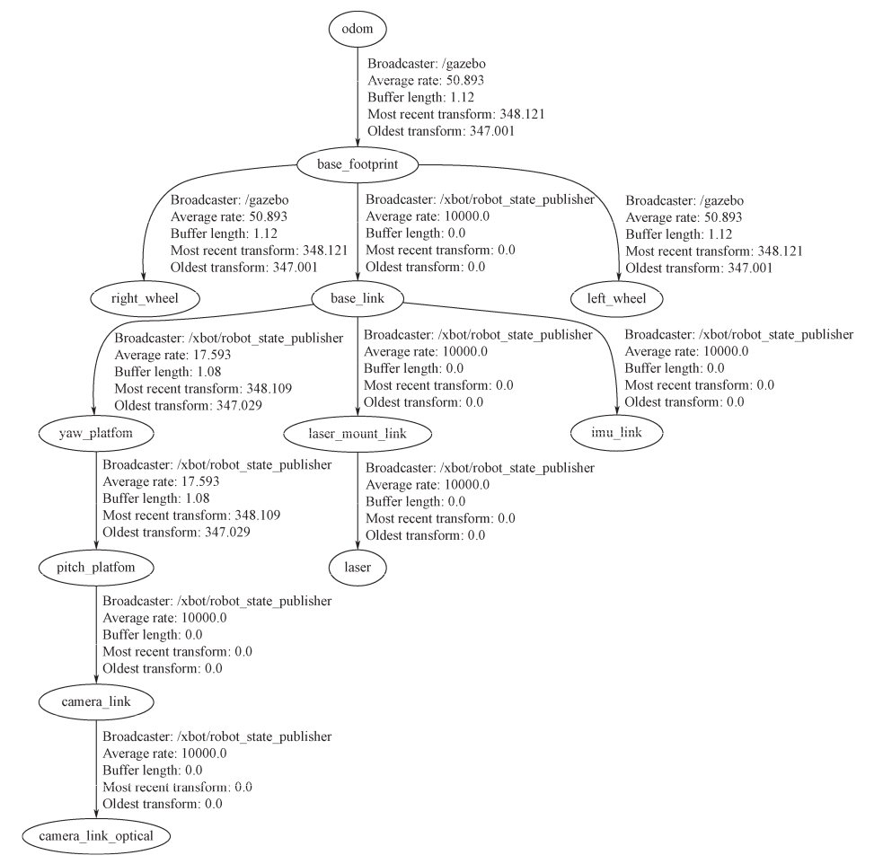

<center>图 5.3 TF 树</center>

### 5.1.3 ROS 中 TF 坐标的基本规则

**（1）ROS 的坐标系统使用右手法则**

在 ROS 中坐标系总是三维的，而且遵循右手法则，Z 轴用拇指表示，X 轴用食指表示，Y 轴用中指表示。X 轴指向前方，Y 轴指向左方，Z 轴指向上方。研究坐标系绕某轴旋转时，也是用右手法则，右手握住坐标轴，大拇指的方向朝着坐标轴朝向的正方向，四指环绕的方向即为沿着这个坐标轴旋转的正方向。ROS 坐标系及对应的右手法则示意图如图 5.4 所示。

在 Rviz 中，默认 X 轴是红色、Y 轴是绿色、Z 轴是蓝色，也就是 XYZ 对应 RGB。如图 5.5所示。

**（1）ROS 的坐标系统使用右手法则**
在 ROS 中坐标系总是三维的，而且遵循右手法则，Z 轴用拇指表示，X 轴用食指表示，Y 轴用中指表示。X 轴指向前方，Y 轴指向左方，Z 轴指向上方。研究坐标系绕某轴旋转时，也是用右手法则，右手握住坐标轴，大拇指的方向朝着坐标轴朝向的正方向，四指环绕的方向即为沿着这个坐标轴旋转的正方向。ROS 坐标系及对应的右手法则示意图如图 5.4 所示。在 Rviz 中，默认 X 轴是红色、Y 轴是绿色、Z 轴是蓝色，也就是 XYZ 对应 RGB。如图 5.5所示。

**（2）用于旋转的四元数必须是单位四元数**

欧拉角使用绕 X、Y、Z 三个轴的旋转来表示物体的旋转：

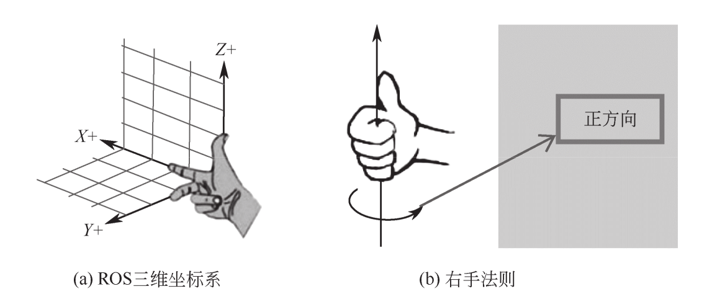

<center>图 5.4 坐标系与右手法则示意图</center>

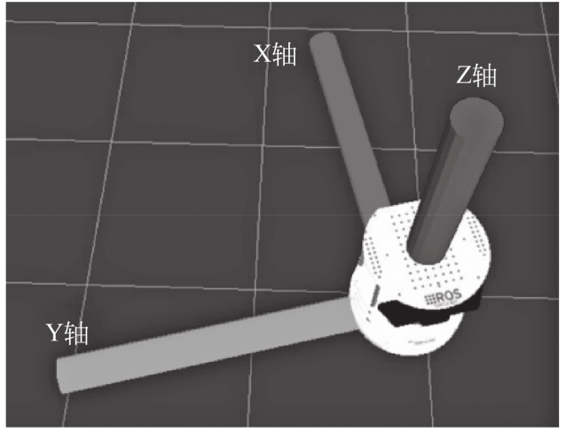

<center>图 5.5 坐标系与右手法则示意图</center>

① 绕 Z 轴旋转，称之为航向角，使用 yaw 表示。

② 绕 X 轴旋转，称之为横滚角，使用 roll 表示。

③ 绕 Y 轴旋转，称之为俯仰角，使用 pitch 表示。

四元数[如式（5.1）]是使用旋转的向量加一个旋转的角度来表示物体的旋转。

Q = ( x , y , z , w )                                              （5.1）

四元数的模使用式（5.2）计算：

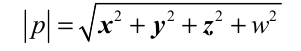 （5.2)

用于旋转的四元数，它的模必须为 1。

**（3）机器人中的坐标系**

机器人自身坐标系一般用 base_link 表示，所在位置为原点，朝向的方向为 X 轴正方向，左方为 Y 轴正方向，头顶是 Z 轴正方向。

里程计坐标系用 odom 表示，在这个坐标系中得到的测量值通常是基于轮速里程计、视觉里程计或者惯性单元得到的。在这个坐标系中，新坐标值通常是根据前一个时刻的坐标得到的。优点：坐标值是连续的并且以平稳的方式演变，没有离散的跳跃。缺点：测量产生的误差会累计，只适合于短时程相对定位。

还有个很重要的是 map 坐标系，它的坐标值通常是通过传感器的数据重新计算或测量得到的。优点：由于每次得到的坐标值都是重新测量、计算得到的，累计误差影响较小。缺点：坐标数据会有跳变，适合于长时程绝对定位。

## 5.2 TF 原理和 TF 消息

### 5.2.1 TF 基本原理

TF 的基本工作原理是：tfbroadcastor 的类里有个 Publisher，tflisener 的类里有个 Subscriber，一个发布叫/tf 的 topic，一个订阅这个 topic，传送的消息 message 里包含了每一对 parent frameid和 child frameid 的信息。这个机制意味着，所有的 tfbroadcastor 会发布某一特定的 parent 到 child的变换，而所有 tflisener 会收到所有的这些变换，然后利用一个 tfbuffercore 的数据结构维护一个完整的树结构及其状态。基于此， tflisener 在使用这棵树时，会用 lookuptransform 或 waitfortransform来获得任意坐标系之间的变换。

这样，即使只有一个 tflisener （即只监听两个坐标系的变换关系），也要跟所有的 tfbroadcastor建立连接，就要收取/tf 上的整个 TF 树，还要负责搜索这棵树，找到一条变换的路径，然后通过变换矩阵相乘得到两个坐标系最终的变换关系。

**（1）TF 树的结构**

TF 库的目的是实现系统中任一个点在所有坐标系之间的坐标变换。也就是说，只要给定一个坐标系下一个点的坐标，就能获得这个点在其他任意坐标系的坐标。为了达到上述目的，就需要提供当前 ROS 系统中任意两个坐标系的位姿变换关系。那么，TF 是用什么方式来描述与记录任意两个坐标系的位姿变换关系的呢？

这里存在一个问题。假设有 n 个坐标系，那么它们之间的组合关系有 C（n，2）个。如果这样穷举个数会非常多，所以不会采用这个方法。为了更合理、更高效地表示任意坐标系的变换关系， TF 使用多层、多叉树的形式来描述 ROS 系统的坐标系，树中的每一个节点都是一个坐标系。TF 树的特点是每个节点只有一个父节点，即采用每个坐标系都有一个父坐标系，可以有多个子坐标系的原则。

**（2）TF 坐标系表示规范**

每个坐标系都有一个父坐标系，可以有多个子坐标系。TF 树就是以父子坐标系的形式来组织的，最上面是父坐标系，往下是子坐标系。在 TF 树中具有父子关系的坐标系是相邻的，用带箭头的线连接起来。在 TF 树中用箭头表示这种父子关系。图 5.6 所表示的 TF 树中 base_link 坐标系是base_footprint 的子坐标系，base_cover_link 坐标系也是 base_footprint 的子坐标系。

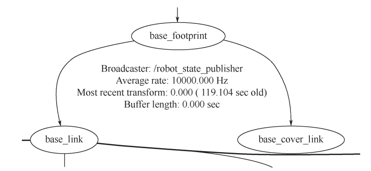

<center>图 5.6 TF 树父子坐标系示例</center>

TF 坐标系的描述规范有以下几点：

① source、 target frame 是在进行坐标变换时的概念， source frame 是坐标变换的源坐标系， targetframe 是目标坐标系。这个时候，这个变换代表的是坐标变换。

② parent、child frame 是在描述坐标系变换时的概念，parent frame 是原坐标系，child frame是变换后的坐标系。这个时候，这个变换代表的是坐标系变换，也是 child 坐标系在 parent 坐标系下的描述。

③ a frame 到 b frame 的坐标系变换（frame transform），也表示了 b frame 在 a frame 中的描述，也代表了把一个在 b frame 里点的坐标变换成在 a frame 里坐标的坐标变换。

④ 从 parent 到 child 的坐标系变换（frame transform）等同于把一个点从 child 坐标系向 parent坐标系的坐标变换，等于 child 坐标系在 parent 坐标系中的姿态描述。

**（3）TF 树的通信方式与 TF 树的具体表示**

TF 树的建立和维护是基于 topic 通信机制的。根据 TF 树的原理，它是靠建立与维护每个父子坐标系的变换关系来维护整个系统所有坐标系的变换关系。每个 parent 坐标系到 child 坐标系的变换关系是靠被称为 broadcastor 的发布器节点来持续发布的。

虽然是靠 topic 通信机制发布的 parent 坐标系到 child 坐标系的变换，但并不是让每一对父子坐标系都发布一个话题，实际上发布的唯一话题是/topic，该话题集合了所有发布的父子坐标系的变换关系。使用 TF 的 tflisener 就可以监听任意两个坐标系的变换关系，前提是 TF 树能把这两个坐标系连通。

**（4）TF 树的建立**

在开始建立 TF 树的时候需要指定第一个父坐标系（parent frame）作为最初的坐标系。比如机器人系统中的 map 坐标系。在第一次发布一个从已有的 parent frame 到新的 child frame 的坐标系变换时，这棵树就会添加一个树枝，之后就是维护。TF 树的建立和维护靠的是 TF 提供的tfbroadcastor 类的 sendtransform 接口。 transformBroadcaster 类就是一个 Publisher，而 sendTransform的作用是来封装 publish 的函数。

**（5）TF 树的维护**

在运行过程中要不断更新已有的 parent frame 到已有的 child frame 的坐标系变换，从而保证最新的位姿变换关系。作为树状结构，要保证父子 frame 都有某个节点在持续地发布这两个 frame之间的位姿关系，才能使树状结构保持完整。只有每一个父子的 frame 的位姿关系能被正确地发布，才能保证任意两个 frame 之间的连通。

**（6）TF 树的使用**

一旦正常建立一个 TF 树，保证每个父子坐标系都能得到正常的维护，那么就可以利用 TF 提供的订阅器，订阅任意两个坐标系的变换关系。

如何根据 TF 树得到任意坐标系的变换关系？其实订阅器是收取的/tf 话题上的消息，该消息集合了所有发布的父子坐标系的变换关系。订阅器接收的其实是当前时刻的整个 TF 树，然后搜索这棵树，根据不同的父子坐标系关系找到一条变换的路径。这条变换路径就能通过父子关系通路连接起所求的这两个坐标系，从而通过将该通路上的变换矩阵不断相乘得到最终所求的这两个坐标系的变换关系。

TF 对发布器与订阅器进行了封装，使开发者通过 TF 的接口更加简单地建立对 TF 树中某些坐标系变换关系的维护与订阅。用 TF 的 tflisener 监听某一个指定的从一个 a frame 到 b frame 的变换关系即可。

### 5.2.2 TF 数据类型

**（1）基本数据类型**

TF 数据类型主要有以下几种基本类型，分别对应四元数、向量、点坐标、位姿和转换模板，如表 5.1 所示。

<center>表 5.1 TF 基本数据类型</center>

| 类型       | TF             | 名称     |
| ---------- | -------------- | -------- |
| Quaternion | tf::Quaternion | 四元数   |
| Vector     | tf::Vector3    | 向量     |
| Point      | tf::Point      | 点坐标   |
| Pose       | tf::Pose       | 位姿     |
| Transform  | tf::Transform  | 转换模板 |

**（2）tf::Stamped <T>**

tf::Stamped<T>数据类型是在上述所有基本类型（除了 tf::Transform）的基础上具有元素frame_id_和 stamp_的模板化。

```cpp
template <typename T>
class Stamped : public T{
    public:
        ros::Time stamp_;
        srd::string frame_id_;
        Stamped() : frame_id_ ("NO_ID_STAMPED_DEFALUT_CONSTRUCTION"){}; //默认构
        造函数仅用于预分配
        Stamped(const T4 input, const ros::Time& timestamp, const std::string &
        frame_id);
        void setData(const T& input);
};
```

 **（3）tf::StampedTransform**

tf::StampedTransform 数据类型是 tf::Transform 的一个特例，同时要求具有 frame_id、stamp 和child_frame_id。

 ```cpp
 /** 简要介绍 TF 使用的标记转换数据类型 */
 class StampedTransform : public tf::Transform{
 	public:
         ros::Time stamp_;
         std::string frame_id_;
         std::string child_frame_id_;
         StampedTransform(const tf::Transform& input, const ros::Time& timestamp,
         const std::string & frame_id, const std::string & child_frame_id);
         tf::Transform(input), stamp_ (timestamp), frame_id_ (frame_id),child_
         frame_id_(child_frame_id){ };
         /** 默认构造函数仅用于预分配 */
         StampedTransform() { };
 	    /** 简要设置继承的变换数据 */
 		void setData(const tf::Transform& input){*static_cast<tf::Transform*> (this) = input;};
 };
 ```

### 5.2.3 TF 特点

TF 的优点如下：

① 各种数值计算的细节，你不用考虑，TF 库可以帮你。

② 接口很简洁，会广播和监听就行。

③ 问题找得很准，那就是需要维护坐标系之间的关系，尤其是父子坐标系的关系。

④ 提供了很多工具程序。

⑤ 考虑了与时间相关的变换。

⑥ 支持 tf-prefix，可以在多机器人上用。通过让不同机器人使用不同的 prefix，来区分机器人。如果只有一个机器人，一般是使用“/”。

TF 的缺点如下：

① 树的结构很简单，但有时候很笨拙。对于同级的坐标系，就需要从下到上找到共同先辈，然后从这个先辈再往下找，进而确定二者的关系。

② 每个订阅器要想获得某两个坐标系的关系，都要搜索同一颗树，这样的开销太大，主要是网络传输的负荷比较大。

③ 很难满足实时性的要求，这一点显而易见。这也是为什么 TF 会将每个变换的数据存10 秒。

④ 虽然整体比较容易上手但是很多细节不易理解。比如，now（）和 time（0）；比如，技术文档里的一些名词术语；比如，采用了机器人里的习惯，与飞行器、惯性导航、车辆里的习惯区别较大，使用时不能想当然。

### 5.2.4 TF 消息  

**（1）TF 消息：两个 frame 之间的消息**

每 个 父 子 坐 标 系 之 间 都 会 有 broadcaster 节 点 来 发 布 消 息 维 护 坐 标 之 间 的 变 换 关 系 。TransformStampded.msg 就是/tf 话题消息。该消息格式用来表示两个 frame 之间一小段 TF 变换的相对坐标关系。

ROS 实际上是靠 TF Tree 来表示整个系统的坐标系关系的，而非简单地靠多个两两父子坐标系的变换关系来描述。这里，TransformStampded.msg 消息的 TF Tree 消息类型的片段即其中的一对父子坐标系位姿的描述方式，TF Tree 消息类型基于 TransformStampded.msg 消息，因此先介绍TransformStampded.msg。TransformStampded.msg 本质上描述的是 TF Tree 中一小段 TF 变换。具体消息类型是 geometry_msgs/TransformStamped，可见该消息类型是属于 geometry_msgs 程序包的，而非 TF 包。该消息标准格式规范如下：

```
std_mags/Header header
	uint32 seq
	time stamp
	string frame_id
string child_frame_id
geometry_msgs/Transform transform
    geometry_msgs/Vector3 translation
        float64 x
        float64 y
        float64 z
    geometry_msgs/Vector3 translation
        float64 x
        float64 y
        float64 z
    geometry_msgs/Quaternion rotation
```

该消息表示的是当前坐标系 frame_id 和它的子坐标系 child_frame_id 之间的变换关系。具体的转换位姿是由 geometry_msgs/Transform 消息类型来定义的，该消息类型用三维向量表示平移，用四元组表示旋转。

**（2）TF 消息：TF 树的消息类型**

/tf 话题表示的内容是整个机器人的 TF 树，而非仅仅是某两个坐标系的变换关系，这样的话，/tf 话题需要很多的节点来维护，每一个节点维护两个父子 frame 之间的关系。即一个/tf 话题可能会有很多个节点向其发送消息。这样就相当于 TF Tree 是由很多的 frame 之间的 TF 拼接而成。上文提到的 TransformStampded.msg 消息类型表示的是两个 frame 之间的 TF 关系，接下来要介绍真正在/tf 话题上进行传输的 TF Tree 的消息类型。

在 TF2 中的 TF 树对应的消息类型是 tf2_msgs/TFMessage.msg。可见该消息位于 tf2_msgs 程序包内。tf2_msgs/TFMessage 消息的具体格式：

```
geometry_msgs/TransformStamped[] transforms
    std_msgs/Header header
        uint32 seq
        time stamp
        string frame_id
    string child_frame_id
    geometry_msgs/Transform transform
        geometry_msgs/Vector3 translation
            float64 x
            float64 y
            float64 z
        geometry_msgs/Quaternion rotation
            float64 x
            float64 y
            flaot64 z
            float64 w
```

由此可以看出 TF 树的消息类型实际上就是一个 TransformStamped 类型定义的可变长度数组。也就是说，本质就是由很多对 frame 之间的 TF 消息 TransformStamped 形成描述整个机器人的 TF树的消息类型 tf2_msgs/TFMessage.msg。

## 5.3 TF 编程基础

### 5.3.1 TF 功能包及官方实例

那么我们该怎么应用 TF 呢？这里先以 ROS 官方给出的实例作为演示。首先我们先输入以下命令安装 TF 功能包。

```bash
sudo apt-get install ros-noetic-turtle-tf -y
```

执行以下命令

```bash
roslaunch turtle_tf turtle_tf_demo.launch
rosrun turtlesim turtle_teleop_key
```

通过键盘控制初始化在中心的海龟进行运动，可以看到另一只海龟自动跟随，如图 5.7 所示。

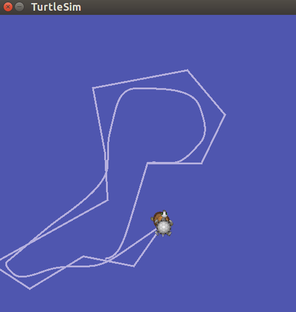

<center>图 5.7 海龟自动跟随</center>

该过程主要通过 turtle1 和 turtle2 之间的坐标变换实现。我们可以通过下列命令得到系统中所运行的所有坐标系的结构关系图以及节点信息图，如图 5.8 和图 5.9 所示。

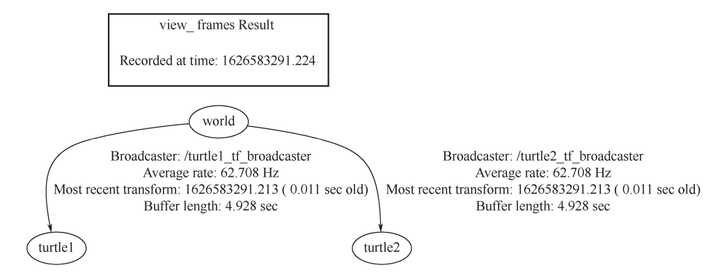

<center>图 5.8 TF 结构关系图</center>

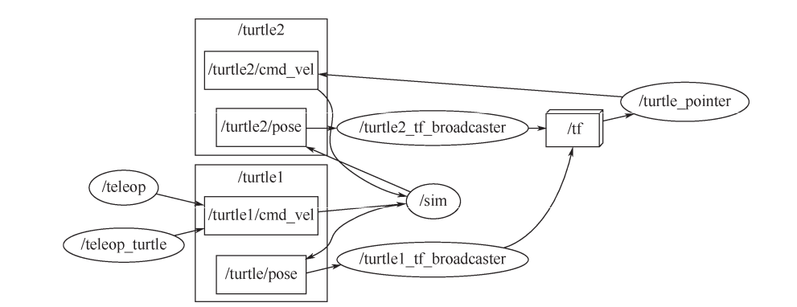

<center>图 5.9 节点信息图</center>

```bash
rosrun tf view_frames   #创建一个 TF 监听器监听 5s，得到 TF 结构关系图
rqt_graph 				#查看节点信息
```

### 5.3.2 TF 编程基础
当我们使用 TF 包时，需要编写两个程序，分别用来执行监听 TF 变换和广播 TF 变换的功能，我们称它们为 TF 监听器和 TF 广播器。

TF 监听器：监听 TF 变换，接收并缓存系统中发布的所有参考系变换关系，并从中查询所需要的参考系变换关系。

TF 广播器：广播 TF 变换，向系统中广播参考系之间的坐标变换关系。系统中可能会存在多个不同部分的 TF 变换广播，但每个广播都可以直接将参考系变换关系直接插入 TF 树中，不需要再进行同步。

下面我们以官方的教程为例，该程序实现了前文图 5.7 给出的海龟自动跟随的效果。

**（1）TF 广播器**

实现功能：创建 TF 广播器，创建坐标变换值并实时发布坐标变换。实现代码见 turtle_tf 包中的 turtle_tf_broadcaster.py 文件，编程思路如下：

① 初始化 ROS 节点，并订阅 turtle 的位置消息。

② 循环等待话题消息，接收到消息之后进入回调函数，该回调函数用以处理并发布坐标变换。

③ 在该回调函数内部定义一个广播器。

④ 根据接收到的小海龟的位置消息，创建坐标变换值。

⑤ 通过定义的广播器发布坐标变换。

**（2）TF 监听器**
实现功能：创建 TF 监听器，创建第二只海龟，监听坐标变换并发布运动控制指令，使第二只海龟向第一只海龟运动。实现代码见 turtle_tf 包中的 turtle_tf_listener.py 文件，编程思路如下：

① 初始化 ROS 节点，并向节点管理器注册节点信息。

② 通过服务调用产生第二只海龟。

③ 创建 turtle2 的速度控制发布器。

④ 创建 TF 监听器并监听 turtle2 相对于 turtle1 的坐标变换。

⑤ 根据坐标变换发布速度控制指令。

**（3）启动文件**

配置 turtle_tf_demo.launch 文件启动官方例程。该文件编程思路如下：

① 启动小海龟节点。

② 启动小海龟控制节点，用于控制小海龟运动。

③ 分别启动 turtle1 和 turtle2 的 TF 广播器。

④ 启动 TF 监听器。

## 5.4 TF in C++

### 5.4.1 简介

前面我们介绍了 TF 的基本的概念、 TF 树消息的格式类型和 TF 编程的基本方法，我们知道，TF 不仅仅是一个标准、话题，它还是一个接口。下面我们就介绍 C++中 TF 的一些函数和写法。

<center>表 5.2 TF 的数据类型</center>

| 名称                 | 数据类型             |
| -------------------- | -------------------- |
| 向量                 | tf::Vector3          |
| 点                   | tf::Point            |
| 四元数               | tf::Quaternion       |
| 3×3 矩阵（旋转矩阵） | tf::Matrix3x3        |
| 位姿                 | tf::pose             |
| 变换                 | tf::Transform        |
| 带时间戳的以上类型   | tf::Stamped          |
| 带时间戳的变换       | tf::StampedTransform |

易混注意：虽然此表的最后带时间戳的变换数据类型为 tf::StampedTransform，和上节我们所讲的 geometry_msgs/TransformStamped.msg 看起来很相似，但是其实数据类型完全不一样，tf::StampedTransform 只能用在 C++里，只是 C++的一个类、一种数据格式，并不是一个消息；而geometry_msgs/TransformStamped.msg 是一个 message，它依赖于 ROS，与语言无关，也即是无论何种语言，C++、Python、Java 等，都可以发送该消息。

### 5.4.3 数据转换

在 TF 里可能会遇到各种各样数据的转换，例如常见的四元数、旋转矩阵、欧拉角这三种数据之间的转换，如图 5.10 所示。

TF in roscpp 给了我们解决该问题的函数，详细源码在我们提供的代码包中。TF 中与数据转换相关的函数都包含在#include<tf/tf.h>头文件中，我们将与数
据 转 换 相 关 的API都 存 在tf_demo的coordinate_transformation.cpp 中，其中列表如下。

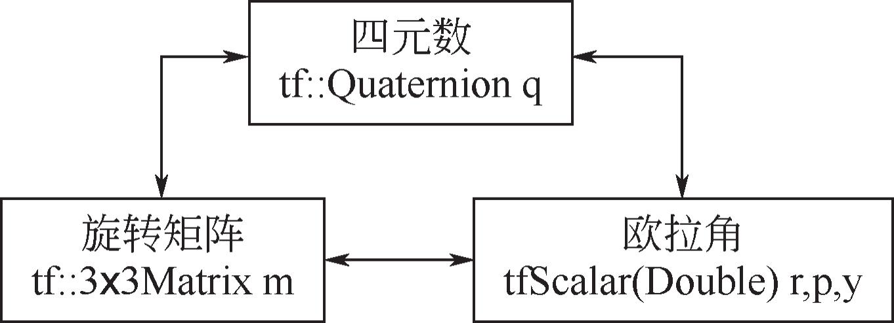

<center>图 5.10 三种数据之间的转换</center>

 **（1）定义空间点和空间向量**

空间点和空间向量计算的相关函数如表 5.3 所示。

 <center>表 5.3 空间点和空间向量计算的相关函数表</center>

| 函数名称                                                  | 函数功能                     |
| --------------------------------------------------------- | ---------------------------- |
| tfScalar::tfDot(const Vector3 &v1, const Vector3 &v2)     | 计算两个向量的点积           |
| tfScalar length()                                         | 计算向量的模                 |
| Vector3 &normalize()                                      | 求与已知向量同方向的单位向量 |
| tfScalar::tfAngle(const Vector3 &v1, const Vector3 &v2)   | 计算两个向量的夹角           |
| tfScale::tfDistance(const Vector3 &v1, const Vector3 &v2) | 计算两个向量的距离           |
| tfScale::tfCross(const Vector3 &v1, const Vector3 &v2)    | 计算两个向量的乘积           |

 示例代码如下：

```cpp
#include<ros/ros.h> #include <tf/tf.h>
//退出用：ctrl+z
int main(int argc, char** argv){
    //初始化
    ros::init(argc, argv, "coordinate_transformation");
    ros::NodeHandle node;
    tf::Vector3 v1(1,1,1);
    tf::Vector3 v2(1,0,1);
    //第 1 部分，定义空间点和空间向量
    std::cout<<"第 1 部分，定义空间点和空间向量"<<std::endl;
    //1.1 计算两个向量的点积
    std::cout<<"向量 v1:"<<"("<<v1[0]<<","<<v1[1]<<","<<v1[2]<<"),";
    std::cout<<"向量 v2:"<<"("<<v2[0]<<","<<v2[1]<<","<<v2[2]<<")"<<std::endl;
    std::cout<<"两个向量的点积："<<tfDot(v1,v2)<<std::endl;
    //1.2 计算向量的模
    std::cout<<"向量 v2 的模值:"<<v2.length()<<std::endl;
    //1.3 求与已知向量同方向的单位向量
    tf::Vector3 v3;
    v3=v2.normalize();
    std::cout<<"与向量 v2 的同方向的单位向量
    v3:"<<"("<<v3[0]<<","<<v3[1]<<","<<v3[2]<<")"<<std::endl;
    //1.4 计算两个向量的夹角
    std::cout<<"两个向量的夹角(弧度):"<<tfAngle(v1,v2)<<std::endl;
    //1.5 计算两个向量的距离
    std::cout<<"两个向量的距离:"<<tfDistance2(v1,v2)<<std::endl;
    //1.6 计算两个向量的乘积
    tf::Vector3 v4;
    v4=tfCross(v1,v2);
    std::cout<<"两个向量的乘积
    v4:"<<"("<<v4[0]<<","<<v4[1]<<","<<v4[2]<<")"<<std::endl;
    return 0;
};
```

**（2）定义四元数**

四元数相关的函数如表 5.4 所示。

<center>表 5.4 四元数相关的函数表</center>

| 函数名称                                                     | 函数功能                       |
| ------------------------------------------------------------ | ------------------------------ |
| setRPY(const tfScalar& yaw, const stScalar &pitch, const tfScalar &roll) | 由欧拉角计算四元数             |
| Vector3 getAxis()                                            | 由四元数得到旋转轴             |
| setRotation(const Vector3 &axis, const tfScalar& angle)      | 已知旋转轴和旋转角，估计四元数 |

示例代码如下：

```cpp
#include <ros/ros.h>
#include <tf/tf.h>
//退出用：ctrl+z
int main(int argc, char** argv){
    //初始化
    ros::init(argc, argv, "coordinate_transformation"); ros::NodeHandle node;
    std::cout<<"第 2 部分，定义四元数"<<std::endl;
    //2.1 由欧拉角计算四元数
    tfScalar yaw,pitch,roll; yaw=0;pitch=0;roll=0;
    std::cout<<"欧拉角 rpy("<<roll<<","<<pitch<<","<<yaw<<")";
    tf::Quaternion q; q.setRPY(yaw,pitch,roll);
    std::cout<<"，转换到四元数
    q:"<<"("<<q[3]<<","<<q[0]<<","<<q[1]<<","<<q[2]<<")"<<std::endl;
    //2.2 由四元数得到旋转轴 tf::Vector3 v5; v5=q.getAxis()
    std::cout<<"四元数 q 的旋转轴
    v5"<<"("<<v5[0]<<","<<v5[1]<<","<<v5[2]<<")"<<std::endl;
    //2.3 由旋转轴和旋转角来估计四元数
    tf::Quaternion q2; q2.setRotation(v5,1.570796);
    std::cout<<"旋转轴 v5 和旋转角度 90°，转换到四元数 q2:"<<"("<<q2[3]<<","<<q2[0]<<","<<q2[1]<<","<<q2[2]<<")"<<std::endl; return 0;
};
```

**（2）定义四元数**

四元数相关的函数如表 5.4 所示。

<center>表 5.4 四元数相关的函数表</center>

| 函数名称                                                     | 函数功能                       |
| ------------------------------------------------------------ | ------------------------------ |
| setRPY(const tfScalar& yaw, const stScalar &pitch, const tfScalar &roll) | 由欧拉角计算四元数             |
| Vector3 getAxis()                                            | 由四元数得到旋转轴             |
| setRotation(const Vector3 &axis, const tfScalar& angle)      | 已知旋转轴和旋转角，估计四元数 |

 示例代码如下：

```cpp
#include <ros/ros.h>
#include <tf/tf.h>
//退出用：ctrl+z
int main(int argc, char** argv){
    //初始化
    ros::init(argc, argv, "coordinate_transformation"); ros::NodeHandle node;
    std::cout<<"第 2 部分，定义四元数"<<std::endl;
    //2.1 由欧拉角计算四元数
    tfScalar yaw,pitch,roll; yaw=0;pitch=0; roll=0;
    std::cout<<"欧拉角 rpy("<<roll<<","<<pitch<<","<<yaw<<")";
    tf::Quaternion q; q.setRPY(yaw,pitch,roll);
    std::cout<<"，转换到四元数 q:"<<"("<<q[3]<<","<<q[0]<<","<<q[1]<<","<<q[2]<<")"<<std::endl;
    //2.2 由四元数得到旋转轴 tf::Vector3 v5; v5=q.getAxis()
    std::cout<<"四元数q的旋转轴 v5"<<"("<<v5[0]<<","<<v5[1]<<","<<v5[2]<<")"<<std::endl;
    //2.3 由旋转轴和旋转角来估计四元数
    tf::Quaternion q2; q2.setRotation(v5,1.570796);
    std::cout<<"旋转轴 v5 和旋转角度 90°，转换到四元数 q2:"<<"("<<q2[3]<<","<<q2[0]<<","<<q2[1]<<","<<q2[2]<<")"<<std::endl; 
    return 0;
};
```

**（3）定义旋转矩阵**

旋转矩阵相关函数如表 5.5 所示。

 <center>表 5.5 旋转矩阵相关函数</center>

| 函数名称                                                    | 函数功能               |
| ----------------------------------------------------------- | ---------------------- |
| setRotation(const Quaternion &q)                            | 通过四元数得到旋转矩阵 |
| getEulerYPR(tfScalar &yaw, tfScalar &pitch, tfScalar &roll) | 由旋转矩阵求欧拉角     |

  示例代码如下：

```cpp
#include <ros/ros.h> 
#include <tf/tf.h>

//退出用：ctrl+z
int main(int argc, char** argv){
    //初始化
    ros::init(argc, argv, "coordinate_transformation"); 
    ros::NodeHandle node;
    //第 3 部分，定义旋转矩阵
    std::cout<<"第 3 部分，定义旋转矩阵"<<std::endl;
    //3.1 通过四元数得到旋转矩阵
    tf::Quaternion q2(1,0，0,0）;
    tf::Matrix3x3 Matrix; 
	tf::Vector3 v6,v7,v8; 
    Matrix.setRotation(q2);
    v6=Matrix[0]; v7=Matrix[1]; v8=Matrix[2];
    std::cout<<"四元数q2 对应的旋转矩阵M:"<<v6[0]<<","<<v6[1]<<","<<v6[2]<<std::endl;
    std::cout<<" "<<v7[0]<<","<<v7[1]<<","<<v7[2]<<std::endl;
    std::cout<<" "<<v8[0]<<","<<v8[1]<<","<<v8[2]<<std::endl;
    //3.2 通过旋转矩阵求欧拉角
    tfScalar m_yaw,m_pitch,m_roll; 
    Matrix.getEulerYPR(m_yaw,m_pitch,m_roll);
    std::cout<<"由旋转矩阵 M,得到欧拉角 rpy("<<m_roll<<","<<m_pitch<<","<<m_yaw<<")"<<std::endl;
    return 0;
};
```

此 外 ， 在 tf_demo 的 教 学 包 中 ， 我 们 还 提 供 了 常 见 的 欧 拉 角 与 四 元 数 的 互 换 ， 详 见Euler2Quaternion.cpp 与 Quaternion2Euler.cpp。

 ### 5.4.4 TF 类

**（1）tf::TransformBroadcaster 类**

这个类在前面讲 TF 树的时候提到过，这个 broadcaster 就是一个 Publisher，而 sendTransform的作用是封装 publish 的函数。在实际使用中，我们需要在某个 Node 中构建 tf::TransformBroadcaster类，然后调用 sendTransform()函数，将 transform 发布到/tf 的一段 transform 上。 /tf 里的 transform为 我 们 重 载 了 多 种 不 同 的 函 数 类 型 。 我 们 的 tf_demo 教 学 包 中 提 供 了 相 关 的 示 例 代 码tf.broadcaster.cpp：

```cpp
transformBroadcaster()
void sendTransform(const StampedTransform &transform)
void sendTransform(const std::vector<StampedTransform> &transforms)
void sendTransform(const geometry_msgs::TransformStamped &transform)
void sendTransform(const std::vector<geometry_msgs::TransformStamped> &transforms)
```

**（2）tf::TransformListener 类**

上一个类是向/tf 发送的类，那么这一个就是/tf 接收的类。首先看 lookuptransform()函数，第一个参数是目标坐标系，第二个参数为源坐标系，也即得到从源坐标系到目标坐标系之间的变换关系，第三个参数为查询时刻，第四个参数为存储转变关系的位置。值得注意，第三个参数通常用 ros::Time（0），这个表示最新的坐标变换关系，而 ros::time::now 则会因为收发延迟，而不能正确获取当前最新的坐标转变关系。canTransform()函数是用来判断两个 transform 之间是否连通，waitForTransform() const 函数是用来等待某两个 transform 之间的连通。我们的 tf_demo教学包中提供了相关的示例代码 tf_listerner.cpp：

```cpp
transformListener()
void lookupTranform(const std::string &target_frame,const std::string &source_frame,co nst ros::Time &time,StampedTransform &transform)const
bool canTransform()
bool waitForTransform()const
```

## 5.5 TF in Python

### 5.5.1 简介

我们知道 TF 中不仅有 C++的接口，也有 Python 的接口。相比 C++，TF 在 Python 中的具体实现相对简单好用。

### 5.5.2 数据类型
TF 的相关数据类型，向量、点、四元数、矩阵都可以表示成类似数组的形式，就是它们都可以用 Tuple、List、Numpy Array 来表示。例如：

```cpp
t = (1.0,1.5,0) 		#平移
q = [1,0,0,0] 			#四元数
m = numpy.identity(3) 	#旋转矩阵
```

第一个平移数据是使用 Tuple 来表示的，同时也可以用 List 表示成 t=[1.0, 1.5, 0]，也能用Numpy Array 表示或 numpy.array(1.0, 1.5, 0)。这些数据类型没有特殊对应，全部是通用的，所以这里也就没有了各种数据类型的转换的麻烦。

### 5.5.3 TF 库

tf.transformations 函数库的基本数学运算函数如表 5.6 所示。

<center>表 5.6 tf.transformations 函数库的基本数学运算函数</center>

| 函数                                           | 注释           |
| ---------------------------------------------- | -------------- |
| euler_matrix(ai, aj, ak, axes='sxyz')          | 欧拉角到矩阵   |
| euler_form_matrix(matrix, axes='sxyz')         | 矩阵到欧拉角   |
| euler_from_quaternion(quaternion, axes='sxyz') | 四元数到欧拉角 |
| quaternion_form_euler(ai, aj, ak, axes='sxyz') | 欧拉角到四元数 |
| quaternion_matrix(quaternion)                  | 四元数到矩阵   |
| quaternion_form_matrix(matrix)                 | 矩阵到四元数   |

使用该函数库时，首先需要使用 import 调用 TF 库，tf.transformations 给我们提供了一些基本的数学运算函数，如表 5.6 所示，使用起来非常方便。在 tf_demo 教学包中，我们列举了一些tf.transformations 常见的 API 和示例代码，具体见下文。

**（1）定义空间点和空间向量**

空间点和空间向量计算的相关函数如表 5.7 所示。

<center>表 5.7 空间点和空间向量计算的相关函数表</center>

| 函数名称                                             | 函数功能                 |
| ---------------------------------------------------- | ------------------------ |
| tf.transformations.random_quaternion(rand=None)      | 返回均匀随机单位四元数   |
| tf.transformations.random_rotation_matrix(rand=None) | 返回均匀随机单位旋转矩阵 |
| tf.transformations.random_vector(size)               | 返回均匀随机单位向量     |
| tf.transformations.translation_matrix(v)             | 通过向量来求旋转矩阵     |
| tf.transformations.translation_from_matrix(m)        | 通过旋转矩阵来求向量     |

  **（2）定义四元数**

四元数相关的函数如表 5.8 所示。

<center>表 5.8 四元数相关的函数表</center>

| 函数名称                                                     | 函数功能                     |
| ------------------------------------------------------------ | ---------------------------- |
| tf.transformations.quaternion_about_axis(angle, axis)        | 通过旋转轴和旋转角返回四元数 |
| tf.transformations.quaternion_conjugate(quaternion)          | 返回四元数的共轭             |
| tf.transformations.quaternion_from_euler(ai, aj, ak, axes='ryxz') | 从欧拉角和旋转轴，求四元数   |
| tf.transformations.quaternion_from_matrix(matrix)            | 从旋转矩阵中，返回四元数     |
| tf.transformations.quaternion_multiply(quaternion1, quaternion2) | 两个四元数相乘               |

**（3）定义旋转矩阵**

旋转矩阵的相关函数如表 5.9 所示。  

 <center>表 5.9 旋转矩阵的相关函数</center>

| 函数名称                                                | 函数功能                           |
| ------------------------------------------------------- | ---------------------------------- |
| tf.transformations.euler_matrix(ai, aj, ak, axes='xyz') | 由欧拉角和旋转轴返回旋转矩阵       |
| tf.transformations.euler_from_matrix(matrix)            | 由旋转矩阵和特定的旋转轴返回欧拉角 |
| tf.transformations.euler_from_quaternion(quaternion)    | 由四元数和特定的旋转轴得到欧拉角   |

### 5.5.4 TF 类

**（1）tf.TransformListener 类**

tf.TransformListener 类中主要包含三种方法，如表 5.10 所示。它的构造函数不需要填值。注意：这里的 time 参数，依然是使用 rospy.Time(0)，而不是 rospy.Time.now()。具体原因 5.4节已经介绍，这里不再赘述。 

<center>表 5.10 tf.TransformListener 类的方法</center>

| 方法                                                         | 作用                             |
| ------------------------------------------------------------ | -------------------------------- |
| canTransform(self, target_frame, source_frame, time)         | frame 是否相通                   |
| waitForTransform(self, target_frame, source_frame, time, timeout) | 阻塞直到 frame 相通              |
| lookupTransform(self, target_frame, source_frame, time)      | 查看相对的 TF，返回(trans, quat) |

除了上述三种主要方法，这个类中还有一些辅助方法，如表 5.11 所示。

<center>表 5.11 tf.TransformListener 类的辅助方法</center>

| 方法                                                         | 作用                                       |
| ------------------------------------------------------------ | ------------------------------------------ |
| chain(target_frame, target_time, source_frame, source_time, fixed_frame) | frame 的连接关系                           |
| frameExists(self, frame_id)                                  | frame 是否存在                             |
| getFrameStrings(self)                                        | 返回所有 TF 的名称                         |
| fromTranslationRotation(translation, rotation)               | 根据平移和旋转返回 4×4 矩阵                |
| transformPoint(target_frame, point_msg)                      | 将 PointStamped 消息转换到新 frame 下      |
| transformPose(target_frame, pose_msg)                        | 将 PoseStamped 消息转换到新 frame 下       |
| transformQuaternion(target_frame, quat_msg)                  | 将 QuaternionStamped 消息转换到新 frame 下 |

tf_demo 教学包中的 scripts/py_tf_listerner.py 给出了示例程序。

**（2）tf.TransformBroadcaster 类**

类似地，我们介绍的是发布方 tf.TransformBroadcaster 类。该类的构造函数也是不需要填值，成员函数有两个，如下：

```cpp
sendTransform(translation, rotation, time, child, parent)	#向/tf 发布消息
sendTransformMessage(transform)  					       	#向/tf 发布消息
```

第一个 sendTransform（）把 transform 的平移和旋转填好，打上时间戳，然后表示从父到子的frame 流，然后发送给/tf 的 topic。第二个是发送 transform 已经封装好的 message 给/tf。这两种不同 的 发 送 方 式 ， 功 能 是 一 致 的 。 tf_demo 教 学 包 中 的 scripts/py_tf_broadcaster.py 和scripts/py_tf_broadcaster02.py 给出了示例程序。

 

## 5.6 TF 相关工具命令

**（1）根据当前的 TF 树创建一个 pdf 图**

```bash
rosrun tf view_frames
```

这个工具首先订阅/tf，订阅 5 秒，根据这段时间内接收到的 TF 信息，绘制成一张 TF Tree，然后创建成一个 pdf 图。

**（2）查看当前的 TF 树**

```bash
rosrun rqt_tf_tree rqt_tf_tree
```

该命令同样是查询 TF Tree，但是与第一个命令的区别是该命令是动态地查询当前的 TF Tree，当前的任何变化都能当即看到，例如何时断开、何时连接，捕捉到这些，然后通过 rqt 工具显示出来。

**（3）查看两个 frame 之间的变换关系**

```bash
rosrun tf tf_echo[reference_frame][target_frame]
```

**（4）用命令行显示当前所有 frame**

```bash
rosrun tf tf_monitor  #显示当前坐标变换树的信息，主要是名称和实时的时间延时
rostopic echo /tf     #以 TransformStamped 消息类型的数组显示所有父子 frame 的位姿变换关系
```

## 5.7本章小结

通过对本章的学习，我们对机器人的坐标变换有了更深入的了解，明白了机器人是怎样通过相对的坐标变换来做出动作的。学完本章，你应该对 TF 基本原理和 TF 的通信方式已经了如指掌了，对 TF 在 C++和 Python 接口中的实现原理以及相关用法也已经掌握了。对于本课程的学习，不仅要将理论知识熟记于心，还需要在实践上多下功夫，TF 编程则是我们很好的实践项目。通过TF 编程实践，使用 TF 包实现了监听 TF 变换和广播 TF 变换的功能。在接下来的第 6 章，我们将会学习到机器人的仿真环境，创建机器人的 URDF 模型并使机器人模型在仿真环境里动起来。

## 5.8 习题

1. TF 的全称是什么？TF 有什么作用？
2. TF 是怎样描述任意两个坐标系的位姿变换关系的？
3. 两个坐标系的关系是怎样来表示的？它们的类型是什么样的？
4. TF 广播器和 TF 监听器的实现流程是什么样的？试着通过代码展示出来。