# 第 6 章 机器人建模和仿真

在项目实践中，机器人的外形和尺寸差异很大，如果开发和调试都在真实的物理设备上进行，无疑会造成非常大的工作量、成本负担和潜在的项目延期风险，而且也不是每个人都有机会接触到真正的机器人。基于这些原因，我们需要对机器人及其所处环境进行建模与仿真。在本章中我们将会学习：创建机器人的 3D 模型；为机器人提供运动、物理限制、惯性和其他物理响应；为机器人 3D 模型添加仿真传感器；在仿真环境中使用该模型。

## 6.1 机器人 URDF 模型

URDF（Unified Robot Description Format，统一机器人描述格式）是 ROS 中一个非常重要的机器人模型描述格式，URDF 能够描述机器人的运动学和动力学特征、视觉表示、碰撞模型等。在 URDF 中，机器人模型由连接件（link）、连接连接件的关节（joint）、传感器（sensor）、传动件（transmission）等部件组成。ROS 同时也提供 urdf 文件的 C++解析器，可以解析 urdf 文件中使用 XML 格式描述的机器人模型。

在使用 urdf 文件构建机器人模型之前，有必要先梳理一下 urdf 文件中常用的 XML 标签，对URDF 有一个大概的了解。

**（1）<link>标签**

<link>标签用于描述机器人某个刚体部分的外观和物理属性，包括尺寸（size）、颜色（color）、形状（shape）、惯性矩阵（inertial matrix）、碰撞参数（collision properties）等。机器人的 link结构一般如图 6.1 所示。

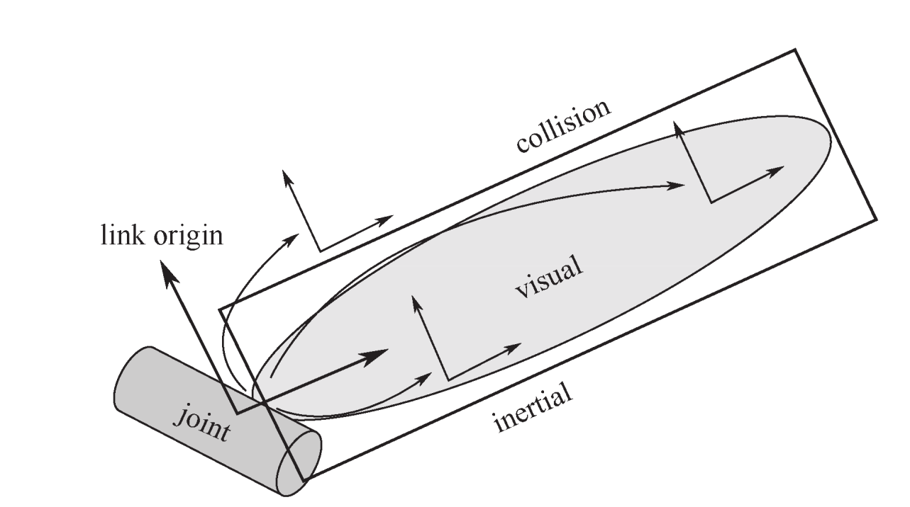

<center>图 6.1 URDF 模型中的 link</center>

其基本的 URDF 描述语法如下：

```xml
<link name="<link name>">
    <inertial> … </inertial>
    <visual> …</visual>
    <collision>… </collision>
</link>
```

<visual>标签用于描述机器人 link 的外观参数，<inertial>标签用于描述 link 的惯性参数，而<collision>标签用于描述 link 的碰撞属性。从图 6.1 可以看到，检测碰撞的 link 区域大于外观可视的区域，这就意味着只要有其他物体与 collision 区域相交，就认为 link 会发生碰撞。

**（2）<joint>标签**

<joint>标签用于描述机器人关节的运动学和动力学属性，包括关节运动的位置和速度限制。根据机器人的关节运动形式，可以将其分为六种类型，如表 6.1 所示。

<center>表 6.1 URDF 模型中的 joint 类型</center>

| 关节类型   | 描述                                              |
| ---------- | ------------------------------------------------- |
| continuous | 旋转关节，可以围绕单轴无限旋转                    |
| revolute   | 旋转关节，类似于 continuous，但是有旋转的角度极限 |
| prismatic  | 滑动关节，沿某一轴线移动的关节，带有位置极限      |
| planar     | 平面关节，允许在平面正交方向上平移或者旋转        |
| floating   | 浮动关节，允许进行平移、旋转运动                  |
| fixed      | 固定关节，不允许运动的特殊关节                    |

 与人的关节一样，机器人关节的主要作用是连接两个刚体的 link，这两个 link 分别称为 parent link 和 child link，如图 6.2 所示。

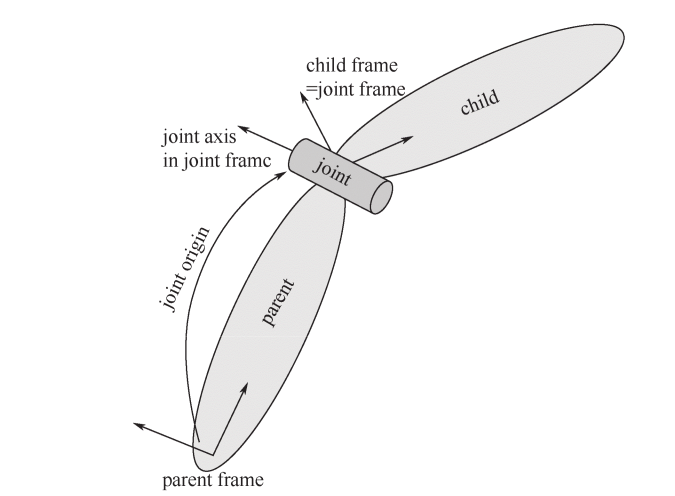

<center>图 6.2 URDF 模型中的 joint</center>

<joint>标签的描述语法如下：

```xml
<joint name="<name of the joint>">
    <parent link="parent_link"/>
    <child link="child_link"/>
    <calibration … />
    <dynamics damping …/>
    <limit effort … />
    ...
</joint>
```

其中必须指定 joint 的 parent link 和 child link，还可以设置关节的其它属性如下：

<calibration>：关节的参考位置，用于校准关节的绝对位置。

<dynamics>：用于描述关节的物理属性，例如阻尼值、物理静摩擦力等，经常在动力学仿真中用到。

<limit>：用于描述运动的一些极限值，包括关节运动的上下限位置、速度限制、力矩限制等。

<mimic>：用于描述该关节与已有关节的关系。

<safety_controller>：用于描述安全控制器参数。

**（3）<robot>标签**

<robot>是完整机器人模型的最顶层标签，<link>和<joint>标签都必须包含在<robot>标签内。如图 6.3 所示，一个完整的机器人模型由一系列<link>和<joint>标签组成。

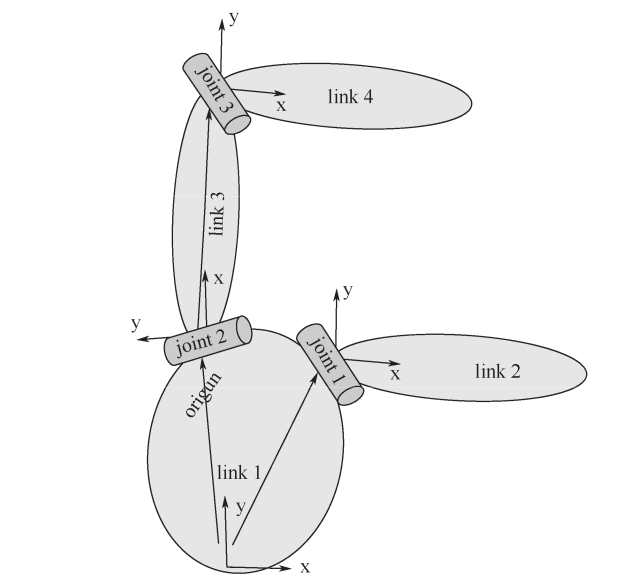

<center>图 6.3 URDF 模型中的 robot</center>

<robot>标签内可以设置机器人的名称，其基本的描述语法如下：

```xml
<robot name="<name of the robot>">
    <link> …</link>
    <link> …</link>
    <joint> …</joint>
    <joint> …</joint>
</robot>
```

**（4）<gazebo>标签**

<gazebo>标签用于描述机器人模型在 Gazebo 中仿真所需要的参数，包括机器人材料的属性、Gazebo 插件等。该标签不是机器人模型必需的部分，只有在 Gazebo 仿真时才需要加入。该标签基本的描述语法如下：

```xml
<gazebo reference="link_1">
	<material>Gazebo/Black</material>
</gazebo>
```

## 6.2 创建与显示 URDF 模型

在 ROS 中，机器人的模型一般放在 RobotName_description 功能包下。下面尝试仿照案例myrobot 机器人从零开始创建一个移动机器人的 URDF 模型。建议读者一定要动手从无到有尝试写一个机器人的 urdf 文件，才能在实践中更加深刻理解 URDF 中坐标、旋转轴、关节类型等关键参数的意义和设置方法。

### 6.2.1 机器人描述功能包

本书配套源码包中已经包含了 myrobot_description 功能包，其中有创建好的机器人模型和配置文件。你也可以使用如下命令创建一个新的功能包：

```bash
catkin_create_pkg myrobot_description urdf xacro
```

myrobot_description 功能包中包含 urdf、meshes、launch 和 config 四个文件夹。

① urdf：用于存放机器人模型的 urdf 或 xacro 文件。

② meshes：用于放置 URDF 中引用的模型渲染文件。

③ launch：用于保存相关启动文件。

④ config：用于保存 rviz 的配置文件。

### 6.2.2 创建 URDF 模型

在之前的学习中，我们已经大致了解了 URDF 模型中常用的标签和语法，接下来使用这些基本语法创建一个如图 6.4 所示的机器人模型，模型文件是 myrobot_description/urdf/myrobot.urdf。

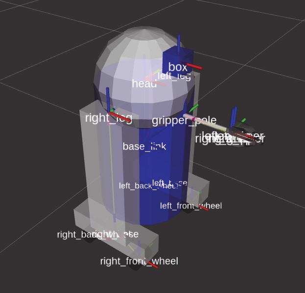

<center>图 6.4 机器人模型</center>

URDF 提供了一些命令行工具，可以帮助我们检查、梳理模型文件，需要在终端中独立安装：

```bash
sudo apt-get install liburdfdom-tools
```

然后使用 check_urdf 命令对 mrobot_chassis.urdf 文件进行检查：

```bash
check_urdf mrobot_chassis.urdf
```

check_urdf 命令会解析 urdf 文件，并且显示解析过程中发现的错误。如果一切正常，在终端中会输出如图 6.5 所示的信息。

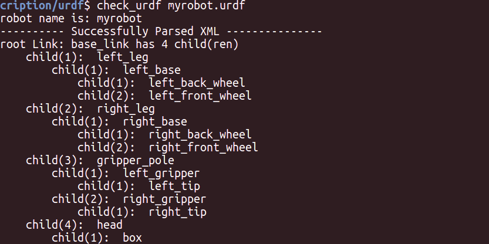

<center>图 6.5 使用 check_urdf 解析 urdf 文件</center>

还可以使用 urdf_to_graphiz 命令查看 URDF 模型的整体结构：

```bash
urdf_to_graphiz myrobot.urdf
```

执行 urdf_to_graphiz 命令后，会在当前目录下生成一个 pdf 文件，打开该文件，可以看到模型的整体结构图，如图 6.6 所示。这个机器人底盘模型有 16 个 link（如图 6.6 中方框表示）和 15个 joint（如图 6.6 中椭圆表示）。


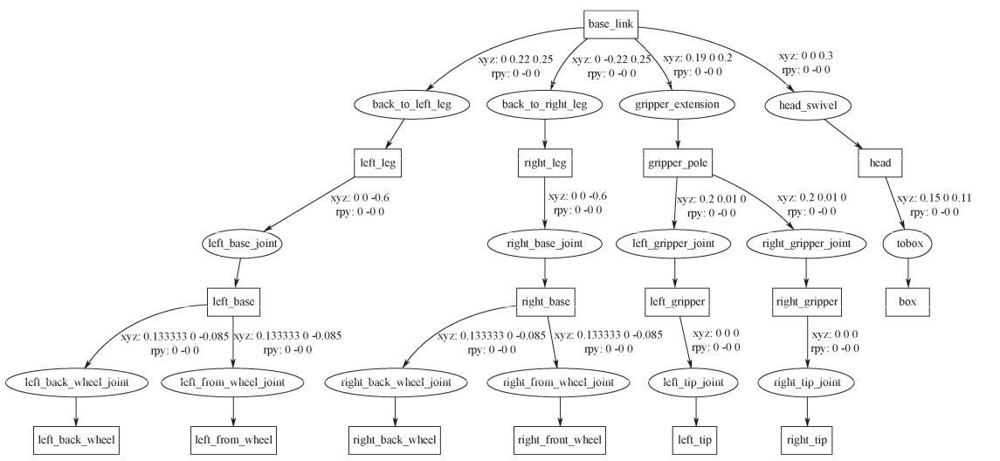

<center>图 6.6 使用 urdf_to_graphiz 命令生成的 URDF 模型整体结构图</center>

### 6.2.3 解析 URDF 模型
针对上面创建的 URDF 模型，下面将对其关键部分进行解析。

```xml
<?xml version="1.0" ?>
<robot name="myrobot">
```

首先需要声明该文件使用 XML 描述，然后使用<robot>根标签定义一个机器人模型，并定义该机器人模型的名称是“myrobot”，根标签内的内容即对机器人模型的详细定义。

```xml
<material name="blue">
	<color rgba="0 0 0.8 1"/>
</material>

<link name="base_link">
    <visual>
        <geometry>
	        <cylinder length="0.6" radius="0.2" />
        </geometry>
    	<material name="blue"/>
    </visual>
</link>
```

上面这一段代码用来描述机器人的底座 link，<visual>标签用来定义底盘的外观属性，在显示和仿真中， Rviz 或 Gazebo 会按照这里的描述将机器人模型呈现出来。我们将机器人底座抽象成一个圆柱结构，使用<cylinder>标签定义这个圆柱的半径和高。此外，使用<material>标签设置机器人底座的颜色——蓝色，在前面单独的<material>标签中设置蓝色的 RGBA 值。

```xml
<joint name="base_to_right_leg" type="fixed">
    <parent link="base_link"/>
    <child link="right_leg"/>
    <origin xyz="0 -0.22 0.25"/>
</joint>
```

以上这段代码定义了第一个关节 joint，用来连接机器人底座和右腿，底座是 parent link，右腿是 child link。 joint 的类型是 fixed 类型，这种类型的 joint 是固定的，不允许关节发生运动。 <origin>标签定义了 child link 相对于 parent link 的三维坐标位置和旋转姿态，xyz 表示在 x 轴、y 轴和 z 轴的坐标位置。

```xml
<link name="right_leg">
    <visual>
        <geometry>
        	<box size="0.6 0.1 0.2" />
        </geometry>
        <origin rpy="0 1.57075 0" xyz="0 0 -0.3"/>
        <material name="white"/>
    </visual>
</link>
```

上面这一段代码描述了右腿的模型。右腿的外形抽象成立方体，立方体的长、宽、高分别为0.6、 0.1 和 0.2；然后使用<origin>标签定义这个右腿立方体在空间内的三维坐标位置和旋转姿态，rpy 表示围绕 x 轴、y 轴和 z 轴的旋转弧度，1.57075 表示围绕 y 轴旋转 90°，xyz 表示在 x 轴、y轴和 z 轴的坐标。下边的描述和机器人底座的类似，定义了右腿的外观颜色。

```xml
<link name="left_gripper">
    <visual>
    <origin rpy="0.0 0 0" xyz="0 0 0"/>
    <geometry>
    	<mesh filename="package://urdf_tutorial/meshes/l_finger.dae"/>
    </geometry>
    </visual>
</link>
```

以上这一段代码中的<mesh>文件来自 PR2，注意明确文件的位置。meshes 可以以多种不同格式导入，STL 非常常见，但引擎也支持 DAE，DAE 可以有自己的颜色数据，这意味着你不必指定颜色/材质。meshes 文件通常位于单独的文件夹中，也会引用文件夹中的.tif 文件。可以使用相对缩放参数或边界框大小调整 mesh 模型大小。

### 6.2.4 在 Rviz 中显示模型

完成 URDF 模型的设计后，可以使用 Rviz 将该模型可视化显示出来，检查是否符合设计目标。在 myrobot_description 功能包的 launch 文件夹中已经创建了用于显示 myrobot 模型的 launch
文件 myrobot_description/launch/display_myrobot_urdf.launch，详细内容如下：

```xml
<launch>
    <arg name="model" default="$(find myrobot_description)/urdf/myrobot.urdf"/>
    <arg name="rvizconfig" default="$(find myrobot_description)/rviz/urdf.rviz"/>
    <param name="robot_description" command="$(find xacro)/xacro $(arg model)"/>
    <node name="joint_state_publisher" pkg="joint_state_publisher_gui" type="joint_state_publisher_gui" />
    <node name="robot_state_publisher" pkg="robot_state_publisher" type="robot_state_publisher" />
    <node name="rviz" pkg="rviz" type="rviz" args="-d $(arg rvizconfig)" required="true" />
</launch>
```

打开终端运行该 launch 文件，如果一切正常，可以在打开的 Rviz 中看到如图 6.7 所示的机器人模型。

```bash
roslaunch myrobot_description display_myrobot_urdf.launch
```

运行成功后，不仅启动了 Rviz，而且出现了一个名为“joint_state_publisher”的 UI。这是因为我们在启动文件中启动了 joint_state_publisher 节点，该节点可以发布每个 joint（除了 fixed 类型）的状态，而且可以通过 UI 对 joint 进行控制。

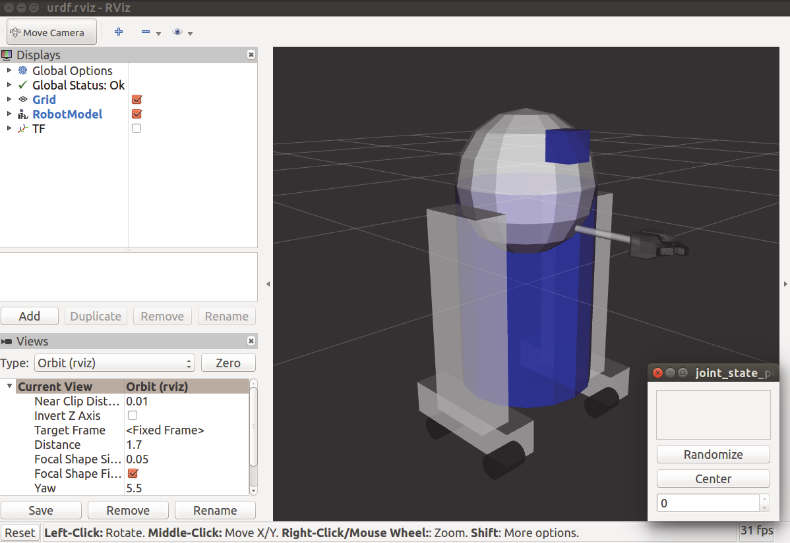

<center>图 6.7 在 Rviz 中显示机器人模型</center>

除了 joint_state_publisher，launch 文件还会启动一个名为“robot_state_publisher”的节点，这两个节点的名称相似，所以很多开发者会混淆两者，分不清楚它们各自的功能。与joint_state_publisher 节点不同，robot_state_publisher 节点的功能是将机器人各个 link、joint 之间的关系，通过 TF 的形式整理成三维姿态信息发布出去。在 Rviz 中，可以选择添加 TF 插件来显示各部分的坐标系（见图 6.4）。

### 6.2.5 让机器人动起来

前面机器人的关节 joint 类型都是 fixed，故机器人是不能动的。如表 6.1 所示，让机器人动起来最关键的是改变关节 joint 类型。下面我们来探索另外几种重要的机器人关节类型以及它们的实现方法。

**（1）the head 的 continuous 关节**

机器人的身体和头部之间的连接是一个连续的关节，这意味着它可以从负无穷大到正无穷大呈任意角度。车轮也是这样建模的，因此它们可以永远在两个方向上滚动。我们需要添加的唯一附加信息是旋转轴<axis>，这里由 xyz 三元组指定，它指定头部围绕其旋转的向量。因为我们希望它绕 z 轴旋转，所以我们指定了向量“0 0 1”。

```xml
<joint name="head_swivel" type="continuous">
    <parent link="base_link"/>
    <child link="head"/>
    <axis xyz="0 0 1"/>
    <origin xyz="0 0 0.3"/>
</joint>
```

**（2）gripper 的 revolute 关节**

左右夹持器关节均建模为旋转关节。这意味着它们的旋转方式与连续运动类型相同，但有严格的限制。因此，我们必须指定关节上限和下限（以弧度为单位）的限制标记，还必须指定此关节的最大速度和作用力，但实际值与我们的目的无关。

```xml
<joint name="left_gripper_joint" type="revolute">
    <axis xyz="0 0 1"/>
    <limit effort="1000.0" lower="0.0" upper="0.548" velocity="0.5"/>
    <origin rpy="0 0 0" xyz="0.2 0.01 0"/>
    <parent link="gripper_pole"/>
    <child link="left_gripper"/>
</joint>
```

**（3）gripper ARM 的 prismatic 标签**

夹持臂是一种不同类型的关节，即棱柱关节。这意味着它沿着轴移动，而不是围绕轴移动。这种平移运动使我们的机器人模型能够伸展和缩回其夹持臂。夹持臂的限制以与旋转关节相同的方式指定，但单位为米，而不是弧度。

```xml
<joint name="gripper_extension" type="prismatic">
    <parent link="base_link"/>
    <child link="gripper_pole"/>
    <limit effort="1000.0" lower="-0.38" upper="0" velocity="0.5"/>
    <origin rpy="0 0 0" xyz="0.19 0 0.2"/>
</joint>
```

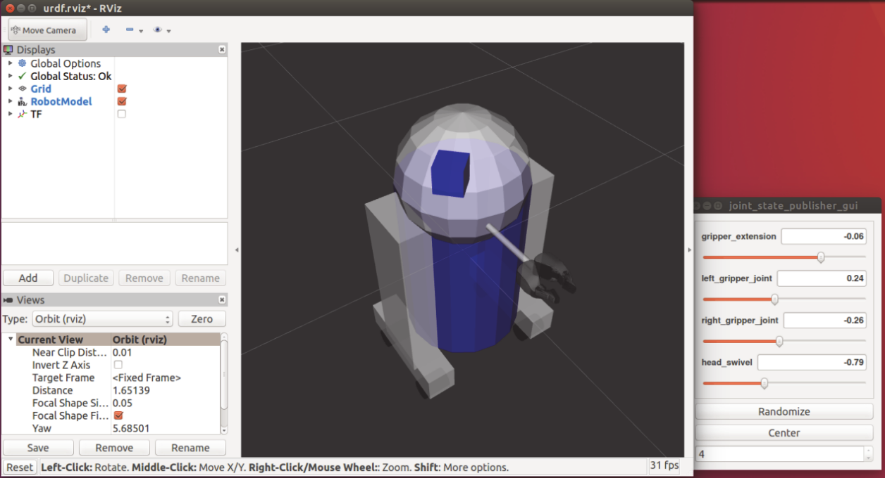

<center>图 6.8 在 Rviz 中控制机器人模型关节运动</center>

在 GUI 中移动滑块时，模型将在 Rviz 中移动。这是怎么做到的呢？首先，GUI 解析 urdf 文件并找到所有非固定关节及其限制。然后，它使用滑块的值发布 sensor_msgs/JointState 消息。再然后，robot_state_publisher 使用这些数据计算不同部件之间的所有变换。最后，生成的变换树用于显示 Rviz 中的所有形状。

## 6.3 添加碰撞和物理属性

在之前的模型中，我们仅创建了模型外观的可视化属性，除此之外，还需要添加碰撞属性和物理属性。

**（1）碰撞属性**

到目前为止，我们只设置了 link 的 visual 标签，定义了机器人的外观。然而，为了在机器人工作或者仿真中实现碰撞检测，我们还需要定义碰撞标签<collision>。下面是具有碰撞标签的新URDF 模型，以 base-link 为例。

```xml
<link name="base_link">
    <visual>
        <geometry>
            <cylinder length="0.6" radius="0.2"/>
        </geometry>
        <material name="blue">
            <color rgba="0 0 0.8 1"/>
        </material>
    </visual>
    <collision>
        <geometry>
        	<cylinder length="0.6" radius="0.2"/>
        </geometry>
    </collision>
</link>
```

注意以下几点：

① collision 标签直接放在 link 下，与 visual 标签同等级。

② collision 标签定义其形状的方式与 visual 标签相同，带有几何图形标签<geometry>。

③ collision 标签可以设置子标签<origin>，与 visual 标签相同。

在很多情况下， collision 标签和 visual 标签定义的 visual 和 origin 相同，但是有两种情况会不同：

① 更快的处理——对两个 meshes 进行碰撞检测比对两个简单几何体进行碰撞检测要复杂得多。因此，可以在碰撞元素中使用更简单的几何体替换 meshes。

② 安全区——希望限制靠近敏感设备的移动。例如，如果我们不希望任何东西与机器人的头部发生碰撞，我们可以将碰撞几何体定义为一个包围其头部的圆柱体，以防止任何东西靠近其头部。

**（2）物理属性**

为了让模型正确仿真，需要定义机器人的几个物理属性，即 Gazebo 等物理引擎需要的属性。

① 惯性（inertia） 每个被仿真的 link 都需要一个惯性标签。同样以 base-link 为例。

```xml
<link name="base_link">
    ...
    <inertial>
        <mass value="10"/>
        <inertia ixx="0.4" ixy="0.0" ixz="0.0" iyy="0.4" iyz="0.0" izz="0.2"/>
    </inertial>
</link>
```

说明如下：

A. 此标签与 visual 标签同等级。

B. 质量以千克为单位。

C. 3×3 转动惯量矩阵由惯性元素指定。由于这是对称的，因此只能用 6 个元素来表示，如式（6.1）所示。具体的物理含义是惯性张量，对角元素是分别对 X、Y、Z 三轴的转动惯量，非对角元素称为惯量积。矩阵用于物体对其旋转运动的惯性大小的度量。

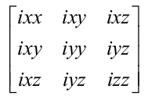   （6.1）

D. 可以指定<origin>子标签，以指定重心和惯性参照系（相对于 link 的参照系）。

E. 使用实时控制器时，零（或几乎为零）的惯性标签可能会导致机器人模型在没有警告的情况下崩溃，并且所有 link 都将显示其原点与世界原点重合。

② 接触系数（contact_coefficients） 还可以定义 link 彼此接触时的行为方式。这是通过名为contact_coefficients 的碰撞标签的子标签完成的，有三个属性需要指定：mu——摩擦系数，kp——刚体系数，kd——阻尼系数。

③ 关节动力学（Joint Dynamics）

关节的移动方式由关节的动力学标记定义。这里有两个属性，如果未指定，这些系数默认为零。

A. 摩擦（friction）：物理静态摩擦。对于棱柱关节，单位为牛顿。对于旋转关节，单位为牛顿米。

B. 阻尼（damping）：物理阻尼值。对于棱柱关节，单位为牛顿秒每米。对于旋转关节，单位为牛顿米秒每弧度。

## 6.4 xacro 文件简化 URDF 模型

回顾现在的机器人模型，我们似乎创建了一个十分冗长的模型文件，其中有很多内容，除了参数，几乎都是重复的。但是 urdf 文件并不支持代码复用的特性，如果为一个复杂的机器人建模，那么它的 urdf 文件会很复杂。

ROS 当然不会容忍这种冗长、重复的情况，因为它的设计目标就是提高代码的复用率。于是，针对 URDF 模型产生了另外一种精简化、可复用、模块化的描述形式——xacro，它具备以下几点突出的优势。

精简模型代码：xacro 是一个精简版本的 urdf 文件，在 xacro 文件中，可以通过创建宏定义的方式定义常量或者复用代码，不仅可以减少代码量，还可以让模型代码更加模块化，更具可读性。

提供可编程接口： xacro 的语法支持一些可编程接口，如常量、变量、数学公式、条件语句等，可以让建模过程更加智能、有效。

xacro 是 urdf 的升级版，模型文件的后缀名由.urdf 变为.xacro，而且在模型<robot>标签中需要加入 xacro 的声明：

```xml
<?xml version="1.0"?>
<robot name="macroed" xmlns:xacro="http://ros.org/wiki/xacro">
```

**（1）使用常量定义**

在之前的 URDF 模型中有很多尺寸、坐标等常量的使用，但是这些常量分布在整个文件中，不仅可读性差，而且后期修改时十分困难。xacro 提供了一种常量属性的定义方式：

```xml
<xacro:property name="M_PI" value="3.14159"/>
```

当需要使用该常量时，使用如下语法调用即可：

```xml
<origin xyz="0 0 0" rpy="${M_PI/2} 0 0" />
```

现在，各种参数的定义都可以使用常量定义的方式进行声明：

```xml
<xacro:property name="width" value="0.2" />
<xacro:property name="leglen" value="0.6" />
<xacro:property name="polelen" value="0.2" />
<xacro:property name="bodylen" value="0.6" />
<xacro:property name="baselen" value="0.4" />
<xacro:property name="wheeldiam" value="0.07" />
<xacro:property name="pi" value="3.1415" />
```

如果改动机器人模型，只需要修改这些参数即可，十分方便。

**（2）调用数学公式**

在“${}”语句中，不仅可以调用常量，还可以使用一些常用的数学运算，包括加、减、乘、除以及负号和括号等，例如：

```xml
<cylinder radius="${wheeldiam/2}" length="0.1"/>
```

所有数学运算都会转换成浮点数进行，以保证运算的精度。

**（3）使用宏定义**

xacro 文件可以使用宏定义来声明重复使用的代码模块，还可以包含输入参数，类似编程中的函数概念。比如一辆车有四个轮子，我们写一个轮子的定义就够了，其他只是参数的不同。我们看一下，利用前文中机器人的两条腿，来实现代码复用，代码如下：

```xml
<xacro:macro name="leg" params="prefix reflect">
    <link name="${prefix}_leg">
        <visual>
            <geometry>
                <box size="${leglen} 0.1 0.2"/>
            </geometry>
            <origin xyz="0 0 -${leglen/2}" rpy="0 ${pi/2} 0"/>
            <material name="white"/>
        </visual>
        <collision>
            <geometry>
                <box size="${leglen} 0.1 0.2"/>
            </geometry>
            <origin xyz="0 0 -${leglen/2}" rpy="0 ${pi/2} 0"/>
        </collision>
        <xacro:default_inertial mass="10"/>
    </link>
    <joint name="base_to_${prefix}_leg" type="fixed">
        <parent link="base_link"/>
        <child link="${prefix}_leg"/>
        <origin xyz="0 ${reflect*(width+.02)} 0.25" />
    </joint>
    <!-- A bunch of stuff cut -->
</xacro:macro>
```

以上宏定义中包含 2 个输入参数：prefix 和 reflect。使用名称前缀 prefix 命名两个相似的物体，使用镜像参数 reflect，用 1 和-1 实现两条腿对称。需要该宏定义模块时，使用如下语句调用，设置输入参数即可：

```XML
<xacro:leg prefix="right" reflect="1" />
<xacro:leg prefix="left" reflect="-1" />
```

如果传入的参数为属性块，需要在参数栏对应参数名称前添加“*”号。在对应的宏定义模块中，插入属性块部分需要使用 insert_block 命令。

```XML
<xacro:macro name="blue_shape" params="name *shape">
    <link name="${name}">
        <visual>
            <geometry>
                <xacro:insert_block name="shape" />
            </geometry>
            <material name="blue"/>
        </visual>
        <collision>
            <geometry>
                <xacro:insert_block name="shape" />
            </geometry>
        </collision>
    </link>
</xacro:macro>
```

在定义 blue_shape 的时候，由于传入的参数为属性块，需要在参数栏对应参数名字 shape 前添加“*”号。同样插入属性块部分时需要使用 insert_block 命令：

```XML
<xacro:insert_block name="shape" />
```

在使用 blue_shape 宏定义的时候，需要传入两个参数，一个是 name，一个是从属性块*shape。如下所示：

```XML
<xacro:blue_shape name="base_link">
	<cylinder radius=".42" length=".01" />
</xacro:blue_shape>
```

**（4）xacro 文件引用**

xacro 文件引用时，需要首先包含被引用文件，类似于 C 语言中的 include 文件。声明包含关系后，该文件就可以使用被包含文件中的模块了。如下所示：

```XML
<xacro:include filename="$(find myrobot_description)/urdf/myrobot.urdf.xacro" />
```

**（5）显示 xacro 模型**

使用命令行可以直接将 xacro 文件解析为 urdf 文件。

```bash
rosrun xacro xacro --inorder myrobot.urdf.xacro > myrobot.urdf
```

当前目录下会生成一个转换后的 urdf 文件，然后使用上面介绍的 launch 文件可将该 URDF 模型显示在 Rviz 中。

也可以省略手动转换模型的过程，直接在 launch 文件中调用 xacro 解析器，自动将 xacro 转换成 urdf 文件。详见文件 display_myrobot_xacro.launch：

```xml
<param name="robot_description" command="$(find xacro)/xacro --inorder '$(find myrobot_description)/urdf/myrobot.urdf.xacro'" />

# 或者

<arg name="model" default="$(find myrobot_description)/urdf/myrobot.urdf.xacro"/>
<param name="robot_description" command="$(find xacro)/xacro $(arg model)"/>
```

## 6.5 添加传感器模型

通常，室内移动机器人会装配彩色摄像头、RGB-D 摄像头、激光雷达等传感器，也许现实中我们无法拥有这些传感器，但是在虚拟的机器人模型世界里我们可以创造一切。

### 6.5.1 添加摄像头

首先尝试创建一个摄像头的模型。笔者仿照真实摄像头画了一个正方体，以此代表摄像头模型。对应的模型文件是 myrobot_description/urdf/camera.xacro：

```xml
<?xml version="1.0"?>
<robot
    xmlns:xacro="http://www.ros.org/wiki/xacro" name="camera">
    <xacro:macro name="usb_camera" params="prefix:=camera">
        <link name="${prefix}_link">
            <visual>
                <geometry>
                    <box size="0.08 0.08 0.08"/>
                </geometry>
                <material name="blue"/>
            </visual>
        </link>
    </xacro:macro>
</robot>
```

以上代码中使用了一个名为 usb_camera 的宏来描述摄像头，输入参数是摄像头的名称，宏中包含了表示摄像头长方体 link 的参数。

然后还需要创建一个顶层 xacro 文件，把机器人和摄像头这两个模块拼装在一起。顶层 xacro文件 myrobot_description/urdf/myrobot_with_camera.xacro 的内容如下：

```xml
<?xml version="1.0"?>
<robot
    xmlns:xacro="http://www.ros.org/wiki/xacro" name="myrobot">
    <xacro:include filename="$(find myrobot_description)/urdf/myrobot_body.xacro"/>
    <xacro:include filename="$(find myrobot_description)/urdf/camera.xacro" />
    <xacro:myrobot_body/>
    <joint name="camera_joint" type="fixed">
        <origin xyz="0.15 0 0.11" />
        <parent link="head"/>
        <child link="camera_link"/>
    </joint>
    <xacro:usb_camera prefix="camera"/>
</robot>
```

在这个顶层 xacro 文件中，包含了描述摄像头的模型文件，然后使用一个 fixed 类型的 joint把摄像头固定在机器人顶部靠前的位置。

运行如下命令，在 Rviz 中查看安装有摄像头的机器人模型，如图 6.9 所示。

```bash
roslaunch myrobot_description display_myrobot_with_camera.launch
```

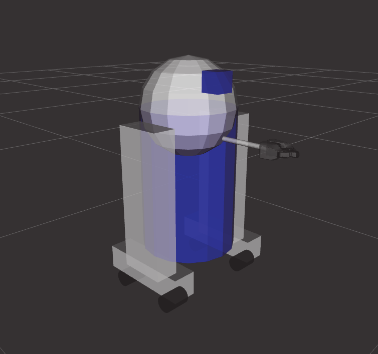

<center>图 6.9 安装有摄像头的机器人模型</center>

此时，你可能会想：这样的摄像头模型，会不会太简单了！不要着急，一会儿在 Gazebo 中仿真时，你就会发现这个黑方块是“简约而不简单”。另外，也可以在 SolidWorks 等软件中创建更加形象、具体的传感器模型，然后转换成 URDF 模型格式装配到机器人上。

### 6.5.2 添加 Kinect

Kinect 是一种常用的 RGB-D 摄像头，三维模型文件 kinect.dae 可以在 TurtleBot 功能包中找到。Kinect 模型描述文件 myrobot_description/urdf/kinect.xacro 的内容如下：

```xml
<?xml version="1.0"?>
<robot
    xmlns:xacro="http://www.ros.org/wiki/xacro" name="kinect_camera">
    <xacro:macro name="kinect_camera" params="prefix:=camera">
        <link name="${prefix}_link">
            <origin xyz="0 0 0" rpy="0 0 0"/>
            <visual>
                <origin xyz="0 0 0" rpy="0 0 ${M_PI/2}"/>
                <geometry>
                    <mesh filename="package://myrobot_description/meshes/kinect.dae" />
                </geometry>
            </visual>
            <collision>
                <geometry>
                    <box size="0.07 0.3 0.09"/>
                </geometry>
            </collision>
        </link>
        <joint name="${prefix}_optical_joint" type="fixed">
            <origin xyz="0 0 0" rpy="-1.5708 0 -1.5708"/>
            <parent link="${prefix}_link"/>
            <child link="${prefix}_frame_optical"/>
        </joint>
        <link name="${prefix}_frame_optical"/>
    </xacro:macro>
</robot>
```

在可视化设置中使用<mesh>标签可以导入该模型的 mesh 文件，使用<collision>标签可将模型简化为一个长方体，精简碰撞检测的数学计算。

然后将 Kinect 和机器人拼装到一起，顶层 xacro 文件 myrobot_description/launch/myrobot_with_kinect.xacro 的内容如下：

```xml
<?xml version="1.0"?>
<robot
    xmlns:xacro="http://www.ros.org/wiki/xacro" name="myrobot">
    <xacro:include filename="$(find myrobot_description)/urdf/myrobot_body.xacro"/>
    <xacro:include filename="$(find myrobot_description)/urdf/kinect.xacro" />
    <xacro:myrobot_body/>
    <joint name="camera_joint" type="fixed">
        <origin xyz="0 0 0.21" />
        <parent link="head"/>
        <child link="camera_link"/>
    </joint>
    <xacro:kinect_camera prefix="camera"/>
</robot>
```

运行如下命令，即可在 Rviz 中看到安装有 Kinect 的机器人模型，如图 6.10 所示。

```bash
roslaunch myrobot_description display_myrobot_with_kinect.launch
```

### 6.5.3 添加激光雷达

使用类似的方式还可以为机器人添加一个激光雷达模型，这里不再赘述，你可以参考本书配套 源 码 中 激 光 雷 达 的 模 型 文 件 myrobot_description/urdf/rplidar.xacro ， 顶 层 xacro 文 件 为myrobot_description/launch/myrobot_with_rplidar.xacro。

运行以下命令，即可看到安装有激光雷达的机器人模型，如图 6.11 所示。

```bash
roslaunch myrobot_description display_myrobot_with_rplidar.launch
```


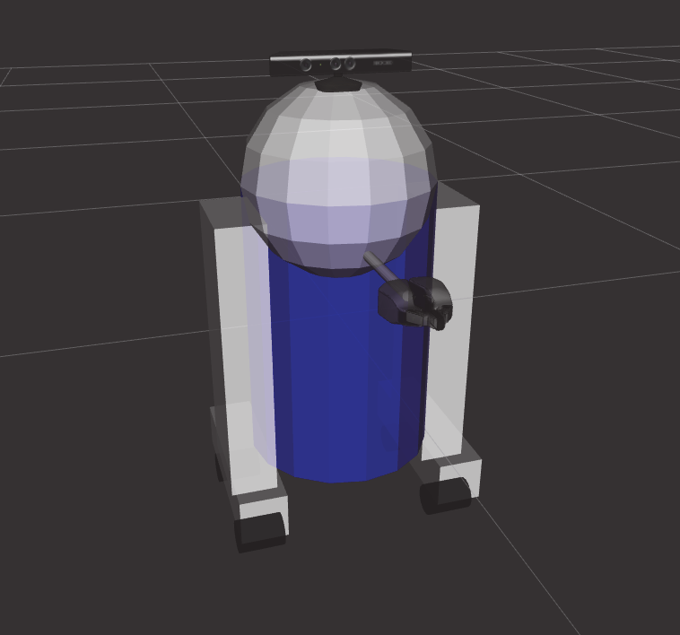

<center>图 6.10 安装有 Kinect 的机器人模型</center>

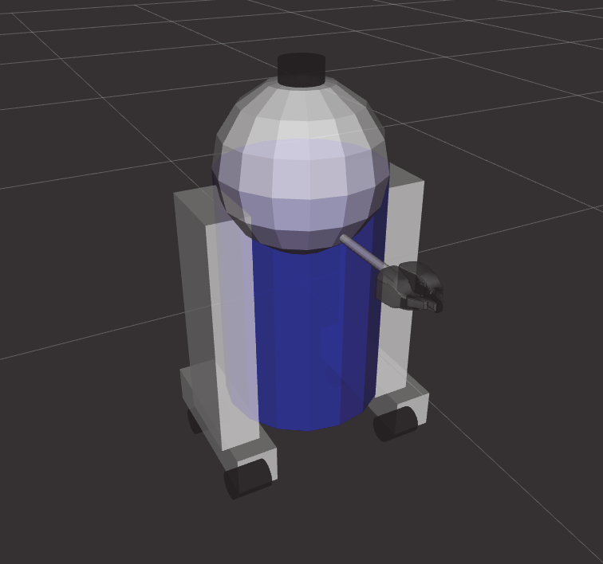

<center>图 6.11 安装有激光雷达的机器人模型</center>

现在机器人模型已经创建完成，为了实现机器人仿真，还需要想办法控制机器人在仿真环境中的运动。另外，如果仿真环境中的传感器可以像真实设备一样获取周围的信息就更好了。别着急，这些功能本章都会实现，我们先来学习如何在 Rviz 中搭建一个简单的运动仿真环境。

## 6.6 ArbotiX+Rviz 机器人运动仿真

ArbotiX 是一款控制电机、舵机的控制板，并提供相应的 ROS 功能包，但是这个功能包不仅可以驱动真实的 ArbotiX 控制板，它还提供一个差速控制器，通过接收速度控制指令更新机器人的 joint 状态，从而帮助我们实现机器人在 Rviz 中的运动。

本节将为机器人模型配置 ArbotiX 差速控制器，配合 Rviz 创建一个简单的仿真环境。

### 6.6.1 安装 ArbotiX

在Noetic版本的 ROS 软件源中已经集成了 ArbotiX 功能包的二进制安装文件，可以使用如下命令进行安装：

```bah
sudo apt-get install ros-noetic-arbotix-* -y
```

### 6.6.2 配置 ArbotiX 控制器

ArbotiX 功能包安装完成后，就可以针对机器人模型进行配置了。配置步骤较为简单，不需要修改机器人的模型文件，只需要创建一个启动 ArbotiX 节点的 launch 文件，再创建一个与控制器相关的配置文件即可。

**（1）创建 launch 文件**

以 装 配 了 Kinect 的 机 器 人 模 型 为 例 ， 创 建 启 动 ArbotiX 节 点 的 launch 文 件myrobot_description/launch/arbotix_myrobot_with_kinect.launch，代码如下：

```xml
<launch>
    <param name="/use_sim_time" value="false" />
    <!-- 加载机器人 URDF/xacro 模型 -->
    <arg name="urdf_file" default="$(find xacro)/xacro --inorder '$(find myrobot_description)/urdf/myrobot_with_kinect.xacro'" />
    <arg name="gui" default="false" />
    <param name="robot_description" command="$(arg urdf_file)" />
    <param name="use_gui" value="$(arg gui)"/>
    <node name="arbotix" pkg="arbotix_python" type="arbotix_driver" output="screen">
        <rosparam file="$(find myrobot_description)/config/fake_myrobot_arbotix.yaml" command="load" />
        <param name="sim" value="true"/>
    </node>
    <node name="joint_state_publisher" pkg="joint_state_publisher" type="joint_state_publisher" />
    <node name="robot_state_publisher" pkg="robot_state_publisher" type="robot_state_publisher">
        <param name="publish_frequency" type="double" value="20.0" />
    </node>
    <node name="rviz" pkg="rviz" type="rviz" args="-d $(find myrobot_description)/config/myrobot_arbotix.rviz" required="true" />
</launch>
```

这个 launch 文件和之前显示机器人模型的 launch 文件几乎一致，只是添加了启动 arbotix_driver节点的相关内容：

```xml
<node name="arbotix" pkg="arbotix_python" type="arbotix_driver" output="screen">
    <rosparam file="$(find myrobot_description)/config/fake_myrobot_arbotix.yaml" command="load" />
    <param name="sim" value="true"/>
</node>
```

arbotix_driver 可以针对真实控制板进行控制，也可以在仿真环境中使用，需要配置“sim”参数为 true。另外，该节点的启动还需要加载与控制器相关的配置文件，该配置文件在功能包的 config路径下。

**（2）创建配置文件**

配置文件 myrobot_description/config/fake_myrobot_arbotix.yaml 的内容如下：

```xml
controllers: {
	base_controller: {type: diff_controller, base_frame_id: base_link, base_width:0.4, ticks_meter: 4100, Kp: 12, Kd: 12, Ki: 0, Ko: 50, accel_limit: 1.0 }
}
```

控制器命名为 base_controller，类型是 diff_controller，也就是差速控制器，刚好可以控制机器人模型的双轮差速运动。此外，还需要配置参考坐标系、底盘尺寸、PID 控制等参数。

### 6.6.3 运行仿真环境

完成上述配置后，ArbotiX+Rviz 的仿真环境就搭建完成了，通过以下命令即可启动该仿真环境：

```bash
roslaunch myrobot_description arbotix_myrobot_with_kinect.launch
```

启动成功后，可以看到机器人模型已经在 Rviz 中准备就绪，如图 6.12 所示。

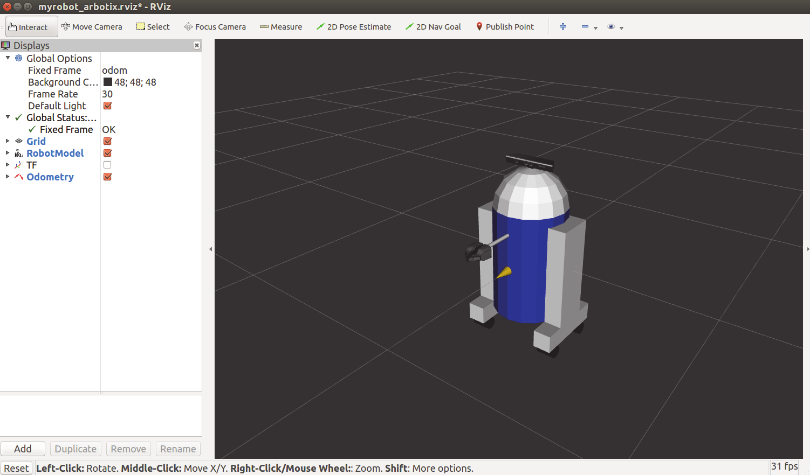

<center>图 6.12 基于 Rviz 和 ArbotiX 的仿真环境</center>

查看当前 ROS 系统中的话题列表（见图 6.13），cmd_vel 话题赫然在列，如果你还记得小海龟例程，当时使用的就是该 topic 控制小海龟运动的。类似地，arbotix_driver 节点订阅 cmd_vel 话题，然后驱动模型运动。

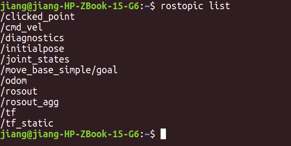

<center>图 6.13 查看 ROS 系统中的话题列表</center>

输入以下命令运行键盘控制程序，然后在终端中根据提示信息点击键盘，就可以控制 Rviz 中的机器人模型运动了。

```bash
roslaunch myrobot_teleop myrobot_teleop.launch
```

如图 6.14 所示，Rviz 中的机器人模型已经按照速度控制指令开始运动，箭头代表机器人运动过程中的姿态。

此时，Rviz 中设置的“Fixed Frame”是 odom，也就是机器人的里程计坐标系。这是一个全局坐标系，通过里程计记录机器人当前的运动位姿，从而更新 Rviz 中的模型状态。ArbotiX 的机器人仿真只是模拟了机器人的 base_link 相对于 odom 的 TF 变换，并没有实际控制轮子转动。用rqt_graph 命令查看此时的节点结构图，如图 6.15 所示。


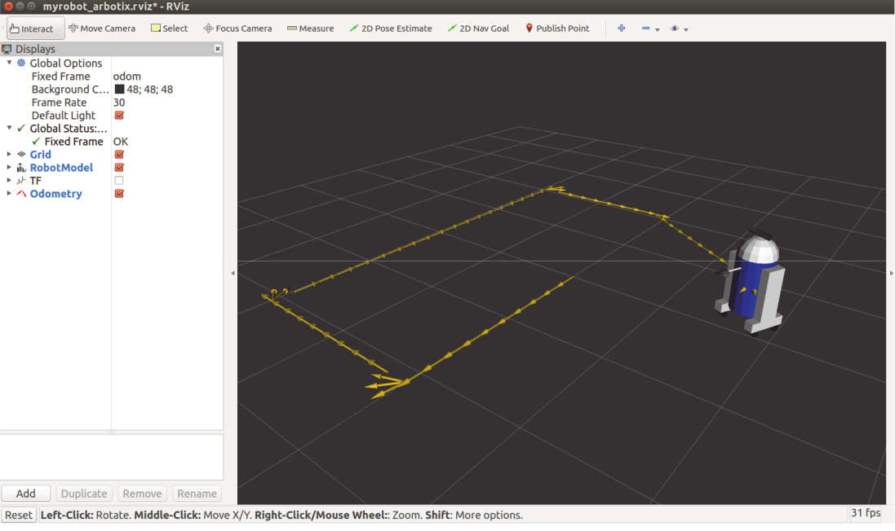

<center>图 6.14 Rviz 中的机器人模型根据指令开始运动</center>

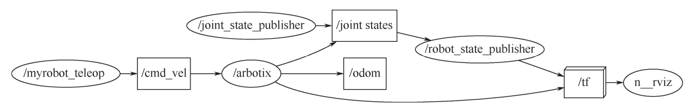

<center>图 6.15 ArbotiX+Rviz 仿真节点结构图</center>

ArbotiX+Rviz 可以构建一个较为简单的运动仿真器，在本书后续内容中还会多次使用这个仿真器实现导航等功能。除此之外，我们在第 3 章介绍过的物理仿真平台——Gazebo，可以做到类似真实机器人的高度仿真状态，包括物理属性、传感器数据、环境模型等。

在真正学习、使用 Gazebo 之前，首先要对这里使用的 ArbotiX 差速控制器做一个升级，为Gazebo 仿真做好准备。

## 6.7 ros_control

上一节 ArbotiX+Rviz 实现的机器人运动仿真中所用到的 ArbotiX 差速控制器有很大的局限性，无法在 ROS 丰富的机器人应用中通用。如图 6.16 所示，如果要将 SLAM、导航、MoveIt！等功能包应用到机器人模型甚至真实机器人之上时，应该如何实现这其中的控制环节呢？

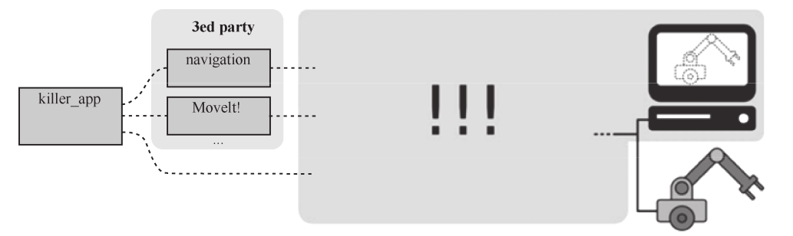

<center>图 6.16 真实机器人/仿真模型与应用功能包之间缺少控制环节</center>

ros_control 就是 ROS 为开发者提供的机器人控制的中间件，包含一系列控制器接口、传动装置接口、硬件接口、控制器工具箱等，可以帮助机器人应用功能包快速应用到真实机器人上，提高开发效率。ros_control 起源于 PR2 机器人控制器，对其进行重写后使之适用于所有机器人。由支持 ros_control 的移动底座和机械臂组成的机器人不需要编写任何附加代码，只要设置好几个控制器的配置文件，就可以自主导航并为机械臂进行路径规划。ros_control 还提供多个库以支持编写自定义控制器。

### 6.7.1 ros_control 框架

如图 6.17 是所示 ros_control 的总体框架，针对不同类型的机器人（移动机器人、机械臂等），ros_control 可以提供多种类型的控制器（controller），但是这些控制器的接口各不相同。

图 6.18 是 ros_control 的数据流图，ros_control 功能包将来自机器人执行器、编码器和输入设置点的联合状态数据作为输入。它使用通用的控制回路反馈机制（通常是 PID 控制器）来控制发送到执行器的输出（通常是作用力）。对于没有一对一映射关系的关节位置、作用力等的物理机制而言，ros_control 变得更加复杂，但这些场景可以使用传动系统（transmissions）进行考虑。

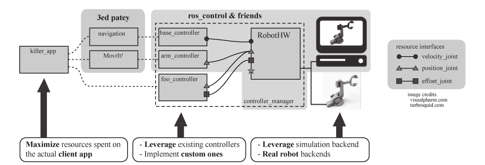

<center>图 6.17 ros_control 的总体框架</center>

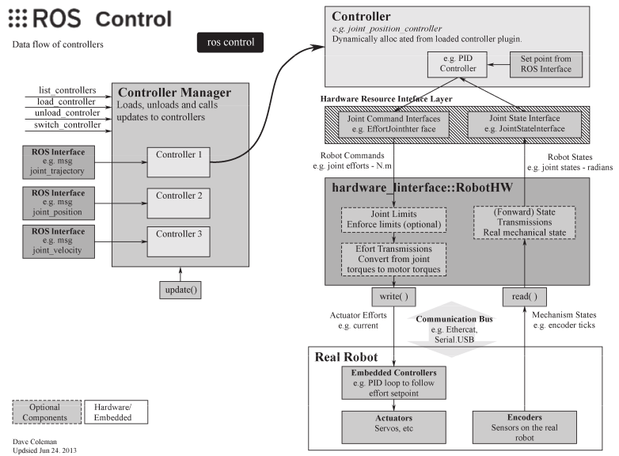

<center>图 6.18 ros_control 的数据流图</center>

**（1）控制器管理器（Controller Manager）**

每个机器人可能有多个控制器，所以这里有一个控制器管理器的概念，提供一种通用的接口来管理不同的控制器。控制器管理器的输入就是 ROS 上层应用功能包的输出。

**（2）控制器（Controller）**

控制器可以完成每个 joint 的控制，读取硬件资源接口中的状态，再发布控制命令，并且提供PID 控制器。

**（3）硬件资源（Hardware Resource）**

为上下两层提供硬件资源的接口。

**（4）机器人硬件抽象（RobotHW）**

为了提高代码的复用率，ros_control 提供一个硬件抽象层，负责机器人硬件资源的管理，而controller 从硬件抽象层请求资源即可，并不直接接触硬件。机器人硬件抽象层通过 write 和 read方法完成硬件操作，这一层也包含关节约束、力矩转换、状态转换等功能。

**（5）真实机器人（Real Robot）**

真实机器人上也需要有自己的嵌入式控制器，将接收到的命令反映到执行器上，比如接收到旋转 90°的命令后，就需要让执行器快速、稳定地旋转 90°。

### 6.7.2 ros_control 安装

在 Ubuntu 系统中，可以通过以下命令安装 ros_control：

```bash
sudo apt-get install ros-kinetic-ros-control ros-kinetic-ros-controllers
```

### 6.7.3 控制器

目前 ros_controllers 功能包提供了以下类型的控制器，你也可以创建自己的控制器，并且不限于下面列出的控制器。所有控制器都使用 forward_command_controller 向硬件接口发送命令。

① effort_controllers：发送期望的作用力/转矩给关节。
A. joint_effort_controller。
B. joint_position_controller。
C. joint_velocity_controller。

② joint_state_controller：发布注册到 hardware_interface::JointStateInterface 的所有资源状态到一个话题（topic），消息类型为 sensor_msgs/JointState。

③ position_controllers：同时设置一个或多个关节位置。
A. joint_position_controller。
B. Joint_group_position_controller。

④ velocity_controllers：同时设置一个或多个关节速度。
A. joint_velocity_controller。
B. joint_group_velocity_controller。

⑤ joint_trajectory_controllers：用于拼接整个轨迹的额外功能。
A. position_controller。
B. velocity_controller。
C. effort_controller。
D. position_velocity_controller。
E. position_velocity_acceleration_controller。

当然，我们也可以根据自己的需求创建需要的控制器，然后通过控制器管理器来管理自己创建的控制器。创建控制器的具体方法可以参考 WIKI：https://github.com/ros-controls/ros_control/wiki/controller_interface。

### 6.7.4 硬件接口

硬件接口是控制器和硬件进行沟通的接口，用来发送和接收硬件命令，同样可以自己创建需要的硬件接口，具体实现方法可以参考 WIKI：https://github.com/ros-controls/ros_control/wiki/hardware_interface。目前可用的硬件接口（通过硬件资源管理器）如下。

① 关节命令接口：硬件接口支持控制一组关节，注意到这些命令可以有任何语义，只要它们每个可以表示为单对，它们就不一定是作用力命令。要明确命令的含义，参阅以下派生类：
A. 作用力关节接口：控制作用力型关节。
B. 速度关节接口：控制速度型关节。
C. 位置关节接口：控制位置型关节。

② 关节状态接口：支持读取一组指定关节状态的硬件接口，状态包括位置、速度、作用力（力或力矩）。

③ 执行器状态接口：支持读取一组指定执行器状态的硬件接口，状态包括位置、速度、作用力（力或力矩）。

④ 执行器命令接口。
A. 作用力执行器接口。
B. 速度执行器接口。
C. 位置执行器接口。

⑤ 力转矩传感器接口。

⑥ IMU 传感器接口。

### 6.7.5 传动装置

传动装置（Transmission）是 URDF 机器人描述模型的扩展，用于描述执行器和关节之间的关系。传动装置传输作用力/流量，使产出/功率保持不变。多个执行器可能通过复杂的传动装置与多个关节相连。

**（1）传动装置 URDF 格式**

下面是传动装置的 URDF 格式示例：

```xml
<transmission name="simple_trans">
    <type>transmission_interface/SimpleTransmission</type>
    <joint name="foo_joint">
        <hardwareInterface>EffortJointInterface</hardwareInterface>
    </joint>
    <actuator name="foo_motor">
        <mechanicalReduction>50</mechanicalReduction>
        <hardwareInterface>EffortJointInterface</hardwareInterface>
    </actuator>
</transmission>
```

其中，标签<joint>（一个或多个）指定传动装置连接的关节，子标签<hardwareInterface>（一个或多个）指定一个支持的关节硬件接口，注意：当这个标签的值是 EffortJointInterface 时传动装置加载到 Gazebo，或者是 hardware_interface/EffortJointInterface 时传动装置加载到 RobotHW。标签<actuator>（一个或多个）指定传动装置连接的执行器，子标签<mechanicalReduction>（可选）指定关节/执行器传输时的机械减速，子标签<hardwareInterface>（可选）（一个或多个）指定一个支持的关节硬件接口。

**（2）传动装置接口**

传动装置特定代码在一个统一接口下实现双向的（执行器和关节）作用力和流量图，且是与硬件接口无关的。目前可用的传动装置类型如下：

① Simple Reduction Transmission——简单减速传动装置。

② Differential Transmission——差速传动装置。

③ Four Bar Linkage Transmission——四连杆传动装置。

用法：
① transmission_interface::ActuatorToJointStateInterface——从执行器变量中获得关节状态。

② hardware_interface::JointStateInterface——输出关节状态到控制器。

### 6.7.6 关节约束

关节约束接口（joint_limits_interface）包括描述关节约束的数据结构，从通用格式如 URDF和 rosparam 中获取关节约束的方法，以及在各种关节命令中执行关节约束的方法。关节约束接口不是由控制器本身使用，而是在控制器用 write（）函数更新机器人抽象后执行。关节约束不仅包含关节速度、位置、加速度、加加速度、力矩等方面的约束，还包含起安全作用的位置软限位、速度边界（k_v）和位置边界（k_p）等。可以使用如下方式在 URDF 中设置 Joint Limits 参数：

```xml
<joint name="$foo_joint" type="revolute">
    <!-- other joint description elements -->
    <!-- Joint limits -->
    <limit lower="0.0" upper="1.0" effort="10.0" velocity="5.0" />
    <!-- Soft limits -->
    <safety_controller k_position="100" k_velocity="10" soft_lower_limit="0.1" soft_upper_limit="0.9" />
</joint>
```

还有一些参数需要通过 yaml 配置文件事先加载到参数服务器中，yaml 文件的格式如下：

```ini
joint_limits:
    foo_joint:
        has_position_limits: true
        min_position: 0.0
        max_position: 1.0
        has_velocity_limits: true
        max_velocity: 2.0
        has_acceleration_limits: true
        max_acceleration: 5.0
        has_jerk_limits: true
        max_jerk: 100.0
        has_effort_limits: true
        max_effort: 5.0
bar_joint:
    has_position_limits: false # Continuous joint
    has_velocity_limits: true
    max_velocity: 4.0
```

### 6.7.7 控制器管理器

controller_manager 提供了一种多控制器控制的机制，可以实现控制器的加载、开始运行、停止运行、卸载等多种操作。

图 6.19 所示的就是 controller_manager 控制控制器实现的状态跳转。controller_manager 还提供多种工具来辅助完成这些操作。

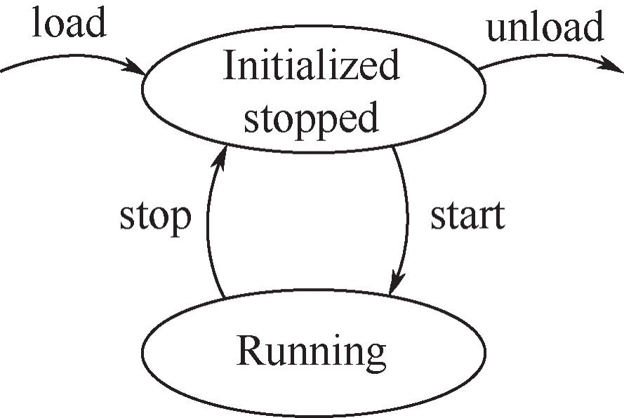

<center>图 6.19 控制器的状态跳转</center>

**（1）命令行工具**

controller_manager 命令的格式为：

```bash
rosrun controller_manager controller_manager <command> <controller_name>
```

支持的<command>如下：

① load：加载一个控制器。

② unload：卸载一个控制器。

③ start：启动控制器。

④ stop：停止控制器。

⑤ spawn：加载并启动一个控制器。

⑥ kill：停止并卸载一个控制器。

如果希望查看某个控制器的状态，可以使用如下命令：

```bash
rosrun controller_manager controller_manager <command>
```

支持的<command>如下：

① list：根据执行顺序列出所有控制器，并显示每个控制器的状态。

② list-types：显示所有控制器的类型。

③ reload-libraries：以插件的形式重载所有控制器的库，不需要重新启动，方便对控制器进行开发和测试。

④ reload-libraries——restore：以插件的形式重载所有控制器的库，并恢复到初始状态。

但是，很多时候我们需要控制的控制器有很多，比如六轴机器人至少有六个控制器，这时也可以使用 spawner 命令一次控制多个控制器：

```bash
rosrun controller_manager spawner [——stopped] name1 name2 name3
```

上面的命令可以自动加载、启动控制器，如果加上——stopped 参数，那么控制器则只会被加载，但是并不会开始运行。如果想要停止控制一系列控制器，但是不需要卸载，可以使用如下命令：

```bash
rosrun controller_manager unspawner name1 name2 name3
```

**（2）launch 工具**

在 launch 文件中，同样可以通过运行 controller_manager 命令，加载和启动一系列控制器：

```xml
<launch>
    <node pkg="controller_manager" type="spawner" args="——stopped controller_name1 controller_name2" />
</launch>
```

以上 launch 文件会加载并启动 controller，如果只需加载不必启动，可以使用以下配置：

```xml
<launch>
    <node pkg="controller_manager" type="spawner" args="controller_name1 controller_name2" />
</launch>
```

**（3）可视化工具 rqt_controller_manager**

controller_manager 还提供了可视化工具 rqt_controller_manager，安装成功后，直接使用以下命令即可打开界面：

```bash
rosrun rqt_controller_manager rqt_controller_manager
```

**（4）控制器管理器服务**

为了与 ROS 其他节点交互，控制器管理器提供 6 个服务响应：

① controller_manager/load_controller （controller_manager_msgs/LoadController）。

② controller_manager/unload_controller （controller_manager_msgs/UnloadController）。

③ controller_manager/switch_controller （controller_manager_msgs/SwitchController）。

④ controller_manager/list_controllers （controller_manager_msgs/ListControllers）。

⑤ controller_manager/list_controller_types（controller_manager_msgs/ListControllerTypes）。

⑥ controller_manager/reload_controller_libraries （ controller_manager_msgs/ReloadController-Libraries）。

## 6.8 机器人 Gazebo 仿真

### 6.8.1 在 Gazebo 中显示机器人模型

使用 xacro 设计的机器人 URDF 模型已经描述了机器人的外观特征和物理特性，虽然已经具备在 Gazebo 中仿真的基本条件，但是由于没有在模型中加入 Gazebo 的相关属性，还是无法让模型在 Gazebo 仿真环境中动起来。那么如何开始仿真呢？

首先我们需要确保每个 link 的<inertia>元素已经进行了合理的设置，然后要为每个必要的<link>、<joint>、<robot>设置<gazebo>标签。<gazebo>标签是 URDF 模型中描述 Gazebo 仿真时所需要的扩展属性。添加 Gazebo 属性之后的模型文件放置在本书配套源码 myrobot_gazebo 功能包的 urdf 文件夹下，以区别于 myrobot_description 中的 URDF 模型。

**（1）为 link 添加<gazebo>标签**

针对机器人模型，需要对每一个 link 添加<gazebo>标签，包含的属性仅有 material。material属性的作用与 link 里<visual>中 material 属性的作用相同，Gazebo 无法通过<visual>中的 material参数设置外观颜色，所以需要单独设置，否则默认情况下 Gazebo 中显示的模型全是灰白色。其中颜色可以直接命名，首字母大写，不需要提前设定 RGBA。

以 base_link 为例，<gazebo>标签的内容如下：

```xml
<gazebo reference="base_link">
	<material>Gazebo/Blue</material>
</gazebo>
```

**（2）在 Gazebo 中显示机器人模型**

文件 view_myrobot_gazebo.launch 将机器人模型 myrobot.urdf.xacro 导入到 Gazebo 中显示：

```xml
<launch>
    <arg name="paused" default="false"/>
    <arg name="use_sim_time" default="true"/>
    <arg name="gui" default="true"/>
    <arg name="headless" default="false"/>
    <arg name="debug" default="false"/>
    <arg name="model" default="$(find myrobot_gazebo)/urdf/myrobot.urdf.xacro"/>
    <include file="$(find gazebo_ros)/launch/empty_world.launch">
        <arg name="debug" value="$(arg debug)" />
        <arg name="gui" value="$(arg gui)" />
        <arg name="paused" value="$(arg paused)"/>
        <arg name="use_sim_time" value="$(arg use_sim_time)"/>
        <arg name="headless" value="$(arg headless)"/>
    </include>
    <param name="robot_description" command="$(find xacro)/xacro --inorder $(arg model)" />
    <node name="urdf_spawner" pkg="gazebo_ros" type="spawn_model" args="-z 1.0 -unpause -urdf -model robot -param robot_description" respawn="false" output="screen" />
    <node pkg="robot_state_publisher" type="robot_state_publisher" name="robot_state_publisher">
        <param name="publish_frequency" type="double" value="30.0" />
    </node>
</launch>
```

launch 文件虽然长，但关键地方没多少，都是一些参数的配置。其中主要有：

① 启动一个 Gazebo 的空白世界环境。

② 使用 urdf_spawner 节点将 robot_description 载入到 Gazebo 的空白世界中。

③ 启动 robot_state_publisher 发布机器人相关的 TF。

运行该 launch 文件的效果如图 6.20 所示。

但是，现在 Gazebo 中的机器人，就是一个静态摆设。无论在真实世界或者在 Gazebo 仿真中，机器人都应该有自己的动力来源，使之能够移动。而不是像之前 Rviz+ArbotiX 仿真那样，通过外力来手动调节 joint_state_publisher 节点实现对机器人的运动控制。为了使机器人能够交互，在Gazebo 仿真中，我们需要指定两部分：插件和传动装置。

### 6.8.2 Gazebo 插件

Gazebo 插件赋予了 URDF 模型更加强大的功能，可以帮助模型绑定 ROS 消息，从而完成传感器的仿真输出以及对电机的控制，让机器人模型更加真实。Gazebo 插件可以根据插件的作用范围应用到 URDF 模型的<robot>、<link>、<joint>上，需要使用<gazebo>标签作为封装。


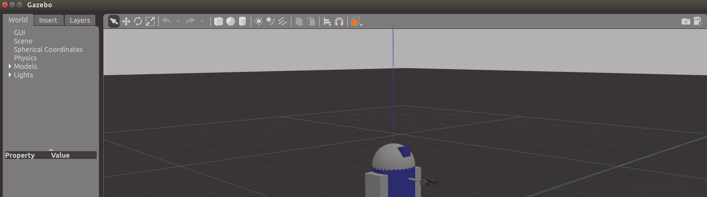

<center>图 6.20 Gazebo 中显示机器人模型</center>

**（1）为<robot>元素添加插件**

为<robot>元素添加 Gazebo 插件的方式如下：

```xml
<gazebo>
    <plugin name="unique_name" filename="plugin_name.so">
	... plugin parameters ...
</plugin>
</gazebo>
```

与其他的<gazebo>元素相同，如果<gazebo>元素中没有设置 reference="×"属性，则默认应用于<robot>标签。

**（2）为<link>、<joint>标签添加插件**

如果需要为<link>、 <joint>标签添加插件，则需要设置<gazebo>标签中的 reference="×"属性：

```xml
<gazebo reference="your_link_name">
    <plugin name=" unique_name " filename="plugin_name.so">
    ... plugin parameters ...
    </plugin>
</gazebo>
```

至于 Gazebo 目前支持的插件种类，可以查看 ROS 默认安装路径下的/opt/ros/kinetic/lib 文件夹，所有插件都是以 libgazebo×××.so 的形式命名的。

本书配套案例中，在 publishjoints.urdf.xacro 文件中的<robot>标签内，插入如下代码，来搭建Gazebo 和 ROS 之间的桥梁。

```xml
<gazebo>
    <plugin name="gazebo_ros_control" filename="libgazebo_ros_control.so">
        <robotNamespace>/</robotNamespace>
    </plugin>
</gazebo>
```

上述标签内容使得机器人模型在与 Gazebo 交互的时候，使用 ros_control 提供的动态链接库文件。ros_control 只是一个接口，其中包括很多种具体的控制器。所以还需要 joints.yaml 文件指定具体的控制器：

```ini
type: "joint_state_controller/JointStateController"
publish_rate: 50
```

然后在 joints.launch 文件中将参数加载到对应的 node：control_manager 上。

```xml
<rosparam command="load" file="$(find learn_model)/config/joints.yaml" ns="r2d2_joint_state_controller" />
<node name="r2d2_controller_spawner" pkg="controller_manager" type="spawner" args="r2d2_joint_state_controller --shutdown-timeout 3"/>
```

加载控制器之后，机器人还是无法运动关节，因为它不知道到底是哪个关节来执行命令。这时候就需要指定传动装置了。

### 6.8.3 Gazebo 传动装置
为了使用 ROS 控制器驱动机器人，需要在模型中加入<transmission>元素，将传动装置与 joint绑定。对于每一个不是 fixed 类型的关节 joint，我们都需要指定它们的 transmission。

**（1）head 运动**

```xml
<transmission name="head_swivel_trans">
    <type>transmission_interface/SimpleTransmission</type>
    <actuator name="$head_swivel_motor">
        <mechanicalReduction>1</mechanicalReduction>
    </actuator>
    <joint name="head_swivel">
        <hardwareInterface>hardware_interface/PositionJointInterface
</hardwareInterface>
    </joint>
</transmission>
```

head-firsttransmission.urdf.xacro 文件中的上述代码块将 head_swivel 关节与执行机构连接，joint标签需要与之前定义的保持一致， <joint name="">定义了将要绑定驱动器的 joint， <type>标签声明了所使用的传动装置类型，<hardwareInterface>定义了硬件接口的类型，这里使用的是位置控制接口，<mechanicalReduction>指定关节和驱动器之间的减速比。然后在 config 目录下新建文件 head.yaml。

```ini
type: "position_controllers/JointPositionController"
joint: head_swivel 
```

在这里设置 position_controllers 参数。在 urdf 文件中的 hardware interface 就与控制器类型配套了。对应的启动文件为 head.launch 文件，加入 r2d2_head_controller 控制器：

```xml
<rosparam command="load" file="$(find myrobot_gazebo)/config/joints.yaml" ns="r2d2_joint_state_controller" />
<rosparam command="load" file="$(find myrobot_gazebo)/config/head.yaml" ns="r2d2_head_controller" />
<node name="r2d2_controller_spawner" pkg="controller_manager" type="spawner" args="r2d2_joint_state_controller
r2d2_head_controller --shutdown-timeout 3"/>
```

启动 launch 文件，发布如下命令查看机器人头部转动的效果：

```bash
rostopic pub /r2d2_head_controller/command std_msgs/Float64 "data： -0.707"
```

可以看到在 Rviz 和 Gazebo 中，头部非常快地摆动到对应位置。如果按照真实环境，机器人实现缓慢转动，需要在 head-firsttransmission.urdf.xacro 文件中对<joint> head_swivel 加入<limit effort="30" velocity="1.0"/>力和速度的限制。

**（2）gripper 运动**

与 gripper 相关的关节有三个：gripper_extension、left_gripper_joint 和 right_gripper_joint。为了实现 gripper 运动，这三个关节同样需要添加如上类似内容。但是对每个关节分别进行控制十分麻烦，因此可以用配置文件 gripper.yaml 实现批量控制。

```ini
type: "position_controllers/JointGroupPositionController"
joints:
- gripper_extension
- left_gripper_joint
- right_gripper_joint
```

同样修改 launch 文件为 gripper.launch，添加对上述 yaml 文件的解析。在 gripper.urdf.xacro 文件中添加对应的 transmission 标签。最后启动 launch 文件，终端 pub 显示对应数据：

```ini
rostopic pub /r2d2_gripper_controller/command std_msgs/Float64MultiArray
"layout:
dim:
- label: ''
size: 3
stride: 1
data_offset: 0
data: [0, 0.5, 0.5]"
```

**（3）四个轮子的驱动**

轮子的驱动步骤与上述关节驱动类似，但控制器类型不同。上述的所有 joint 控制方式都是PositionController 位置控制器，而轮子是 DiffDriveController 差速控制器。

第一步，添加 transmission。在 myrobot_move.urdf.xacro 文件中添加如下内容：

```xml
<transmission name="${prefix}_${suffix}_wheel_trans">
    <type>transmission_interface/SimpleTransmission</type>
    <actuator name="${prefix}_${suffix}_wheel_motor">
        <mechanicalReduction>1</mechanicalReduction>
    </actuator>
    <joint name="${prefix}_${suffix}_wheel_joint">
        <hardwareInterface>VelocityJointInterface</hardwareInterface>
    </joint>
</transmission>
```

第二步，yaml 参数文件。轮子和上述其他的控制方式不一样，对应的 diffdrive.yaml 也就显得比较复杂。

第三步，修改 launch 文件。详见 view_myrobot_move_gazebo.launch 文件。启动 view_myrobot_move_gazebo.launch 文件，如果一切正常，应该可以看到如图 6.21 所示的界面，此时机器人模型已经加载进入仿真环境中。

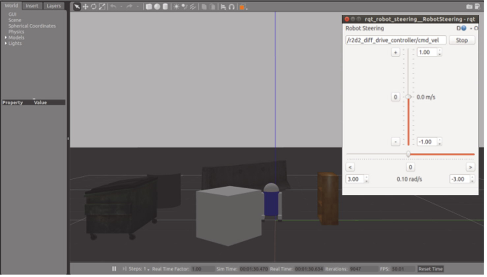

<center>图 6.21 Gazebo 中的机器人仿真环境</center>

可以通过图 6.21 中的 rqt_robot_steering 控制机器人在仿真环境中运动，或者发布/订阅 cmd_vel话题，运行键盘控制节点 myrobot_teleop 来控制机器人运动。当机器人在仿真环境中撞到障碍物时，会根据两者的物理属性决定机器人是否反弹，或者障碍物是否会被推动，这也证明了 Gazebo是一种贴近真实环境的物理仿真平台。

### 6.8.4 摄像头仿真

在之前用 ArbotiX+Rviz 搭建的机器人仿真环境中，机器人装配了多种传感器模型，但是这些模型并无法获取任何环境的数据。Gazebo 的强大之处还在于提供了一系列传感器插件，可以帮助我们仿真传感器数据，获取 Gazebo 仿真环境中的传感器信息。首先为机器人模型添加一个摄像头插件，让机器人看到 Gazebo 中的虚拟世界。

**（1）为摄像头模型添加 Gazebo 插件**

类似于机器人模型中的差速控制器插件，传感器的 Gazebo 插件也需要在 URDF 模型中进行配置。复制 myrobot_description 中的传感器模型到 myrobot_gazebo 包中，然后在摄像头的模型文件myrobot_gazebo/urdf/camera.xacro 中添加<gazebo>的相关标签，代码如下：

```xml
<gazebo reference="${prefix}_link">
    <material>Gazebo/Black</material>
</gazebo>
<gazebo reference="${prefix}_link">
    <sensor type="camera" name="camera_node">
        <update_rate>30.0</update_rate>
        <camera name="head">
            <horizontal_fov>1.3962634</horizontal_fov>
            <image>
                <width>1280</width>
                <height>720</height>
                <format>R8G8B8</format>
            </image>
            <clip>
                <near>0.02</near>
                <far>300</far>
            </clip>
            <noise>
                <type>gaussian</type>
                <mean>0.0</mean>
                <stddev>0.007</stddev>
            </noise>
        </camera>
        <plugin name="gazebo_camera" filename="libgazebo_ros_camera.so">
            <alwaysOn>true</alwaysOn>
            <updateRate>0.0</updateRate>
            <cameraName>/camera</cameraName>
            <imageTopicName>image_raw</imageTopicName>
            <cameraInfoTopicName>camera_info</cameraInfoTopicName>
            <frameName>camera_link</frameName>
            <hackBaseline>0.07</hackBaseline>
            <distortionK1>0.0</distortionK1>
            <distortionK2>0.0</distortionK2>
            <distortionK3>0.0</distortionK3>
            <distortionT1>0.0</distortionT1>
            <distortionT2>0.0</distortionT2>
        </plugin>
    </sensor>
</gazebo>
```

新的摄像头模型文件在模型描述部分没有变化，只需要加入两个<gazebo>标签。第一个<gazebo>标签用来设置摄像头模型在 Gazebo 中的 material，与机器人模型的配置相似，只需要设置颜色参数。

重点是第二个设摄像头插件的<gazebo>标签。在加载传感器插件时，需要使用<sensor>标签来包含传感器的各种属性。例如现在使用的是摄像头传感器，需要设置 type 为 camera，传感器的命名（name）可以自由设置；然后使用<camera>标签具体描述摄像头的参数，包括分辨率、编码格 式 、 图 像 范 围 、 噪 声 参 数 等 ； 最 后 需 要 使 用 <plugin> 标 签 加 载 摄 像 头 的 插 件libgazebo_ros_camera.so，同时设置插件的参数，包括命名空间、发布图像的话题、参考坐标系等。

**（2）运行仿真环境**

现在摄像头插件已经配置完成，使用如下命令启动仿真环境，并加载装配了摄像头的机器人模型：

```bash
roslaunch myrobot_gazebo view_myrobot_with_camera_gazebo.launch
```

启动成功后，可以看到机器人已经在仿真环境中了，查看当前系统中的话题列表，如图 6.22所示。从图 6.22 发布的话题中可以看到摄像头已经开始发布图像消息了，使用 rqt 工具查看当前机器人眼前的世界：

```bash
rqt_image_view
```

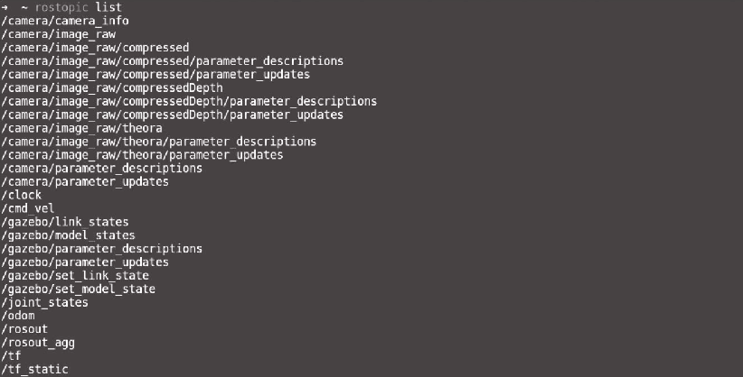

<center>图 6.22 查看 ROS 系统中的话题列表</center>

选择仿真摄像头发布的图像话题/camera/image_raw，即可看到如图 6.23 所示的图像信息。

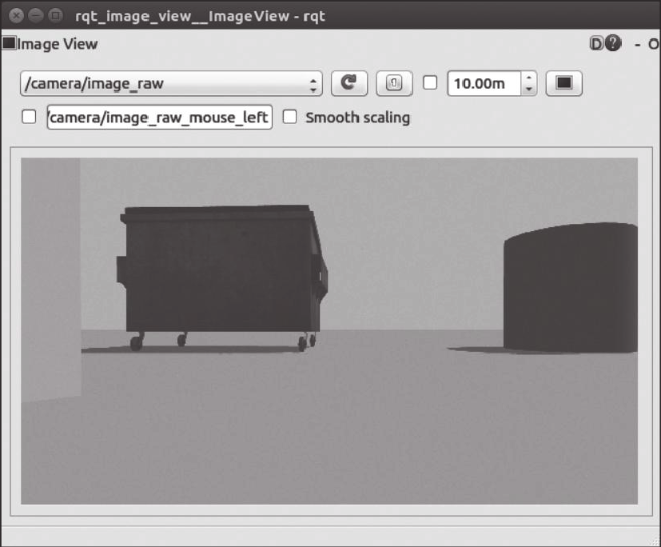

<center>图 6.23 仿真摄像头发布的图像信息</center>

现在就感觉 Gazebo 仿真环境中的机器人就像真实的机器人一样，不仅可以进行运动控制，还可以获取传感器的反馈信息。

### 6.8.5 Kinect 仿真

很多应用还会使用 Kinect 等 RGB-D 传感器，接下来就为 Gazebo 中的机器人装配一个 Kinect，让它可以获取更加丰富的三维信息。

**（1）为 Kinect 模型添加 Gazebo 插件**

在 Kinect 模型文件 myrobot_gazebo/urdf/kinect.xacro 中添加以下<gazebo>标签：

```xml
<gazebo reference="${prefix}_link">
    <sensor type="depth" name="${prefix}">
        <always_on>true</always_on>
        <update_rate>20.0</update_rate>
        <camera>
            <horizontal_fov>${60.0*M_PI/180.0}</horizontal_fov>
            <image>
                <format>R8G8B8</format>
                <width>640</width>
                <height>480</height>
            </image>
            <clip>
                <near>0.05</near>
                <far>8.0</far>
            </clip>
        </camera>
        <plugin name="kinect_${prefix}_controller"
filename="libgazebo_ros_openni_
kinect.so">
            <cameraName>${prefix}</cameraName>
            <alwaysOn>true</alwaysOn>
            <updateRate>10</updateRate>
            <imageTopicName>rgb/image_raw</imageTopicName>
            <depthImageTopicName>depth/image_raw</depthImageTopicName>
            <pointCloudTopicName>depth/points</pointCloudTopicName>
            <cameraInfoTopicName>rgb/camera_info</cameraInfoTopicName>
            <depthImageCameraInfoTopicName>depth/camera_info
            </depthImageCameraInfo-
TopicName>
            <frameName>${prefix}_frame_optical</frameName>
            <baseline>0.1</baseline>
            <distortion_k1>0.0</distortion_k1>
            <distortion_k2>0.0</distortion_k2>
            <distortion_k3>0.0</distortion_k3>
            <distortion_t1>0.0</distortion_t1>
            <distortion_t2>0.0</distortion_t2>
            <pointCloudCutoff>0.4</pointCloudCutoff>
        </plugin>
    </sensor>
</gazebo>
```

这里需要选择的传感器类型是 depth，<camera>标签中的参数与摄像头的类似，分辨率和检测距 离 都 可 以 在 Kinect 的 说 明 手 册 中 找 到 ， <plugin> 标 签 中 加 载 的 Kinect 插 件 是libgazebo_ros_openni_kinect.so，同时需要设置发布的各种数据话题名称以及参考坐标系等参数。

**（2）运行仿真环境**

使用如下命令启动仿真环境，并加载装配了 Kinect 的机器人模型：

```bash
roslaunch myrobot_gazebo view_myrobot_with_kinect_gazebo.launch
```

查看当前系统的话题列表，确保 Kinect 插件已经启动成功，如图 6.24 所示。

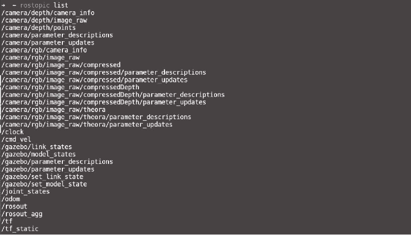

<center>图 6.24 仿真摄像头发布的图像信息</center>

然后使用如下命令打开 Rviz，查看 Kinect 的点云数据：

```bash
rosrun rviz rviz
```

在 Rviz 中需要设置“Fixed Frame”为“camera_frame_optical”，然后添加一个 PointCloud2类型的插件，修改插件订阅的话题为/camera/depth/points，此时就可以在主界面中看到如图 6.25所示的点云信息。

### 6.8.6 激光雷达仿真

在 SLAM 和导航等机器人应用中，为了获取更精确的环境信息，往往会使用激光雷达作为主要传感器。同样我们可以在 Gazebo 中为仿真机器人装载一款激光雷达。


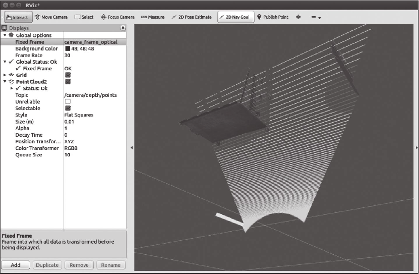

<center>图 6.25 仿真 Kinect 发布的点云信息</center>

**（1）为 rplidar 模型添加 Gazebo 插件**

我们使用的激光雷达是 rplidar，在 rplidar 的模型文件 myrobot_gazebo/urdf/rplidar.xacro 中添加以下<gazebo>标签：

```xml
<gazebo reference="${prefix}_link">
    <material>Gazebo/Black</material>
</gazebo>
<gazebo reference="${prefix}_link">
    <sensor type="ray" name="rplidar">
        <pose>0 0 0 0 0 0</pose>
        <visualize>false</visualize>
        <update_rate>5.5</update_rate>
        <ray>
            <scan>
                <horizontal>
                    <samples>360</samples>
                    <resolution>1</resolution>
                    <min_angle>-3</min_angle>
                    <max_angle>3</max_angle>
                </horizontal>
            </scan>
            <range>
                <min>0.10</min>
                <max>6.0</max>
                <resolution>0.01</resolution>
            </range>
            <noise>
                <type>gaussian</type>
                <mean>0.0</mean>
                <stddev>0.01</stddev>
            </noise>
        </ray>
        <plugin name="gazebo_rplidar" filename="libgazebo_ros_laser.so">
            <topicName>/scan</topicName>
            <frameName>laser_link</frameName>
        </plugin>
    </sensor>
</gazebo>
```

激光雷达的传感器类型是 ray，rplidar 的相关参数在产品手册中可以找到。为了获取尽量贴近真实环境的仿真效果，需要根据实际参数配置<ray>标签中的雷达参数：360°检测范围、单圈 360个采样点、5.5Hz 采样频率、最远 6m 检测范围等。最后使用<plugin>标签加载激光雷达的插件libgazebo_ros_laser.so，所发布的激光雷达话题是“/scan”。

**（2）运行仿真环境**

使用如下命令启动仿真环境，并加载装配了激光雷达的机器人：

```xml
roslaunch myrobot_gazebo view_myrobot_with_laser_gazebo.launch
```

查看当前系统中的话题列表，确保 laser 插件已经启动成功，如图 6.26 所示。

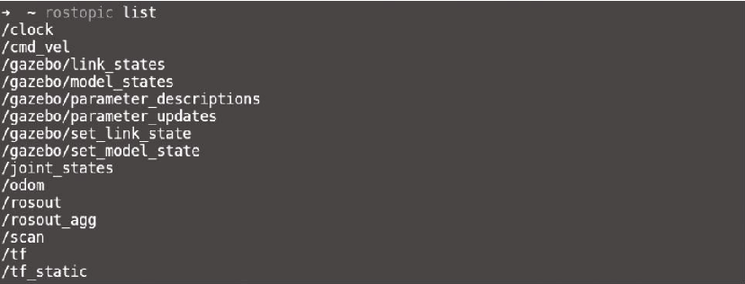

<center>图 6.26 查看 ROS 系统中的话题列表</center>

然后使用如下命令打开 Rviz，查看 rplidar 的激光数据：

```bash
rosrun rviz rviz
```

在 Rviz 中设置“Fixed Frame”为“base_footprint”，然后添加一个 LaserScan 类型的插件，修改插件订阅的话题为“/scan”，就可以看到界面中的激光数据了，如图 6.27 所示。

到目前为止，Gazebo 中的机器人模型已经比较完善了，接下来我们就可以在这个仿真环境的基础上实现丰富的机器人功能。

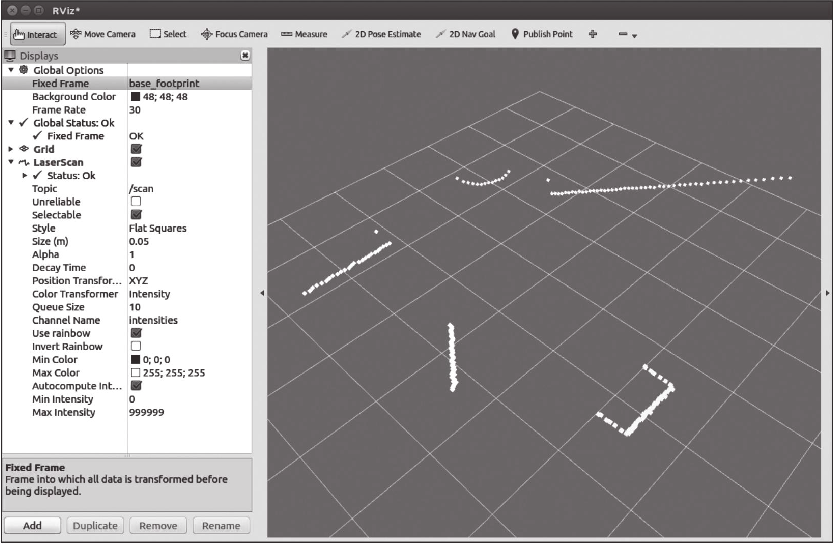

<center>图 6.27 仿真激光雷达发布的激光信息</center>

## 6.9 本章小结

仿真是机器人系统开发中的重要步骤，学习完本章内容后，你应该已经了解如何使用 urdf 文件创建一个机器人模型，然后使用 xacro 文件优化该模型，并且放置到 ArbotiX+Rviz 或 Gazebo 仿真环境中，以实现丰富的 ROS 功能。

到目前为止，我们学习了 ROS 基础知识，也了解了真实或仿真机器人系统的搭建方法。第7章将从机器视觉开始，带你走向机器人应用层面的开发实践。

## 6.10 习题

1. 机器人模型描述的格式是什么？这种格式是用什么语言构成的？
2. URDF 模型的标签有几个？分别是什么？
3. URDF 模型和 xacro 模型的联系和区别是什么？
4. 在 Gazebo 中显示机器人模型需要在原机器人模型的描述格式上做哪些修改？


