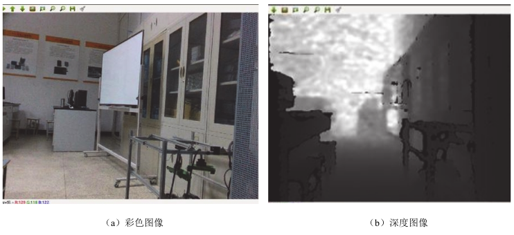

# 第 7 章 机器人视觉开发技术

机器人视觉系统是指用计算机来实现人的视觉功能，也就是用计算机来实现对客观的三维世界的识别。人类接收的信息 70%以上来自视觉，视觉为人类提供了关于周围环境最详细可靠的信息。机器人的眼睛与人类的眼睛有类似的地方，人眼之所以能看到物体，是因为物体反射的光线刺激人眼的感光细胞，然后视觉神经在大脑中形成物体的像。计算机则是摄像头的光敏元件通过模数转换将光信号转换成数字信号，并将其量化为数字矩阵，最终表示物体反射光强度的大小。

一个典型的工业机器视觉应用系统从客观事物的图像中提取信息，进行处理并加以理解，最终用于实际检测、测量和控制，包括光源、光学系统、图像捕捉系统、图像数字化模块、数字图像处理模块、智能判断决策模块和机械控制执行模块等。首先采用摄像机或其他图像拍摄装置将目标转换成图像信号，然后转变成数字信号传送给专用的图像处理系统，根据像素分布、亮度和颜色等信息，进行各种运算来提取目标的特征，根据预设的容许度和其他条件输出判断结果。

值得一提的是，广义的机器视觉的概念与计算机视觉没有多大区别，泛指使用计算机和数字图像处理技术达到对客观事物图像的识别、理解和控制。而工业应用中的机器视觉概念与普通计算机视觉、模式识别、数字图像处理有着明显区别，其特点是：

① 机器视觉是一项综合技术，其中包括数字图像处理技术、机械工程技术、控制技术、电光源照明技术、光学成像技术、传感器技术、模拟与数字视频技术、计算机软硬件技术、人机接口技术等。这些技术在机器视觉中是并列关系，相互协调应用才能构成一个成功的工业机器视觉应用系统。

② 机器视觉更强调实用性，要求能够适应工业生产中恶劣的环境；要有合理的性价比；要有通用的工业接口，能够由普通工人来操作；有较高的容错能力和安全性，不会破坏工业产品；必须有较强的通用性和可移植性。

③ 对机器视觉工程师来说，不仅要具有研究数学理论和编制计算机软件的能力，更需要的是光、机、电一体化的综合能力。

④ 机器视觉更强调实时性，要求高速度和高精度，因而计算机视觉和数字图像处理中的许多技术目前还难以应用于机器视觉，它们的发展速度远远超过其在工业生产中的实际应用速度。

本章我们将在图像数据的基础上，使用 ROS 中的功能包实现以下常用的机器视觉应用。主要包括以下五项内容：

① ROS 中的图像数据：了解 ROS 中的二维图像和三维点云数据，通过 Rviz 来查看点云，并熟悉 ROS-PCL 点云应用开发接口。

② 摄像头标定：在图像测量过程以及机器视觉应用中，为了确定空间物体表面某点的三维几何位置与其在图像中对应点之间的相互关系，我们使用 camera_calibration 功能包实现摄像头的标定。

③ 人脸识别：OpenCV 是图像处理中的有力工具，ROS 中的 cv_bridge 功能包为两者提供了接口，cv_bridge 能够在 ROS 图像消息和 OpenCV 图像之间进行转换，而且可以使用对应的 API对图像进行处理。

④ 二维码识别：利用 ROS 官方的 ar_track_alvar 功能包，生成分辨率和编码不同的 AR 标签，整合摄像头或 Kinect 深度摄像头实现二维码的识别和更好的姿态估计。通过 AprilTag 与 ROS 连接，从而可以估计物体的三维位置和姿态。

⑤ 物体检测：find_object_2d 功能包是 ROS 集成的物体检测库，利用 find_object_2d 功能包实现对物体特征点的检测，可以选择 SURF、SIFT、FAST 和 BRIEF 特征检测器得到物体的位姿信息，方便我们后续的开发。

## 7.1 ROS 图像数据

在 ROS 中有不同样式的摄像头，不管是单目摄像头、双目摄像头还是 RGB-D 深度摄像头，都有自己的图像数据格式，我们要熟悉 ROS 系统中的图像数据格式，这样才能在 ROS 视觉的开发中更加得心应手。

### 7.1.1 二维图像数据

ROS 中有通用 USB 摄像头的驱动功能包 usb_cam，在该功能包的 WIKI 上我们可以看到详细的接口说明，最终的图像将通过<camera_name>/image 发布出来，订阅后就可以看到图像了。

在使用 usb_cam 的功能包之前，我们首先要准备一个摄像头（笔记本电脑可以使用自带的摄像头），为了确保摄像头成功连接在电脑上，我们使用以下命令：

```bash
ls /dev/v*
```

笔记本自带的摄像头的设备号一般为/dev/video0，如果运行完 ls /dew/v*命令看到“/dev/video0”，则表示摄像头被成功驱动了。

其次下载 ROS Kinect 版本的摄像头驱动：

```bash
sudo apt-get install ros-noetic-usb-cam -y
```

连接 USB 摄像头到 PC 端的 USB 接口，通过以下命令启动摄像头：

```bash
roslaunch usb_cam usb_cam-test.launch
```

下面就是运行 launch 文件的内容，它做的事情有两件：

①第一个节点是启动了一个在 usb_cam 功能包下的 usb_cam_node 节点，该节点的作用是驱动摄像头，配置摄像头的参数，驱动完成以后，通过话题将它发布出来。

②第二个节点是启动了一个在 image_view 功能包下的 image_view 节点，这个是 ROS 提供的一个小的可视化界面的功能，就是执行 launch 文件之后看到的界面，启动之后它会订阅一个话题，并把话题中的图像显示出来，就是我们看到的图像页面，如图 7.1 所示。

出现图像画面后，使用以下命令可以查看 ROS 系统中的图像 topic 信息，如图 7.2 所示。

```bash
rostopic info /usb_cam/image_raw
```

如图 7.2 所示的终端信息，我们可以发现图像 topic 的消息类型是 sensor_msgs/Image，它的发布者是/usb_cam，订阅者是/image_view。其中 sensor_msgs/Image 是摄像头原始图像的消息类型，我们可以通过以下命令查看该图像数据的 msg 格式，如图 7.3 所示。

```bash
rosmsg show sensor_msgs/Image
```


<center>图 7.1 image_view 节点显示</center>


<center>图 7.2 图像的话题信息</center>


<center>图 7.3 图像消息类型 sensor_msgs/Image</center>

下面我们来介绍一下图像数据消息每一行代表的具体内容。

① header：消息的头部，包含图像的序号、时间戳和绑定坐标系。

② height：图像长度。

③ width：图像宽度。

④ encoding：图像的像素编码，包含通道的含义、排序、大小。

⑤ is_bigendian：图像数据的大小端存储模式。

⑥ step：一行图像数据的字节长度。

⑦ data：图像数据。

图像产生的数据量在实际应用中是非常大的，非常占用空间和带宽，尤其是一些工业图像以30 帧每秒的速度录像的话会产生好几百 MB 大小的视频，所以图像在传输前会进行压缩处理， ROS中压缩图像的消息类型为 sensor_msgs/CompressedImage，该消息类型的定义如图 7.4 所示。


<center>图 7.4 压缩图像消息类型 sensor_msgs/CompressedImage</center>

### 7.1.2 三维点云和深度图像

点云数据是指在空间中随机放置的 3D 点的集合。例如，Rviz 订阅 camera/depth_registered/points话题后，终端会显示三维点云数据。我们可以使用如下命令查看三维点云数据消息类型，如图 7.5所示。

```bash
rostopic info /camera/depth_registered/points
```


<center>图 7.5 三维点云数据的 topic 信息</center>

三维点云数据消息类型对应于 Rviz 中添加可视化插件时所选择的插件类型，可以使用以下命令查看该消息的具体格式，如图 7.6 所示。

```bash
rosmsg show sensor_msgs/PointCloud2
```


<center>图 7.6 三维点云消息类型 sensor_msgs/PointCloud2</center>

三维点云消息类型定义如下：

① header：消息的头部，包含图像的序号、时间戳和绑定坐标系。

② height：点云图像长度。

③ width：点云图像宽度。

④ fields：每个点的数据类型。

⑤ is_bigendian：数据的大小端存储模式。

⑥ point_step：单点的数据字节大小。

⑦ row_step：一列数据的字节大小。

⑧ data：点云数据。

ROS 所在设备若安装了 realsense2_camera 摄像头，可以打开终端，输入以下命令：

```bash
roslaunch realsense2_camera rs_camera.launch
```

新打开一个终端可以查看当前所有的 topic。如果我们输入 rostopic list | grep "raw$" ，可以看到如图 7.7 所示的六种话题，利用 image_view 就可以通过这六种话题查看六种图像。如果是在笔记本上模拟，没有 RealSense2 深度摄像头，则无法显示深度信息。


<center>图 7.7 rostopic list 话题</center>

另外，我们可以利用 image_view 查看相机的彩色图像、深度图像、红外图像、彩色流向深度
流对齐的图像，如图 7.8 所示。以下命令中，“/camera/color/image_raw”是话题名称，查看其他图像只需修改此话题即可。

```bash
$ rosrun image_view image_view image：=/camera/color/image_raw					#彩色图像
$ rosrun image_view image_view image：=/camera/depth/image_rect_raw				#深度图像
$ rosrun image_view image_view image：= /camera/infra1/image_rect_raw	 		#红外图像
$ rosrun image_view image_view image：= /camera/aligned_depth_to_color/image_raw #彩色流向深度流对齐的图像
```




<center>图 7.8 利用 image_view 查看图像</center>

### 7.1.3 查看点云图像

通过以上学习，知道可以使用 image_view 来查看相机产生的各种图像，而要查看点云图像则需要使用 Rviz 或其他 GUI 程序。

运行`roslaunch realsense2_camera rs_camera.launch`，用命令`rosrun rviz rviz`或`rviz`打开 Rviz，然后 Add 一个 visualization，选择“By topic”里面的/camera/depth_registered/points节点，把里面的“PointCloud2”点云图像加入 Rviz 中，如图 7.9 所示。


<center>图 7.9 在 Rviz 中加入点云</center>

此时在 Rviz 中并未发现有点云图像，原因是 Rviz 中的 map 为世界坐标系，而相机坐标不知道自己的位姿，需要给相机一个位姿，告诉相机它与世界坐标的关系是什么。最简单的方法就是把map 坐标直接设置为相机的坐标。先通过以下命令查看 topic 的信息，其消息类型如图 7.10 所示。


<center>图 7.10 查看消息的类型</center>

```bash
rostopic info /camera/depth_registered/points
```

再通过命令 rosmsg show sensor_msgs/PointCloud2 查看消息的定义，如图 7.11 所示。


<center>图 7.11 查看消息的类型</center>

通过消息的定义，我们可以发现有一个 frame_id，这就是相机的坐标系，通过命令`rostopic echo /camera/depth_registered/points | grep frame_id`可以查看 frame_id 的名称，如图 7.12 所示。


<center>图 7.12 frame_id 的名称</center>

frame_id 的名称叫做“camera_color_optical_frame”，世界坐标系叫做“map”，之后就可以输入以下命令：

```bash
rosrun tf static_transform_publisher 0.0 0.0 0.0 0.0 0.0 0.0 map camera_color_optical_frame 100
```

通过以上命令可以将世界坐标系直接赋给相机坐标系，此命令中的 6 个 0.0 表示既没有平移，也没有旋转，然后通过 Rviz 显示点云图像，如图 7.13 所示。


<center>图 7.13 Rviz 中的点云图像</center>

###7.1.4 ROS-PCL 开发接口

之前我们介绍了点云数据定义为某一坐标系下的一组数据点。在 3D 环境中，点云数据有 x、y、 z 三个坐标。 PCL 是用于处理 2D/3D 图像和 3D 点云数据的开源项目， ROS 官方网站参考链接：http://wiki.ros.org/pcl/Tutorials。PCL 与 OpenCV（将在后面的小节介绍）一样，也是基于 BSD 许可协议，可以免费用于商业和学术研究，支持 Linux、Windows 和 macOS 等操作系统。

PCL 由大量标准算法组成，如过滤、特征估计、表面重建、模型拟合和分割、定位搜索等，可用于实现不同类型的点云应用开发。点云数据可以通过 Kinect、华硕 Xtion Pro、英特尔 RealSense等传感器获取。然后，我们就可以在机器人项目中使用这些数据，如机器人操控和抓取物体。PCL和 ROS 是紧密集成的，用于处理来自各类传感器的点云数据。perception_pcl 软件包集是 PCL 的ROS 接口，该软件包集可以将来自 ROS 的点云数据转换成 PCL 的数据类型，反之亦然。

perception_pcl 软件包集包含以下软件包：

① pcl_conversions：该软件包提供了将 PCL 数据类型转换为 ROS 消息的 API。

② pcl_msgs：该软件包包含了在 ROS 中定义的 PCL 相关消息。PCL 相关消息包含ModelCoefficients、PonitIndices、PolygonMesh、Vertices。

③ pcl_ros：该软件包是打通 ROS 与 PCL 之间的桥梁，包含将 ROS 消息与 PCL 数据类型桥接的工具和节点。

④ pointcloud_to_laserscan：该软件包的主要功能是将 3D 点云数据转换为 2D 激光扫描数据。

该软件包有助于将 3D 视觉传感器（如 Kinect 和华硕 Xtion Pro）变成激光扫描仪。激光扫描数据主要用于 2D-SLAM，可应用于机器人导航。

下面我们将通过输入以下命令来安装 ROS perception 软件包集，它是 ROS 中的一个软件包集合，包含所有与视觉相关的软件包，包括 OpenCV、PCL 等。

```bash
sudo apt-get install ros-noetic-perception -y
```

ROS perception 软件包集包含了以下各类 ROS 软件包：

① image_common：该软件包包含处理 ROS 图像的常用功能。这个软件包由下列软件包组成（http://wiki.ros.org/image_common）：
A. image_transport：该软件包可以在发布和订阅图像时压缩图像，这样可以节省带宽（http://wiki.ros.org/image_transport）。压缩算法包括 JPFG/PNG 压缩和 Theora 视频流压缩。另外，还可以将自定义的压缩方法添加到 image_transport 中。
B. camera_calibration_parsers：该软件包包含一个从 XML 文件读/写相机校准参数的程序。该软件包主要用于相机驱动程序访问校准参数。
C. camera_info_manager：该软件包包含一个保存、恢复、加载校准信息的程序，主要由相机驱动程序调用。
D. polled_camera：该软件包包含从轮询相机驱动程序（例如 prosilica_camera）请求图像的接口。
E. image_pipeline：该软件包包含一组软件包，处理来自相机驱动的原始图像，可以实现各种图像处理，如校准、畸变消除、立体视觉处理、深度图像处理等功能。

② camera_calibration：校准是建立 3D 环境与 2D 相机图像之间映射关系的重要工具之一。该软件包中的工具为 ROS 提供了单目和立体相机校准。
A. depth_image_proc：该软件包用于处理来自 Kinect 和 3D 视觉传感器的深度图像，由若干个节点和小节点组成。深度图像可以被小节点处理，生成点云数据。
B. stereo_image_proc：该软件包的节点可以处理一对相机图像，如消除畸变。与 image_proc软件包的不同之处在于 stereo_image_proc 可以处理两个相机的立体视觉，生成点云数据和视差图像。
C. image_rotate：该软件包包含可以旋转输入图像的节点。
D. image_view：这是 ROS 中查看消息话题的简单工具，还可以用于浏览立体图像和视差图像。
E. image_transport_plugins：该软件包包含 ROS 图像传输的插件，用于发布和订阅 ROS 图像，并将图像压缩至不同程度或将视频进行编码，从而减少传输带宽和传输时延。
F. laser_pipeline：这是一组可以处理激光数据的软件包集，例如滤波和转换 3D 笛卡尔数据并组装这些数据以形成点云。laser_pipeline 软件包集包含以下各种软件包：
（A） laser_filters：该软件包用于对原始激光数据进行去噪，去除机器人本体范围内的激光点，还可以去除激光数据中的虚假数值。
（B）laser_geometry：对激光数据进行去噪后，须将其距离值和角度值转换成笛卡尔坐标下的坐标值，同时还要考虑激光扫描仪的旋转和倾斜角。
（C）laser_assembler：该软件包可以将激光扫描数据融合成 3D 点云数据或 2.5D 扫描数据。
G. perception_pcl：PCL-ROS 接口的 ROS 软件包集。
H. vision_opencv：OpenCV-ROS 接口的 ROS 软件包集。

## 7.2 摄像头标定

与其他传感器一样，相机也需要校准以校正相机内部参数造成的图像失真，并根据相机坐标确定世界坐标。摄像头这种精密仪器对光学器件的要求较高，由于摄像头内部与外部的一些原因，生成的物体图像往往会发生畸变。为了避免数据源造成的误差，需要针对摄像头的参数进行标定，完成相机坐标到真实世界坐标的转换。可用经典的黑白棋盘、对称圆形图案、不对称圆形图案等方法对相机进行校准。根据不同的图案，我们用不同的方程求得校准参数。我们可以通过校准工具检测图案，并将检测到的每个图案视为一个新方程。当校准工具检测到足够多的图案时，就可以计算出相机的最终参数。ROS 官方提供了用于双目和单目摄像头标定的功能包 camera_calibration 来进行相机校准。

### 7.2.1 camera_calibration 功能包

在进行摄像头标定之前，我们要使用以下命令安装摄像头标定功能包 camera_calibration：

```bash
sudo apt-get install ros-kinetic-camera-calibration
```

然后下载 ROS WIKI 页面中提到的黑白格棋盘图案，然后打印出来并粘贴在一个纸板上。这将是我们用于校准的图案。如图 7.14 所示，8×8 黑白格棋盘图中有 7×7 个校准点。


<center>图 7.14 黑白格棋盘校准图案</center>

### 7.2.2 启动标定程序

首先使用以下命令启动 USB 摄像头程序，确保摄像头能够正常运转：

```bash
roslaunch robot_vision usb_cam.launch
```

然后使用以下命令进行标定：

```bash
rosrun camera_calibration cameracalibrator.py --size 7x7 square 0.024 image:=/usb_cam/image_raw camera:=/usb_cam
```

从上面的命令我们可以看出，使用 cameracalibrator.py 标定程序时，输入了 4 个参数，下面来介绍不同参数的具体意义：

① size：标定棋盘格内部角点的个数，如图 7.14 所示的棋盘一共有 8 行，每行有 7 个内部角点。

② square：这个参数对应每个棋盘格的边长，单位是米。

③ image 和 camera：设置摄像头发布的图像话题以及摄像头类别的选择。

根据使用的摄像头和标定靶棋盘格尺寸，相应修改以上参数，即可启动标定程序。

### 7.2.3 标定摄像头

标定程序启动成功后，将标定靶放置在摄像头视野范围内，可以看到如图 7.15 所示的图形界面。图像均为 640×480 的 8×8 黑白格棋盘图，有 7×7 个内部角点。

在没有标定成功前，需要等待几分钟，此时“display”界面右边的按钮都为灰色，不能进行标定。为了提高相机标定的准确性，应该尽量让标定靶出现在摄像头视野范围内的各个区域，界面右上角的进度条会提示标定进度。

① X：标定靶在摄像头视野中的左右移动。

② Y：标定靶在摄像头视野中的上下移动。

③ Size：标定靶在摄像头视野中的前后移动。

④ Skew：标定靶在摄像头视野中的倾斜转动。


<center>图 7.15 摄像头标定程序</center>

在标定过程中不断移动、旋转标定靶直到“CALIBRATE”按钮变为绿色，标志着标定程序的参数采集完成。此时就可以点击“CALIBRATE”按钮，标定程序开始自动计算摄像头的标定参数。点击“SAVE”按钮就可以将标定参数保存在默认文件夹下。点击“COMMIT”按钮，提交数据并且退出。参数计算完成后界面恢复，而且在终端中摄像机的各个参数会出现在标定程序的终端窗口，如图 7.16 所示。


<center>图 7.16 终端中的标定结果</center>

点击界面中的“SAVE”按钮，标定参数将被保存到默认的文件夹下，并在终端中看到该路径，如图 7.17 所示。


<center>图 7.17 标定参数的保存路径</center>

然后点击“COMMIT”，打开/tmp 文件夹，就可以看到标定结果的压缩文件 calibrationdata.tar.gz。解压该文件后从中可以找到以 head_camera.yaml 命名的标定结果文件，这样就可以通过标定文件来实现摄像头的标定了。

### 7.2.4 Kinect 相机的标定

Kinect 相机不仅有 RGB 摄像头，还有一个红外深度摄像头，两个摄像头需要分别标定，方法与 USB 摄像头的标定相同。安装好 Kinect 的驱动后，启动 Kinect 相机并分别使用以下命令，按照 7.2.3 节介绍的流程即可完成标定。

```bash
roslaunch robot_vision freenect.launch

rosrun camera_calibration cameracalibrator.py image:=/camera/rgb/image_raw camera:=/camera/rgb --size 7x7 --square 0.024

rosrun camera_calibration cameracalibrator.py image:=/camera/ir/image_raw
camera：=/camera/ir --size 7x7 --square 0.024
```

与之前的相机标定方法不同之处在于，这里只需要将图像输出订阅的话题改为`/camera/rgb/image_raw`并且将相机的类型改为/camera/rgb，即可完成对 Kinect 相机的标定。

### 7.2.5 加载标定参数的配置文件

标定摄像头生成的配置文件是 YAML 格式的，可以在启动摄像头的 launch 文件中进行加载，例如加载摄像头标定文件的 robot_vision/launch/usb_cam_with_calibration.launch：

```xml
<launch>
	<node name="usb_cam" pkg="usb_cam" type="usb_cam_node" output="screen" >
    <param name="video_device" value="/dev/video0" />
    <param name="image_width" value="1280" />
    <param name="image_height" value="720" />
    <param name="pixel_format" value="yuyv" />
    <param name="camera_frame_id" value="usb_cam" />
    <param name="io_method" value="mmap"/>
    <param name="camera_info_url" type="string" value="file://$(find robot_vision)/camera_calibration.yaml" />
</node>undefined</launch>
```

Kinect 相机标定文件的加载方法相同，分别设置 RGB 摄像头和红外深度摄像头的标定文件即可，详见 robot_vision/launch/freenect_with_calibration.launch：

```xml
<launch>
    <!-- Launch the freenect driver -->
    <include file="$(find freenect_launch)/launch/freenect.launch">
        <arg name="publish_tf" value="false" />
        <!-- use device registration -->
        <arg name="depth_registration" value="true" />
        <arg name="rgb_processing" value="true" />
        <arg name="ir_processing" value="false" />
        <arg name="depth_processing" value="false" />
        <arg name="depth_registered_processing" value="true" />
        <arg name="disparity_processing" value="false" />
        <arg name="disparity_registered_processing" value="false" />
        <arg name="sw_registered_processing" value="false" />
        <arg name="hw_registered_processing" value="true" />
        <arg name="rgb_camera_info_url" value="file://$(find robot_vision)/kinect_ rgb_calibration.yaml" />
        <arg name="depth_camera_info_url" value="file://$(find robot_vision)/kinect_ depth_calibration.yaml" />
    </include>
</launch>
```

如果启动加载了标定文件的传感器后，终端出现警告信息，我们只需要把标定文件的camera_name 改成我们实际的传感器的名称，并按照警告信息修改对应的传感器名称即可。

### 7.2.6 校正图像

通过相机的标定我们建立了相机成像几何模型并矫正透镜畸变，使成像后的图像与真实世界的景象保持一致。那我们可以直接使用功能包来对实时采集到的图像进行校正吗？image_proc 软件包可以实现图像的矫正和色彩的处理，让我们来感受一下吧。

我们在终端输入以下命令来下载相应的功能包：

```bash
git clone https：//github.com/ros-perception/image_pipeline.git
```

image_proc 软件包应用于摄像机驱动程序和视觉处理节点之间。image_proc 功能包可以消除原始图像流中的相机失真，而且可以将 Bayer 或 YUV422 格式的图像数据转换为彩色图像。如图7.18 所示，我们展示了一个单目相机进行校正的前后对比图。如图 7.18（a）所示是一张颜色失真的灰色图像，如图 7.18（b）所示是校正颜色后的图像（黑色的边框会使图像畸变）。

为了确保相机驱动能够正常地运行，可以在终端输入以下命令：

```bash
rostopic list| grep image_raw
```

来查看兼容驱动程序中可用的原始图像主题。如果驱动程序发布话题/my_camera/image_raw和/my_camera/camera_info，则可以执行以下操作：

```bash
ROS_NAMESPACE=my_camera rosrun image_proc image_proc
```

请注意：在/my_camera 命名空间下，其中订阅的是 image_raw 和 camera_info 话题。同样，所有输出话题都在/my_camera 命名空间中发布。重新打开一个终端输入以下命令：

```bash
rosrun image_view image_view image：=my_camera/image_rect_color
```

这样就会显示来自/my_camera 的未失真的彩色图像。


<center>图 7.18 单目相机图像校正实例</center>

## 7.3 OpenCV 库和人脸识别


OpenCV 库是一个开源的基于 BSD 许可协议发行的跨平台计算机视觉和机器学习软件库，可以运行在 Linux、Windows、Android 和 macOS 操作系统上。它轻量而且高效，由一系列 C 函数和少量 C++类构成，同时提供了 Python、Ruby、MATLAB 等语言的接口，实现了图像处理和计算机视觉方面的很多通用算法。利用 OpenCV 库，我们可以通过人脸识别算法在输入的图像中确定人脸（如果存在）的位置、大小和姿态，可应用于生物特征识别、视频监听、人机交互等应用中。2001 年，Viola 和 Jones 提出了基于 Haar 特征的级联分类器对象检测算法，并由 Lienhart 和 Maydt进行改进，为快速、可靠的人脸检测应用提供了一种有效方法。OpenCV 已经集成了该算法的开源实现，利用大量样本的 Haar 特征进行分类器训练，然后调用训练好的分类器 cascade 进行模式匹配。

### 7.3.1 安装 OpenCV 库

ROS 中集成了 OpenCV 库和相关的接口功能包，使用以下命令即可安装相关的依赖：

```bash
sudo apt-get install ros-kinetic-vision-opencv libopencv-dev python-opencv -y
```

读者也可以查阅 ROS 官方的 OpenCV 文档，查询网址为 http://wiki.ros.org/opencv_apps，选择自己 ROS 系统的发行版本即可找到对应文档的介绍。ROS 的 opencv_apps 包提供了各种在内部运行 OpenCV 功能并将其结果发布为 ROS 话题的节点，使用 opencv_apps 只需运行所需的 OpenCV功能相对应的 launch 文件即可。

### 7.3.2 使用 OpenCV 库

ROS 是机器人领域中比较受关注的一种系统，它的应用比较方便而且有许多的工具，比如传感器驱动包就可以直接使用。但是 ROS 对于传感器数据有自己的格式和规范，而在 OpenCV 中，我们使用 OpenCV C++接口得到的图像是以 Mat 矩阵的形式存储的，这与 ROS 定义的图像消息的格式有一定的区别，所以我们需要利用 cv_bridge 将这两种不相同的格式联系起来，如图 7.19 所示。通过 cv_bridge 可以将 OpenCV 处理过后的数据转换成 ROS 图像，通过话题进行发布，实现各节点之间的图像传输。


<center>图 7.19 ROS 图像和 OpenCV 图像的相互转换</center>

ROS 图像和 OpenCV 图像的相互转换不仅仅有 C++的接口也有 Python 的接口，下面我们先介绍 C++ 的 cv_bridge 接 口 ， 再 通 过 Python 接 口 进 行 演 示 。 ROS 中 图 像 的 消 息 格 式为sensor_msgs/Image，考虑到 OpenCV 提供的丰富功能，许多开发者想结合 OpenCV 来显示并处理ROS 发布的图像。

在本节中，我们可以学习到如何编写一个使用 cv_bridge 将 ROS 图像转换为 OpenCV 中 cv::Mat格式的节点，通过使用 cv_bridge 完成 ROS 与 OpenCV 之间的图像转换。在该例程中，一个 ROS节点订阅摄像头驱动发布的图像消息，然后将其转换成 OpenCV 的图像格式进行显示，最后再将该 OpenCV 格式的图像转换成 ROS 图像消息进行发布并显示。

cv_bridge 定义了 CvImage 类型，其中包含 OpenCV 源图像、图像的编码格式和 ROS 消息的头名称。CvImage 包含 sensor_msgs/Image 所需的信息，因此我们可以将 ROS sensor_msgs/Image
消息转换为 CvImage 类型格式。CvImage 类型格式为：

```cpp
namespace cv_bridge {
class CvImage{
    public:
        std_msgs::Header header;
        std::string encoding;
        cv::Mat image;
	};
	typedef boost::shared_ptr<CvImage> CvImagePtr;
	typedef boost::shared_ptr<CvImage const> CvImageConstPtr;
}
```

cv_bridge 提供以下用于转换为 CvImage 的功能：

```cpp
//第一种情况：总是复制，返回一个可变的 CvImage
CvImagePtr toCvCopy(const sensor_msgs::ImageConstPtr& source,
const std::string& encoding = std::string());
CvImagePtr toCvCopy(const sensor_msgs::Image& source,
const std::string& encoding = std::string());
// 第二种情况：尽可能共享，返回 const CvImage
CvImageConstPtr toCvShare(const sensor_msgs::ImageConstPtr& source,
const std::string& encoding = std::string());
CvImageConstPtr toCvShare(const sensor_msgs::Image& source,
const boost::shared_ptr<void const>& tracked_object,
const std::string& encoding = std::string());
```

下面我们介绍将 OpenCV 图像转换为 ROS 图像消息，先将 CvImage 转换为 ROS 图像消息，需要使用 toImageMsg()成员函数：

```cpp
class CvImage
{
    sensor_msgs::ImagePtr toImageMsg() const;
    // Overload mainly intended for aggregate messages that contain
    // a sensor_msgs::Image as a member
    void toImageMsg(sensor_msgs::Image& ros_image) const;
};
```

然后我们编写一个 ROS 图像消息的节点，将图像转换为 cv::Mat，在其上绘制一个圆并使用OpenCV 显示该图像，并通过 ROS 重新发布该图像信息。在创建节点之前，我们需要在 package.xml和 CMakeLists.xml 中添加以下依赖项：

```cpp
sensor_msgs
cv_bridge
roscpp
std_msgs
image_transport
```

在/src 文件夹中创建 image_converter.cpp 文件，并添加以下内容：

```cpp
#include <ros/ros.h>

#include <image_transport/image_transport.h>

#include <cv_bridge/cv_bridge.h>

#include <sensor_msgs/image_encodings.h>

#include <opencv2/imgproc/imgproc.hpp>

#include <opencv2/highgui/highgui.hpp>

static
const std::string OPENCV_WINDOW = "Image window";
class ImageConverter {
  ros::NodeHandle nh_;
  image_transport::ImageTransport it_;
  image_transport::Subscriber image_sub_;
  image_transport::Publisher image_pub_;
  public:
    ImageConverter(): it_(nh_) {
      // Subscribe to input video feed and publish output video feed
      image_sub_ = it_.subscribe("/camera/image_raw", 1, &ImageConverter::imageCb, this);
      image_pub_ = it_.advertise("/image_converter/output_video", 1);
      cv::namedWindow(OPENCV_WINDOW);
    }~ImageConverter() {
      cv::destroyWindow(OPENCV_WINDOW);
    }
  void imageCb(const sensor_msgs::ImageConstPtr & msg) {
    cv_bridge::CvImagePtr cv_ptr;
    try {
      cv_ptr = cv_bridge::toCvCopy(msg, sensor_msgs::image_encodings::BGR8);
    } catch (cv_bridge::Exception & e) {
      ROS_ERROR("cv_bridge exception: %s", e.what());
      return;
    }
    // Draw an example circle on the video stream
    if (cv_ptr -> image.rows > 60 && cv_ptr -> image.cols > 60)
      cv::circle(cv_ptr -> image, cv::Point(50, 50), 10, CV_RGB(255, 0, 0));
    // Update GUI Window
    cv::imshow(OPENCV_WINDOW, cv_ptr -> image);
    cv::imshow(OPENCV_WINDOW, cv_ptr -> image);
    cv::waitKey(3);
    // Output modified video stream
    image_pub_.publish(cv_ptr -> toImageMsg());
  }
};
int main(int argc, char ** argv) {
  ros::init(argc, argv, "image_converter");
  ImageConverter ic;
  ros::spin();
  return 0;
}
```


<center>图 7.20 cv_bridge 例程的运行效果</center>

下面我们通过一个例程来演示 cv_bridge 的 Python 接口，来完成 ROS 图像和 OpenCV 图像信息的相互转换，输入如下命令：

```bash
roslaunch robot_vision usb_cam.launch
rosrun robot_vision cv_bridge_test.py
rqt_image_view
```

首先我们启动相机的 launch 文件，通过 ROS 来显示图像。例程运行的效果与 C++接口相同，如图 7.20 所示，图（a）是通过 cv_bridge 将 ROS 图像转换成 OpenCV 图像数据之后的显示效果；图（b）是将 OpenCV 图像数据再次通过 cv_bridge 转换成 ROS 图像后的显示效果，从而实现 OpenCV和 ROS 图像信息的相互转换。

实现该例程的源码 robot_vision/scripts/cv_bridge_test.py 的内容如下：

```cpp
import rospy
import cv2
from cv_bridge
import CvBridge, CvBridgeError
from sensor_msgs.msg
import Image
class image_converter:
  def __init__(self):
    # 创建 cv_bridge， 声明图像的发布者和订阅者
    self.image_pub = rospy.Publisher("cv_bridge_image", Image, queue_size = 1)
    self.bridge = CvBridge()
    self.image_sub = rospy.Subscriber("/usb_cam/image_raw", Image, self.callback)
    def callback(self, data):
      # 使用 cv_bridge 将 ROS 的图像数据转换成 OpenCV 的图像格式
    	try:
            cv_image = self.bridge.imgmsg_to_cv2(data, "bgr8")
        except CvBridgeError as e:
    		print e
        # 在 OpenCV 的显示窗口中绘制一个圆作为标记
        (rows, cols, channels) = cv_image.shape
        if cols > 60 and rows > 60:
        	cv2.circle(cv_image, (60, 60), 30, (0, 0, 255), -1)
        # 显示 OpenCV 格式的图像
        cv2.imshow("Image window", cv_image)
        cv2.waitKey(3)
        # 再将 OpenCV 格式的数据转换成 ROS 图像式的数据发布
        try:
	        self.image_pub.publish(self.bridge.cv2_to_imgmsg(cv_image, "bgr8"))
        except CvBridgeError as e:
        	print e
  
if __name__ == '__main__':
  try:
    # 初始化 ROS 节点
    rospy.init_node("cv_bridge_test")
    rospy.loginfo("Starting cv_bridge_test node")
    image_converter()
    rospy.spin()
  except KeyboardInterrupt:
    print "Shutting down cv_bridge_test node."
    cv2.destroyAllWindows()
```

分析以上例程代码的关键部分：

① 要调用 OpenCV，必须先导入 OpenCV 模块，另外还应导入 cv_bridge 所需要的一些模块。

② 定义一个 Subscriber 接收原始的图像消息，再定义一个 Publisher 发布 OpenCV 处理后的图像消息，还要定义一个 CvBridge 的句柄，便于调用相关的转换接口。

③ imgmsg_to_cv2（）接口的功能是将 ROS 图像消息转换成 OpenCV 图像数据，该接口有两个输入参数：第一个参数指向图像消息流，第二个参数用来定义转换的图像数据格式。

④ cv2_to_imgmsg（）接口的功能是将 OpenCV 格式的图像数据转换成 ROS 图像消息，该接口同样要求输入图像数据流和数据格式这两个参数。

由于是 python 文件，我们需要给.py 文件提供 root 权限，保证程序能够顺利地运行。我们可以通过重映射，修改程序映射到实际的图像主题，例如“/camera/rgb/image_color”。

### 7.3.3 使用 OpenCV 实现人脸识别

人脸识别是一种生物识别技术，描述人脸的整体特征和轮廓，是一种通过模式识别来对人的身份进行识别的技术。人脸识别流程主要是按照人脸检测、特征提取、人脸比对的顺序对人脸进行判断和分析。人脸的检测就是对图像的轮廓进行特定算法的处理从而判断有无人脸；特征提取就是将人脸的特征通过向量表示出来；人脸比对主要是将要识别的面部与已有的面部进行比较来确定是否是同一个人。人脸识别技术应用非常广泛，而且目前该技术已经融入到了我们的日常生活中，例如刑事侦查、身份核实、密码设置等，研究人脸识别具有重大的现实意义。

强大的 OpenCV 包集成了许多人脸识别的算法，所以我们不需要重新寻找人脸识别的源码，只需要调用 OpenCV 中相应的接口就可以实现人脸识别的功能。一般情况下我们在安装 ROS 系统过程中，会包含摄像头 usb_cam 驱动包，下面运行例程来展示人脸识别的过程和效果。

**（1）人脸检测**

人脸检测是指对采集到的图像进行搜索，找到所有可能是人脸的位置，并返回人脸位置和大小的过程。人脸识别中搜索部分的所有操作都是基于人脸检测的结果进行，所以人脸检测是人脸识别的一个关键环节，检测结果的好坏直接影响到人脸识别的效率和效果。下面我们利用 OpenCV中的 Haar 特征分类器实现人脸检测，并且训练模型来对不同对象进行识别。我们需要将不同的人脸进行分类，相同的人脸放在同一个文件夹里，然后训练人脸识别模型并保存。

使用以下命令启动摄像头，然后运行 face_detector.launch 文件启动人脸检测功能：

```bash
roslaunch robot_vision usb_cam.launch
roslaunch robot_vision face_detector.launch
```

face_detector.launch 文件将启动人脸检测节，点实现人脸检测功能，该节点代码文件是face_train.py，内容如下：

```python
import os
import numpy as np
import cv2
#脸部检测函数

def face_detect_demo(image):
    gray = cv2.cvtColor(image, cv2.COLOR_BGR2GRAY)
	face_detector = cv2.CascadeClassifier(r 'haarcascade_frontalface_default.xml')
    faces = face_detector.detectMultiScale(gray, 1.2, 6)
	# 如果未检测到脸部， 则返回原始图像
	if (len(faces) == 0):
  		return None, None
	# 目前假设只有一张脸， x、 y 为左上角坐标， w、 h 为矩形的宽和高
  	(x, y, w, h) = faces[0]
	# 返回图像的脸部部分
	return gray[y: y + w, x: x + h], faces[0]

def ReFileName(dirPath):
    ""
    ": param dirPath: 文件夹路径: return :
      ""
    "
    # 对目录下的文件进行遍历
    faces = []
    for file in os.listdir(dirPath):
      # 判断是否是文件
        if os.path.isfile(os.path.join(dirPath, file)) == True:
            c = os.path.basename(file)
        name = dirPath + '\\' + c
        img = cv2.imread(name)
        # 检测脸部
        face, rect = face_detect_demo(img)
        # 我们忽略未检测到的脸部
        if face is not None:
            # 将脸添加到脸部列表并添加相应的标签
            faces.append(face)
    cv2.waitKey(1)
    cv2.destroyAllWindows()
    return faces

#tanli 照片读取（ 同学 1）
dirPathtanli = "./image"
#文件路径
tanli = ReFileName(dirPathtanli) #调用函数
labeltanli = np.array([0 for i in range(len(tanli))]) #标签处理
#wangqin 照片读取（ 同学 2）
dirPathtanli = "./image"
#文件路径
tanli = ReFileName(dirPathtanli) #调用函数
labeltanli = np.array([1 for i in range(len(tanli))]) #标签处理
#拼接并打乱数据特征和标签
x = np.concatenate((tanli, tanli), axis = 0)
y = np.concatenate((labeltanli, labeltanli), axis = 0)
index = [i for i in range(len(y))] #test_data 为测试数据
np.random.seed(1)
np.random.shuffle(index) #打乱索引
train_data = x[index]
train_label = y[index]
#分类器
recognizer = cv2.face.LBPHFaceRecognizer_create()
recognizer.train(train_data, train_label)
# 保存训练数据
recognizer.write('./train.yml')
```

我们将训练所得的模型写入 train.yml 文件中，并且得到了人脸检测的结果，如图 7.21 所示，识别到的人脸我们用矩形框标出。


<center>图 7.21人脸检测结果</center>

**（2）人脸识别**

人脸检测最重要的应用之一就是人脸识别。人脸识别技术描述了一种生物识别技术，其技术远不止于在人脸出现时进行识别。它实际上试图确定它是谁的脸，我们可以把存储的人脸模型与已知的图像进行比较。具体的代码文件是 face_recognizer.py，内容如下：

```python
import cv2
#人脸检测函数
def face_detect_demo(image):
	gray = cv2.cvtColor(image, cv2.COLOR_BGR2GRAY)
#需要根据自己 OpenCV 的安装路径来查看 Xml 文件的绝对路径
face_detector =
cv2.CascadeClassifier('haarcascade_frontalface_default.xml')
	faces = face_detector.detectMultiScale(gray, 1.2, 6)
	# 如果未检测到脸部，则返回原始图像
	if (len(faces) == 0):
		return None, None
	# 目前假设只有一张脸，x、y 为左上角坐标，w、h 为矩形的宽和高
	(x, y, w, h) = faces[0]
	# 返回图像的脸部部分
	return gray[y:y + w, x:x + h], faces[0]

#导入训练结果
recognizer = cv2.face.LBPHFaceRecognizer_create()
recognizer.read('train.yml')#读取前文训练的结果

# 根据给定的人脸（x，y）坐标、宽度和高度在图像上绘制矩形框
def draw_rectangle(img, rect):
	(x, y, w, h) = rect#矩形框
	cv2.rectangle(img, (x, y), (x + w, y + h), (255, 255, 0), 2)
    
# 根据给定的人脸（x，y）坐标写出人名
def draw_text(img, text, x, y):
	cv2.putText(img, text, (x, y), cv2.FONT_HERSHEY_COMPLEX, 1, (128, 128, 0), 2)
    
# 此函数识别图像中的人脸并在脸部周围绘制一个矩形框及其人名
facelabel = ["tanli", "tanli"]#人物名

def predict(image):
	# 生成图像的副本，保留原始图像
	img = image.copy()
	# 检测人脸区域
	face, rect = face_detect_demo(img)#face_detect_demo 前面的人脸检测函数
	#print(rect)=[x,y,w,h]
	# 预测人脸名字
	label = recognizer.predict(face)
	print(label)#label[0]为名字，label[1]可信度数值越低，可信度越高
	if label[1]<=50:
		# 获取由人脸识别器返回的相应标签的人名
		label_text = facelabel[label[0]]
		# 在检测到的脸部周围画一个矩形框
		draw_rectangle(img, rect)
		# 标出预测的人名
		draw_text(img, label_text, rect[0], rect[1])
		# 返回预测的图像
		return img
	else:
		# 在检测到的脸部周围画一个矩形框
		draw_rectangle(img, rect)
		# 标出预测的人名
		draw_text(img, "not find", rect[0], rect[1])
		# 返回预测的图像
        return img

test_img = cv2.imread(".\image\image1.jpg")
#执行预测
pred_img = predict(test_img)
cv2.imshow('result', pred_img)
cv2.waitKey(0)
cv2.destroyAllWindows()
                      
```

运行以上程序，得到的结果如图 7.22 所示，这样就完成了对人脸的识别。如果我们想识别其他的人脸，可以修改 test_img 值进行预测。


<center>图 7.22 人脸识别结果图</center>

## 7.4 二维码识别

二维码是用特定的几何图形按一定规律在平面（二维方向）上分布的黑白相间的矩形方阵记录数据符号信息的新一代条码技术，由一个二维码矩阵图形和一个二维码号，以及下方的说明文字组成，具有信息量大、纠错能力强、识读速度快、全方位识读等特点。平时我们生活中会在很多地方用到二维码，通过扫描二维码能够实现移动端的支付，也可以得到扫描后的信息，从而省去了一些在手机上输入统一资源定位器（URL）的繁琐过程。 ROS 中提供了多种二维码识别的功能包，本节我们利用 ar_track_alvar 功能包和 AprilTag 功能包作为示例对二维码进行识别和相机的标定。

### 7.4.1 ar_track_alvar 功能包

ar_track_alvar 功能包是一个开源的 AR 标签跟踪库，目前已经在 ROS Kinetic 发行版中实现了封装。ar_track_alvar 功能包主要有以下四个功能：

① 生成不同大小、分辨率和数据/ID 编码的 AR 标签。

② 识别和跟踪单个 AR 标签的姿势，可选择集成 Kinect 相机的深度数据以获得更好的姿势估计。

③ 识别和跟踪由多个标签组成的姿势，实现更稳定的姿态估计、对遮挡的鲁棒性以及对多边对象的跟踪。

④ 使用相机图像自动计算捆绑中标签之间的空间关系，这样用户就不必手动测量并在 XML文件中输入标签位置来使用捆绑功能。

ar_track_alvar 功能包的安装直接使用以下命令即可：

```bash
sudo apt-get install ros-noetic-ar-track-alvar -y
```

ar_track_alvar 功能包默认安装目录在 opt/ros/noetic/share/ar_track_alvar 下，打开该功能包下的 launch 文件夹，可以看到多个 launch 文件，如图 7.23 所示。这些都是针对 PR2 机器人和 Kinect相机结合的示例，我们可以在这些文件的基础上进行修改，让自己的机器人能够实现对二维码的识别。


<center>图 7.23 ar_track_alvar 功能包中的 launch 文件</center>

### 7.4.2 创建二维码

ar_track_alvar 功能包提供了二维码标签的生成功能，可以使用如下命令创建相应标号的二维码标签：

```bash
rosrun ar_track_alvar createMarker AR_ID
```

其中 AR_ID 可以是从 0 到 65535 之间任意数字的标号，例如：

```bash
rosrun ar_track_alvar createMarker 0
```

可以创建一个标号为 0 的二维码标签图片，命名为 MarkerData_0.png，并放置到终端的当前路径下。createMarker 工具还有很多参数可以进行配置，使用以下命令即可看到图 7.24 所示的使用帮助信息。

```bash
rosrun ar_track_alvar createMarker
```

从图 7.24 中可以看到，createMarker 不仅可以使用数字标号生成二维码标签，也可以使用字符串、文件名、网址等，还可以使用-s 参数设置生成二维码的尺寸。


<center>图 7.24 createMarker 工具的帮助信息</center>

可以使用如下命令创建一系列二维码标签：

```bash
roscd robot_vision/config
rosrun ar_track_alvar createMarker -s 5 0
rosrun ar_track_alvar createMarker -s 5 1
rosrun ar_track_alvar createMarker -s 5 2
```

### 7.4.3 摄像头识别二维码

ar-track-alvar 功能包支持 USB 摄像头或 RGB-D 摄像头作为识别二维码的视觉传感器，分别对应于 individualMarkersNoKinect 和 individualMarkers 这两个不同的识别节点。

我们将 ar-track-alvar 功能包 launch 文件夹中的 pr2_indiv_no_kinect.launch 文件复制到自己的工作空间下，首先使用 USB 摄像头识别二维码进行修改、设置，重命名为 robot_vision/launch/ar_track_camera.launch，接下来我们去工作空间下看一下 launch 文件，如图 7.25 所示。


<center>图 7.25 ar-track-alvar 的 launch 文件</center>

launch 文件的具体代码如下，也针对重要的部分进行了注释：

```xml
<launch>
	<node pkg="tf" type="static_transform_publisher" name="world_to_cam" args="0 0 0.5 0 1.57 0 world usb_cam 10" />

    <arg name="marker_size" default="5" />
    <arg name="max_new_marker_error" default="0.08" />
    <arg name="max_track_error" default="0.2" />
    <arg name="cam_image_topic" default="/usb_cam/image_raw" /><!--修改为自己发布的图像话题-->
    <arg name="cam_info_topic" default="/usb_cam/camera_info" /><!--修改为自己发布的标定参数话题-->
    <arg name="output_frame" default="/usb_cam" /><!--修改为图片所在的坐标系，关系到
    后续的坐标系自动变换-->
    <node name="ar_track_alvar" pkg="ar_track_alvar" type="individualMarkersNoKinect" respawn="false" output="screen">
    	<param name="marker_size" type="double" value="$(arg marker_size)" />
```

我们修改了 launch 文件的几个主要的部分，如下所示：

① 设置 world 与 camera 之间的坐标变换。

② 设置 individualMarkersNoKinect 节点所需要的参数，主要是订阅图像数据的话题名，还有所使用二维码的实际尺寸，单位是厘米。

③ 启动 Rviz 界面，将识别结果可视化。

运行 launch 文件启动二维码识别功能，在终端输入以下命令：

```bash
roslaunch robot_vision usb_cam_with_calibration.launch
roslaunch robot_vision ar_track_camera.launch
```

启动摄像头时，需要加载标定文件，可以改为自己的摄像头标定文件，这样才能知道摄像头在世界坐标系下的具体位姿，否则可能无法识别二维码。运行成功后可以在打开的 Rviz 界面中看到摄像头信息，主界面中还有 world 和 camera 两个坐标系的显示。现在将二维码标签打印出来放在摄像头的视野范围内，识别结果如图 7.26 所示。


<center>图 7.26 Rviz 中二维码的识别</center>

其中，ar_pose_marker 列出了所有识别到的二维码信息，包括 ID 号和二维码的位姿状态，使用如下命令可以在终端显示该消息的数据，显示结果如图 7.27 所示。

```bash
rostopic echo /ar_pose_marker
```


<center>图 7.27 二维码的位姿信息</center>

得到二维码的位姿状态数据后，在后续的开发中就可以实现导航中的二维码定位、引导机器人跟随运动、实现目标物体的抓取和分类、通过识别二维码实现自动泊车等功能。

### 7.4.4 体姿态估计与 AR 标记检测

本例中，我们将学习利用基准标记让机器人与周围环境进行交互。为了与环境中的任意物体进行交互，机器人需要依靠其视觉传感器来识别和定位这些物体。物体姿态估计是所有机器人和计算机视觉应用的一个重要功能。但是，能够在现实环境中实现高效的物体识别和姿态估计是很不容易的﹐而且在多数情况下，一台相机不足以确定物体的 3D 姿态。

确切地讲，仅使用一个固定相机不可能得到一个场景的空间深度信息。因此，通常会利用 AR（Augmented Reality，增强现实）标记来简化物体姿态估计。AR 标记通常由人工合成的方形图像表示，由宽的黑色外边框和内部黑白图案组成，也就是我们常说的二维码，从而可以确定唯一的标识符。黑色的外边框有助于图像的快速检测，而二进制表示的黑白编码则可以进行标识符的确认，同时应用于错误检测和错误纠正技术。

利用二维码标记的主要优势是，每个基准图像都可以被程序检测到，且都是唯一的标识。利用标记字典，机器人能够检测并识别大量的物体，并与之进行交互。另外，还可以通过检测标记的大小来估计给定对象相对于视觉传感器的距离。这些标记通常被称为 AR 标记，因为这种技术已被广泛应用于增强现实，允许在视频中呈现虚拟信息或虚拟对象。目前，使用 AR 标记技术已经开发出了不同形式的程序，很多已经提供了 ROS 的接口，如 ARToolKit 和 ArUco（一个微型的增强现实库）。下面我们将讨论如何使用 AprilTag 视觉基准系统来检测和定位标记，并将其与 ROS连接，从而可以估计物体的三维位置和姿态。

AprilTag 是专门为机器人应用设计的基准系统。AprilTag 计算得到的 AR 标记姿态精度非常高，所以非常适合开发机器人应用。可以从下面的库中获取 AprilTag 的代码。

```bash
git clone https：//github.com/RIVeR-Lab/apriltags_ros.git
```

现在你可以编译 ROS 工作区来构建 apriltags 软件包，及其在 ROS 下的移植版本 apriltags_ros。使用 AprilTag 时，需要注意以下事项：

① 视频流：通过订阅 sensor_msgs/Image 话题来获取视频数据。

② 相机校准：如前文所述，通过订阅 sensor_msgs/CameraInfo 话题来获取校准数据。

③ 标记描述：配置要检测的标记，特别是它的 ID、标记的大小，以及与其姿态相关的坐标系，这些都必须设置好。

④ 标记：打印出用于检测的标记。AprilTag 已经提供了 5 种不同编码（16h5、25h7、25h9、36h9、36h11）的标记集，并提供了 png 文件供直接打印。这些标记都可以在 apriltags 软件包下的apriltags/tags 文件夹中找到。

配置完 apriltags_ros 并启动后，它将发布在坐标系场景中检测到的所有标记的姿态。图 7.28显示的这些话题都是由 apriltags 节点发布的。


<center>图 7.28 由 AprilTag 发布的 ROS 话题列表</center>

通过查看发布在/tag_detections_image 话题上的图像数据，可以以图形化的方式看到详细处理流程和检测到的标记，如图 7.29 所示，每个基准标记都被高亮显示，并给出了 ID 值。


<center>图 7.29 ROS 下 AprilTag 的图形化输出结果</center>

检 测 到 的 标 记 的 姿 态 被 发 布 在 /tag_detections 话 题 上 ， 该 话 题 包 括 apriltags_ros/AprilT-agDetectionArray 类型。所有检测到的标记的 ID 值和姿态都会发布到该话题中，与图 7.28 所示坐标系相对应的话题内容如图 7.30 所示。


<center>图 7.30 ROS 下 AprilTag 检测到标记的位置和姿态</center>

现在我们来讨论如何用 apriltags 得到三个物体的位置。校准过视觉系统后，如文前所述，我们可以配置并启动 apriltags_ros 节点。当然，也可以直接从下面的 Git 库中下载。

```bash
git clone https：//github.com/jocacace/apriltags_ros_demo
```

该软件包中有配置好的启动文件，用于启动 apriltags。需要特别注意下面两个主要文件：

① bags：包含 object.bag 包文件，它可以通过 ROS 话题进行视频数据和相机校准信息的流式发布。

② launch：包含 apriltags_ros_objects.launch 启动文件，可以播放 objects.bag 包文件，还能启动 apriltags_ros 节点，用于识别三种不同的标记。

要配置 apriltags_ros 节点，我们必须按照下面的方式来修改启动文件：

```xml
<node pkg="apriltaas_ros" type="apriltag_detector_node" name="apriltag_detector" output="screen" >
    <remap from="image_rect" to="/camera/rgb/image_raw"/>
    <remap from="camera_info" to="/camera/rgb/camera_info"/>
    <param name="image_transport" type="str" value="compressed"/>
    <param name="tag_family" type="str" value="36h11"/>
    <rosparam param="tag_descriptions">
        {id: 6, size: 0.035, frame_id: mastering_ros},
        {id: 1, size: 0.035, frame_id: laptop},
        {id: 7, size: 0.035, frame_id: smartphone}
    </rosparam>
</node>
```

在该启动文件中，我们可以用 remap 命令设置相机用到的话题，如视频流和图像话题；另外，我们需要告知 apriltags_ros 节点，哪些标记必须检测；我们需要指定编码类型；然后指定标记的ID、标记的大小（米），以及每个标记所对应的坐标系名。

注意：标记的大小是由其黑色外边框的边长表示的。该参数可以让 AR 标记检测算法，估计标记与相机之间的距离。因此，当需要用这个方法获得精确的姿态估计时，需要特别留意该参数。

本例中，我们要检测三个不同的标记，ID 分别是 6、1、7，大小都是 3.5 厘米。每个标记都与一个坐标系关联，可以在 Rviz 中使用 TF 来查看。可以在 apriltags_ros_demo/launch 文件夹中找到本例完整的启动文件。

可以输入以下命令直接用提供的启动文件运行本示例。第一次运行时会生成一个 bagfile 日志文件，该日志文件包含一个场景视频流，场景中有三个物体、三个附加的标记，以及相机校准信息。

```bash
roslaunch apriltag_ros_demo apriltags_ros_objects.launch
```

现在，你可以通过 apriltags_ros 话题来输出这些物体的姿态信息，或者在 Rviz 中进行可视化，如图 7.31 所示。


<center>图 7.31 使用 AR 标记和 ROS 跟踪多个对象</center>

## 7.5 物体检测

基于视觉的目标检测与跟踪是图像处理、计算机视觉、模式识别等众多学科的交叉研究课题，在视频监控、虚拟现实、人机交互、自主导航等领域，具有重要的理论研究意义和实际应用价值。ROS 中集成了一个很强大的物体识别和检测的功能包——find_object_2d 功能包，它实现了SURF、SIFT、FAST 和 BRIEF 特征检测器和用于物体检测的描述子。通过此包提供的 GUI，可以标记待检测的物体，保存后可用来进行特征检测。而此包提供的检测器节点可检测摄像头图像中的物体，并通过话题发布物体的具体信息。此包还能通过 3D 传感器估计物体的深度信息和朝向信息。

### 7.5.1 find_object_2d 功能包

首先需要安装 find_object_2d 的功能包，安装这个功能包很简单，如果在 Ubuntu20.04 和 ROS Noietic 版本下，可以使用二进制包直接安装 find_object_2d 功能包和相关的依赖，在终端输入如下命令即可：

```bash
sudo apt-get install ros-noetic-find-object-2d -y
```

当然根据不同的 ROS 系统版本，我们也可以通过源码进行安装。将源代码复制到工作空间的src 文件夹中（假如你的工作空间名为 catkin_ws），然后完成编译即可：

```bash
git clone https://github.com/introlab/find-object.git src/find_object_2d
cd catkin_ws
catikin_make
```
如果编译成功，就可以顺利地使用 find_object_2d 功能包了。

### 7.5.2 物体检测实例

接下来是运行 find_object_2d 功能包启动检测器节点，检测摄像头图像中的物体，按此流程操作之前，首先需要安装 usb_cam 这个依赖包。由于之前我们已经安装过，就不再赘述 usb_cam 功能包的安装了。将 USB 摄像头接入 ROS 设备，并启动 ROS usb_cam 驱动，打开摄像头节点接收摄像头图像信息。

```bash
roslaunch robot_vision usb_cam.launch
```

启动 usb_cam 驱动程序后，我们可以查看 ROS 中可用的图像节点，方便我们发布处理图像节点，使用如下命令，结果如图 7.32 所示。

```bash
rostopic list
```


<center>图 7.32 ROS 中发布的图像节点</center>


我们使用摄像头的原始图像，该图像将被发布到/usb_cam/image_raw。下一步所要做的就是使用以下命令运行物体检测器节点：

```bash
rosrun find_object_2d find_object_2d image：=/usb_cam/image_raw
```

命令将打开如图 7.33 所示的物体检测器窗口，运行物体检测器节点我们可以看到摄像头采集到的图像和物体上的特征点。


<center>图 7.33 物体检测器节点</center>

那么我们得到图像的特征点又有什么用处呢？图像处理中，特征点指的是图像灰度值发生剧烈变化的点或者在图像边缘上曲率较大的点（即两个边缘的交点）。图像特征点在基于特征点的图像匹配算法中有着十分重要的作用。图像特征点能够反映图像本质特征，能够标识图像中目标物体，通过特征点的匹配能够完成图像的匹配。目前，局部的特征点检测算法有 SIFT、SURF、Harris、FAST、BRIFE 算法，每个算法都有各自的优点和缺点，感兴趣的读者可以自行去搜索、查看算法的底层原理，学习算法的理论知识。

现在我们只检测了图像的特征点，下面我们通过 find_object_2d 功能包来实现物体检测的功能。我们需要执行以下几个步骤：

① 右键单击此窗口左侧面板（Objects），将会出现“Add objects from scene”选项，选择此选项，将会弹出一个“Add object”对话框，它将引导你标记所关注的物体，在完成标记之后，标记物体即开始被跟踪。如图 7.34 所示，显示正在拍摄包含该物体的场景。


<center>图 7.34 Add object 对话框</center>

② 将物体对准摄像头后，按“Take Picture”按钮获取物体快照。

③ 下一个窗口用于从当前快照中标记物体，如图 7.35 所示。首先使用鼠标指针来标记框选的物体，然后单击“Next”按钮裁剪物体，接着继续下一步。


<center>图 7.35 框选物体</center>

④ 裁剪物体后，将显示物体特征描述符总数，你可以点击“End”按钮添加此物体模板进行检测。

⑤ 恭喜你已经添加了一个待检测物体。一旦添加好物体，你将会看到物体周围多了一个边框，这说明此物体被检测到了，如图 7.36 所示。


<center>图 7.36 物体检测实例</center>

如果想知道被检测物体的具体位姿信息，我们可以在终端使用如下命令，得到如图 7.37 所示的结果。

```bash
rosrun find_object_2d print_objects_detected
```


<center>图 7.37 终端显示物体位姿信息</center>

你还可以通过/object 主题获取被检测物体的完整信息。该话题发布一个多维数组，该数组包含物体的宽、高信息和单应性矩阵信息，这些信息用来计算物体的位置、方向和剪切值。输入如下命令即可得到如图 7.38 所示的终端结果。

```bash
rostopic echo /object
```


<center>图 7.38 维数组表示的物体位姿信息</center>

当我们得到了物体的相关信息，例如单应性矩阵、物体在存储图像中的位置、物体在当前帧的位置，这就对我们开发机器人很便利了，我们只需要订阅这个话题，获取我们想要的消息即可，就再也不需要重新进行物体的框选和检测了，这样更有利于我们对物体检测功能的使用。

### 7.5.3 话题和参数

find_object_2d 功能包订阅和发布了许多的话题，也包括自定义的参数设置。下面我们会逐一介绍这些话题和参数，方便读者对功能包的理解。

**（1）订阅的话题**

① image(sensor_msgs/Image)：RGB/单色图像。仅在 subscribe_depth 为“false”时使用。

② rgb/image_rect_color(sensor_msgs/Image)： RGB/单色图像。如果 subscribe_depth 为“true”才能使用。

③ rgb/camera_info(sensor_msgs/CameraInfo)： RGB 相机数据。如果 subscribe_depth 为“true”才能使用。

④ registered_depth/image_raw(sensor_msgs/Image)：注册的深度图像。如果 subscribe_depth为“true”才能使用。

**（2）发布的话题**

① objects(std_msgs/Float32MultiArray ) ： 检 测 到 对 象 格 式 为 [objectId1 ， objectWidth ，objectHeight，h11，h12，h13，h21，h22，h23，h31，h32，h33，objectId2…]，代表物体的标号和物体宽、高等信息。

② objectsStamped(find_object_2d/ObjectsStamped)：使用标记检测到的对象（用于与相应的TF 同步）。

**（3）参数**

① ~subscribe_depth(bool 类型, 默认“true”)：订阅深度图像。TF 将为检测到的每个对象发布。

② ~gui(bool 类型, 默认“true”)：启动图形用户界面。

③ ~objects_path(string 类型)：包含要检测对象的文件夹的路径。

④ ~session_path(string 类型)：要加载的会话文件的路径。如果设置了 objects_path 则忽略。

⑤ ~settings_path(string 类型)：设置文件（*.ini）的路径。

⑥ ~object_prefix(string 类型, 默认“object”)：TF 的对象前缀。

## 7.6 本章小结

机器视觉是机器人应用中涉及最多的领域， ROS 针对视觉数据定义了 2D 和 3D 类型的消息结构，基于这些数据，本章我们一起学习了如下内容：ROS 中的图像数据以及点云的查看方式；摄像头的标定方法；OpenCV 库和人脸识别的方法；使用摄像头进行二维码识别、物体姿态估计与AR 标记检测；物体检测方法。

本章我们让机器人看到了这个世界，第 8 章将为机器人装上“耳朵”和“嘴巴”，不仅可以听到美妙的声音，而且可以通过语音与我们交流。

## 7.7 习题

1. 查看 ROS 系统中的图像 topic 信息是用的什么命令？
2. 查询图像数据的 msg 格式需要什么命令？
3. 点云是什么？点云在 ROS 中的数据格式是什么样的？
4. 为什么 ROS 系统要进行摄像头标定？我们常用的标定功能包是什么？
5. OpenCV 库只能在 ROS 系统调用吗？实现人脸识别的算法流程是怎么样的？
6. 使用 ar_track_alvar 功能包创建二维码的命令是什么？
7. 局部特征点检测算法有哪些？


