# 第 8 章 机器人语音开发技术

语音是人类最自然的交流方式。与机器进行语音交流，让机器明白你在说什么，这是人们长期梦寐以求的事情。但人类语音的机器翻译领域内的进展还远远没有发展到为主流用户带来实质性好处的地步，与机器对话依然不太顺畅。目前在低功耗音频技术方面的研发具有了改善人机交互关系的潜力，而先前曾阻碍语音识别领域内真正进步的瓶颈将被突破。一条通往人机互动领域内快速创新的道路正在开启，这将沿着我们与机器互动的方向引领诸多有趣活动的开发，这些机器将能够倾听我们，而且能越来越容易地听懂我们说的话。

要使机器人能完成与人的对话，需要涉及到语音识别、语音合成、自然语言处理等技术。简单来说，语音识别就是将人的声音转换成文字便于机器人计算与理解；语音合成就是将机器人要说的文字内容转换为声音；自然语言处理相当于机器人的大脑，负责回答与提问。整个语音交互的过程，如图 8.1 所示。

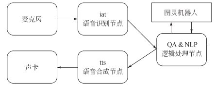

<center>图 8.1 语音交互</center>

本章将进入机器语音的学习，让机器人能跟人进行语义对话交流。本章将涉及到语音识别、语音播放、语音合成、智能语音应答等方面的知识。

## 8.1 语音识别

### 8.1.1 PocketSphinx 功能包

ROS 中的 PocketSphinx 是一个离线的计算量和体积都很小的嵌入式语音识别引擎，可以提供语音识别功能。PocketSphinx 是在 Sphinx-2 的基础上针对嵌入式系统的需求进行修改、优化而来的，是第一个开源面向嵌入式的中等词汇量连续语音识别项目。

**（1）PocketSphinx 功能包的安装**

在 ROS Indigo 系统中安装 PocketSphinx 非常方便、快捷，可以直接安装 ros-indigo-pocketsphinx的二进制文件。但是在 Kinetic 版本的 ROS 软件源中，没有集成 PocketSphinx 功能包的二进制文件。所以我们通过源码进行安装，以下是 Kinetic 版本安装 PocketSphinx 功能包的步骤：

① 安装依赖：需要安装的依赖有 ros-kinetic-audio-common、libasound2、libgstreamer0.10、python-gst0.10、gstreamer0.10-*等。安装步骤如下：

```bash
sudo apt-get install ros-kinetic-audio-common libasound2 gstreamer0.10-* python-gst0.10 -y
```

安装完依赖关系，接下来我们安装可用的功能包，这些功能包分别是 libsphinxbasel_0.8-6_amd64.deb、libpocketsphinxl_0.8-5_amd64.deb、libgstreamer- plugins-baseO.10-0_0.10.36-2ubuntu0.1_amd64. deb、gstreamer0. 10-pocketsphinx_ 0.8-5_amd64.deb ,可以在本书配套的资源包中找到。可以直接双击.deb 文件安装或者通过终端安装。

② 进入工作空间目录，下载 PocketSphinx 功能包的源码，编译功能包。

```bash
cd ~/catkin_ws/src
git clone https://github.com/mikeferguson/pocketsphinx
cd ~/catkin_ws/
catkin_make
```


③ 下载英文语音包 pocketsphinx-hmm-en-tidigits_0.8-5 并安装，该语音包可在本书配套的资源包中找到。

```bash
 sudo dpkg -i pocketsphinx-hmm-en-tidigits_0.8-5_all.deb 
```


④ 在 PocketSphinx 包里创建一个 model 目录，存放解压的语音模型文件。

````bash
cd ~/dev/catkin_ws/src/pocketsphinx
mkdir model
sudo cp -r /usr/share/pocketsphinx/model/* ～/catkin_ws/src/pocketsphinx/ model

⑤ 安装 PocketSphinx 训练好的声学模型。
```bash
sudo apt-get install pocketsphinx
```

这条命令安装完成后，会在/usr/local/lib/python3.5/dist-packages/目录下生成一个 PocketSphinx的包，在这个包下有个/model/en-us/，这里存放着 PocketSphinx 训练好的声学模型。按照以上步骤进行操作即可完成 PocketSphinx 功能包的编译和安装，进入 PocketSphinx 功能包目录，然后在终端输入以下命令：
````

```bash
tree –L 3
```

此时 PocketSphinx 功能包的目录结构如图 8.2 所示。


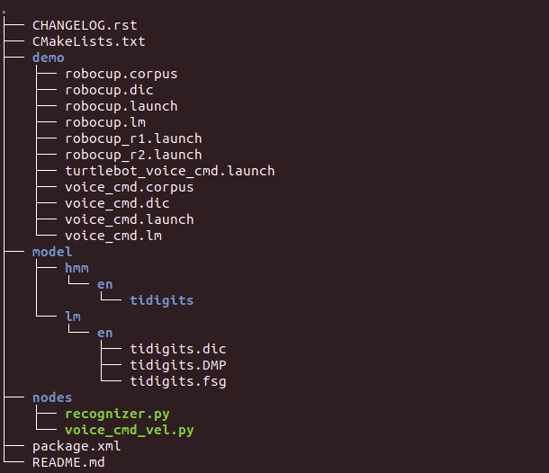

<center>图 8.2 PocketSphinx 功能包的目录结构</center>

**（2）PocketSphinx 功能包用法**

PocketSphinx 功 能 包 的 核 心 节 点 是recognizer.py 文件。这个文件通过麦克风收集语音信息，然后调用语音识别库进行识别并生成文本信息，通过/recognizer/output 消息进行发布，其他节点可以通过订阅该消息获取识别结果，并进行相应处理。下面我们列出PocketSphinx 功能包的一些接口。

① 话题和服务

PocketSphinx 功能包发布的话题和提供的服务如表 8.1 所示。

<center>表 8.1 PocketSphinx 功能包的话题和服务</center>

|         | 名称  | 类型            | 描述                     |
| ------- | ----- | --------------- | ------------------------ |
| topic   | out   | std_msgs/String | 识别结果的字符串         |
| service | start | std_srvs/Empty  | 连接音频流，开始语音识别 |
| service | stop  | std_srvs/Empty  | 断开音频流，停止语音识别 |

② 参数 PocketSphinx 功能包中可供配置的参数如表 8.2 所示。

<center>表 8.2 PocketSphinx 功能包配置参数</center>

| 参数 | 类型   | 描述                   |
| ---- | ------ | ---------------------- |
| lm   | string | 设置语言模型文件的路径 |
| dict | string | 设置字典文件的路径     |

### 8.1.2 PocketSphinx 功能包测试

首先检查麦克风是否接入，并在系统设置里进行测试，然后确保麦克风里有语音输入，确定麦克风正常工作，最后打开系统设置找到声音选项卡，找到输入那一列。操作如图 8.3 所示。

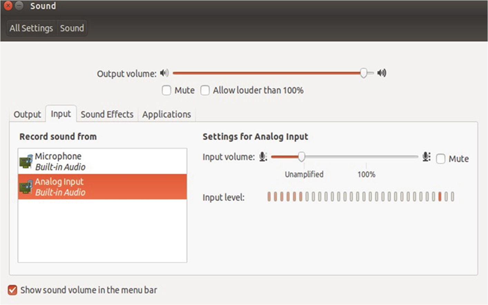

<center>图 8.3 麦克风测试图</center>

接下来，启动 launch 文件，测试 PocketSphinx 的语音识别功能。

```bash
roslaunch pocketsphinx robocup.launch
```

注意：若 PocketSphinx 功能包运行时发生创建滤波器失败，频率范围不匹配时，通常采用重新 连 接 语 音 引 擎 的 方 式 进 行 解 决 。 从 本 书 配 套 的 资 源 包 中 找 到 CMU Sphinx 语 音 引 擎pocketsphinx-hmm-en-tidigits，解压缩 deb 文件和其中的 data 数据包，复制其中的 model 文件到功能包中即可。然后需要对 recognizer.py 和 robocup.launch 文件进行修改：

① 修改 recognizer.py 文件。

```bash
cd ~/catkin_ws/src/pocketsphinx/nodes
vim recognizer.py
```
注释掉 py 文件中的`self.asr.set_property('configured', True)`。

② 添加 lm、dict、hmm 支持英语识别。

```python
self.asr.set_property('lm', '/usr/share/pocketsphinx/model/lm/en/tidigits.DMP')
self.asr.set_property('dict', '/usr/share/pocketsphinx/model/lm/en/tidigits.dic')
self.asr.set_property('hmm', '/usr/share/pocketsphinx/model/hmm/en/tidigits')
```

③ 修改 robocup.launch 文件。

修改 launch 文件，添加一项 hmm 参数。具体代码如下：

```xml
<launch>
    <node name="recognizer" pkg="pocketsphinx" type="recognizer.py" output="    screen">
        <param name="lm" value="$(find pocketsphinx)/demo/robocup.lm"/>
        <param name="dict" value="$(find pocketsphinx)/demo/robocup.dic"/>
        <param name="hmm" value="/usr/local/lib/python3.5/dist-packages/pocketsphinx/model/en-us"/>
    </node>
</launch>
```

接下来重新启动 launch 文件，输入`roslaunch pocketsphinx robocup.launch`来对一些简单的语句进行测试，输入语言必须是英语，例如 good、go to 等，看看能不能正确识别出来。当语音进行识别以后，我们可以直接查看 ROS 发布的结果信息，输入如下命令，操作结果如图 8.4 所示。

```bash
rostopic echo /recognizer/output
```


<center>图 8.4 语音识别英文测试图</center>

PocketSphinx 功能包仅仅提供一种离线的语音识别功能，默认支持的模型是非常有限的，在下一节中我们会学习如何添加语音库。

### 8.1.3 添加语音库

PocketSphinx 功能包的语音识别是属于离线识别，也就是将一些常用的词汇放到一个文件中，作为识别的文本库，然后分段识别语音信号，最后在文本库中搜索对应的文本信息。如果想看语音识别库中有哪些文本信息，可以通过下面的命令进行查询：

```bash
roscd pocketsphinx/demo
more robocup.corpus
```

我们可以自己向语音库中添加其他的文本识别信息，语音库中的可识别信息使用.txt 为后缀的文档存储。我们可以在 PocketSphinx 功能包下创建一个专门用来存放语音库相关文件的文件夹，例如 voicelab，并在文件夹下输入我们想要添加的文本信息，命名为 voice.txt，如图 8.5 所示。

```bash
roscd pocketsphinx/voicelab
more voice.txt
```


<center>图 8.5 文本信息添加图</center>

以上是需要添加的文本，我们也可以修改其中的某些文本，改成自己需要的。然后我们要把这个文件在线生成语音信息和库文件，这一步需要登录网站 http://www.speech.cs.cmu.edu/tools/lmtool-new.html，根据网站的提示信息上传文件，然后再点击“COMPILE KNOWLEDGEBASE”按钮进行在线编译生成库文件，如图 8.6 所示。

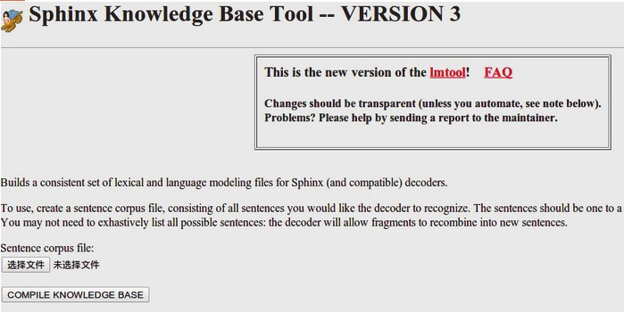

<center>图 8.6 在线生成语音信息和模板文件</center>

下载所需要的压缩文件，解压至 PocketSphinx 功能包的 voice 文件夹的 config 文件夹下，这些解压出来的 dic、lm 文件就是根据我们设计的语音识别命令生成的语音库，可以将这些文件都重命名为 voice 且后缀名保持不变。

### 8.1.4 创建 PocketSphinx 的 launch 文件

创建 launch 文件，并且修改对应的参数，来加载我们已经编译好的文本和库文件，启动语音识别节点，设置语音库的路径。voice.launch 文件的内容如下所示：

```xml
<launch>
    <node name="recognizer" pkg="pocketsphinx" type="recognizer.py" output="screen">
        <param name="lm" value="$($find pocketsphinx)/voicelab/voice.lm"/>
        <param name="dict" value="$($find pocketsphinx)/voicelab/voice.dic"/>
        <param name="hmm" value="/usr/local/lib/python3.5/dist-packages/pocketsphinx/model/en-us"/>
    </node>
</launch>
```

我们修改了 launch 文件参数的具体值也就是加载路径的位置，实现了用户自定义文本信息，得到想要的语音回应。launch 文件在运行 recognizer.py 节点的时候使用了之前生成的语音识别库和文件参数，这样就可以使用自己的语音库来进行语音识别了，使用如下命令即可实现离线语音库功能了。

```bash
roslaunch pocketsphinx voice.launch
rostopic echo /recognizer/output
```

如果我们需要使用其他的语音的模型，可以在网站 https://packages.debian.org/bullseye/pocketsphinx-en-us 下载，解压到工作空间后修改 launch 文件的 lm、dict、hmm 对应的路径就可以识别我们说的对应语音了。

## 8.2 语音播放
### 8.2.1 播放指定文件

ROS 中的 audio_common 是一个第三方音频开发包，它实现了音频驱动以及相关的 ROS 消息机制。其中 sound_play 库具有播放语音和语音合成的功能。使用 sound_play 实现文本转语音的步骤如下：

① 安装 audio_common 和相关依赖库。

```bash
sudo apt-get install ros-kinetic-audio-common libasound2 mplayer -y
```

② 打开终端，运行并测试 sound_play 主节点。

```bash
rosrun sound_play soundplay_node.py
```

③ 打开另一个终端，输入需要转化成语音的文本信息。

```bash
rosrun sound_play say.py "Hello World."
```

此时的机器人就可以实现说话的功能了，还可以使用第三方项目（如科大讯飞）让 XBot 机器人播放语音文件，命令为：

```bash
rosservice call /xbot/play "loop:false 
mode:1 #播放模式为将语音转换为文字
audio_path:'~/catkin_ws/xbot_talker/assets/wav/welcom.wav'
tts_text:""
"
```
其中 audio_path 后面是想要播放的语音文件的路径，可以自行修改。

### 8.2.2 将输入的文字转化为语音

我们可以让机器人播放输入的文字，只需要在机器人终端中输入如下命令启动/play 服务即可。

```bash
rosservice call /xbot/play "loop: false
mode:2 #播放模式为将文字转化为语音
audio_path:''
tts_text:"请和我打招呼"
"
```
其中可以将“请和我打招呼”替换为任何你想要播放的文字。语音播放成功后，终端会输出相应的提示，当显示“success：True”时，表明该命令执行成功。在输入命令时，可以使用 Tab键来自动补全，以避免命令输入错误，补全后只需修改相应参数即可。

## 8.3 通过语音控制机器人

### 8.3.1 语音控制小海龟

上一节我们实现了语音识别的功能，可以成功将英文语音命令识别生成对应的字符串，有了这一功能，就可以实现不少机器语音的应用。本节基于以上功能实现一个语音控制机器人的小应用，机器人就使用仿真环境中的小海龟，我们可以输入以下命令打开小海龟模拟节点，如图 8.7 所示。

```bash
rosrun turtlesim turtlesim_node
```

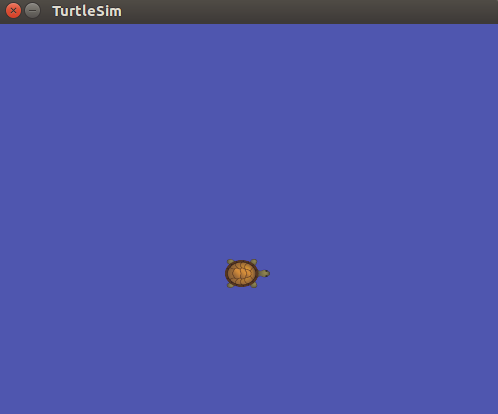

<center>图 8.7 小海龟模拟节点</center>

我们需要编写一个语音控制节点，订阅 PocketSphinx功能包并识别发布的“recognizer/output”消息，然后根据消息中的具体内容，比如 go、back 等内容来发布速度控制指令。该节点的实现在 robot_ voice/script/voice_teleop.py 中，代码的详细内容如下所示：

```python
import rospy
from geometry_msgs.msg import Twist
from std_msgs.msg import string
#初始化 ROS 节点，声明一个发布速度控制的 Publisher

rospy.init_node('voice_teleop')
pub = rospy.publisher('/turtle1/cmd_vel' , Twist, queue_size=10)
r = rospy.Rate(10)
#接收到语音命令后发布速度指令
def get_voice(data):
    voice_text=data.data
    rospy.loginfo("I said:: %s" , voice_text)
    twist = Twist()
    if voice_text == "go":
    	twist.linear.x =2
    elif voice_text == "back ":
    	twist.linear.x =-2
    elif voice_text == "left ":
    	twist.angular.z = 2
    elif voice_text == "right":
    	twist.angular.z = -2
    pub.publish(twist)

#订阅 PocketSphinx 语音识别的输出字符
def teleop():
    rospy.loginfo("Starting voice Teleop")
    rospy.subscriber("/recognizer/output", string, get_voice)
    rospy.spin()

while not rospy.is_shutdown():
	teleop()
```

以上代码的实现较为简单，通过一个 Subscriber 订阅/recognizer/output 话题。接收到语音识别的结果后进入回调函数，简单处理后通过 Publisher 发布控制小海龟运动的速度控制指令。接下来就可以运行这个语音控制的例程了，通过以下命令启动所有节点：

```bash
roslaunch robot_voice voice_commands.launch
rosrun robot_voice voice_teleop.py
rosrun turtlesim turtlesim_node
```

所有终端中的命令成功执行后，就可以打开小海龟的仿真界面。然后通过语音“go”“back”“left”
“right”等命令控制小海龟的运动，我们就可以在终端中看到语音控制的结果，如图 8.8 所示。


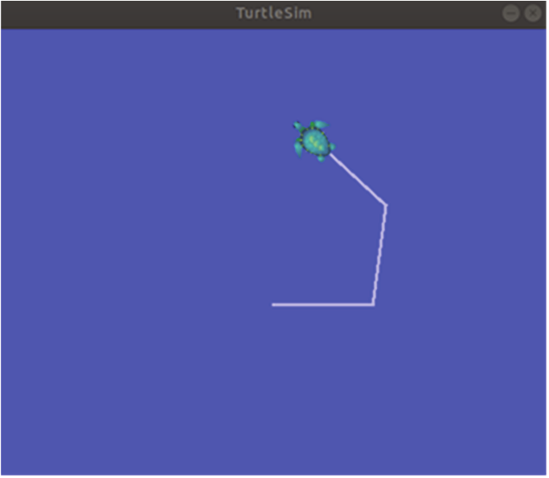

<center>图 8.8 语音控制小海龟的运行状态</center>

### 8.3.2 XBot 对话和语音控制

XBot 的/chat 服务提供了与机器人进行对话以及通过语音控制机器人的交互功能。运行以下命令即可进行交互以下使用 XBot 1.0 环境，使用 XBot2.0 环境请参考（https://www.droid.ac.cn/docs/ xbotu/intel.html#id2）：

```bash
roslaunch xbot_talker talker.launch
rosservice call /xbot/chat "start_chat:true"
```

执行该命令后，机器人会在一段时间内发出“嘟——嘟——”声，在听到声音之后即可开始与机器人交谈。结束对话时需要告诉机器人“关闭”。在机器人接收到语音输入的关闭命令后，会结束对话，在/chat 服务端返回 success。

初始配置的机器人已经能够回答一些简单的问题，包括：你好、你多大了、你是谁、你叫什么名字、你会什么、介绍一下你自己等。如果要设置更多问答以及更丰富的交互场景，可以按照下一小节教程进行自定义对话内容。

初始配置的部分对话内容如表 8.3 所示，用户可输入含有关键词的语音，与机器人进行交互。例如，如果问机器人“你几岁了？”，由于语音中包含关键词“几岁”，机器人就会根据已定义好的回答，回应“我已经三岁了”。

<center>表 8.3 初始配置对话表</center>

| 语音关键词 keyword                            | XBot 响应 answer                                             |
| --------------------------------------------- | ------------------------------------------------------------ |
| “你好”                                        | “我叫小德，希望我能成为您的好伙伴，请多指教。”               |
| “叫什么”“名字”                                | “我叫小德，希望我能成为您的好伙伴，请多指教。”               |
| “你多大”“几岁”                                | “我已经三岁啦。”                                             |
| “你来自”<br/>“介绍”“你自己”                   | “我来自重德智能公司”<br/>“您好，我是重德智能的机器人小德，集科研、教学、服务<br/>于一体的多功能机器人。” |
| “你是谁”                                      | “我是小德呀，你不认识我吗？我可认识你哦！”                   |
| “高兴”“见到你”                                | “我和你的每一次遇见都是我的小确幸。”                         |
| “会做什么”“你会什么”<br/>“你会做什么”         | “我可以和你一起学习,一起听歌，一起散步，做一切你想要我做的事情。” |
| “向前走”“向前走一步”                          | 以 0.1m/s 的速度前进一步                                     |
| “向后走”“向后走一步”“向后退”“向后<br/>退一步” | 以 0.1m/s 的速度后退一步                                     |
| “向左转”“向左旋转”                            | 以 0.78m/s 的速度向左旋转一下                                |
| “向右转”“向右旋转”                            | 以 0.78m/s 的速度向右旋转一下                                |
| “关闭”                                        | 关闭/chat 服务，停止交互对话                                 |

### 8.3.3 自定义对话内容

用户可以通过修改以下两个配置文件自定义对话内容。

**（1）修改 xbot_talker/assets/grammar.bnf 语法文件**

bnf 语法文件使用一种结构描述了用户可能说出的语言范围和构成模式。简单来说，机器人只能够识别该文件中定义的关键词，该文件可用文本文件打开并编辑。打开文件后，用户可直接在最后添加自定义的关键词，例如，添加关键词“你有弟弟吗”“你弟弟是谁”。如图 8.9 所示。关键词之间用“|”分隔开，“！id”后面小括号里的数字，依次往后加 1 即可，最后以分号“；”结束。

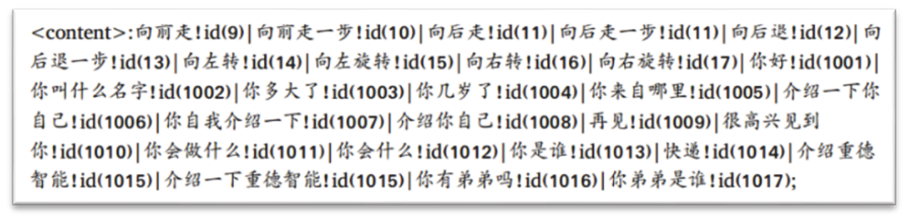

<center>图 8.9 关键词语句</center>

**（2）修改 xbot_talker/assets/new_dictionary.txt 文件**

打开 new_dictionary.txt 文件，在文件末尾“}”之前添加自定义的交互信息，如图 8.10 所示。

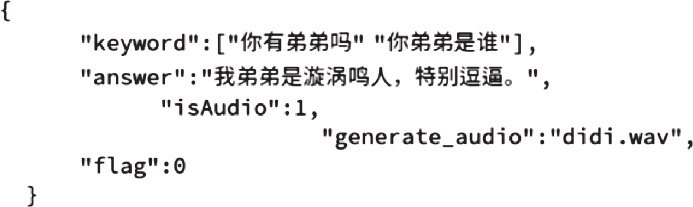

<center>图 8.10 交互词典</center>

在图 8.10 所示的交互词典中，每一组交互信息都要使用花括号“{}”括起来，并且每组信息之间用英文逗号“,”分隔开。

请注意以下几点：

① keyword 必须是 grammar.bnf 定义的关键词，否则机器人无法识别。

② answer 代表自定义的回答，可以是回复的语句，也可以是控制机器人前进、后退的指令。

③ isAudio 标志，“1”表示把 answer 里的文字转化为语音播出，语音文件存放在自定义的generate_audio 对应的“名称.wav”文件里。

④ flag 标志，1 表示进行语音回答后机器人不需要进行额外动作，0 表示机器人可能需要进行移动等动作。

修改完以上两个配置文件之后，就可以对 Xbot 进行语音交互测试，并且可以根据自己自定义的内容进行对话。

### 8.3.4 监控 talker 功能包的运行状态

我们可以通过/talk_state 话题实时监控机器人talker 功能包的运行情况，打开一个新的终端输入以下命令：

```bash
rostopic echo /talk_state
```

开启话题检测后，在启动/play 和/chat 的过程中，终端会显示该话题发布的消息，如图 8.11 所示。

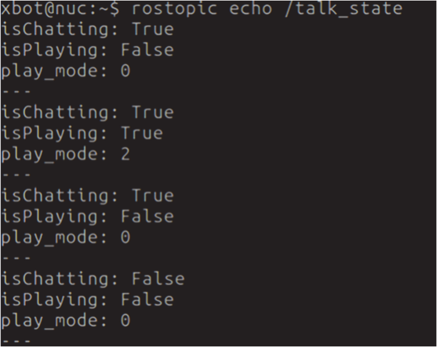

<center>图 8.11 talker 功能包运行状态</center>

其中，isChatting 标志为 True 表示正在进行对话，为 False 则表示没有进行对话； isPlaying 标志为True 表示正在播放音频，为 False 则表示没有播放；play_mode 标志为 0 表示没有播放，为 1 表示播放指定的音频文件，为 2 表示将文字转化为语音播放。

## 8.4 在 ROS 上使用科大讯飞

讯飞开放平台作为全球首个开放的智能交互技术服务平台，致力于为开发者打造一站式智能人机交互解决方案。目前，开放平台以“云+端”的形式向开发者提供语音合成、语音识别、语音唤醒、语义理解、人脸识别等多项服务。国内外企业、中小型创业团队和个人开发者，均可在讯飞开放平台直接体验世界领先的语音技术，并简单、快速集成到产品中，让产品具备“能听、会说、会思考、会预测”的功能。

### 8.4.1 下载科大讯飞 SDK

第一步：注册成为开发者。科大讯飞开放平台的官方网站是 http://www.xfyun.cn。进入讯飞开放平台快捷登录页，通过微信扫码、手机快捷登录，即可快速成为讯飞开放平台注册开发者，或者进入讯飞开放平台注册页，注册完整的开放平台账号，成为讯飞开放平台注册开发者。

第二步：登录平台后，通过右上角的“控制台”，或右上角下拉菜单的“我的应用”进入控制台。若账户未曾创建过应用，可创建第一个应用。给应用起一个名字，并填写相关的信息，如图 8.12 所示。

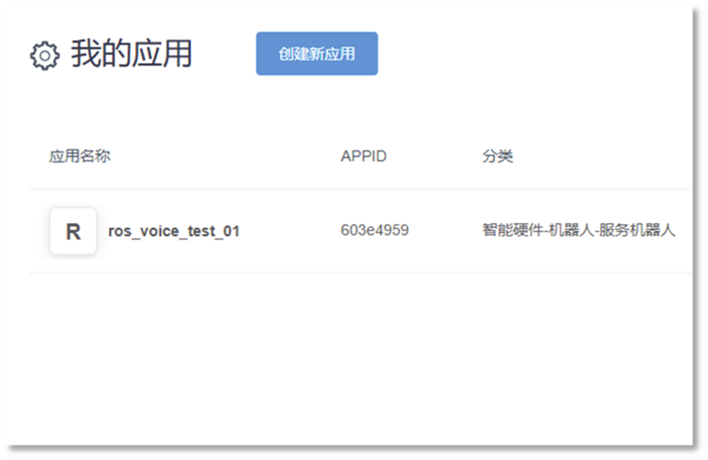

<center>图 8.12 创建应用</center>

点击提交按钮后，应用就创建完毕。应用创建完成之后，可以通过左侧的服务列表，选择要使用的服务。在服务管理面板中，将看到这个服务对应的可用量、历史用量、服务接口的验证信息，还有可以调用的 API 和 SDK 接口。

需要注意的是，并不是每个服务的管理面板都相同，不同的服务由不同的管理面板构成。另外，也不是每个服务同时都具有 SDK 和 API 接口，有些服务只有 API 接口，而有些服务只有 SDK接口。具体的可在对应的服务管理页中查看。

讯飞开放平台支持一个账户创建多个应用。当需要返回应用列表页切换应用时，可以点击页面左上角应用名称上方的返回按钮，或顶部右侧个人菜单中的“我的应用”。进入应用列表后，选择一个应用点击应用名称，即可进入这个应用对应的服务管理页。

第三步：获取 API 接口或下载 SDK 体验测试。在进入控制台对应的服务管理页之后，用户可以通过下载 SDK 或者获取 WebAPI 接口，就可以接入 AI 服务测试了，如图 8.13 所示。


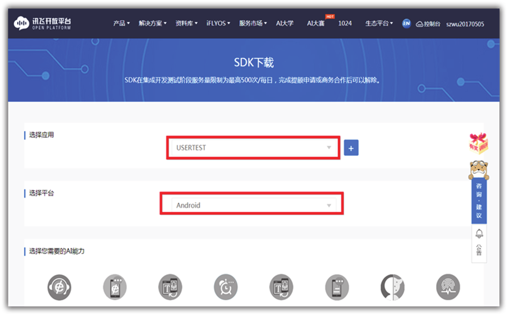

<center>图 8.13 SDK 下载</center>

如果应用需要采用 API 方式接入，用户可以通过服务管理页 API 版块，查看具体的调用接口，并通过“文档”，查阅开发文档，如图 8.14 所示。


<center>图 8.14 API 接口</center>

### 8.4.2 SDK 包测试

SDK 下载完成后，SDK 的版本当然是 Linux。我们可以使用自带的 demo 做一些测试，以便对科大讯飞的语音识别功能有一个大致的了解。将下载好的 SDK 解压到指定目录下，打开 SDK根目录下的 samples 文件夹，该文件夹中已包含科大讯飞 SDK 自带的示例代码，如图 8.15 所示。

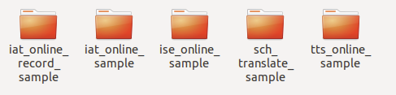

<center>图 8.15 科大讯飞 SDK 代码示例</center>

这里以 iat_online_record_sample 为例，在终端中进入该例程文件夹后，即可看到运行结果在根目录下的 bin 文件夹中，可以看到编译生成的可执行文件，如图 8.16 所示。进入 SDK 内samples/iat_online_record_sample 目录，视自己的电脑系统位数来选择脚本（source 64bit_make.sh 或 32bit_make.sh）并运行。


<center>图 8.16 生成的可执行文件</center>

运行成功后进入 SDK 的 bin 目录下，在终端中运行 iat_online_record_sample 二进制可执行文件，根据提示操作，不需要上传用户字典，在终端输入 0，则是语音输入源为麦克风，然后就可以看到 15s的语音输入提示。这时尝试对着麦克风说话，15s 后，示例应用开始进行在线语音识别，识别结果通过终端字符输出，如图 8.17 所示。

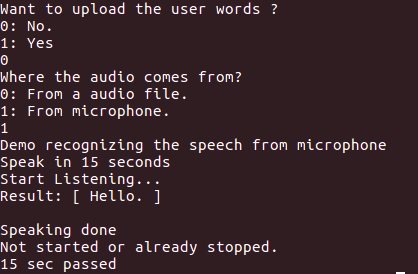

<center>图 8.17 示例运行结果</center>

这里如果出现了报错“Recognizer error 10407”，有 两 种 解 决 方 案 。 第 一 种 是 你 的 AppID 没 有 在samples/iat_record_sample.c 中填写，因为一个 AppID对应一个平台下一个应用的一个 SDK，所以你要保证你的 SDK 和 AppID 与你的应用具有唯一性。修改代码中的 AppID，修改为自己的 AppID。这样SDK 和 AppID 与你的应用就对应上了。

```python
const char* login_params = "appid = 593ff61d, work_dir = ."；
```

第二种解决方案是复制库文件进行链接，进入到 SDK 包主目录的 lib 文件夹下，根据自己的电脑选择系统位数，64 位选择“x64”，32 位选择”x86。执行以下命令：

```bash
sudo cp libmsc.so /usr/local/lib/
sudo ldconfig
```

执行完，再次运行程序，测试成功。

需要注意的是，该语音识别是在线任务，需要联网进行。而且为了减少 SDK 包在应用中占用过多内存，在官网下载单个功能的 SDK 包时，可能并不包含其他功能，如下载唤醒的 SDK 包时，可能不包含听写或合成等功能，因此在运行未包含功能的示例时，可能会报错。对此，请下载对应功能的 SDK，或下载组合的 SDK 包。目前科大讯飞已经适配日语、俄语、西班牙语、法语、韩语等各国语言，如需要请查看官网 API 文档（https://www.xfyun.cn/doc/mscapi/Windows&Linux/WLfilelist.html）。

### 8.4.3 ROS 结合科大讯飞进行语音听写

为 了 能 让 机 器 人 对 我 们 所 说 的 话 进 行 语 音 合 成 ， 我 们 基 于 科 大 讯 飞 的 “ ./iat_online_record_sample”示例，对源代码进行修改。添加了 ROS 的接口，方便和 ROS 系统进行交互，修改的源代码放入/pocketsphinx/demo/iat.cpp 文件中，主要的代码如下所示：

```python
int main(int argc, char* argv[ ])
{
    // 初始化 ROS
    ros::init(argc, argv, "voiceRecognition");
    ros::NodeHandle n;
    ros::Rate loop_rate(10);
    // 声明 Publisher 和 Subscriber
    // 订阅唤醒语音识别的信号
    ros::Subscriber wakeUpSub = n.subscribe("voiceWakeup", 1000, WakeUp);
    // 发布唤醒语音识别的信号
    ros::Publisher voiceWordsPub = n.advertise<std_msgs::String("voiceWords",1000);
    ROS_INFO("Sleeping...");
    int count=0;
    while(ros::ok())
    {
    // 语音识别唤醒
        if (wakeupFlag){
                ROS_INFO("Wakeup...");
                int ret = MSP_SUCCESS;
            //修改自己的 AppID
            const char* login_params = "appid = 593ff61d, work_dir = .";
            const char* session_begin_params =
                "sub = iat, domain = iat, language = zh_cn, "
                "accent = mandarin, sample_rate = 16000, "
                "result_type = plain, result_encoding = utf8";
                    ret = MSPLogin(NULL, NULL, login_params);
                if(MSP_SUCCESS != ret){
                    MSPLogout();
                    printf("MSPLogin failed , Error code %d.\n",ret);
                }
                printf("Demo recognizing the speech from microphone\n");
                printf("Speak in 10 seconds\n");
                demo_mic(session_begin_params);
                printf("10 sec passed\n");
                wakeupFlag=0;
                MSPLogout();
            }
            // 语音识别完成
            if(resultFlag){
                resultFlag=0;
                std_msgs::String msg;
                msg.data = g_result;
                voiceWordsPub.publish(msg);
            }
            ros::spinOnce();
            loop_rate.sleep();
            count++;
    	}
exit:
    MSPLogout(); // Logout...
    return 0;
}

```

主要修改了 iat.cpp 文件的主函数部分，加入了 Publisher 和 Subscriber，Subscriber 用来接收语音唤醒信号，接收到唤醒信号后，会将 wakeupFlag 变量置位，然后在主循环中调用 SDK 的语音听写功能，识别成功后置位 resultFlag 变量，通过 Publisher 将识别出来的字符串进行发布。接下来我们修改 CMakeLists.txt，只需添加一部分编译规则：

```cmake
add_executable(iat_publish
    src/iat.cpp
    src/speech_recognizer.c
    src/linuxrec.c)
target_link_libraries(
    iat_publish
    ${catkin_LIBRARIES}
    libmsc.so -ldl -lpthread -lm -lrt -lasound
)
```

需要将科大讯飞 SDK 的库文件复制到系统目录下，以便在后续的编译过程中可以链接到该库文件。进入 SDK 根目录下的 libs 文件夹，选择相应的平台架构，64 位系统选择“x64”，32 位系统选择“x86”，进入功能包文件夹后，使用如下命令完成复制：

```bash
cd libs
sudo cp libmsc.so /usr/lib/ libmsc.so
```

进入工作空间重新编译，然后对我们修改的 ROS 接口文件进行测试：

```bash
catkin_make
roscore
rosrun pocketsphinx iat
rostopic pub / s voicewakeup td_msgs/string "data： 'any string' "
```

我们发布唤醒信号后，可以看到“Start Listening...”的提示，然后就可以对着麦克风说联网完成在线识别后会将识别结果在终端进行显示，如图 8.18 所示。

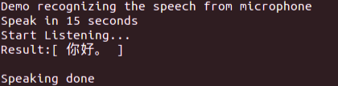

<center>图 8.18 语音听写实例</center>

## 8.5 智能语音对话

本节的智能语音部分，包括科大讯飞的语音唤醒、离线命令词识别、离线语音合成等 SDK 的融合，实现多功能的操作。并且通过图灵进行语义理解，最终实现智能语音对话。

### 8.5.1 tts 语音合成实现对话

**（1）创建应用程序**

通过 8.4.1 的方式下载语音唤醒、离线命令词识别、离线语音合成这三个 SDK，本书这里创建的应用程序名称是 KF，如图 8.19 所示。


<center>图 8.19 创建应用程序</center>

**（2）下载 SDK 功能包**

只有创建好应用程序才能下载 SDK，在 Ubuntu 中创建一个文件夹“SoftWare”，将需要下载的语音唤醒、离线命令词识别、离线语音合成等 SDK 解压到该文件夹下。

**（3）测试 SDK 功能包**

测试步骤如下：

① 先在终端输入以下命令下载 mplayer 播放器。

```bash
sudo apt-get install mplayer -y
```
② 到 tts_sample 目录下（在这里，你的 tts_sample 的路径可能与本书的路径不同）。

```bash
cd SoftWare/samples/tts_sample/
source 64bit_make.sh
make
```

③ 将“64bit_make.sh”这个文件夹复制到 bin 目录下，我们后面需要使用此文件夹。

```bash
cp 64bit_make.sh ../../bin/
```

④ 回到 bin 目录下。

```bash
cd SoftWare/bin/
./tts_sampl
```

⑤ 此时编译完成，

而且我们可以看到 bin 目录下多了一个 tts_sample.wav 文件，如图 8.20 所示。

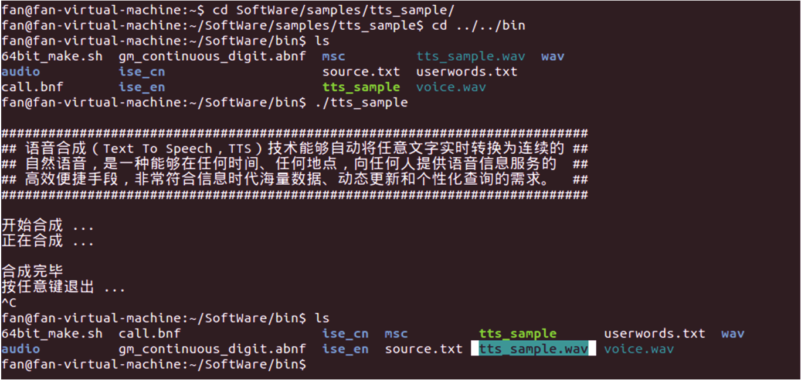

<center>图 8.20 生成的 tts_sample.wav 文件</center>

⑥ 我们需要播放 tts_sample.wav 文件的内容，在此之前需要下载 SOX，安装完以后才能用以下命令行来进行播放。

```bash
sudo apt install sox
play tts_sample.wav
```

至此，就能听到声音了，但是关掉命令窗口后重新执行 tts_sample 会发现找不到 libmsc.so，主要是因为没有 source 而找不到路径，但是为了以后不用每次都要 source，所以我们需要进行以下步骤：

```bash
cd SoftWare/libs/x64
sudo cp libmsc.so /usr/lib
```

这样以后就不用每次都 source 了，当我们在 bin 目录下再执行./tts_sample 就不会出错了。同时，需要在 tts_sample 中修改 Makefile 文件，在文件中加入“$（DIR_BIN）/*.wav”，使每次 make clean 都会删除之前的 wav 文件。

为了方便使用，在工作空间 catkin_ws 下创建一个包。

```bash
cd catkin_ws/src/
catkin_create_pkg voice_system std_msgs rospy roscpp
```

把科大迅飞包里的代码复制到你创建的包里，并重命名为 xf_tts.cpp。

```bash
cd SoftWare/samples/tts_sample/
cp tts_sample.c ~/catkin_ws/src/voice_system/src/
cd catkin_ws/src/voice_system/src/
mv tts_sample.c xf_tts.cpp
```

我们 cd 到 SoftWare/include 目录下把 include 复制到 voice_system 包中。

```bash
cd SoftWare/include
cp * ~/catkin_ws/src/voice_system/include
```

修改 xf_tts.cpp 文件，这时我们需要把 AppID 改为自己的 AppID 路径，qtts.h 等路径要改为自己的该文件的路径。xf_tts.cpp 的代码如下：

```cpp
#include <stdlib.h>

#include <stdio.h>

#include <unistd.h>

#include <errno.h>

#include <ros/ros.h>

#include <std_msgs/String.h>

#include "/home/fan/SoftWare/include/qtts.h"

#include "/home/fan/SoftWare/include/msp_cmn.h"

#include "/home/fan/SoftWare/include/msp_errors.h"

const char * fileName = "/home/fan/music/voice.wav";
const char * playPath = "play /home/fan/music/voice.wav";
typedef int SR_DWORD;
typedef short int SR_WORD;
/* wav 音频头部格式 */
typedef struct _wave_pcm_hdr {
  char riff[4];
  int size_8;
  // = "RIFF"
  // = FileSize - 8
  char wave[4]; // = "WAVE"
  char fmt[4];
  int fmt_size; // = "fmt "
  // = 下一个结构体的大小 : 16
  short int format_tag;
  short int channels;
  int samples_per_sec;
  Int avg_bytes_per_sec;
  ample / 8
  short int block_align;
  short int bits_per_sample;
  char data[4];
  int data_size;
  // = PCM : 1
  // = 通道数 : 1
  // = 采样率 : 8000 | 6000 | 11025 | 16000
  // = 每秒字节数 : samples_per_sec * bits_per_s
  // = 每采样点字节数 : wBitsPerSample / 8
  // = 量化比特数: 8 | 16
  // = "data"
  // = 纯数据长度 : FileSize - 44
}
wave_pcm_hdr;
/* 默认 wav 音频头部数据 */
wave_pcm_hdr default_wav_hdr = {
  {
    'R',
    'I',
    'F',
    'F'
  },
  0,
  {
    'W',
    'A',
    'V',
    'E'
  },
  {
    'f',
    'm',
    't',
    ' '
  },
  16,
  1,
  1,
  16000,
  32000,
  2,
  16,
  {
    'd',
    'a',
    't',
    'a'
  },
  0
};
/* 文本合成 */
int text_to_speech(const char * src_text,
  const char * des_path,
    const char * params) {
  int ret = -1;
  FILE * fp = NULL;
  const char * sessionID = NULL;
  unsigned int audio_len = 0;
  wave_pcm_hdr wav_hdr = default_wav_hdr;
  int synth_status = MSP_TTS_FLAG_STILL_HAVE_DATA;
  if (NULL == src_text || NULL == des_path) {
    printf("params is error!\n");
    return ret;
  }
  fp = fopen(des_path, "wb");
  if (NULL == fp) {
    printf("open %s error.\n", des_path);
    return ret;
  }
  /* 开始合成 */
  sessionID = QTTSSessionBegin(params, & ret);
  if (MSP_SUCCESS != ret) {
    printf("QTTSSessionBegin failed, error code: %d.\n", ret);
    fclose(fp);
    return ret;
  }
  ret = QTTSTextPut(sessionID, src_text, (unsigned int) strlen(src_text), NULL);
  if (MSP_SUCCESS != ret) {
    printf("QTTSTextPut failed, error code: %d.\n", ret);
    QTTSSessionEnd(sessionID, "TextPutError");
    fclose(fp);
    return ret;
  }
  printf("正在合成 ……\n");
  fwrite( & wav_hdr, sizeof(wav_hdr), 1, fp); //添加 wav 音频头，使用采样率为 16000
  while (1) {
    /* 获取合成音频 */
    const void * data = QTTSAudioGet(sessionID, & audio_len, & synth_status, &
      ret);
    if (MSP_SUCCESS != ret)
      break;
    if (NULL != data) {
      fwrite(data, audio_len, 1, fp);
      wav_hdr.data_size += audio_len; //计算 data_size 大小
    }
    if (MSP_TTS_FLAG_DATA_END == synth_status)
      break;
  }
  printf("\n");
  if (MSP_SUCCESS != ret) {
    printf("QTTSAudioGet failed, error code: %d.\n", ret);
    QTTSSessionEnd(sessionID, "AudioGetError");
    fclose(fp);
    return ret;
  }
  /* 修正 wav 文件头部数据的大小 */
  wav_hdr.size_8 += wav_hdr.data_size + (sizeof(wav_hdr) - 8);
  /* 将修正过的数据写回文件头部,音频文件为 wav 格式 */
  fseek(fp, 4, 0);
  fwrite( & wav_hdr.size_8, sizeof(wav_hdr.size_8), 1, fp);
  fseek(fp, 40, 0);
  //写入 size_8 的值
  //将文件指针偏移到存储 data_size 值的位置
  fwrite( & wav_hdr.data_size, sizeof(wav_hdr.data_size), 1, fp);
  //写入 data_
  size 的值
  fclose(fp);
  fp = NULL;
  /* 合成完毕 */
  ret = QTTSSessionEnd(sessionID, "Normal");
  if (MSP_SUCCESS != ret) {
    printf("QTTSSessionEnd failed, error code: %d.\n", ret);
  }
  return ret;
}
int makeTextToWav(const char * text,
  const char * filename) {
  int ret = MSP_SUCCESS;
  const char * login_params = "appid = 5b090780, work_dir = .";
  //登录参数,AppID
  与 msc 库绑定, 请勿随意改动
  /*
  * rdn:
  合成音频数字发音方式
  * volume: 合成音频的音量
  * pitch: 合成音频的音调
  * speed: 合成音频对应的语速
  * voice_name: 合成发音人
  * sample_rate: 合成音频采样率
  * text_encoding: 合成文本编码格式
  *
  */
  const char * session_begin_params = "engine_type = local,voice_name=xiaofeng,
  text_encoding = UTF8, tts_res_path = fo | res / tts / xiaofeng.jet;
  fo | res / tts / common.
  jet, sample_rate = 16000, speed = 50, volume = 50, pitch = 50, rdn = 0 ";
  /* 用户登录 */
  ret = MSPLogin(NULL, NULL, login_params);
  //第一个参数是用户名，第二个参数是
  密码， 第三个参数是登录参数， 用户名和密码可在 http: //www.xfyun.cn 上注册获取
    if (MSP_SUCCESS != ret) {
      printf("MSPLogin failed, error code: %d.\n", ret);
    }
  else {
    printf("开始合成 ……\n");
    ret = text_to_speech(text, filename, session_begin_params);
    if (MSP_SUCCESS != ret) {
      printf("text_to_speech failed, error code: %d.\n", ret);
    }
    printf("合成完毕\n");
  }
  MSPLogout();
  return 0;
}
void playWav() {
  system(playPath);
}
void topicCallBack(const std_msgs::String::ConstPtr & msg) {
  std::cout << "get topic text:" << msg -> data.c_str();
  makeTextToWav(msg -> data.c_str(), fileName);
  playWav();
}
int main(int argc, char * argv[]) {
  const char * start = "科大迅飞在线语音合成模块启动";
  makeTextToWav(start, fileName);
  playWav();
  ros::init(argc, argv, "xf_tts_node");
  ros::NodeHandle n;
  ros::Subscriber sub = n.subscribe("/voice/xf_tts_topic", 3, topicCallBack);
  ros::spin();
  return 0;
}
```

在 CMakeLists.txt 文件的“include_directories”后加入“include”，需要在文件末尾加入：

```cmake
add_executable（xf_tts_node src/xf_tts.cpp）
target_link_libraries （ xf_tts_node ${catkin_LIBRARIES} -lmsc -lrt -ldl -lpthread）
```

修改后的 CMakeLists.txt 代码如下：

```cmake
cmake_minimum_required(VERSION 2.8.3)
project(voice_system)
find_package(catkin REQUIRED COMPONENTS
    roscpp
    rospy
    std_msgs)
include_directories(include${catkin_INCLUDE_DIRS})
add_executable(xf_tts_node src/xf_tts.cpp)
target_link_libraries(xf_tts_node ${catkin_LIBRARIES} -lmsc -lrt -ldl-lpthread)
```

到 catkin_ws 目录下进行编译，编译完成之后，需要在终端输入 roscore，再输入以下命令重新打开终端到 catkin_ws 目录下运行 xf_tts_node 节点。

```bash
cd catkin_ws
rosrun voice_system xf_tts_node
```

此时，你能听到“科大迅飞在线语音合成模块启动”的声音，如图 8.21 所示。


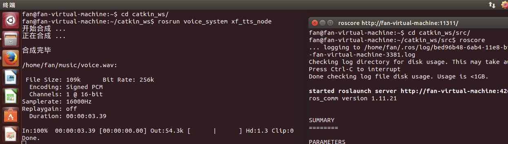

<center>图 8.21 科大讯飞包成功启动</center>

重新打开一个终端窗口，在 catkin_ws 目录下发布一个话题。

```bash
cd catkin_ws
rostopic pub /voice/xf_tts_topic std_msgs/String 你好
```

此时，你会听到“你好”的声音，这时 ROS 上已成功运行科大迅飞语音模块。

### 8.5.2 通过图灵进行语义理解

图灵机器人 AI 开放平台，具有智能对话、知识库、技能服务三种核心功能，它能准确地对中文语义进行理解，可以借助图灵机器人的 API 接口，根据自己的需要创建聊天机器人、客服机器人、领域对话问答机器人、儿童陪伴机器人等在线服务。

我们需要通过图灵进行语义理解，首先到图灵的官网（http://www.tuling123.com/）申请一个帐号，申请完以后，需要创建一个机器人，我们这里的机器人叫“聊天机器人”，创建好后会获得一个密匙，然后将密匙后的开关关掉。

下载好之后，在 vioce_system 包中的 src 文件夹下创建一个 tuling_nlu.cpp 文件。以下是tuling_nlu.cpp 的内容。注意：需要把代码中的 key 改为自己创建机器人的 key，需要把“curl_easy_setopt（pCurl, CURLOPT_URL, "http://openapi.tuling123.com/openapi/api"）”中的网址改为自己机器人的接口地址，这个地址可以在机器人的 API 文档中找到。

```cpp
#include<ros/ros.h>

#include<std_msgs/String.h>

#include<iostream>

#include<sstream>

#include<jsoncpp/json/json.h>

#include<curl/curl.h>

#include<string>

#include<exception>

using namespace std;
int flag = 0;
string result;
int writer(char * data, size_t size, size_t nmemb, string * writerData) {
  unsigned long sizes = size * nmemb;
  if (writerData == NULL)
    return -1;
  writerData -> append(data, sizes);
  return sizes;
}
int parseJsonResonse(string input) {
  Json::Value root;
  Json::Reader reader;
  bool parsingSuccessful = reader.parse(input, root);
  if (!parsingSuccessful) {
    std::cout << "!!! Failed to parse the response data" << std::endl;
    return -1;
  }
  const Json::Value code = root["code"];
  const Json::Value text = root["text"];
  result = text.asString();
  flag = 1;
  std::cout << "response code:" << code << std::endl;
  std::cout << "response text:" << result << std::endl;
  return 0;
}
int HttpPostRequest(string input) {
    string buffer;
    std::string strJson = "{";
    strJson += "\"key\" : \"093f05b003c643bbae919b353c3a12ff\","; //双引号前加／防转义
    strJson += "\"info\" : ";
    strJson += "\"";
    strJson += input;
    strJson += "\"";
    strJson += "}";
    std::cout << "post json string: " << strJson << std::endl;
    try {
      CURL * pCurl = NULL;
      CURLcode res;
      // In windows, this will init the winsock stuff
      curl_global_init(CURL_GLOBAL_ALL);
      // get a curl handle
      pCurl = curl_easy_init();
      if (NULL != pCurl) {
        // 设置超时时间为 10 秒
        curl_easy_setopt(pCurl, CURLOPT_TIMEOUT, 10);
        // First set the URL that is about to receive our POST
        // This URL can just as well be a
        // https:// URL if that is what should receive the data
        curl_easy_setopt(pCurl, CURLOPT_URL, "http://openapi.tuling123.
          com / openapi / api ");
          //curl_easy_setopt(pCurl, CURLOPT_URL, "http://192.168.0.2/posttest.
          cgi ");
          // 设置 http 发送的内容类型为 JSON
          curl_slist * plist = curl_slist_append(NULL, "Content-Type:application/
            json; charset = UTF - 8 ");
            curl_easy_setopt(pCurl, CURLOPT_HTTPHEADER, plist);
            // 设置要 POST 的 JSON 数据
            curl_easy_setopt(pCurl, CURLOPT_POSTFIELDS, strJson.c_str()); curl_easy_setopt(pCurl, CURLOPT_WRITEFUNCTION, writer); curl_easy_setopt(pCurl, CURLOPT_WRITEDATA, & buffer);
            // Perform the request, res will get the return code
            res = curl_easy_perform(pCurl);
            // Check for errors
            if (res != CURLE_OK) {
              printf("curl_easy_perform() failed:%s\n", curl_easy_ strerror(res));
            }
            // always cleanup
            curl_easy_cleanup(pCurl);
          }
          curl_global_cleanup();
        }
        catch (std::exception & ex) {
          printf("curl exception %s.\n", ex.what());
        }
        if (buffer.empty()) {
          std::cout << "!!! ERROR The Tuling sever response NULL" << std::endl;
        } else {
          parseJsonResonse(buffer);
        }
        return 0;
      }
      void arvCallBack(const std_msgs::String::ConstPtr & msg) {
        std::cout << "your quesion is: " << msg -> data << std::endl;
        HttpPostRequest(msg -> data);
      }
      int main(int argc, char ** argv) {
        ros::init(argc, argv, "tuling_nlu_node");
        ros::NodeHandle nd;
        ros::Subscriber sub = nd.subscribe("voice/tuling_nlu_topic", 10,
          arvCallBack);
        ros::Publisher pub = nd.advertise < std_msgs::String > ("/voice/xf_tts_topic", 10);
        ros::Rate loop_rate(10);
        while (ros::ok()) {
          if (flag) {
            std_msgs::String msg;
            msg.data = result;
            pub.publish(msg);
            flag = 0;
          }
          ros::spinOnce();
          loop_rate.sleep();
        }
      }
```

在 CMakeLists.txt 文件中加入如下代码：

```cmake
add_executable(tuling_nlu_node src/tuling_nlu.cpp)
target_link_libraries(tuling_nlu_node {catkin_LIBRARIES} -lcurl –ljsoncpp)
```
修改好的 CMakeLists.txt 如下：

```cmake
cmake_minimum_required(VERSION 2.8.3)
project(voice_system)
find_package(catkin REQUIRED COMPONENTS
    roscpp
    rospy
    std_msgs )
include_directories( include${catkin_INCLUDE_DIRS})
add_executable(xf_tts_node src/xf_tts.cpp)
target_link_libraries(xf_tts_node ${catkin_LIBRARIES} -lmsc -lrt -ldl -lpthread)
add_executable(tuling_nlu_node src/tuling_nlu.cpp)
target_link_libraries(tuling_nlu_node ${catkin_LIBRARIES} -lcurl -ljsoncpp)
```

然后进入 catkin_ws 工作空间中进行编译：

```bash
cd catkin_ws
catkin_make
```

现在就可以和图灵机器人对话了，首先在终端输入 roscore，然后在 catkin_ws 下运行 xf_tts_node节点和 tuling_nlu_node 节点。

```bash
rosrun voice_system xf_tts_node
rosrun voice_system tuling_nlu_node
rostopic pub -1 /voice/tuling_nlu_topic std_msgs/String "明天北京天气"
```
至此，你便能听到图灵机器人的回复了，如图 8.22 所示。


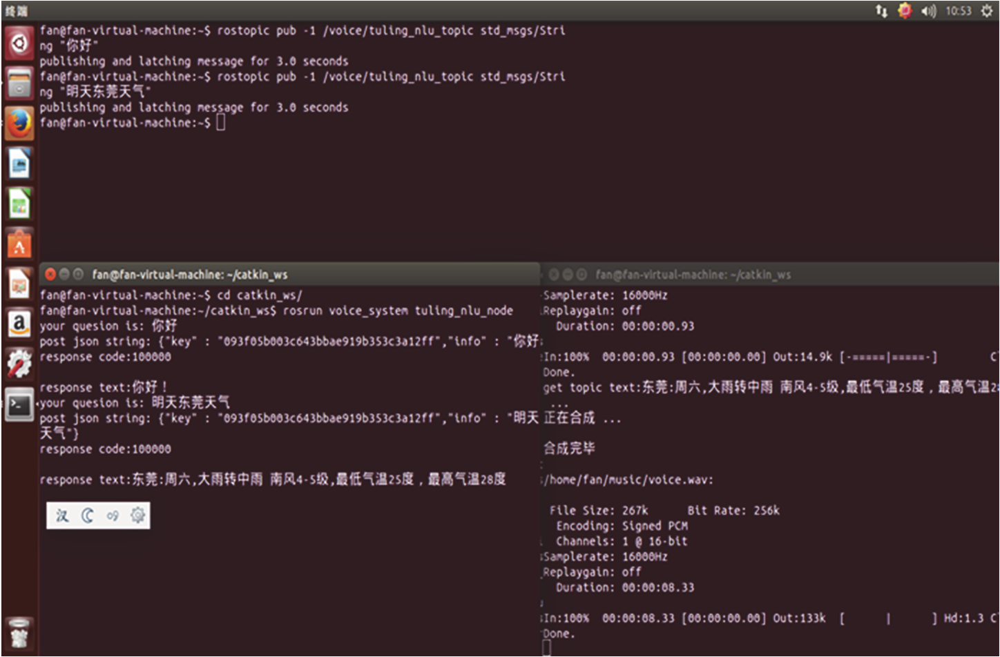

<center>图 8.22 图灵机器人回复</center>

在 CMakeListss.txt 文件的末尾加入两行代码，修改完的 CMakeLists.txt 文件如下：

```cmake
cmake_minimum_required(VERSION 2.8.3)
project(voice_system)
find_package(catkin REQUIRED COMPONENTS
    roscpp
    rospy
    std_msgs)
include_directories(include${catkin_INCLUDE_DIRS} )
add_executable(xf_tts_node src/xf_tts.cpp)
target_link_libraries(xf_tts_node ${catkin_LIBRARIES} -lmsc -lrt -ldl -lpthread)
add_executable(tuling_nlu_node src/tuling_nlu.cpp)
target_link_libraries(tuling_nlu_node ${catkin_LIBRARIES} -lcurl -ljsoncpp)
add_executable(xf_asr_node src/xf_asr.cpp src/speech_recognizer.cpp src/
linuxrec.cpp)
target_link_libraries(xf_asr_node ${catkin_LIBRARIES} -lmsc -lrt -ldl
-lpthread-lasound)
```

接下来我们需要修改 linuxrec.cpp，详细代码见教学包。最后在 catkin_ws 工作空间中进行编译：

```bash
cd catkin_ws
catkin_make
```

现在就可以和机器人对话了，首先在终端输入：

```bash
roscore
```
然后在 catkin_ws 下运行 xf_tts_node、tuling_nlu_node 和 xf_asr_node 这三个节点，操作截图如图 8.23 所示。


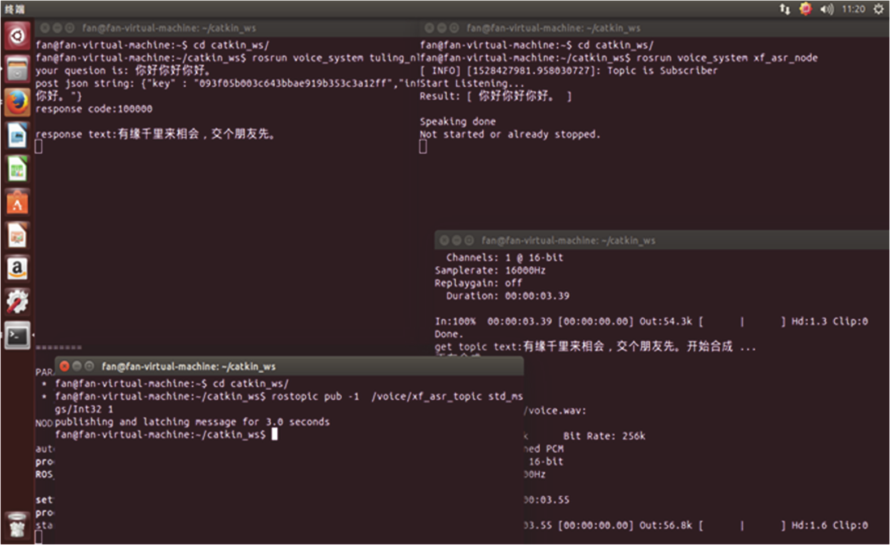

<center>图 8.23 发布语音节点信息</center>

```bash
cd ~/catkin_ws
rosrun voice_system xf_tts_node
rosrun voice_system tuling_nlu_node
rosrun voice_system xf_asr_node
rostopic pub -1 /voice/xf_asr_topic std_msgs/Int32 1
```

这样我们就实现了机器人和人之间的语音交流功能，是不是非常地神奇。自己的机器人也能像其他智能问答机器人一样，能够与你沟通自如了。

## 8.6 本章小结

通过对本章的学习，你应该了解了机器语音是如何实现的，学会了如何通过语音控制机器人、语音播放和与机器人实现对话交流，并且对 ROS 功能包、科大讯飞 SDK 和图灵语义有了一定的了解和认识。

接下来我们将让机器人自己动起来，通过创建地图和重定位来实现机器人 SLAM 和自主导航。

## 8.7 习题

1. PocketSphinx 功能包是通过哪个节点发布信息的？
2. PocketSphinx 功能包仅仅提供离线的语音交互吗？可以实现在线语音交互吗？
3. 怎样通过 ROS 系统来播放指定的音频文件？
4. 自定义对话内容是怎样进行修改的？
5. 科大讯飞功能包的 AppID 有什么作用？每个用户只能拥有一个 AppID 吗？

