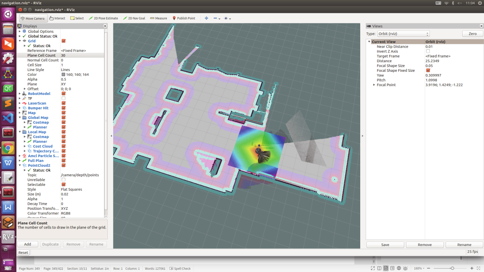
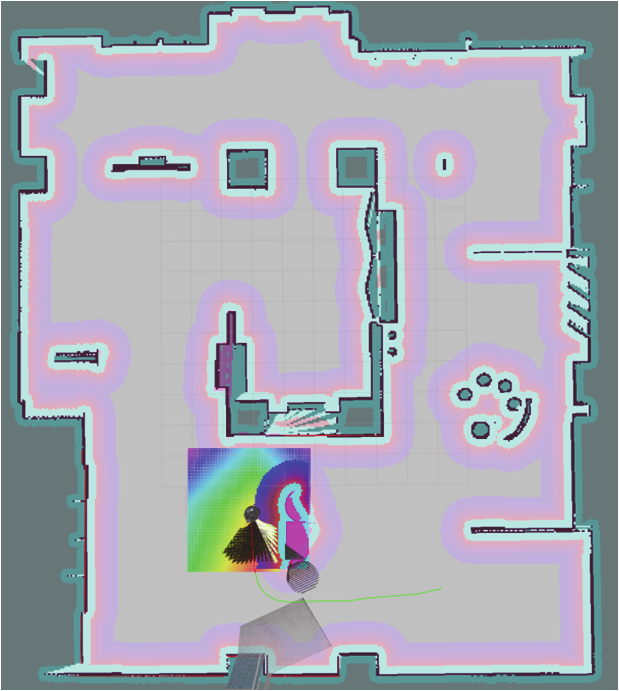
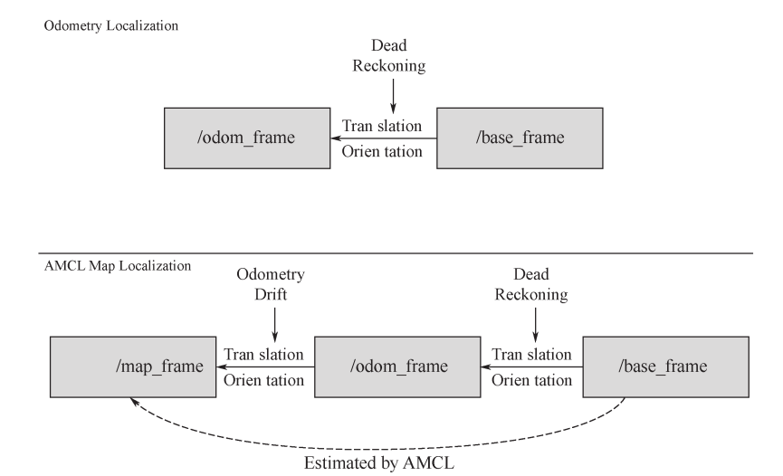

# 第 9 章 机器人SLAM与自主导航开发技术

机器人具有高度自规划、自组织、自适应能力，适合于在复杂的非结构化环境中工作。SLAM和导航技术是机器人的研究核心，同时也是机器人实现智能化及完全自主的关键技术。机器人只有准确地知道自身的位置、工作空间中障碍物的位置以及障碍物的运动情况，才能安全、有效地进行自主运动。所以，机器人的自身定位问题就显得尤为重要。定位和位置估计也是自主式机器人最重要的能力之一。

机器人 SLAM 研究的问题包含许许多多的领域，我们常见的几个研究的问题包括建图（Mapping）、定位（Localization）和路径规划（Path Planning），如果机器人带有机械臂，那么运动规划（Motion Planning）也是重要的一个环节。而同步定位与建图（Simultaneous Localization And Mapping，SLAM）问题位于定位和建图的交集部分，如图 9.1 所示。SLAM 需要机器人在未知的环境中逐步建立地图，然后根据地图确定自身位置，从而进一步定位。


<center>图 9.1 SLAM 研究问题总览</center>

下面我们来介绍一下经典的 SLAM 框架，了解一下经典 SLAM（图优化） 究竟由哪几个模块组成，如图9.2 所示。


<center>图 9.2 经典 SLAM 框架</center>

SLAM 框架中的每个环节都有具体的作用：

① 里程计：能够通过相邻帧之间的图像估计相机运动，并恢复场景的空间结构。只计算相邻时刻的运动，而和过去的信息没有关联。当然也会存在一些问题，仅通过里程计来估计轨迹，将不可避免地出现累积漂移。由于里程计的工作方式，先前时刻的误差将会传递到下一时刻，导致经过一段时间之后，估计的轨迹将不再准确。

② 后端滤波：主要是优化和处理 SLAM 过程中噪声的问题，通俗地说就是如何从这些带有噪声的数据中估计整个系统的状态，以及这个状态估计的不确定性有多大，这里的状态既包括机器人自身的轨迹，又包括地图。

③ 回环检测：也称闭环检测，主要解决位置估计随时间漂移的问题。判断机器人是否曾经到达过先前的位置，如果检测到回环，它会把信息提供给后端进行处理。

④ 建图：机器人根据估计的轨迹，建立与任务要求对应的地图。介绍完 SLAM 的经典框架，相信大家对机器人 SLAM 流程有了大概的了解。这一章我们来学
习 ROS 中 SLAM 的一些功能包，也就是一些常用的 SLAM 算法，例如 Gmapping、Hector、Cartographer、Navigation 等算法。这一章我们不会过多地关注算法背后的数学原理，而是更注重工程实现的方法，告诉你 SLAM 算法包是如何工作的，以及怎样快速地搭建 SLAM 算法。我们将学习这些功能包的使用方法，并且使用仿真环境和真实机器人实现这些功能。

## 9.1 理论基础

### 9.1.1 传感器

要完成机器人的 SLAM 和自主导航，机器人首先要有感知周围环境的能力，尤其要有感知周围环境深度信息的能力，因为这是探测障碍物的关键数据。这里我们将讲述它们的工作原理及在ROS 中的存储格式，希望大家会对传感器这一部分有更进一步的认识。

**（1）激光雷达**

激光雷达（见图 9.3）是通过发射激光束来探测目标的位置、速度等特征量的雷达系统。其工作原理是向目标发射探测信号（激光束），然后将接收到的从目标反射回来的信号（目标回波）与发射信号进行比较，适当处理后，就可获得目标的有关信息。


<center>图 9.3 激光雷达实物</center>

激光 SLAM 采用 2D 或 3D 激光雷达（也叫单线或多线激光雷达），2D 激光雷达一般用于室内机器人（如扫地机器人等），而 3D 激光雷达一般用于无人驾驶领域。激光雷达的出现和普及使得测量更快、更准，信息更丰富。激光雷达采集到的物体信息呈现出一系列分散的、具有准确角

度和距离信息的点，被称为点云。通常，激光 SLAM 系统通过对不同时刻两片点云的匹配与比对，计算激光雷达相对运动的距离和姿态的改变，也就完成了对机器人自身的定位。3D 激光雷达在ROS 中的数据格式是点云数据格式 PointCloud2，2D 激光雷达数据格式是 LaserScan。

激光雷达的优点是：①分辨率高。激光雷达可以获得极高的角度、距离和速度分辨率。通常角分辨率不低于 0.1mard（可以分辨 3km 距离上相距 0.3m 的两个目标），距离分辨率可达 0.lm，速度分辨率能达到 10m/s 以内。②隐蔽性好、抗有源干扰能力强。③低空探测性能好。④体积小，质量小。

激光雷达的缺点是：工作时受天气和大气影响较大，且 2D 激光雷达仅能获得平面信息，而3D 激光雷达价格昂贵。

**（2）IMU 惯性测量单元**

惯性导航元件（IMU）的惯性测量单元（见图 9.4）是运动惯性导航系统（用于飞机、航天器、船舶、无人驾驶飞机、无人机和导弹导航）的主要组件。惯性测量单元是测量物体的三轴姿态角（或角速率）以及加速度的装置。一个 IMU 包含了三个单轴的加速度计和三个单轴的陀螺仪，加速度计检测物体在载体坐标系统独立三轴的加速度信号，而陀螺仪检测载体相对于导航坐标系的角速度信号，测量物体在三维空间中的角速度和加速度，并以此解算出物体的姿态。


<center>图 9.4 IMU 惯性测量单元</center>

因为惯性导航系统拥有这种能力，我们可以使用航迹推算的方法，即从 IMU 的传感器收集数据（IMU 在 ROS 中的数据格式是 Imu），然后通过计算得到机器人的位置。值得注意的是，IMU提供的是一个相对的定位信息，它的作用是测量相对于起点物体所运动的路线，所以它并不能提供具体位置的信息，因此，它常常和 GPS 一起使用，在某些 GPS 信号微弱的地方，IMU 就可以发挥它的作用，可以让机器人继续获得绝对位置的信息，不至于“迷路”。

**（3）相机**

SLAM 中使用的相机与我们平时见到的单反摄像头并不是同一个东西。它往往更加简单，且不携带昂贵的镜头，以一定速率拍摄周围的环境，形成一个连续的视频流。普通的摄像头能以 30张图片每秒的速度采集图像，高速相机则更快一些。按照相机的工作方式，我们把相机分为单目（Monocular）、双目（Stereo）和深度相机（RGB-D）三个大类，如图 9.5 所示。


<center>图 9.5 单目、双目和深度相机</center>

① 单目相机 只用一个摄像头进行 SLAM 的方式称为单目 SLAM，这种传感器结构特别简单、成本特别低，所以单目 SLAM 非常受研究者关注。单目相机的数据就是照片，照片就是拍照时的场景在相机的成像平面上留下的一个投影，它以二维的形式反映了三维的世界，在这个过程中丢掉了一个维度即深度（距离）。我们无法通过单张照片计算场景中的物体与我们之间的距离。

相机将三维世界中的一点（米制单位）映射到二维图像平面（像素单位）的过程可以用多种几何模型进行描述，其中最简单的是针孔模型，它描述了一束光线通过针孔后在针孔背面投影成像的过程。如图 9.6 所示，展示了空间一点 M 在针孔相机成像平面上的成像过程。


<center>图 9.6 相机成像模型</center>

由于单目相机只是三维空间的二维投影，所以，如果我们真想恢复三维结构，必须移动相机的视角。在单目 SLAM 中也是同样的原理。我们必须移动相机之后，才能估计它的运动，同时估计场景中物体的远近和大小。

② 双目相机 双目相机一般由左眼相机和右眼相机两个水平放置的相机构成。每一个相机都可看成针孔相机，两个相机光圈追踪的距离称为双目相机的基线（见图 9.7）。通过这个基线（需要进行大量计算并且是不太可靠的）来估计每个像素的空间位置，从而测量物体与物体之间的距离。双目相机克服了单目相机无法获得距离的缺点。


<center>图 9.7 双目相机模型</center>

双目相机类似于人眼，可以通过左右眼图像的差异，判断物体的远近，在计算机上也是同样的道理。双目相机测量到的深度范围与基线相关，基线距离越大，能够测量到的深度范围就越大。双目相机的距离估计是比较左右眼的图像获得的，并不依赖其他传感器设备，所以它既可以应用在室内，又可以应用于室外。双目或多目相机的缺点是配置与标定均较为复杂，其深度量程和精度受双目的基线与分辨率限制，而且视差的计算非常消耗计算资源，需要使用 GPU 和 FPGA 设备加速后，才能实时输出整张图像的距离信息。因此在现有的条件下，计算量是双目相机面临的主要问题之一。

**③ RGB-D 相机**

深度相机又称 RGB-D 相机，是 2010 年左右开始兴起的一种相机，它最大的特点是可以通过红外结构光或 Time-of-Flight（ToF）原理，像激光传感器那样，通过主动向物体发射光并接收返回的光，测出物体离相机的距离。这部分并不是像双目相机那样通过软件计算来解决，而是通过物理的测量手段，所以相比于双目相机可节省大量的计算成本。目前常用的RGB-D 相机包括 Kinect/Kinect V2、Xtion Pro、RealSense 等。不过，现在多数 RGB-D 相机还存在测量范围窄、噪声大、视野小、易受日光干扰、无法测量透射材质等诸多问题，在 SLAM 方面，主要用于室内 SLAM，室外则较难应用。

### 9.1.2 地图

对于家用扫地机器人来说，这种主要在低矮平面里运动的机器人，只需要一个二维的地图来标记哪里可以通过，哪里存在障碍物，就足够它在一定范围内导航了。而对于一个相机而言，它有六自由度的运动，我们至少需要一个三维的地图。有些时候，我们想要一个漂亮的重建结果，不仅是一组空间点，还需要带纹理的三角面片（一种三维几何模型）。另一些时候，我们又不关心地图的样子，只需要知道“A 点到 B 点可通过，而 B 点到 C 点不行”这样的事情，甚至，有时我们不需要地图，或者地图可以由其他人提供，例如行驶的车辆往往可以得到已经绘制好的当地地图。

对于地图，我们有太多不同的需求。因此，相比于前面提到的视觉里程计、回环检测和后端优化，建图并没有一个固定的形式和算法。一组空间点的集合可以称为地图，一个漂亮的 3D 模型亦是地图，一个标记着城市、村庄、铁路、河道的图片亦是地图。地图的形式随 SLAM 的应用场合而定。大体上讲，它们可以分为度量地图与拓扑地图两种。

度量地图强调精确地表示地图中物体的位置关系，通常我们用稀疏（Sparse）与稠密（Dense）对它们进行分类。稀疏地图进行了一定程度的抽象，并不需要表达所有的物体。例如，我们选择一部分具有代表意义的东西，称之为路标（Landmark），那么一张稀疏地图就是由路标组成的地图，而不是路标的部分就可以忽略掉。相对地，稠密地图着重于建模所有看到的东西。对于定位来说，稀疏路标地图就足够了。

拓扑地图相比于度量地图的精确性，则更强调地图元素之间的关系。拓扑地图是一个图（Graph），由节点和边组成，只考虑节点间的连通性，例如 A 点、B 点是连通的，而不考虑如何从 A 点到达 B 点的过程。它放宽了地图对精确位置的需求，去掉了地图的细节问题，是一种更为紧凑的表达方式。然而，拓扑地图不擅长表达具有复杂结构的地图。如何对地图进行分割形成节点与边，又如何使用拓扑地图进行导航与路径规划，仍是有待研究和解决的问题。ROS 中的地图很好理解，就是一张普通的灰度图像，通常为 pgm 格式。这张图像上的黑色像素表示障碍物，白色像素表示可行区域，灰色是未探索的区域，如图 9.8 所示。


<center>图 9.8 SLAM 地图的灰度理解</center>

在 SLAM 建图过程中，你可以在 Rviz 里看到一张地图被逐渐建立起来的过程，类似于一块块拼图被拼接成一张完整的地图。这张地图对于我们定位、路径规划都是不可缺少的信息。事实上，地图在 ROS 中是以 topic 的形式维护和呈现的，这个 topic 名称就叫做/map，它的消息类型是nav_msgs/OccupancyGrid。

由于/map 中实际上存储的是一张图片，为了减少不必要的开销，这个 topic 往往采用锁存（Latched）的方式来发布。什么是锁存？其实就是：地图如果没有更新，就维持着上次发布的内容不变，此时如果有新的订阅者订阅消息，就只会收到一个/map 的消息，也就是上次发布的消息；只有当地图更新了（比如 SLAM 又建立出新的地图），这时/map 才会发布新的内容。锁存器的作用是将发布者最后一次发布的消息保存下来，然后自动地把它发送给后来的订阅者。这种方式非
常适合变动较慢、相对固定的数据（例如地图），而且它只发布一次，相比于同样的消息不定时的发布，锁存的方式既可以减少通信中对带宽的占用，又可以减少消息资源维护的开销。然后我们来看一下地图的 OccupancyGrid 类型是如何定义的，可以通过命令 `rosmsg show nav_msgs/OccupancyGrid` 来查看消息，或者直接通过命令 `rosed nav_msgs OccupancyGrid.msg`来查看 srv 文件。

```
std_msgs/Headerheader
    #消息的报头
    uint32 seq
    time stamp
    string frame_id
#地图消息绑定在 TF 的 frame 上，一般为 map
nav_msgs/MapMetaData info #地图相关信息
    timemap_load_time
    float32 resolution
    #加载时间
    #分辨率 单位：m/pixel
    uint32 width #宽的单位：pixel
    uint32 height #高的单位：pixel
    geometry_msgs/Pose origin
        #原点
        geometry_msgs/Point position
            float64 x
            float64 y
            float64 z
        geometry_msgs/Quaternion orientation
            float64 x
            float64 y
            float64 z
float64 w
int8[] data #地图具体信息
```

这个 srv 文件定义了/map 话题的数据结构，包含了三个主要的部分： header、 info 和 data。 header是消息的报头，保存了序号、时间戳、frame 等通用信息；info 是地图的配置信息，它反映了地图的属性；data 是真正存储这张地图数据的部分，它是一个可变长数组。int8 后面加了“[]”，你可以理解为一个类似于 vector 的容器，它存储的内容有 width×height 个 int8 型的数据，也就是这张地图上每个像素。

## 9.2 Gmapping 算法

ROS 的开源社区汇集了许多 SLAM 算法，可以直接使用或进行二次开发。Gmapping 采用Rao-Blackwellized Particle Filters（RBPF）的方法，运用重采样自适应技术，充分考虑粒子耗散问题和粒子逐渐更新权重而收敛的特性，降低了机器人位置在粒子滤波中的不确定性，从而使机器人对里程计信息获取、激光束点阵的优化采集等信息的采集质量有大幅度提升，使建图更加完整、准确。

### 9.2.1 Gmapping 功能包

Gmapping 算法是目前基于激光雷达和里程计方案里面一种比较可靠和成熟的算法，它基于粒子滤波，采用 RBPF 的方法，达到的效果非常稳定，许多基于 ROS 的机器人 SLAM 算法都是使用的 gmapping_slam。这个软件包位于 ros-perception 组织中的 slam_gmapping 仓库中。其中的slam_gmapping 是一个 Metapackage，它依赖了 Gmapping 功能包，而算法具体实现都在 Gmapping软件包中，该软件包中的 slam_gmapping 程序就是在 ROS 中运行的 SLAM 节点。如果你感兴趣，可以阅读一下 Gmapping 的论文和源代码以及开源的 SLAM 算法，有兴趣的读者可以阅读 openslam中 Gmapping 算法的相关论文。网址为：http://openslam.org/gmapping.html。

如果你的 ROS 安装的是 desktop-full 版本，会默认带有 Gmapping。可以用以下命令来检测Gmapping 是否安装：

```bash
apt-cache search ros-$ROS_DISTRO-gmapping -y
```
如果提示没有，可以直接用 apt 进行二进制安装。

```bash
sudo apt-get install ros-$ROS_DISTRO-gmapping -y
```

Gmapping 在 ROS 上运行的方法很简单，输入如下命令即可运行：

```bash
rosrun gmapping slam_gmapping
```

由于 Gmapping 算法中需要设置的参数很多，这种启动单个节点的效率很低。所以我们往往会把 Gmapping 的启动写到 launch 文件中，同时把 Gmapping 需要的一些参数也提前设置好，写进launch 文件或 yaml 文件。具体可参考教学软件包中的 slam_sim_demo 中的 gmapping_demo.launch和 robot_gmapping.launch.xml 文件。

Gmapping package 里包含一个名为 slam_gmapping 的节点，它允许我们使用激光雷达和机器人的位置信息创建一个 2D 的地图，这个节点接收激光雷达的信息和机器人的关节变换信息，然后将这些信息转换为 Occupancy Grid Map（OGM），也就是常用的栅格地图。

在运行 Gmmaping 功能包时，我们需要创建一个 launch 文件来运行 Gmapping package。启动一个 slam_gmapping 节点，然后开始在环境中移动机器人。slam_gmapping 节点去订阅激光雷达信息（/scan）和机器人的变换信息（/tf）来建立一个地图。通过/map 话题来发布建立好的地图信，
之后使用 Rviz 查看该地图。

Gmapping 建 立 的 栅 格 地 图 通 过 /map 话 题 进 行 发 布 ， 这 个 话 题 的 消 息 类 型 是nav_msgs/OccupancyGrid，它由一个取值范围在 0～100 的整数来表示，为 0 表示这个位置完全没有任何障碍物，为 100 表示这个位置已经完全被障碍物占领了，除此之外，如果是-1 则表示这个位置的地图情况完全未知。

只能建立地图是不够的，我们还应该掌握地图信息保存的方法，我们可以使用 map_server 去进行保存。打开一个终端，运行 rosrun map_server map_saver -f my_map。通过这个命令我们可以把当前正在运行的程序中的地图保存下来，保存下来的文件中有两个部分，my_map.pgm 文件和my_map.yaml 文件，分别是地图的图片信息和地图的配置文件。

使用 Gmapping 的第一步就是创建一个运行 Gmapping 节点的 launch 文件，主要用于节点参数的配置，launch 文件代码如下：

```xml
<launch>
	<arg name="scan_topic" default="scan" />
	<arg name="base_frame" default="base_footprint"/>
	<arg name="odom_frame" default="odom"/>
	<node pkg="gmapping" type="slam_gmapping" name="slam_gmapping" output="screen">
		<param name="base_frame" value="$(arg base_frame)"/>
		<param name="odom_frame" value="$(arg odom_frame)"/>
		<param name="map_update_interval" value="1.0"/>
		<!--底盘坐标系-->
		<!--里程计坐标系-->
		<!--更新时间(s)，多久更新一次地图，不是频率-->
		<param name="maxUrange" value="20.0"/>
		<!--激光雷达最大可用距离，在此之外的数据截断不用-->
		<param name="maxRange" value="25.0"/>
		<param name="sigma" value="0.05"/>
		<param name="kernelSize" value="1"/>
		<param name="lstep" value="0.05"/>
		<param name="astep" value="0.05"/>
		<param name="iterations" value="5"/>
		<param name="lsigma" value="0.075"/>
		<param name="ogain" value="3.0"/>
		<param name="lskip" value="0"/>
		<param name="minimumScore" value="200"/>
		<param name="srr" value="0.01"/>
		<param name="srt" value="0.02"/>
		<param name="str" value="0.01"/>
		<param name="stt" value="0.02"/>
		<param name="linearUpdate" value="0.5"/>
		<param name="angularUpdate" value="0.436"/>
		<param name="temporalUpdate" value="-1.0"/>
		<param name="resampleThreshold" value="0.5"/>
		<param name="particles" value="80"/>
		<param name="xmin" value="-25.0"/>
		<param name="ymin" value="-25.0"/>
		<param name="xmax" value="25.0"/>
		<param name="ymax" value="25.0"/>
		<param name="delta" value="0.05"/>
		<param name="llsamplerange" value="0.01"/>
		<param name="llsamplestep" value="0.01"/>
		<param name="lasamplerange" value="0.005"/>
		<param name="lasamplestep" value="0.005"/>
		<remap from="scan" to="$(arg scan_topic)"/>
	</node>
	<!-- Move base -->
	<!--include file="$(find navigation_sim_demo)/launch/include/velocity_smoother.launch.xml"/-->
	<!--include file="$(find navigation_sim_demo)/launch/include/safety_controller.launch.xml"/-->
	<arg name="odom_frame_id" default="odom"/>
	<arg name="base_frame_id" default="base_footprint"/>
	<arg name="global_frame_id" default="map"/>
	<arg name="odom_topic" default="odom" />
	<arg name="laser_topic" default="scan" />
	<node pkg="move_base" type="move_base" respawn="false" name="move_base" output="screen">
		<rosparam file="$(find navigation_sim_demo)/param/costmap_common_params.yaml"command="load" ns="global_costmap" />
		<rosparam file="$(find navigation_sim_demo)/param/costmap_common_params.yaml"command="load" ns="local_costmap" />
		<rosparam file="$(find navigation_sim_demo)/param/local_costmap_params.yaml" command="load" />
		<rosparam file="$(find navigation_sim_demo)/param/global_costmap_params.yaml" command="load" />
		<rosparam file="$(find navigation_sim_demo)/param/dwa_local_planner_params.yaml" command="load" />
		<rosparam file="$(find navigation_sim_demo)/param/move_base_params.yaml" command="load" />
		<rosparam file="$(find navigation_sim_demo)/param/global_planner_params.yaml" command="load" />
		<rosparam file="$(find navigation_sim_demo)/param/navfn_global_planner_params.yaml" command="load" />
		<!-- reset frame_id parameters using user input data -->
		<param name="global_costmap/global_frame" value="$(arg global_frame_ id)"/>
		<param name="global_costmap/robot_base_frame" value="$(arg base_frame_ id)"/>
		<param name="local_costmap/global_frame" value="$(arg odom_frame_id)"/>
		<param name="local_costmap/robot_base_frame" value="$(arg base_frame_ id)"/>
		<param name="DWAPlannerROS/global_frame_id" value="$(arg odom_frame_ id)"/>
		<remap from="odom" to="$(arg odom_topic)"/>
		<remap from="scan" to="$(arg laser_topic)"/>
		<remap from="cmd_vel" to="/cmd_vel_mux/input/navi"/>
	</node>
</launch>
```

然 后 通 过 在 终 端 输 入 命 令 roslaunch slam_sim_demo gammaping_demo.launch 使 用Gmapping 功能包，运行 Gmapping 效果如图 9.9 所示。



<center>图 9.9 SLAM 地图的灰度理解</center>

### 9.2.2 Gmapping 计算图

Gmapping 的作用是根据激光雷达和里程计（Odometry）的信息，对环境地图进行构建，并且对自身状态进行估计。因此，它的输入应当包括激光雷达和里程计的数据，而输出应当有自身位置信息和地图。下面我们从计算图（消息的流向）的角度来看看 Gmapping 算法在实际运行中的结构，如图 9.10 所示。


<center>图 9.10 SLAM 地图的灰度理解</center>

位于中心的是我们运行的 slam_gmapping 节点，这个节点负责整个 Gmapping 的 SLAM 工作。Gmapping 的输入 topic 主要有两个：

① /tf 以及/tf_static：坐标变换，类型为第一代的 tf/tfMessage 或第二代的 tf2_msgs/TFMessage。其中一定要提供的有两个 TF，一个是 base_frame 与 laser_frame 之间的 TF，即机器人底盘和激光雷达之间的变换；另一个是 base_frame 与 odom_frame 之间的 TF，即底盘和里程计原点之间的坐标变换。odom_frame 可以理解为里程计原点所在的坐标系。

② /scan：激光雷达数据，类型为 sensor_msgs/LaserScan。 /scan 很好理解，是 Gmapping SLAM所必需的激光雷达数据，而/tf 是一个比较容易忽视的细节。尽管/tf 这个 topic 听起来很简单，但它维护了整个 ROS 三维世界里的转换关系，而 slam_gmapping 要从中读取的数据是 base_frame 与laser_frame 之间的 TF，只有这样才能够把周围障碍物变换到机器人坐标系下，更重要的是base_frame 与 odom_frame 之间的 TF，这个 TF 反映了里程计（电机的光电码盘、
视觉里程计、IMU）的监测数据，也就是机器人里程计测得的距离，它会把这段距离变换后发布到 odom_frame 和laser_frame 之间。因此 slam_gmapping 会从/tf 中获得机器人里程计的数据。

Gmapping 的输出 topic 主要有：

① /tf：主要是输出 map_frame 和 odom_frame 之间的变换。

② /slam_gmapping/entropy：std_msgs/Float64 类型，反映了机器人位姿估计的分散程度。

③ /map：slam_gmapping 建立的地图。

④ /map_metadata：地图的相关信息。

输出的/tf 里有一个很重要的信息，就是 map_frame 和 odom_frame 之间的变换，这其实就是对机器人的定位。通过连通 map_frame 和 odom_frame，这样 map_frame 与 base_frame，甚至与laser_frame 都连通了。这样便实现了机器人在地图上的定位。同时，输出的 topic 里还有/map，在上一节我们介绍了地图的类型，在 SLAM 场景中，地图是作为 SLAM 的结果被不断地更新和发布的。

### 9.2.3 话题和服务

Gmapping 功能包中发布/订阅的话题和提供的服务如表 9.1 所示。

<center>表 9.1 Gmapping 功能包中发布/订阅的话题和提供的服务</center>


### 9.2.4 参数

Gmapping 功能包中可供配置的参数如表 9.2 所示。

<center>表 9.2 Gmapping 功能包中可供配置的参数</center>

| 参数                     | 类型   | 默认值    | 描述                                                         |
| ------------------------ | ------ | --------- | ------------------------------------------------------------ |
| throttle_scans           | int    | 1         | 每接收到该数量帧的激光数据后只处理其中的一帧                 |
| base_frame               | string | base_link | 机器人基坐标系                                               |
| map_frame                | string | map       | 地图坐标系                                                   |
| odom_frame               | string | odom      | 里程计坐标系                                                 |
| map_update_interval      | float  | 5.0       | 地图更新频率，该值越低，计算负载越大                         |
| maxUrange                | float  | 80.0      | 激光可探测的最大范围                                         |
| sigma                    | float  | 0.05      | 端点匹配的标准差                                             |
| kernelSize               | int    | 1         | 在对应的内核中进行查找                                       |
| lstep                    | float  | 0.05      | 平移过程中的优化步长                                         |
| astep                    | float  | 0.05      | 旋转过程中的优化步长                                         |
| iterations               | int    | 5         | 扫描匹配的迭代次数                                           |
| lsigma                   | float  | 0.075     | 似然计算的激光标准差                                         |
| ogain                    | float  | 3.0       | 似然计算时用于平滑重采样效果                                 |
| lskip                    | int    | 0         | 每次扫描跳过的光束数                                         |
| minimumScore             | float  | 0.0       | 扫描匹配结果的最低值，当使用有限范围（例如 5m）的激光扫描仪时，可以避免在大开放空间中跳跃姿势估计 |
| srr                      | float  | 0.1       | 平移函数（rho/rho），平移时的里程误差                        |
| srt                      | float  | 0.2       | 旋转函数（rho/theta），平移时的里程误差                      |
| str                      | float  | 0.1       | 平移函数（theta/rho），旋转时的里程误差                      |
| stt                      | float  | 0.2       | 旋转函数（theta/theta），旋转时的里程误差                    |
| linearUpdate             | float  | 1.0       | 机器人每平移该距离后处理一次激光扫描数据                     |
| angularUpdate            | float  | 0.5       | 机器人每旋转该弧度后处理一次激光扫描数据                     |
| temporalUpdate           | float  | -1.0      | 如果最新扫描处理的速度比更新的速度慢，则处理一次扫描，该值为负数时关闭基于时间的更新 |
| resampleThreshold        | float  | 0.5       | 基于 Neff 的重采样阈值                                       |
| particles                | int    | 30        | 滤波器中的粒子数目                                           |
| xmin                     | float  | -100.0    | 地图 x 向初始最小尺寸                                        |
| ymin                     | float  | -100.0    | 地图 y 向初始最小尺寸                                        |
| xmax                     | float  | 100.0     | 地图 x 向初始最大尺寸                                        |
| ymax                     | float  | 100.0     | 地图 y 向初始最大尺寸                                        |
| delta                    | float  | 0.05      | 地图分辨率                                                   |
| llsamplerange            | float  | 0.01      | 似然计算的平移采样距离                                       |
| llsamplestep             | float  | 0.01      | 似然计算的平移采样步长                                       |
| lasamplerange            | float  | 0.005     | 似然计算的角度采样距离                                       |
| lasamplestep             | float  | 0.005     | 似然计算的角度采样步长                                       |
| transform_publish_period | float  | 0.05      | TF 变换发布的时间间隔                                        |
| -occ_thresh              | float  | 0.25      | 栅格地图占用率的阈值                                         |
| maxRange                 | float  | —         | 传感器的最大范围                                             |

### 9.2.5 里程计误差及修正

目前 ROS 中常用的里程计广义上包括车轮上的光电码盘、惯性导航元件（IMU）、视觉里程计。你可以只用其中的一个作为 odom，也可以选择多个进行数据融合，融合结果作为 odom。通常来说，实际 ROS 项目中的里程计会发布两个 topic：

① /odom：类型为 nav_msgs/Odometry，反映里程计估测的机器人位置、方向、线速度、角速度信息。

② /tf：主要是输出 odom_frame 和 base_frame 之间的 TF。这段 TF 反映了机器人的位置和方向变换，数值与/odom 中的相同。

由于以上三种里程计都是对机器人的位姿进行估计，存在着累积误差，因此当运动时间较长时，odom_frame 和 base_frame 之间变换的真实值与估计值的误差会越来越大。你可能会想，能否用激光雷达数据来修正 odom_frame 和 base_frame 的 TF 呢？事实上 Gmapping 不是这么做的，里程计估计的是多少，odom_frame 和 base_frame 的 TF 就显示多少，永远不会去修正这段 TF。Gmapping 的做法是把里程计误差的修正发布到 map_frame 和 odom_frame 之间的 TF 上，也就是把误差补偿在了地图坐标系和里程计原点坐标系之间。通过这种方式来修正定位。这样 map_frame和 base_frame 之间，甚至和 laser_frame 之间就连通了，实现了机器人在地图上的定位。

## 9.3 Hector 算法

Hector 是一个实时的利用网格构建地图的 SLAM 系统，只需要较少的计算资源。它结合了使用激光雷达系统的鲁棒扫描匹配方法和基于惯性传感器的三维姿态估计系统。通过使用地图梯度的快速近似和多分辨率网格，实现了在各种具有挑战性的环境中具备可靠的定位和映射能力。虽然 Hector 系统不提供明确的闭环能力，但它应用在很多室内场景时已经足够准确了。该算法已成功用于无人地面机器人、无人地面车辆、手持测绘设备和四旋翼无人机的应用案例。

### 9.3.1 Hector 功能包

hector_slam 的核心节点是 hector_mapping，该节点使用 TF 进行扫描数据的变换，不需要里程计数据。该节点订阅“/scan”话题以获取 SLAM 所需的激光数据。在 ROS 的软件源中已经集成了 hector-slam 相关的功能包，可以使用如下命令对 Hector 功能包进行二进制安装：

```bash
sudo apt-get install ros-noetic-hector-slam -y
```

使用 Hector 的第一步就是创建一个运行 Hector 节点的 launch 文件，主要用于节点参数的配置，launch 文件代码如下：

```xml
<launch>
	<node pkg="hector_mapping" type="hector_mapping" name="hector_height_ mapping" output="screen">
		<!--Frame names-->
		<param name="pub_map_odom_transform" value="true"/>
		<param name ="map_frame" value ="map"/>
		<param name="base_frame" value="base_link" />
		<param name="odom_frame" value="odom" />
		<!--TF use-->
		<param name="use_tf_scan_transformation" value="true"/>
		<param name="use_tf_pose_start_estimate" value="false"/>
		<!--mapsize /start point-->
		<param name="map_resolution" value="0.05"/>
		<param name="map_size" value="1024"/>
		<param name="map_start_x" value="0.5"/>
		<param name="map_start_y" value="0.5"/>
		<param name="laser_z_min_value" value="-1.0"/>
		<param name="laser_z_max_value" value="1.0"/>
		<param name="map_multi_res_levels" value="2"/>
		<param name="map_pub_period" value="1"/>
		<param name="laser_min_dist" value="0.4"/>
		<param name="laser_max_dist" value="5.5"/>
		<param name="output_timing" value="false"/>
		<param name="pub_map_scanmatch_transform" value="true"/>
		<!--map update parameter-->
		<param name="update_factor_free" value="0.45"/>
		<param name="update_factor_occupied" value="0.7"/>
		<param name="map_update_distance_thresh" value="0.1"/>
		<param name="map_update_angle_thresh" value="0.05"/>
		<!--Advertising config-->
		<param name="scan_topic" value="scan" />
		<param name="advertise_map_service" value="true"/>
		<param name="map_with_known_poses" value="false"/>
		<param name="scan_subscriber_queue_size" value="5"/>
	</node>
	<!-- Move base -->
	<include file="$(find navigation_sim_demo)/launch/include/move_base.launch.xml"/>
</launch>
```

我们可以在终端输入 `roslaunch slam_sim_demo hector_demo.launch` 来运行 Hector 功能包，运行效果如图 9.11 所示。


<center>图 9.11 Hector 运行效果图</center>

### 9.3.2 Hector 计算图

Hector 算法的效果不如 Gmapping、Karto，因为它仅用到激光雷达信息。这样建图与定位的依据就不如多传感器结合的效果好。但 Hector 适合手持移动或者本身就没有里程计的机器人使用。Hector 的计算图如图 9.12 所示。


<center>图 9.12 Hector 的计算图</center>

位于中心的节点叫作 hector_mapping，它的输入和其他 SLAM 框架类似，都包括了/tf 和/scan，另外 Hector 还订阅了一个/syscommand 话题，这是一个字符串型的 topic，当接收到 reset 消息时，地图和机器人的位置都会初始化到最初的位置。

在输出的 topic 方面，Hector 多了一个/poseupdate 和/slam_out_pose，前者是具有协方差的机器人位姿估计，后者是没有协方差的位姿估计。

### 9.3.3 话题和服务

hector_mapping 节点中发布/订阅的话题和提供的服务如表 9.3 所示。

<center>表 9.3 hector_mapping 节点中的话题和服务</center>


### 9.3.4 参数

hector_mapping 节点功能包中可供配置的参数如表 9.4 所示。

<center>表 9.4 hector_mapping 节点中可供配置的参数</center>

| 参数                                  | 类型   | 默认值            | 描述                                                         |
| ------------------------------------- | ------ | ----------------- | ------------------------------------------------------------ |
| base_frame                            | string | base_link         | 机器人基坐标系，用于定位和激光扫描数据的变换                 |
| map_frame                             | string | map               | 地图坐标系                                                   |
| odom_frame                            | string | odom              | 里程计坐标系                                                 |
| map_resolution                        | double | 0.025（m）        | 地图分辨率，网格单元的边缘长度                               |
| map_size                              | int    | 1024              | 地图的大小                                                   |
| map_start_x                           | double | 0.5               | /map 的原点（0.0, 1.0）在 x 轴上相对于网格图的位置           |
| map_start_y                           | double | 0.5               | /map 的原点（0.0, 1.0）在 y 轴上相对于网格图的位置           |
| map_update_distance_thresh            | double | 0.4（m）          | 地图更新的阈值，在地图上从一次更新起算到直行距离达到该参数值后再次更新 |
| map_update_angle_thresh               | double | 0.9（rad）        | 地图更新的阈值，在地图上从—次更新起算到旋转达到该参数值后再次更新 |
| map_pub_period                        | double | 2.0               | 地图发布周期                                                 |
| map_multi_res_levels                  | int    | 3                 | 地图多分辨率网格级数                                         |
| update_factor_free                    | double | 0.4               | 用于更新空闲单元的地图，范围是[0.0, 1.0]                     |
| update_factor_occupied                | double | 0.9               | 用于更新被占用单元的地图，范围是[0.0, 1.0]                   |
| laser_min_dist                        | double | 0.4（m）          | 激光扫描点的最小距离，小于此值的扫描点将被忽略               |
| laser_max_dist                        | double | 30.0（m）         | 激光扫描点的最大距离，超出此值的扫描点将被忽略               |
| laser_z_min_value                     | double | -1.0（m）         | 相对于激光雷达的最小高度，低于此值的扫描点忽略               |
| laser_z_max_value                     | double | 1.0（m）          | 相对于激光雷达的最大高度，高于此值的扫描点忽略               |
| pub_map_odom_transform                | bool   | True              | 是否发布 map 与 odom 之间的坐标变换                          |
| output_timing                         | bool   | False             | 通过 ROS INFO 处理每个激光扫描的输出时序信息                 |
| scan_subscriber_queue_size            | int    | 5                 | 扫描订阅者的队列大小                                         |
| pub_map_scanmatch_transform           | bool   | true              | 是否发布 scanmatcher 与 map 之间的坐标变换                   |
| tf_map_scanmatch_transform_frame_name | string | scanmatcher_frame | scanmatcher 的坐标系命名                                     |

## 9.4 Cartographer 算法

Cartographer 是 Google 推出的一套基于图优化的 SLAM 算法，这种算法允许机器人实现 2D建图和 3D 建图。Cartographer 算法在有限的计算资源条件下建立便携式的数据，获得了高精度的地图。这种算法提供了一种用于 backpack 的建图方法，能够实时绘制 5cm 精度的地图及闭合回环。为了让回环检测实现实时计算，使用了分支上界法（Branch-and-Bound），将 scan-to-map 的匹配作为其约束条件，利用雷达数据计算回环检测过程，降低了计算机的资源需求量，是目前在 SLAM领域比较优秀的算法之一。

### 9.4.1 Cartographer 功能包

Cartographer 功能包既可以通过二进制包安装，又可以通过源码编译的方式进行安装，下面先介绍 Cartographer 通过二进制包安装的方法，二进制包安装方法简单又方便，已经编译好的程序只要安装以后就可以使用了。

```bash
sudo apt-get update 
sudo apt-get install ros-noeitc-cartographer*
```
接下来介绍 Cartographer 通过源码来进行安装，为了不与已有功能包产生冲突，最好为Cartographer 专门创建一个工作空间，这里我们新创建了一个工作空间 catkin_google_ws，然后使用如下步骤下载源码并完成编译。

（1）更新和安装依赖

```bash
sudo apt-get update
sudo apt-get install -y python-wstool python-rosdep ninja-build
```

（2）初始化工作空间

```bash
cd catkin_google_ws
wstool init src
```

（3）加入 cartographer_ros.rosinstall 并更新依赖

```bash
wstool merge-t src https://raw.githubusercontent.com/googlecartographer/cartographer_ros/ master/cartographer_ros.rosinstall
wstool update -t src
```

（4）安装依赖并下载 Cartographer 相关功能包

```bash
rosdep update
rosdep install --from-paths src --ignore-src --rosdistro=$（ROS_DISTRO} –y
```

（5）编译并安装

```bash
catkin_make_isolated --install --use-ninja
source install_isolated/setup.bash
```

如果下载服务器无法连接，也可以使用如下命令修改（见图 9.13），ceres-solver 源码的下载地址为 https://github.com/ceres-solver/ceres-solver.git，修改完以后再次进行编译，没有出现错误就表示功能包安装成功了。


<center>图 9.13 修改 ceres-solver 源码的下载地址</center>

### 9.4.2 Cartographer 总体框架

Cartographer 主要理论是通过闭环检测来消除构图过程中产生的累积误差。用于闭环检测的基本单元是 submap。一个 submap 是由一定数量的 laser scan 构成。将一个 laser scan 插入其对应的submap 时，会基于 submap 已有的 laser scan 及其他传感器数据，估计其在该 submap 中的最佳位置。submap 的创建在短时间内的累积误差被认为是足够小的，然而随着时间的推移，越来越多的submap 被创建后，submap 间的累积误差则会越来越大。因此需要通过闭环检测适当地优化这些submap 的位姿，进而消除这些累积误差，这就将问题转化成一个位姿优化问题。

当一个 submap 的构建完成，也就是不会再有新的 laser scan 插入到该 submap 时，该 submap就会加入到闭环检测中。闭环检测会考虑所有的已完成创建的 submap。当一个新的 laser scan 加入到地图中时，如果该 laser scan 的估计位姿与地图中某个 submap 的某个 laser scan 的位姿比较接近的话，那么通过某种 scan match 策略就会找到该闭环。Cartographer 中的 scan match 策略通过在新加入地图的 laser scan 的估计位姿附近取一个窗口，进而在该窗口内寻找该 laser scan 的一个可能的匹配，如果找到了一个足够好的匹配，则会将该匹配的闭环约束加入到位姿优化问题中。Cartographer 的重点内容就是融合多传感器数据的局部 submap 创建以及用于闭环检测的 scan match 策略的实现。整个算法的流程如图 9.14 所示。

Cartographer 主要负责处理来自 Laser、IMU、Odometry 等传感器的输入数据并基于这些数据进行地图的构建。然后是 Local SLAM 部分，也被称为前端，该部分的主要任务是建立维护Submaps，但问题是该部分建图误差会随着时间累积。接下来是 Global SLAM 部分，也称为后端，该部分的主要任务是进行闭环检测。如前文所述，闭环检测本质上也是一个优化问题，文中将其表达成了pixel-accurate match 的形式，采用分支界定（Branch-and-Bound）的方法来解决。总体而言，LocalSLAM 部分负责生成较好的子图，而 Global SLAM 部分进行全局优化，将不同的子图以最匹配的位姿贴在一起，该部分的主要任务是进行闭环检测。读者有兴趣可以直接自行查看官方文档（https://google-cartographer.readthedocs.io/en/latest/configuration.html）。官方文档也有安装的具体方式，如果安装失败可按照官网指示进行编译安装。


### 9.4.3 Cartographer 测试

谷歌的 Cartographer 算法提供了多种官方 demo，包含 2D 和 3D 的 SLAM 算法，我们可以直接下载官方录制好的数据包进行测试。这里我们主要介绍 2D Cartographer SLAM 算法包的实现。下载数据包：

```bash
source devel/setup.bash
wget -P ~/Downloads https://storage.googleapis.com/cartographer-public-data/bags/backpack_2d/cartographer_paper_deutsches_museum.bag
```


<center>图 9.14 Cartographer 总体框架</center>

运行 demo 程序：

```bash
roslaunch cartographer_ros demo_backpack_2d.launch bag_filename:=${HOME}/ Downloads/cartographer_paper_deutsches_museum.bag
```

Cartographer 2D 测试建图如图 9.15 所示，可见 Cartographer 算法取得了很不错的效果。


<center>图 9.15 Cartographer 2D 测试图</center>

节点状态如图 9.16 所示。


<center>图 9.16 节点状态图</center>

当然，也可以尝试 Cartographer 的 3D SLAM demo 包，具体的操作如下：

```bash
wget -P ~/Downloads https://storage.googleapis.com/cartographer-public-data/bags/backpack_3d/b3-2016-04-05-14-14-00.bag
roslaunch cartographer_ros demo_backpack_3d.launch bag_filename:=${HOME}/
Downloads/b3-2016-04-05-14-14-00.bag
```

Cartographer 功能包除了 3D SLAM demo 之外，还有 Revo LDS demo 和 PR2 demo 文件，大家有兴趣可以对每个 demo 一一尝试。

### 9.4.4 Cartographer 节点的配置与运行

通过对 Cartographer 的测试，我们对 Cartographer 有了初步的了解。接下来我们考虑如何将Cartographer 移植到自己的机器人上。大概的流程分为三个部分：

**（1）配置 urdf 文件**

为了方便后面发布 TF 变换，主要内容为 Imu、Laser、robot 的相对位置关系，其中定义了三个构件 link 以及两个关节 joint，关节处 x、y、z 为相对位移，r、p、y 为相对旋转。其配置文件如下所示：

```xml
<robot name="my_robot">
	<material name="orange">
		<color rgba="1.0 0.5 0.2 1" />
	</material>
	<material name="gray">
		<color rgba="0.2 0.2 0.2 1" />
	</material>
	<link name="imu">
		<visual>
			<origin xyz="0.0 0.0 0.0" />
			<geometry>
				<box size="0.06 0.04 0.02" />
			</geometry>
			<material name="orange" />
		</visual>
	</link>
	<link name="laser">
		<visual>
			<origin xyz="0.0 0.0 0.0" />
			<geometry>
				<cylinder length="0.07" radius="0.05" />
			</geometry>
			<material name="gray" />
		</visual>
	</link>
	<link name="base_link" />
	<joint name="imu2base" type="fixed">
		<parent link="base_link" />
		<child link="imu" />
		<origin xyz="0 0 0" rpy="0 0 0" />
	</joint>
	<joint name="laser2base" type="fixed">
		<parent link="base_link" />
		<child link="laser" />
		<origin xyz="0 0.1 0" rpy="0 0 0" />
	</joint>
</robot>
```

**（2）配置.lua 文件**

.lua 文件的参数会在运行时加载到相关变量处，本处使用 2D，而且没有其他传感器，如果需要 3D或者其他传感器，根据需求修改。

```lua
include "map_builder.lua"
include "trajectory_builder.lua"
options = {
    map_builder = MAP_BUILDER,
    trajectory_builder = TRAJECTORY_BUILDER,
    map_frame = "map", #这个是地图坐标系名称
    tracking_frame = "imu",#设置为 IMU 的坐标系
    published_frame = "base_link",#设置为机器人坐标系
    odom_frame = "odom",#里程计坐标系名称
    provide_odom_frame = true,
    publish_frame_projected_to_2d = false,
    use_odometry = false,#是否使用编码器提供 Odom
    use_nav_sat = false,#是否使用 gps
    use_landmarks = false,#是否使用路标
    num_laser_scans = 0,
    num_multi_echo_laser_scans = 0,
    num_subdivisions_per_laser_scan = 1,
    num_point_clouds = 1,
    lookup_transform_timeout_sec = 0.2,
    submap_publish_period_sec = 0.3,
    pose_publish_period_sec = 5e-3,
    trajectory_publish_period_sec = 30e-3,
    rangefinder_sampling_ratio = 1,
    odometry_sampling_ratio = 1,
    fixed_frame_pose_sampling_ratio = 1,
    imu_sampling_ratio = 1,
    landmarks_sampling_ratio = 1
}
TRAJECTORY_BUILDER_3D.num_accumulated_range_data = 1
MAP_BUILDER.use_trajectory_builder_3d = true
MAP_BUILDER.num_background_threads = 7
POSE_GRAPH.optimization_problem.huber_scale = 5e2
POSE_GRAPH.optimize_every_n_nodes = 320
POSE_GRAPH.constraint_builder.sampling_ratio = 0.03
POSE_GRAPH.optimization_problem.ceres_solver_options.max_num_iterations = 10
POSE_GRAPH.constraint_builder.min_score = 0.62
POSE_GRAPH.constraint_builder.global_localization_min_score = 0.66
return options
```

**（3）配置 launch 文件**

该 launch 文件主要包含两部分工作：一是运行 cartographer_node 节点，二是启动 Rviz 可视化界面。当运行 cartographer_node 节点时，要用到一个 rplidar.lua 文件，该文件的主要作用是进行参数配置，与 Gmapping、Hector 在 launch 文件中直接配置参数的方法稍有不同。

```xml
<launch>
	<!--param name="/use_sim_time" value="true" /-->
	<node name="cartographer_node" pkg="cartographer_ros" type="cartographer_node" args="-configuration_directory $(find slam_sim_demo)/param -configuration_basename cartographer_params.lua" output="screen">
		<remap from="scan" to="/scan" />
		<remap from="points2" to="/camera/depth/points"/>
	</node>
	<!--node name="flat_world_imu_node" pkg="cartographer_turtlebot" type="cartographer_flat_world_imu_node" output="screen"><remap from="imu_in" to="/mobile_base/sensors/imu_data_raw" /><remap from="imu_out" to="/imu" /></node-->
	<node name="rviz" pkg="rviz" type="rviz" required="true" args="-d $(find slam_sim_demo)/rviz/cartographer.rviz" />
	<node name="cartographer_occupancy_grid_node" pkg="cartographer_ros" type="cartographer_occupancy_grid_node" args="-resolution 0.05" />
</launch>
<launch>
	<node name="cartographer_node" pkg="cartographer_ros" type="cartographer_node" args="-configuration_directory $(find cartographer_ros)/configuration_ files -configuration_basename xbot-u.lua" output="screen">
		<remap from="scan" to="/scan" />
	</node>
	<node name="cartographer_occupancy_grid_node" pkg="cartographer_ros" type="cartographer_occupancy_grid_node" args="-resolution 0.05" />
</launch>
```

配置完成后回到 catkin_google_ws 路径下，使用如下命令再次编译：

```bash
catkin_make_isolated --install —-use-ninja
```

当使用 Cartographer 在线建图时，Cartographer 不知道什么时候结束，所以要先调用服务来关闭传感器数据的接收。执行如下命令：

```bash
rosservice call /finish_trajectory 0
```

此时就可以在 Rviz 中看到地图了。然后输入以下命令保存地图，这样就可以实现通过自己的机器人来跑通 Cartographer 2D 功能包了。

```bash
rosservice call /write_state "filename： 'map.pbstream' "
```

## 9.5 自主导航

Navigation 是机器人最基本的功能之一，ROS 提供了一整套 Navigation 的解决方案，包括全局与局部的路径规划、代价地图、异常行为恢复、地图服务器等，这些开源工具包极大地减少了开发的工作量，任何一套移动机器人硬件平台经过这套方案都可以快速实现部署。

### 9.5.1 导航功能包

Navigation Stack 是一个 ROS 的 Metapackage，里面包含了 ROS 在路径规划、定位、地图、异常行为恢复等方面的 package，其中运行的算法都堪称经典，Navigation Stack 功能包如表 9.5所示。Navigation Stack 的主要作用就是路径规划，通常是输入各传感器的数据，输出速度。一般我们的 ROS 都预装了 Navigation。Navigation Stack 的源代码位于 https://github.com/ros-planning/navigation。

<center>表 9.5 Navigation Stack 功能包</center>

| 包名                   | 功能                                                         |
| ---------------------- | ------------------------------------------------------------ |
| amcl                   | 定位                                                         |
| fake_localization      | 定位                                                         |
| map_server             | 提供地图                                                     |
| move_base              | 路径规划节点                                                 |
| nav_core               | 路径规划的接口类，包括 base_local_planner、base_global_planner、recovery_behavior 三个接口 |
| base_local_planner     | 实现了 TrajectoryRollout 和 DWA 两种局部规划算法             |
| dwa_local_planner      | 重新实现了 DWA 局部规划算法                                  |
| parrot_planner         | 实现了较简单的全局规划算法                                   |
| navfn                  | 实现了 Dijkstra 和 A*全局规划算法                            |
| global_planner         | 重新实现了 Dijkstra 和 A*全局规划算法                        |
| clear_costmap_recovery | 实现了清除代价地图的恢复行为                                 |
| rotate_recovery        | 实现了旋转的恢复行为                                         |
| move_slow_and_clear    | 实现了缓慢移动的恢复行为                                     |
| costmap_2d             | 二维代价地                                                   |
| voxel_grid             | 三维小方块                                                   |
| robot_pose_ekf         | 机器人位姿的卡尔曼滤波                                       |

这么多 package，你可能会觉得很乱，不过不用担心，在使用过程中其实还是比较简单的，我们接下来将会对常用的主要功能进行介绍。

### 9.5.2 工作框架

机器人的自主导航功能基本全靠 Navigation 中的 package， Navigation 工作框架如图 9.17 所示。


<center>图 9.17 Navigation 工作框架</center>

如图 9.17 所示位于导航功能正中心的是 move_base 节点，可以理解为一个强大的路径规划器，在实际的导航任务中，只需要启动这一个节点，并且为其提供数据，就可以规划出路径和速度。move_base 之所以能实现路径规划，是因为它包含了很多的插件，如图 9.17 所示的浅色圆圈global_planner、local_planner、global_costmap、local_costmap、recovery_behaviors。这些插件用于负责一些更细微的任务：全局规划、局部规划、全局地图、局部地图、恢复行为。而每一个插件其实也都是一个 package，放在 Navigation Stack 里。关于 move_base 下文会进一步介绍，先来看看 move_base 外围有哪些输入输出。

其中输入主要有：
① /tf：主要提供的 TF 包括 map_frame、odom_frame、base_frame 以及机器人各关节之间的完整的一棵 TF 树。

② /odom：里程计信息。

③ /scan 或/pointcloud：传感器的输入信息，最常用的是激光雷达（sensor_msgs/LaserScan 类型），也有点云数据（sensor_msgs/PointCloud）。

④ /map：地图，可以由 SLAM 程序来提供，也可以由 map_server 来指定已知地图。以 上 四 个 topic 是 必 须 持 续 提 供 给 导 航 系 统 的 ， 还 有 一 个 是 可 随 时 发 布 的 topic ——move_base_simple/goal，表示目标点位置。

需要注意的是：

① move_base 并不会发布 TF，因为对于路径规划问题来说，假设地图和位置都是已知的，定位和建图是其他节点需要完成的事情。

② sensor_topics 一般输入的是激光雷达数据，但也有输入点云数据的情况。

③ 如图 9.17 所示，map_server 是灰色，代表可选，并不表示/map 这个 topic 是可选的，必须给 move_base 提供地图。输出类型为/cmd_vel：geometry_msgs/Twist，为每一时刻规划的速度信息。

### 9.5.3 move_base

move_base 算得上是 Navigation 中的核心节点，之所以称之为核心，是因为它在导航任务中处于支配地位，其他的一些 package 都是它的插件，move_base 框架如图 9.18 所示。


<center>图 9.18 move_base 框架</center>

move_base 要 运 行 起 来 ， 首 先 需 要 选 择 好 插 件 ， 包 括 三 种 插 件 ： base_local_planner 、base_global_planner 和 recovery_behaviors。move_base 的插件参数如表 9.6 所示。

<center>表 9.6
参数
    move_base 的插件参数</center>

| 参数                 | 默认值                                                       | 功能 |
| -------------------- | ------------------------------------------------------------ | ---- |
| ~base_global_planner | navfn/NavfnROS                                               |      |
| ~base_local_planner  | base_local_planner/TrajectoryPlannerROS                      |      |
| ~recovery_behaviors  | [{name:conservative_reset, type:clear_costmap_recovery/ClearCostmapRecovery}, {name: rotate_recovery, type:rotate_recovery/RotateRecovery},{name:aggressive_reset, type:clear_costmap_recovery/ClearCostmapRecovery}] |      |

这三种插件都要指定参数，否则系统会指定默认值。 Navigation 为我们提供了不少候选的插件，可以在配置 move_base 时选择。

**（1）base_local_planner 插件**

① base_local_planner 实现了 Trajectory Rollout 和 DWA 两种局部规划算法。

② dwa_local_planner 实现了 DWA 局部规划算法，可以看作是 base_local_planner 的改进版本。

**（2）base_global_planner 插件**

① carrot_planner 实现了较简单的全局规划算法。

② navfn实现了 Dijkstra 和 A*全局规划算法。

③ global_planner 重新实现了 Dijkstra 和 A*全局规划算法，可以看作是 navfn 的改进版。

**（3）recovery_behaviors 插件**

① clear_costmap_recovery 实现了清除代价地图的恢复行为。

② rotate_recovery 实现了旋转的恢复行为。

③ move_slow_and_clear 实现了缓慢移动的恢复行为。

除了以上三个需要指定的插件外，还有一个 costmap 插件，该插件默认已经选择好，默认为costmap_2d，不可更改，但 costmap_2d 提供了不同的 Layer 可以供我们设置。以上所有的插件都是继承于 nav_core 里的接口，nav_core 属于一个接口 package，它只定义了三种插件的规范，也可以说定义了三种接口类，然后分别由以上的插件来继承和实现这些接口。因此，如果要研究路径规划算法，不妨研究一下 nav_core 定义的路径规划工作流程，然后仿照 dwa_local_planner 或其他插件来实现。

在这里插件的概念并不是我们抽象的描述，而是 ROS 里 catkin 编译系统能够辨认出的并且与其他节点能够耦合的 C++库，插件是可以动态加载的类，也就是说插件不需要提前链接到 ROS 的程序上，只需在运行时加载插件就可以调用其中的功能。

具体关于插件的介绍，有兴趣请看 http：//wiki.ros.org/pluginlib，本书不做过多介绍。

### 9.5.4 move_base 的 service

move_base 的 service 包括：

① make_plan：nav_msgs/GetPlan 类型，请求为一个目标点，响应为规划的轨迹，但不执行该轨迹。

② clear_unknown_space：std_srvs/Empty 类型，允许用户清除未知区域地图。

③ clear_costmaps：std_srvs/Empty 类型，允许用户清除代价地图上的障碍物。

### 9.5.5 导航案例

下面我们将通过一个实例来学习 ROS Navigation，实现自主导航的前提是需要我们有一个地图。我们需要一个地图来表示当前机器人所属的环境，希望机器人能够使用这个地图进行导航，目标就是让机器人能够认知自己在环境中的位置，能够自动地导航并前往给定的目标点，现在就让我们演示一下建立地图的过程。

输入以下指令来对机器人实现仿真，模拟机器人处于一个室内场景，方便我们进行建图和导航，如图 9.19 所示。

```bash
roslaunch robot_sim_demo robot_spawn.launch
```


<center>图 9.19 机器人仿真场景</center>

使 用 如 下 命 令 使 我 们 可 以 在 Rviz 中 利 用 Gmapping 算 法 建 立 地 图 模 型 ， 使 用robot_keyboard_teleop.py 脚本对 XBot 进行控制并建立环境地图。

```bash
roslaunch slam_sim_demo gmapping.demo.launch
roslaunch slam_sim_demo view_slam.launch
rosrun robot_sim_demo robot_keyboard_teleop.py
```

由于我们当前使用的是激光雷达实现的导航算法，在我们的 Rviz 中有显示激光雷达的数据，我们可以看到如图 9.20 所示的红线，这就是我们的激光雷达传感器获取到的数据，这些数据用于建立这个地图。当我们驱动机器人在环境中四处移动时，就可以获得当前环境的完整地图，如图 9.20所示。


<center>图 9.20 机器人对周围环境进行建图</center>

然后我们通过在终端输入如下命令来保存机器人的地图信息：

```bash
rosrun map_server map_saver -f my_map
```

通过这个命令我们可以把当前正在运行的程序中的地图保存下来，如图 9.21 所示。在保存下来的文件中有 my_map.pgm 文件和 my_map.yaml 文件，分别是地图的图片信息和地图的配置文件。

我们现在已经知道地图的重要性以及如何绘制地图了，现在我们又有一个疑问，拥有地图是否已经足够了？如果不够，我们接下来又需要做什么才能实现我们的目的——自主导航呢？答案当然是不够，除了地图之外我们还需要进行定位，也就是让机器人知道自己处于给定的地图中的哪一部分，准确地说是得知自己在给定地图下的位姿，这个位姿包括位置与姿态，也就是机器人的朝向。那么接下来我们还是简单地演示一下定位的方法。

输入如下命令进行机器人仿真以及在 Rviz 中可视化机器人的定位和导航，运行结果如图 9.22所示。

```bash
roslaunch robot_sim_demo robot_spawn.launch
roslaunch navigation_sim_demo amcl_demo.launch
roslaunch navigation_sim_demo view_navigation.launch
```


<center>图 9.21 保存的地图图片</center>


<center>图 9.22 Rviz 中机器人的位姿信息</center>

在 Rviz 界面中，我们可以看到这些绿色的点，仔细看可以看出这是一些向量，它们表示对机器人当前位姿的估计，在开始的时候我们的算法对机器人的位姿估计偏差如此大，可以说这样的定位是完全不可能直接使用的。那么我们接下来看看移动机器人会发生什么。在 Rviz 中看到机器人移动之后，绿圈的范围逐渐缩小，这意味着我们对机器人的位姿估计更加地准确了，如图 9.23所示。

事实上，机器人移动距离越远，我们从机器人的传感器数据中获取的信息就越多，定位也就更加准确。传感器数据和地图数据存在一定的偏差，机器人采集的数据越多就越能对定位信息进行调整，并以此减少这个偏差。

我们需要为机器人指定一个目的地（Goal location），让机器人通过一系列规划到达目标位姿。使用 Rviz 中的 2D Pose Estimate 重新给出机器人的位姿估计，我们使用 Rviz 中的 2D Nav Goal 功能随机指定一个目标点，这样机器人就可以通过算法到达选定的目的地了，如图 9.24 所示。


<center>图 9.23 机器人绿圈不断缩小</center>


<center>图 9.24 机器人自主导航</center>

在实现了上述目标之后，我们解决的仅仅是静态环境中的导航问题，在真实环境中我们是没有办法保证环境是绝对静态的，可能会有来回走动的人，这就需要我们在实现静态环境的导航基础上，完成避障的功能。这里的障碍物指的是在我们建立的地图中没有出现的不可通过的区域，如图 9.25 所示。

随着机器人和障碍物越来越近，机器人的激光雷达先探测到了障碍物，当机器人不断接近障碍物的时候，机器人规划的路径也发生了改变，可以看到机器人选择绕离放置障碍物的地方并最终成功到达目标位姿，如图 9.26 所示。


<center>图 9.25 在仿真环境中加入障碍物</center>



<center>图 9.26 机器人避过障碍到达目的地</center>

## 9.6 costmap 和 map_server

costmap 是 Navigation Stack 里的代价地图，它其实也是 move_base 插件，本质上是 C++的动态链接库，用过 catkin_make 之后生成.so 文件，然后 move_base 在启动时会通过动态加载的方式调用其中的函数。

### 9.6.1 代价地图

之前我们在介绍 SLAM 时讲过 ROS 里地图的概念，地图就是/map 这个 topic，它也是一张图片，一个像素代表了实际的一块面积，用灰度值来表示障碍物存在的可能性。然而，在实际的导航任务中，光有一张地图是不够的，机器人需要能动态地把障碍物加入，或者清除已经不存在的障碍物，有些时候还要在地图上标出危险区域，为路径规划提供更有用的信息。

因为导航的需要，所以出现了代价地图。你可以将代价地图理解为，在/map 之上新加的另外几层地图，不仅包含了原始地图信息，还加入了其他辅助信息。

代价地图具有以下特点：

① 代价地图有两张，一张是 local_costmap，一张是 global_costmap，分别用于局部路径规划器和全局路径规划器，而这两个 costmap 都默认并且只能选择 costmap_2d 作为插件。

② 无论是 local_costmap 还是 global_costmap，都可以配置它们的 Layer，可以选择多个层次。

costmap 的 Layer 包括以下几种：

A. Static Map Layer：静态地图层，通常都是 SLAM 建立完成的静态地图。

B. Obstacle Map Layer：障碍地图层，用于动态地记录传感器感知到的障碍物信息。

C. Inflation Layer：膨胀层，在以上两层地图上进行膨胀（向外扩张），以避免机器人的外壳撞上障碍物。

D. Other Layers：你还可以通过插件的形式自己实现 costmap，目前已有 Social Costmap Layer、Range Sensor Layer 等开源插件。

### 9.6.2 地图插件的选择

与 move_base 插件配置类似，costmap 配置也同样用 yaml 文件来保存，其本质是维护在参数服务器上。由于 costmap 通常分为局部和全局的 costmap，我们习惯把两个代价地图分开。以ROS-Academy-for-Beginners 为例，配置写在了 param 文件夹下的 global_costmap_params.yaml 和local_costmap_params.yaml 里。

global_costmap_params.yaml 配置：

```
global_costmap:
    global_frame: /map
    robot_base_frame: /base_footprint
    update_frequency: 2.0
    publish_frequency: 0.5
    static_map: true
    rolling_window: false
    transform_tolerance: 0.5
    plugins:
        -{name:static_layer, type:"costmap_2d::StaticLayer"}
        -{name:voxel_layer, type:"costmap_2d::VoxelLayer"}
        -{name:inflation_layer, type:"costmap_2d::InflationLayer"}
```

local_costmap_params.yaml 配置：

```
local_costmap:
    global_frame: /map
    robot_base_frame: /base_footprint
    update_frequency: 5.0
    publish_frequency: 2.0
    static_map: false
    rolling_window: true
    width: 4.0
    height: 4.0
    resolution: 0.05
    origin_x: 5.0
    origin_y: 0
    transform_tolerance: 0.5
    plugins:
        -{name:voxel_layer, type:"costmap_2d::VoxelLayer"}
        -{name:inflation_layer, type:"costmap_2d::InflationLayer"}
```

在 plugins 一项中可以设置 Layer 的种类，可以多层叠加。在本例中，考虑到局部地图并不需要静态地图，而只考虑传感器感知到的障碍物，因此可以删去 Static Layer。

### 9.6.3 map_server

在某些固定场景下，我们已经知道了地图（无论是通过 SLAM 还是测量），这样机器人每次启动时最好就能直接加载已知地图，而不是每次开机都需要重建。在这种情况下，就需要有一个节点来发布/map 和提供场景信息了。map_server 是一个和地图相关的功能包，它可以将已知的地图发布出来，供导航和其他功能使用，也可以保存 SLAM 建立的地图。要让 map_server 发布/map，需要给它输入两个文件：

① 地图文件，通常为 pgm 格式；

② 地图的描述文件，通常为 yaml 格式。

例如在 ROS-Academy-for-Beginners 里，我们提供了软件博物馆的地图文件，具体可以查看代码包中 slam_sim_demo/maps 的相关内容。

Software_Museum.yaml 的配置如下：

```
image:Software_Museum.pgm						#指定地图文件
    resolution:0.050000							#地图的分辨率单位为 m/pixel  
    origin: [-25.000000, -25.000000, 0.000000] 	#地图的原点
    negate: 0								   	#0 代表白色为空闲，黑色为占据
    occupied_thresh: 0.65						#当占据的概率大于 0.65 认为被占据
    free_thresh: 0.196							#当占据的概率小于 0.196 认为无障碍
```

其中占据的概率 occ=（255-color_avg）/255.0，color_avg 为 RGB 三个通道的平均值。有了以上两个文件，就可以通过命令来加载这张地图，map_server 相关命令如表 9.7 所示。

<center>表 9.7 map_server 相关命令</center>

| map_server 相关命令                               | 作用                                   |
| ------------------------------------------------- | -------------------------------------- |
| rosrun map_server map_server Software_Museum.yaml | 加载自定义的地图                       |
| rosrun map_server map_saver -f mymap              | 保存当前地图为 mymap.pgm 和 mymap.yaml |

当我们运行命令 rosrun map_server map_server ***.yaml 时，会有以下的通信接口：

**（1）topic**

通常我们是在 launch 文件中加载 map_server，然后发布地图。而 map_server 发布的消息包括：

① /map_metadata：发布地图的描述信息。

② /map：发布锁存的地图消息。

**（2）service**

static_map：用于请求和响应当前的静态地图。

**（3）param**

frame_id：string 类型，默认为 map。绑定发布的地图与 TF 中的那个 frame 通常就是 map。有两个概念不要混淆，map 既是一个 topic，又是一个 frame，前者是 topic 通信方式中的一个话题，信息交互的频道；后者是 TF 中的一个坐标系，map_frame 需要和其他的 frame 相连通。


## 9.7 AMCL 定位算法

AMCL 全称是蒙特卡洛自适应定位（Adaptive Mentcarto Localization），是一种很常用的定位算法，它通过比较检测到的障碍物和已知地图来进行定位。AMCL 是 ROS/ROS2 系统中最官方的定位模块，是导航模块中唯一指定的定位算法。它在 ROS/ROS2 系统中，乃至整个移动机器人领域都占有举足轻重的地位。虽然也有许多其他的定位算法陆续出现，但是在 ROS/ROS2 系统中，目前也仅仅是作为 AMCL 的配合类辅助。AMCL 并不是时髦的新技术，很传统，也迟早会被其他更优秀的技术所代替。然而就目前来说，它是所有机器人技术初学者的必备知识。

### 9.7.1 AMCL 计算图

AMCL 上的通信架构如图 9.27 所示，与之前 SLAM 的框架很像，最主要的区别是/map 作为了输入，而不是输出，因为 AMCL 算法只负责定位，而不管建图。


<center>图 9.27 AMCL 通信架构图</center>

同时还有一点需要注意，AMCL 定位会对里程计误差进行修正，示意图如图 9.28 所示。修正的方法是把里程计误差加到 map_frame 和 odom_frame 之间，而 odom_frame 和 base_frame 之间是里程计的测量值，这个测量值并不会被修正。这一工程实现与之前 Gmapping 的做法是相同的。



<center>图 9.28 AMCL 误差修正示意图</center>

在机器人的运动过程中，里程计信息可以帮助机器人定位，而 AMCL 也可以实现机器人定位。里程计定位和 AMCL 定位的区别是：

① 里程计定位：只是通过里程计的数据来处理/base 和/odom 之间的 TF 变换。

② AMCL 定位：可以估算机器人在地图坐标系/map 下的位姿信息，提供/base、/odom、/map之间的 TF 变换。

### 9.7.2 话题和服务

AMCL 功能包订阅/发布的话题和提供的服务如表 9.8 所示。

<center>表 9.8 AMCL 功能包的话题和服务</center>


### 9.7.3 参数

AMCL 功能包中可供配置的参数较多，如表 9.9 所示。

<center>表 9.9 AMCL 功能包的参数</center>


### 9.7.4 AMCL 测试

在 navigation_sim_demo 包当中，演示包括了两个内容：

① amcl_demo：map_server+amcl 为已知地图+自适应蒙特卡洛定位。

② odometry_navigation_demo：已知地图+仅用里程计（编码器）定位。

首先我们演示自适应蒙特卡洛定位，在终端中运行 Gazebo 仿真场景：

```bash
roslaunch robot_sim_demo robot_spawn.launch
```
启动键盘控制程序：

```bash
rosrun robot_sim_demo robot_keyboard_teleop.py
```
再运行定位程序 AMCL：

```bash
roslaunch navigation_sim_demo amcl_demo.launch
```

让我们来看看 amcl_demo.launch 的内容：

```xml
<launch>
	<!-- Map server -->
	<arg name="map_file" default="$(find slam_sim_demo)/maps/ISCAS_Museum. yaml"/>
	<node name="map_server" pkg="map_server" type="map_server" args="$(arg map_file)" />
	<!-- Localization -->
	<arg name="initial_pose_x" default="5.0"/>
	<arg name="initial_pose_y" default="0.0"/>
	<arg name="initial_pose_a" default="-2.0"/>
	<arg name="custom_amcl_launch_file" default="$(find navigation_sim_demo)/launch/include/robot_amcl.launch.xml"/>
	<include file="$(arg custom_amcl_launch_file)">
		<arg name="initial_pose_x" value="$(arg initial_pose_x)"/>
		<arg name="initial_pose_y" value="$(arg initial_pose_y)"/>
		<arg name="initial_pose_a" value="$(arg initial_pose_a)"/>
	</include>
	<!-- Move base -->
	<include file="$(find navigation_sim_demo)/launch/include/move_base.launch.xml"/>
</launch>
```

最后，输入以下命令启动 Rviz 可视化工具。演示结果如图 9.29 所示。

```bash
roslaunch navigation_sim_demo view_navigation.launch
```


<center>图 9.29 AMCL 算法演示效果图</center>

AMCL 是一种基于粒子滤波的算法，其优点是不受场景限制，算法简洁、快速，同时也兼顾算法的精度问题，机器人的多次移动能提高算法的准确性，并且重新调整粒子的分布情况，经过若干次的迭代之后，粒子就集中分布在可靠性高的区域了。

为了与仅用里程计的定位作比较，同样打开我们的虚拟仿真环境，输入以下命令，得到 Rviz中的仿真图，如图 9.30 所示。


<center>图 9.30 仅用里程计定位演示效果图</center>

```bash
roslaunch navigation_sim_demo odometry_localization_demo.launch
```

odom 坐标系的原点是机器人启动时刻的位置，如果每次机器人所处的位置都不一样，会造成odom 的数据有累积误差，而且如果因为传感器，打滑和空转等噪声因素会增大误差。考虑到误差累积过大，所以使用 AMCL 算法来修正 odom 坐标系 map 中的位置。

## 9.8 本章小结

通过本章的学习，你应该掌握了使用 ROS 进行 SLAM 建图和自主导航的方法，并且掌握了使用仿真环境和真实的机器人来实现 SLAM 建图和导航的功能。

SLAM 建图：ROS 提供了多种 SLAM 功能包，包括二维 SLAM 的 Gmapping、Hector 功能包等，以及它们的 topic 参数设置和实例展示。通过使用这些功能包实现了仿真机器人和真实机器人的 SLAM 功能。

自主导航：ROS 提供了移动机器人的导航框架，包括实现机器人定位的 AMCL 功能包和实现路径规划的 move_base 功能包，可以帮助我们快速实现移动机器人的导航功能，而且 ROS 提供的这些开源工具包极大地减少了开发的工作量。

## 9.9 习题

1. 机器人要实现 SLAM 和自主导航需要用到哪些传感器元件？
2. ROS 中创建的地图和我们所知的地图有什么区别和联系？
3. 基于 Gmapping 的 SLAM 算法是基于哪几个传感器实现的？
4. Hector 功能包是通过什么数学原理或者算法实现的？
5. Cartographer 总体框架是如何搭建的？
6. ROS 中保存地图的命令是什么？
7. AMCL 的全称是什么？它的通信架构是怎样的？

